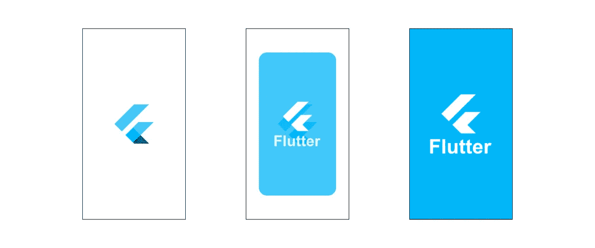

# 在 Flutter 中定义自定义页面过渡

> 原文：<https://medium.com/geekculture/defining-custom-page-transitions-in-flutter-e2972a464be?source=collection_archive---------2----------------------->

## 与 Navigator 2.0 和 1.0 兼容



如果你看一下如何在 [Flutter Cookbook](https://docs.flutter.dev/cookbook/animation/page-route-animation) 中制作页面路径转换的动画，你会发现一个在`PageRouteBuilder`中包装小部件并将其传递给`Navigator.of(context).push`的方法，类似于

```
Navigator.of(context).push(_createRoute(Page2());Route _createRoute(Widget child) {
  return PageRouteBuilder(
    pageBuilder: (context, animation, secondaryAnimation) => child,
    transitionsBuilder: (context, animation, secondaryAnimation, child) {
      // define your animation here
      // TODO: return animated child
    },
  );
}
```

这种方法适应性不强，更糟糕的是，它甚至不能与 Navigator 2.0 一起使用。幸运的是，有一个简单的解决方案，可以很容易地适应每个平台，并与 Navigator 2.0 和 1.0 兼容！

在本指南中，我们将定义一个简单的过渡，即*缩放*和*淡入&淡出*。为此，我们创建了一个单独的类`CustomTransitionBuilder`，它扩展了`PageTransitionsBuilder`并覆盖了`buildTransitions`方法。

```
class CustomTransitionBuilder extends PageTransitionsBuilder {
  const CustomTransitionBuilder(); @override
  Widget buildTransitions<T>(
      PageRoute<T> route,
      BuildContext context,
      Animation<double> animation,
      Animation<double> secondaryAnimation,
      Widget child) { final tween = Tween(begin: 0.0, end: 1.0).chain(CurveTween(curve: Curves.ease)); return ScaleTransition(
      scale: animation.drive(tween),
      child: FadeTransition(opacity: animation, child: child));
    }
}
```

如你所见，我们使用了`ScaleTransition`和`FadeTransition` `AnimatedWidget` s。我们使用`Curves.ease`定义了一个从`0.0`开始到`1.0`结束的`Tween`，以获得更自然的动画。这是一个非常简单的动画。你也可以创建你自己的复杂动画部件并在这里使用它们，或者使用 Flutter 包中的动画。

现在，为了使用我们的转换，我们简单地定义我们的应用程序的`PageTransitionsTheme`。

```
MaterialApp.router(
  ...
  theme: ThemeData(
    ...
    pageTransitionsTheme: const PageTransitionsTheme(
      builders: {
        TargetPlatform.android: CustomTransitionBuilder(),
        TargetPlatform.iOS: CustomTransitionBuilder(),
        TargetPlatform.macOS: CustomTransitionBuilder(),
        TargetPlatform.windows: CustomTransitionBuilder(),
        TargetPlatform.linux: CustomTransitionBuilder(),
      },
    ),
  ),
  ...
),
```

您只需要为您的定制转换目标平台定义一个构建器，但是您可以看到这种方法的适应性有多强。只需为您希望制作不同动画的每个平台创建不同的生成器。这种方法甚至可以根据访问应用程序的平台在 web 浏览器中应用过渡！

这就是全部了！如前所述，这种技术适用于两种导航方式，所以我鼓励您尝试自己喜欢的方式。

一如既往，感谢阅读。如果你想了解更多关于 Flutter 的知识，请跟我来。

如果你不熟悉 Navigator 2.0，请点击这里查看我的三部分系列。