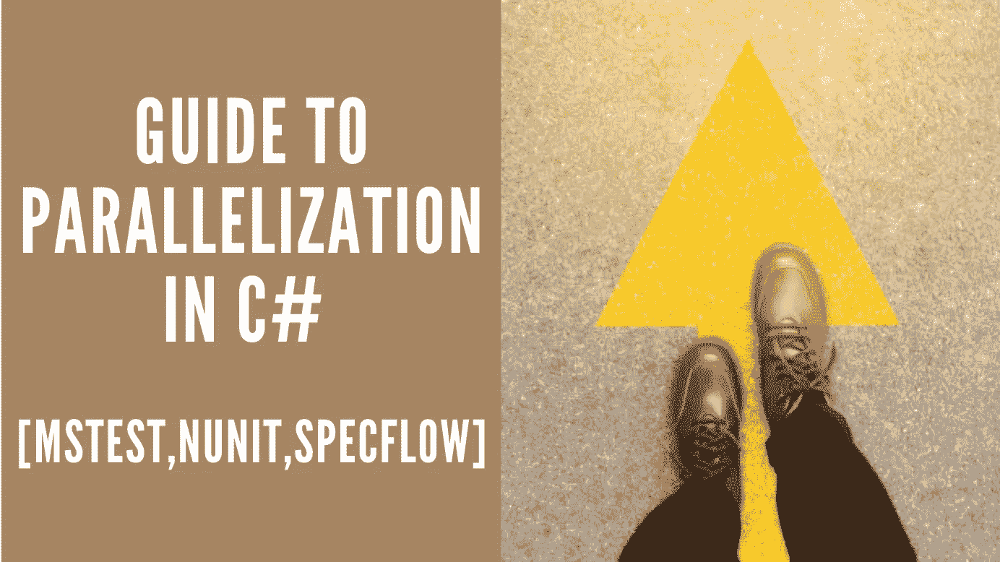

# C#中并行化的权威指南[MsTest，NUnit，SpecFlow]

> 原文：<https://medium.com/geekculture/definitive-guide-to-parallelization-in-c-mstest-nunit-specflow-276c1826fcb3?source=collection_archive---------9----------------------->

**并行化**是同时在不同环境下运行测试的过程。在降低测试执行时间方面，这非常有帮助。

您可以使用的三种比较流行的测试并行化框架是:

1.  SpecFlow
2.  MSTest
3.  努尼特。