# 在 Linux 操作系统中删除根目录

> 原文：<https://medium.com/geekculture/deleting-the-root-directory-in-your-linux-os-8f38e3add4f6?source=collection_archive---------0----------------------->

## 会发生什么？很明显，你的操作系统停止工作了。

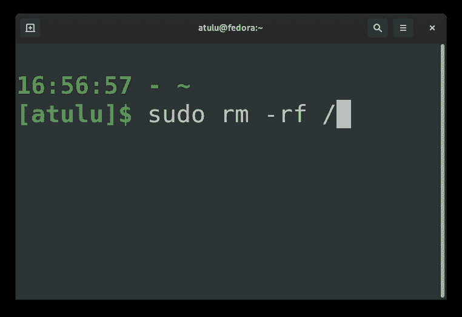

Yeeep!

***警告*** *:以下特技是由一个业余爱好者表演的，他的唯一动机就是满足自己的好奇心。你已经被警告不要在你的工作电脑上做这样的特技，除非你想给你的生活增加一些(错误的)冒险。*

我们知道根目录(“/”)位于 Linux 文件系统层次结构的最顶端。操作系统运行所需的所有其他目录和文件都在它下面。

那么如果执行`sudo rm -rf /`会发生什么？哪些文件会被删除？系统何时以及如何达到不再可用的状态？

如果你很着急，只想看看删除根目录的动作和效果，那么这里有一个 1 分钟的视频给你:

Using a Fedora 33 KVM here, created using virt-manager.

上述视频中的一些要点:

1.  没有 *KA-BOOOM* 。
2.  事实上，系统真的有**优雅关机**。操作系统中的东西一个接一个地停止工作——首先，我在另一个终端上运行的`df`命令停止显示其输出，然后应用程序从活动中消失，接着是图标和壁纸。执行完命令后，bash 无法识别我们传递的任何其他命令(除了像“echo”这样的内置 shell 关键字)。最后，当我试图打开`gnome-settings`时，整个 GUI 都关闭了。只剩下黑屏，显示一个`_`光标闪烁。
3.  `rm`命令可以在操作系统完全停止工作之前完成它的执行。这是有意义的，因为`rm`程序的二进制文件(以及来自另一个终端的`watch`)已经加载到内存中，删除`/usr/bin/rm`不会停止其执行。
4.  **`**rm**`**命令有一个特殊的检查，查看用户是否在** `**/**`上执行递归操作( `**-r**` **)。如果是，则`rm`显示警告并停止执行。要绕过这一点，您必须提供`--no-preserve-root`参数。****

**一旦我到达黑屏，没有其他选择，只能“强制关闭”虚拟机。重启时，我看到一个 Grub 救援终端屏幕。硬盘的分区仍然完好无损。但是包含`/`目录的主分区是空的(看看`ls (hd0,msdos1)/`的输出)。**

**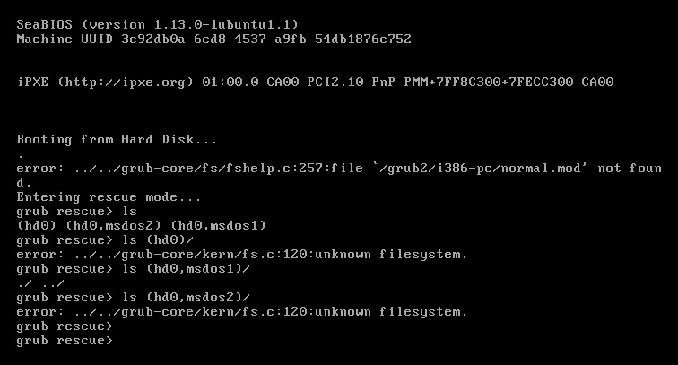**

**hd0 is the hard disk. (hd0, msdos1) is the main partition which used to contain the “/” directory. (hd0, msdos2) is the boot partition (or EFI partition in EFI supported systems).**

**此时，系统不可用。人们可以通过使用实时 USB 操作系统恢复整个硬盘的先前备份，或者通过运行分区恢复工具(如 Testdisk)来恢复它。**

# **再深入一点**

**我在上面做的是删除整个文件系统。虽然看起来很有趣，但我们并不能从中推断/学到什么。所以我想更深入地研究一下 Linux 文件系统的主题，一个一个地删除`"/"`的主要子目录，并找出操作系统因此损失了哪些功能。这样做等同于问"**Linux 系统根目录中的每个子文件夹有什么用途？**"或"**Linux 在文件系统层面是如何划分核心功能的？**”。**

**首先，让我们看看根目录下的子目录:**

**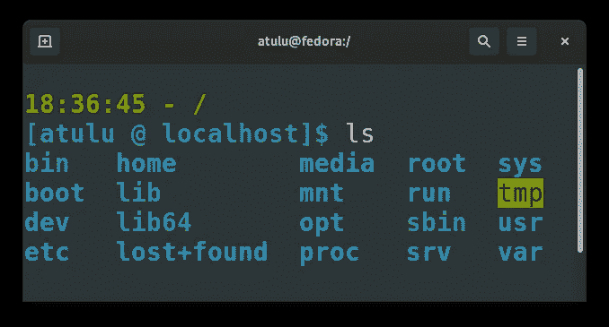**

**在`rsync`的帮助下，我编写了一个小脚本来获得每个目录中文件总数的大致概念。灵感来自 Stackoverflow 中的这个[答案](https://stackoverflow.com/a/34941137/11105624):**

**使用`sudo ./total_files.sh 2>/dev/null`运行这个脚本返回:**

**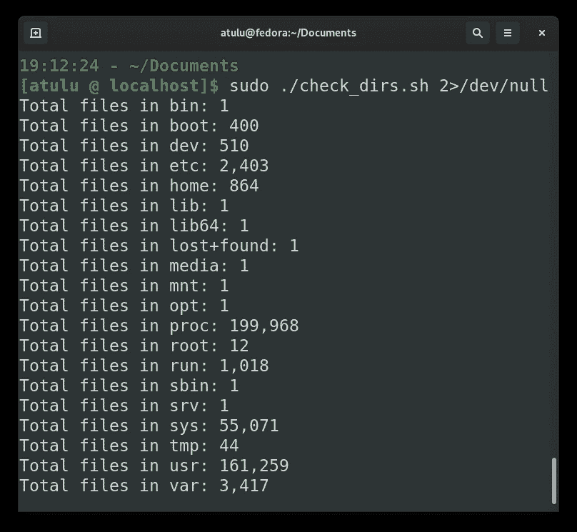**

**我将不涉及`bin`、`lib`、`lib64`和`sbin`，因为它们是指向`usr`目录中相同文件夹名称的符号链接。**

**注意:我的测试环境是 Fedora 33 工作站 KVM(我使用 virt-manager 来创建 VM)。虚拟机的快照是在安装后立即拍摄的。我将一次删除一个`/`的子目录，到处玩并观察，恢复到保存的快照，并对下一个子目录重复相同的步骤。让我们开始吧:**

## **/boot**

**引导目录包含内核映像(`vmlinuz`)和其他重要的引导文件。本质上，这是操作系统引导时访问的目录。这有助于我们理解之前(用`sudo rm -rf / -no-preserve-root`)——**删除所有东西后)重启 OS 时为什么会遇到 Grub 救援屏，因为启动**时没有 Grub 的内核可以加载。******

****删除/boot 文件夹不会影响正在运行的操作系统，如下所示。当你重新启动它时，问题出现了:****

****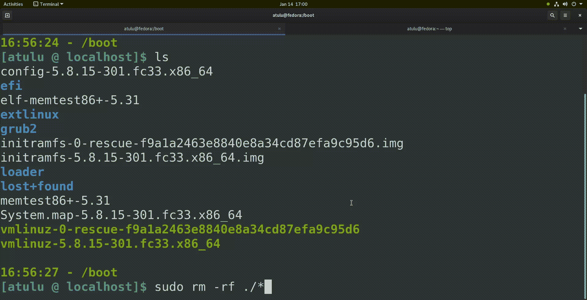****

## ****/开发****

****如果你已经是 Linux 用户一段时间了，那么你肯定会遇到 Linux 的哲学“**一切都是文件**”。这种理念也延伸到硬件设备——比如你的硬盘和它的分区是如何用文件`/dev/hda[x]`(或者固态硬盘的`/dev/nvme[x]`)来表示的。这实际上很酷，我使用 Linux 的这个特性创建了一个活动的可引导 USB，使用一个像这样的命令:****

```
**sudo dd if=./elementaryos-5.1.iso of=/dev/sda bs=4M oflag=sync status=progress**
```

****这个命令将一个基本的 OS ISO 文件的数据写入我的 pen-drive，它由一个设备文件`/dev/sda`表示。****

****那么删除`/dev`目录会怎么样呢？****

****实际上很多事情。****

*   ****首先，您将无法打开新的终端实例。每当你打开一个新的终端窗口/标签，一个新的文件(命名为一个号码)被创建在`/dev/pts`。您可以通过输入命令`tty`找到您当前终端的`pts`文件。`pts`，也称为“伪终端从设备”，由您的终端模拟器应用程序创建，该应用程序是一个`pty`，也称为“伪终端设备”(在我的例子中是 gnome-terminal)。**终端仿真器是主机，需要打开** `**/dev/ptmx**` **设备文件来创建更多的** `**pts**` **从机。**由于我们刚刚删除了这个文件(`/dev/ptmx`)，它无法打开新的标签页:****

********

*   ****删除`/dev`的其他影响包括无法打开 GUI 应用程序。当您输入`journalctl -r`进行检查时，可能会也可能不会导致系统崩溃并显示许多不同的错误信息。此外，您不能播放任何音频文件。当您阅读您的`journcalctl`日志时，您会看到这条消息:****

```
**Jan 14 16:58:18 localhost.localdomain pulseaudio[1661]: Error opening PCM device front:0: No such file or directory**
```

****(PCM 代表**脉码调制**。这里的 PCM 设备大概是指你系统的声卡。)****

*   ****许多程序依靠这些设备文件来获取信息并显示给用户。删除这些文件意味着这些程序也变得无用。例如，`fdisk -l`和`parted`在删除`dev`目录后找不到任何磁盘/分区，可能是因为它们依赖于硬盘设备文件(`/dev/hda[x]`):****

****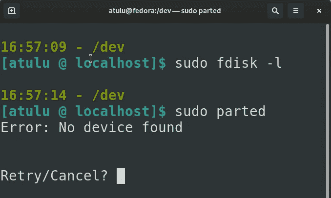****

****也就是说，删除`dev`目录并不像看起来那么灾难性。这是因为**这个目录和它的所有文件都是在你每次启动操作系统时由内核或者它的模块创建/修改的。**所以在你删除了`dev`目录后，你只需要强制重启你的机器，瞧！您之前删除的目录及其所有文件又回来了，您的系统完全正常工作。****

## ****/等等****

****`etc`目录主要包含系统应用程序和其他程序正常运行所使用的配置文件。你只能在这里找到静态文件，没有二进制文件。****

****删除`etc`目录意味着当从 shell 调用时，所有依赖于它们的配置文件的程序都无法运行。例如，`journalctl`命令返回“未找到日志文件”。这是因为配置文件`/etc/systemd/journalctl.conf`包含了`journalctl`启动和管理日志所需的大量配置信息。没有这些信息会阻止它正常启动。其他几个类似`iptables`的程序也会面临类似的问题。****

****还有`/etc/fstab`，这些文件包含操作系统在启动时需要挂载的磁盘和文件系统的详细信息。我删除了`/etc/fstab`(而不是`/etc`)来看看 Fedora 没有它会怎么样。当我重启虚拟机时，事情变得有点奇怪:****

*   ****Fedora 向我展示了一个欢迎屏幕，并要求我设置我的新用户帐户和密码。这和你第一次安装 Fedora 时看到的屏幕是一样的。****
*   ****设置后，右上角没有“活动”按钮，也没有“设置”选项。按下元键(windows 键)不会打开任何东西。基本上，我无法打开任何东西。****

********

****There is no “Activities” menu or “Settings” button (“Wired Connected” did not have any menu inside). Pressing keys don’t open anything either.****

*   ****我按下`Ctrl+Alt+F2`，打开一个虚拟终端，幸运的是这里一切似乎都很好。我在`journalctl`中找不到任何错误日志。****

****实际上，我希望在没有`fstab`文件的情况下，系统永远不会启动，但不知何故，它启动了，并显示出许多奇怪的行为。****

****删除`etc`目录时最大的问题可能是删除了`/etc/passwd`文件，该文件存储了您系统中所有用户帐户的信息。因此，如果您在当前会话后注销/关闭您的系统，您将永远无法再次登录。事实上，我的 Fedora 在强制重启后无法到达登录屏幕(操作系统在删除`/etc/passwd`后立即删除了所有关机选项，因此“强制关闭”是唯一的选项)。删除`/etc/passwd`文件还会阻止您在当前会话中做很多事情。不能使用`ssh, scp, sftp, rsync`命令。由于`/etc/passwd`是包含“sudoers”列表(具有`sudo`权限的用户)的文件，**现在删除它会阻止您使用** `**sudo**` **或任何根登录会话。**所以任何需要你以`sudo`身份运行的命令都会失败——比如`tcpdump`、`fdisk`、`parted`、`reboot`等等(*等等:D)。****

********

## ****/首页****

****删除`home`目录失败，因为它在 Fedora 中被标记为磁盘挂载点。因此使用`rm`命令中止，并显示消息:`rm: cannot remove '/home': Device or resource busy`。****

****但这不重要。您应该能够删除`home`文件夹中的所有内容，这足以让我们测试缺少用户目录的负面影响。****

****令人惊讶的是，许多应用程序在没有用户目录的情况下无法启动。****

*   ****某些 gnome 应用程序依赖于在用户目录中存储数据。****
*   ****Firefox 永远不会打开，因为它依赖于存储在`/home/username/.mozilla`文件夹中的配置文件和数据。****
*   ****由于无法创建通常存储在`/home/username/.cache/gnome-software/`文件夹中的某些缓存文件，每次打开时都显示空白屏幕。****
*   ****Bash 的提示回退到:`bash-5.0$`(因为没有定义我的 PS1 值的`.bashrc`文件)。****

****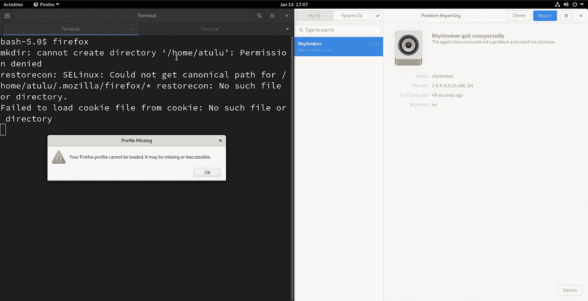****

****Firefox and Rythmbox fail to start****

****缺少用户目录并不像上面提到的目录那样糟糕，因为操作系统从来没有崩溃过(虽然我可能是错的，因为我在没有安装额外应用程序的情况下对新安装的 Fedora 进行了测试。程序越多，问题就越多)。****

## ****/丢失+找到****

****这是由`fsck`从文件系统检查中恢复和存储损坏或错误删除的文件的目录。在我使用 Linux 的经验中，我从来没有在这里发现任何恢复的文件(也就是说，我从来没有在很多情况下首先执行`fsck`检查)。删除这个文件夹并没有真正影响我的操作系统。****

## ****/媒体和/mnt****

****`media`和`mnt`是**用户挂载硬盘或移动设备的两个目录**。它们的唯一目的是作为其他存储设备的挂载点。如果这些文件夹上安装了任何存储设备，你不能删除它们，因为`rm`将返回“设备或资源忙”错误。因此，您必须首先卸载这些设备。****

****缺少这些文件夹并不会真正影响一个普通用户，除非你有一个`fstab`条目，其中一些硬盘被设置为在启动时在`/mnt`或`/media`中挂载(从我的经验来看，`fstab`中的错误条目实际上可能是一个非常严重的问题)。还需要注意的是，每当你插入一个笔式驱动器时，操作系统默认将它安装在`/media`目录中。所以我不确定如果没有这两个目录，你是否能保持没有问题。当我试图在移除`media`和`mnt`后连接一个笔式驱动器时，我的操作系统将它安装在文件夹`/run/media`中。****

## ****/opt****

****此目录保留用于存储与用户安装的应用程序相关的数据。由于我的测试环境是新的 Fedora 33，所以`opt`目录是空的。我的工作操作系统包含 brave、docker、zoom 和 packet tracer 等应用程序存储的数据。所以很明显，删除`opt`目录意味着这些应用程序肯定会出故障。****

## ****/proc****

******`**/proc**`**目录不能删除**。即使您以 root 用户身份登录。该目录中的“文件”是在启动时创建/修改的，并在内核关闭时从内存中删除，因为它完全取决于系统的状态，如正在运行什么进程以及加载了什么模块。许多程序依赖于`proc`来提供系统或进程信息。我强烈推荐探索这个目录和简单的`cat`所有可能的文件，看看你能得到什么信息。******

## ****/root****

****这是根帐户的“主”目录。它包含 root 帐户登录时将使用的配置文件。这包括单独的`.bashrc, .profile`文件，以及其他特定于应用程序的配置文件(在`/root/.config`内部)，比如那些由外部应用程序`wireshark`使用的文件，它只能由根帐户运行。删除这个文件夹会改变 prompt 变成简单的`bash-5.0#`的方式。在我的工作操作系统中，snap 在`/root`中放置了一个文件夹，包含 snap 安装的应用程序的数据。删除根文件夹时，我没有看到任何系统更改。当检查`journalctl`是否有相关错误时，我发现了这个:****

```
**Jan 14 18:01:01 localhost.localdomain CROND[31729]: (CRON) ERROR chdir failed (/root): No such file or direct
ory
Jan 14 18:01:01 localhost.localdomain CROND[31729]: (root) CMD (run-parts /etc/cron.hourly)**
```

****这给了我们一个线索。`cron`作业总是从用户环境中运行(即，当它们运行 cron 作业时，当前目录是用户的主目录)。对于 root 用户(使用`sudo crontab -e`)设置的`cron`作业，**需要转到** `**root**` **目录，从那里执行** `**cron**` **作业**。但是现在看起来 root 的`cron`作业由于缺少`root`文件夹而无法执行。为了证实这一点，我尝试从 root 用户的帐户每分钟运行一个`cron`作业:****

```
**sudo crontab -e# Inside the crontab file:
* * * * * echo "yolooo" > /tmp/trial # this runs every minute**
```

****而且我是对的，**文件** `**/tmp/trial**` **根本就没有创建过**。这向我们展示了当您删除`root`文件夹时，`root`的`cron`作业无法启动。这只是我发现的一个问题，应该有很多其他应用程序依赖于`root`文件夹的存在才能运行。****

## ****/run 和/var****

****我把`/run`和`/var`放在一起，因为`/var`有一个名为`/var/run`的文件夹，它是一个到`/run`的符号链接。`/var/run`曾经是存储各种进程和服务运行时信息的原始目录。从`/var/run`到`/run`的转变是为了更好地组织数据。****

****`/run`在大多数操作系统中作为`tmpfs`安装，它是一种特殊类型的文件系统，只在易失性存储器(RAM/swap)中存储数据。**因此** `**/run**` **中的数据不持久，在系统关机时会丢失。******

****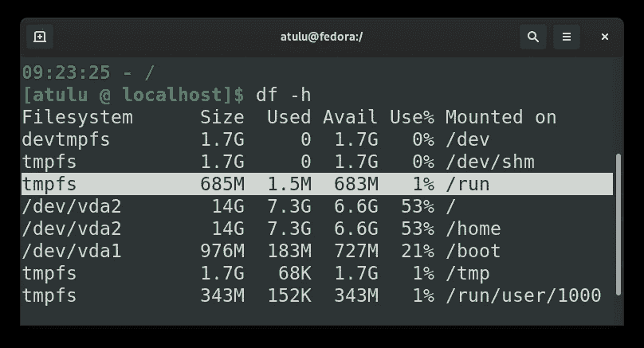****

****`/var`代表“变量”，包含进程和应用的状态信息，这些信息易于根据正在运行的应用/进程的状态而改变。`journalctl`日志文件存储在`/run/log/journal/<machine-id>/*.journal`或`/var/log/journal/<machine-id>/*.journal`中。很多其他的应用程序日志文件都存储在`/var/log/`目录下(比如 apache、lib-virt、nginx、cups 等)。****

****`/var`也存储关于你的操作系统软件包管理器的信息。在 Fedora 中，你可以在`/var/lib/dnf/`中找到包含已安装`rpm`包、历史、回购等信息的数据库。没有这些文件，`dnf`根本无法安装任何东西:****

****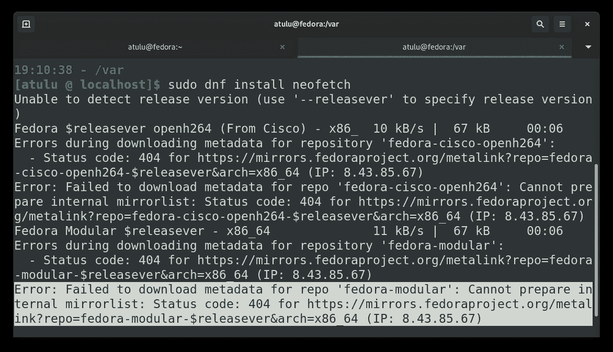****

****Note how `dnf` doesn’t look up any other default repositories.****

****类似地,`/var/lib`目录包含许多正在运行的应用程序和服务的大量状态信息。在全新安装 Fedora 时删除此文件夹会导致两个服务立即失败:****

****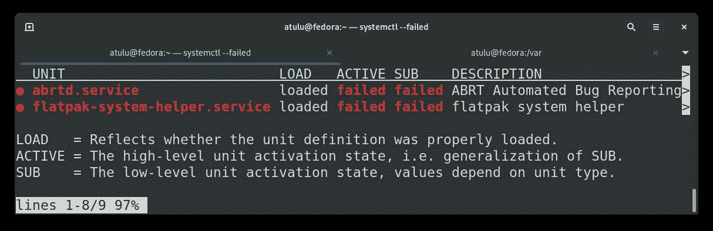****

****Output of `systemctl -failed`****

****当然，随着更多的应用程序和守护进程的安装，更多的服务注定会失败。默认情况下，Apache web 服务器提供放置在`/var/www/html`中的网页。还有一个`/var/cache`目录，其中存储了某些应用程序缓存数据。****

****`run`目录包含许多系统服务所需的重要运行时文件。比如你可以找到`cups`、`dbus`、`udev`等服务的 socket 文件。`systemd`在`/run`中有一个文件夹来存储它的运行时信息。每次删除`/run/systemd`文件夹，我的屏幕都死机，系统挂起。这基本上意味着移除`/run`会导致`systemd`崩溃，并且你知道当 PID 1 停止工作时你的系统是不可用的。有一次尝试删除`/run`目录，在删除后 10 秒钟屏幕冻结，所以我有时间运行`systemctl status`。以下是输出:****

****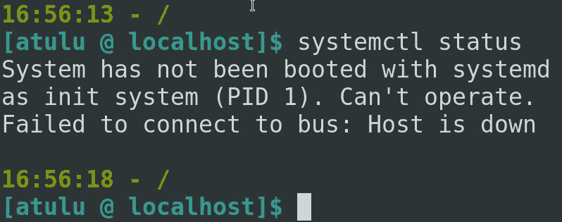****

****嗯，我们刚刚从 RAM 中删除了`systemd`，所以它是有意义的。****

## ****/srv****

****该文件夹包含与您的系统提供的服务相关的特定数据。例如，对于系统中正在运行的 FTP 服务器，与`ftp`服务相关的一些数据存储在该文件夹中。在我的使用中，我从未见过这个目录填充任何数据。在我的 Fedora 中删除这个空目录不会导致任何问题，因为没有任何服务出于任何目的使用它。****

## ****/sys****

****这可能是`/`中最酷的子目录了。就像`proc`一样，它是另一个虚拟文件系统，包含信息并为用户提供一个接口来交互/配置连接到系统的设备。这个目录中的“文件”(这些不是存储在硬盘中的实际文件)本质上只是存储在 RAM 中的各种设备的信息。****

****我的笔记本电脑有些发热问题。为了降低电池的负载，防止 CPU 在重负载时出现温度过高的情况，我通过编辑`/sys`中的文件禁用了英特尔睿频加速:****

```
**# run this as root. Ain't this simple?
$ echo "1" | tee /sys/devices/system/cpu/intel_pstate/no_turbo**
```

****`/sys` **目录及其内容不可移动**。即使以超级用户身份登录。当系统关闭时，此目录中的数据会丢失(易失性内存数据)，并在启动时根据操作系统可以找到的所有设备重新创建。****

## ****/tmp****

****`tmp`代表“临时”,这应该解释了这个目录的用途——**存储临时需要的文件**。这是作为`tmpfs`文件系统挂载的另一个目录。此目录的内容在关机过程中被删除，并且不是永久性的。删除`tmp`的内容并没有给我的 Fedora 带来任何问题。`journalctl`日志也很安静。您不能删除该目录，因为它被标记为“忙碌”，因为它是一个`tmpfs`挂载点。****

## ****/usr****

****我们最终来到了`usr`目录，它包含了组成我们工作的操作系统的最大部分的数据和程序。****

*   ****`/usr/bin`和`/usr/sbin`包含了我们使用的所有程序二进制文件。(`/usr/bin`和`/usr/sbin`的区别在于`sbin`包含通常需要 root 权限才能运行或执行某些任务的二进制文件，例如`fdisk`、`insmod`、`fsck`、`mkfs`等)。****
*   ****`/usr/share`是`/usr`中最大的子目录。它的主要目的是包含与硬件架构无关的数据和文件，从而允许它们在不同的设备上“共享”。这包括各种不同的文件，如可靠的`man`页面(在`/usr/share/man`中找到)、图标(在`/usr/share/icons/`中)、不同编程语言的某些库的源代码(你可以在`/usr/share/javascript/jquery/`中找到 Jquery 源代码)。在`/usr/share/perl`和其他特定于程序的数据中也有很多 Perl 代码。****
*   ****玩过`cowsay`吗？其二进制存储在`/usr/games/cowsay`中。****

```
**__________ 
< moooooo > 
 ---------- 
        \   ^__^ 
         \  (oo)\_______ 
            (__)\       )\/\ 
                ||----w | 
                ||     ||**
```

*   ****`/usr/lib`和`/usr/lib64`目录主要包含目标文件(编译的 C 代码)和其他代码/数据，它们将被系统中安装的不同应用程序用作库。这些并不意味着由用户直接执行。所有的内核模块和驱动程序都安装在`/usr/lib/modules/<kernel-version>/`目录下。****
*   ****`/usr/include`是包含 C 头文件的目录。例如，当你在 C 程序中编写`#include <stdio.h>`时，编译器默认在`/usr/include`目录中查找该文件(你可以将`-I`参数传递给`gcc`，让它也在其他目录中搜索)。****
*   ****`/usr/libexec`是 Linux 操作系统中一个相对较新的实现，它允许以某种方式存储某些二进制文件，以表示它们不打算由用户直接执行，而是仅由安装在您系统中的各种服务/程序在内部使用。****
*   ****`/usr/local`具有与其父`/usr`相同的内部目录结构。这个目录是用户编译的软件和外部应用程序应该安装的地方。与这些应用程序相关的数据也存储在这里。****
*   ****`/usr/src`是通常存储内核源代码的地方(在 Fedora 33 中，这个目录是空的)。****

******一个操作系统本身毫无用处**。作为用户，我们使用程序来完成工作，而操作系统为我们提供了运行这些程序的平台。删除`/usr`目录会让我们没有程序可以运行。我试图将`/usr/bin/journalctl`的副本保存到一个单独的目录中，这样我就可以在执行完`sudo rm -rfv /usr`命令后，从运行该命令的同一个终端上运行它(由于这个终端当前加载在内存中，它应该能够正常工作并运行我传递的另一个二进制文件，对吗？).但结果是，在删除了`/usr`之后，当我运行`/copied-path-to/journalctl`时，bash 无法理解我写的内容:****

****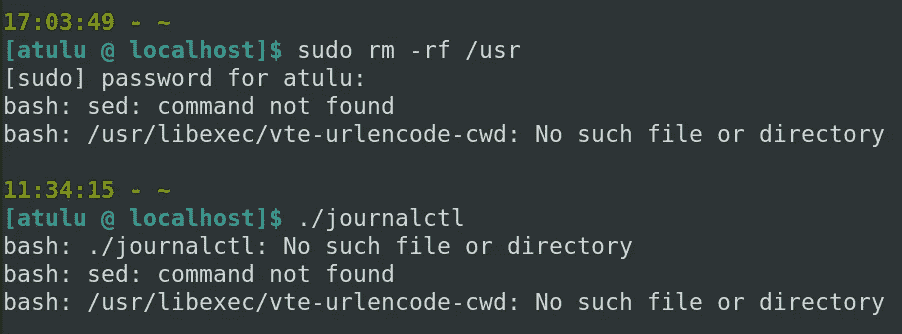****

****这可能意味着 **bash 不能解析我们传递给它的任何东西**(而且每次我们传递一个输入命令，它都会使用`sed`？).bash 此时唯一能够运行的是 shell 内置命令，比如`echo`。****

****因此，如果没有其他程序和库可用，即使是我们加载到内存中的 shell 也不能做任何有意义的事情。在这一点上，我没有太多的时间去玩和获取更多的信息。删除`/usr`后，系统也会在短时间内崩溃，只显示黑屏。****

****这标志着我们实验的结束。我想用一些可能对读者有用/感兴趣的结论来结束这篇文章:****

*   ****有时删除子目录会立即导致系统的 GUI 冻结(我也无法打开第二个虚拟终端)。这使得它不可能看到崩溃的真正原因，因为我不能参考系统日志。**为此，我将使用** `**netcat**` **程序在我的客户虚拟机(Fedora)和主机(Ubuntu)之间建立一个简单的 TCP 连接，将** `**journalctl**` **的输出发送到主机，这样即使屏幕死机，我也可以读取正在发生的事情。**我使用的命令:****

```
**#In host PC
$ nc -l 6767  #host listens in port 6767#In guest vm, from a terminal tab, before I proceed with deleting anything:
$ watch -n 1 journalctl -r | nc <host pc IP> 6767**
```

*   ****最后，还有一个发生在 1986 年的不可思议的故事，一个团队通过输入 `[r](https://www.ee.ryerson.ca/~elf/hack/recovery.html)m -rf *` [意外删除了几乎所有内容后，成功恢复了他们的 UNIX 系统。](https://www.ee.ryerson.ca/~elf/hack/recovery.html)****