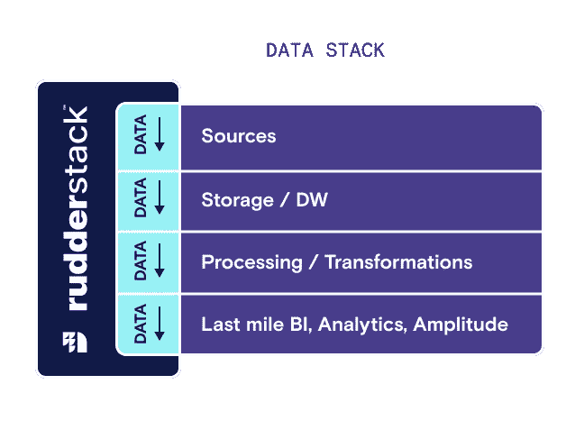

# 借助方向舵堆栈和振幅提供更深入的数字产品洞察

> 原文：<https://medium.com/geekculture/deliver-deeper-digital-product-insights-with-rudderstack-and-amplitude-2e6e62046094?source=collection_archive---------28----------------------->

现在，根据来自每个站点和应用程序的每个客户接触点的洞察来做出决策变得更加容易。Amplitude 的数字优化系统帮助企业关闭数据、洞察力和行动之间的回路。随着 RudderStack 与系统集成，它变得更加强大。我们的即插即用数据管道可以轻松地将实时行为数据从所有网站和应用程序直接传输到 Amplitude，同时处理身份解析。

# 了解数字产品如何大幅推动业务发展

Amplitude 帮助公司从他们的数字产品中获得更多价值。[数字优化系统](https://amplitude.com/digital-optimization-system)将强大的产品分析解决方案与数字个性化工具相结合，创建了一个强大的反馈回路。这种双重方法为公司提供了了解客户行为、预测有价值的结果以及优化数字产品体验以实现最大影响所需的一切。此外，易于访问的见解使跨团队的数据民主化。

# 借助方向舵堆栈实现事件驱动的数据基础设施

数字颠覆者知道，成功需要对客户的深刻理解，以及基于客户洞察快速调整数字产品的能力。行为或事件数据是打开这种精细理解的钥匙，当涉及到行为数据时，正确的工具会带来很大的不同。

# 振幅和方向舵堆栈一起更好

利用行为数据从[数据收集](https://rudderstack.com/blog/the-complete-customer-data-stack-data-collection-part-1)开始。RudderStack 的[事件流](https://rudderstack.com/product/event-stream/)提供了一种可靠且可扩展的方法来实时捕获数据并将其传送给每个下游应用程序。因此，您可以从振幅的角度出发，利用行为分析构建事件驱动的基础设施。我们强大的振幅[集成](https://docs.rudderstack.com/destinations/analytics/amplitude)使得从每个网络和移动来源获取事件数据来增强数字优化系统变得容易。

有了来自 RudderStack 的高性能数据管道，Amplitude 用户可以释放系统的全部价值，并专注于利用每个功能来开始更好地了解他们的客户。通过轻松获得见解，每个团队都可以更快地做出更好的决策。

# 从方向舵堆栈和振幅开始

准备好通过更深入地了解您的客户来更快地做出决策了吗？[免费注册](https://app.rudderlabs.com/signup?type=freetrial)，查看我们的[文档](https://docs.rudderstack.com/destinations/analytics/amplitude)将 Amplitude 设置为目的地，并从今天开始将您的行为数据传输到 Amplitude。

*本博客最初发表于:* [*https://rudder stack . com/blog/deeper-insights-with-rudder stack-and-amplitude*](https://rudderstack.com/blog/deeper-insights-with-rudderstack-and-amplitude)