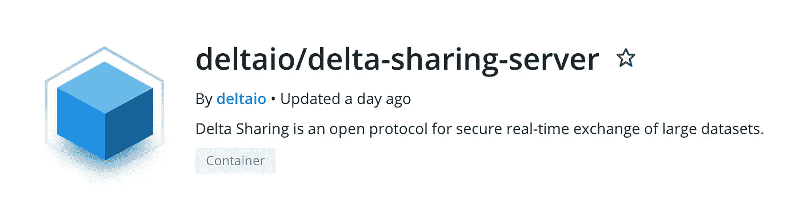
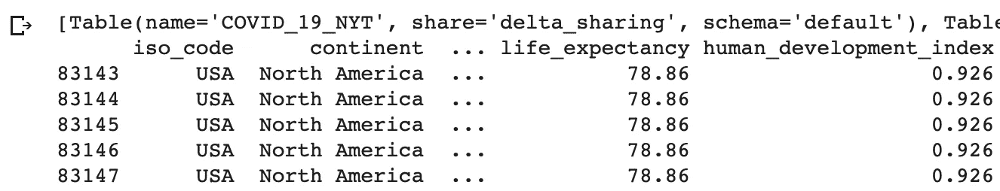

# 如何使用谷歌 Colab 的增量共享

> 原文：<https://medium.com/geekculture/delta-sharing-bc9f1939d08b?source=collection_archive---------3----------------------->

## Delta Sharing 是业内首个安全数据共享的开放协议，无论其他组织使用何种计算平台或云存储，都可以轻松安全地与他们共享大量数据。


# 增量共享

[Delta Sharing](https://delta.io/sharing/) 是一个 Linux Foundation 开源框架。想象一下，这是一种从您的数据湖中共享大量实时数据的现代方式。内部、云中或混合。基本上任何一种支持 pandas 或 Spark 的接收器都可以使用，所以不存在供应商锁定。

## 增量共享 0.2.0

在撰写本文时，Delta Sharing 的[版本 0.2.0](https://github.com/delta-io/delta-sharing/releases) 已经发布。

## 入门指南

作为一个快速的冒烟测试，让我向您展示如何创建一个从现有的 Delta 共享服务器读取数据的客户机(有时也称为“接收器”)。

我喜欢有偏见:-)，所以我建议为此使用 [Databricks workspace](https://databricks.com/try-databricks) 。或者，你也可以使用[亚马逊 EMR](https://aws.amazon.com/emr) 、谷歌 [Dataproc](https://cloud.google.com/dataproc) 、谷歌的 Data Colab、笔记本电脑上的 [Jupyter 笔记本](https://jupyter.org/)，或者普通的老式[独立 Python](https://github.com/delta-io/delta-sharing/blob/main/examples/python/quickstart_pandas.py) 程序。

## 开放协议/无供应商限制

你还记得凯尔西(在谷歌工作)在 CNCF 做 AWS Lamda 演示的那些日子吗？回报的时候到了。因此，为了证明我的观点，即 Delta 共享与数据块无关，我会选择 Google Colab。我的客户端实现将与包含公共数据集的数据块托管的演示服务器进行对话。

## 访问或创建增量共享服务器

如果您复制下面的例子，只需将您的代码指向由 Databricks 托管的同一个演示服务器，就可以轻松开始了。

当然，您也可以启动自己的 Delta 共享服务器。这很容易，因为 Databricks 提供了服务器的参考实现。随着 0.2.0 版本的 Delta Sharing，共享服务器也可以作为 Docker hub 上的 [Docker 镜像](https://hub.docker.com/r/deltaio/delta-sharing-server)使用。



第三个当然也是最舒适的选择是简单地从你的数据块[工作空间](https://databricks.com/blog/2021/05/26/introducing-delta-sharing-an-open-protocol-for-secure-data-sharing.html)共享数据。

## 逐步说明

要开始，进入 [Google Colab](https://colab.research.google.com/) ，打开一个新的笔记本。

在笔记本的第一个单元中，使用 **pip** 安装增量共享 Python 包，以便该包可以在笔记本中使用:

```
!pip install delta-sharing
```

然后，在第二个单元格中，通过几行代码，您可以创建一个指向 profile_file 中定义的服务器端点的**增量共享客户端**，**列出所有共享表**，**将数据加载到 pandas 数据框**，并显示一个经过**过滤的数据子集**。

```
 import delta_sharing# Point to the profile file, location also works with http(s)
profile_file = “https://raw.githubusercontent.com/delta-io/delta-sharing/main/examples/open-datasets.share"# Create a SharingClient.
client = delta_sharing.SharingClient(profile_file)# List all shared tables.
print(client.list_all_tables())# load data as pandas dataframe (or Spark)
table_url = profile_file + “#delta_sharing.default.owid-covid-data”
data = delta_sharing.load_as_pandas(table_url)# display filtered data
print(data[data[“iso_code”] == “USA”].head(10))
```

运行代码后，您的输出应该如下所示:



Delta Sharing

# 数据网格

最近有很多关于数据网格的讨论。在本文中，我将把它简化为数据网格的两个核心构建块。

注意，使用 **Delta sharing** 客户端，用一行代码创建对各种外部数据湖的访问是多么简单:

```
client1 = delta_sharing.SharingClient(**profile_file1**)
```

## 数据治理

然而，数据网格不仅仅是能够在技术上对外共享数据。数据网格更多的是关于企业内部正在发生的事情。它是关于你如何管理你公司的各种数据湖。

这是另一个产品， [**Unity 目录**](https://databricks.com/product/unity-catalog) 进入游戏的地方。它是缺失的一部分，让您可以审核、保护和管理所有工作区和跨云的数据访问。它使用标准 SQL 处理数据库、表、视图、行和列，而不是对文件使用低级、复杂和特定于云的 IAM 角色。

因此，您可以从 Delta Sharing 中轻松分享来自您的 [Lakehouse](https://databricks.com/glossary/data-lakehouse) 的数据。还有 **Delta Sharing** 和 **Unity Catalog** 在一起玩的不错。很高兴在另一篇文章中更详细地介绍这一点，如果你感兴趣，请告诉我！

# 更多？

*   [Delta Sharing OSDC 网络研讨会 Frank Munz](https://www.youtube.com/watch?v=ViVcODZUXcA&t=9s)
*   [数据块增量共享](https://databricks.com/product/delta-sharing)
*   [GitHub 上的增量共享](https://github.com/delta-io/delta-sharing/)
*   [为什么四分之三的数据共享选项都行不通](https://fmunz.medium.com/why-three-out-of-four-data-sharing-technologies-dont-cut-it-anymore-a9caea6fc06f)
*   [与码头集装箱的增量共享](https://hackernoon.com/share-large-amounts-of-live-data-with-delta-sharing-and-docker)

如果你喜欢这篇文章，请为它鼓掌或在社交媒体上分享。更多数据科学，数据工程，或者 AI/ML 相关的消息可以关注我 Twitter:[**@ frankmunz**](https://twitter.com/search?q=frankmunz)**。**