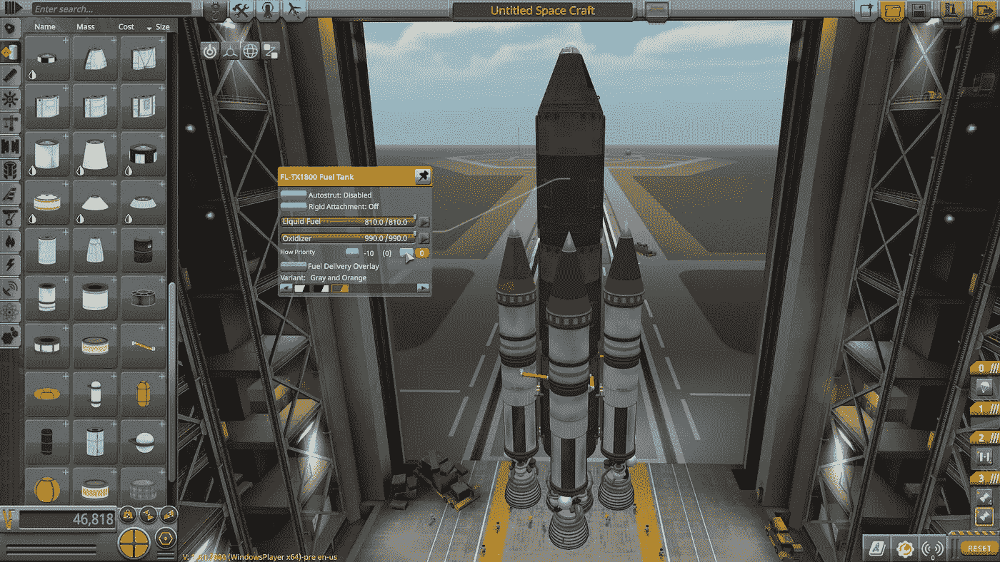
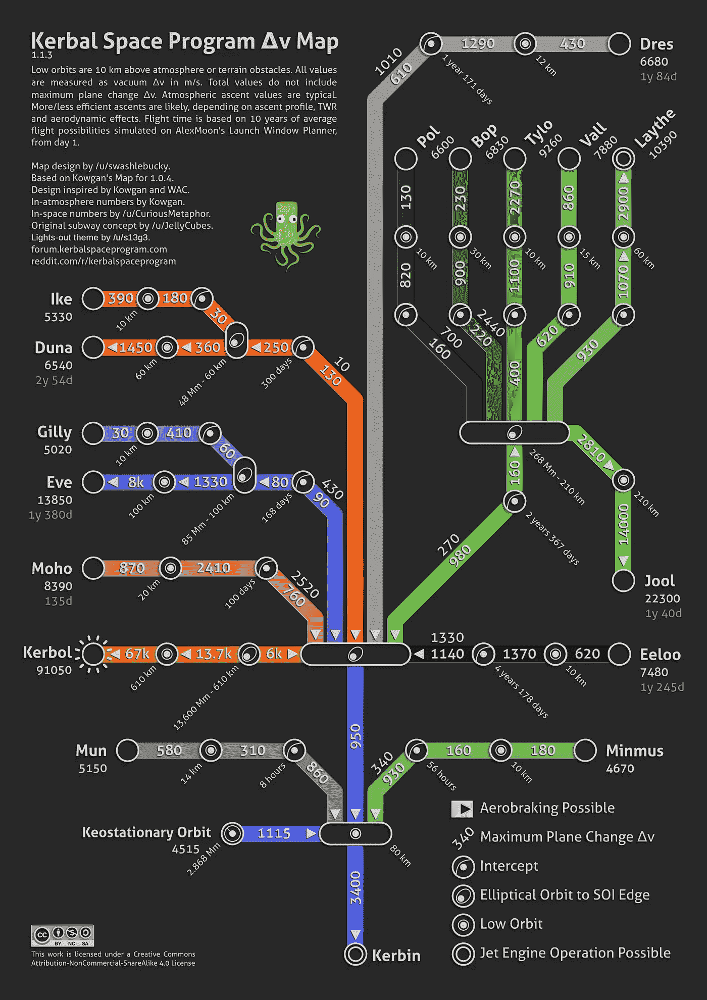

# 德尔塔-v 计算器克巴尔空间计划

> 原文：<https://medium.com/geekculture/delta-v-calculator-kerbal-space-program-3e87617ee099?source=collection_archive---------4----------------------->



[https://www.kerbalspaceprogram.com/game/kerbal-space-program/](https://www.kerbalspaceprogram.com/game/kerbal-space-program/)

你好。今天让我们做一个有趣的项目。我是游戏 Kerbal Space Program 的忠实粉丝，所以我决定制作一个 python 程序，给你一个特定目的地的 delta-v 级别，而不是重复参考地图。所以让我们开始吧！

# 德尔塔-v 地图



[https://www.deviantart.com/s13g3/art/Kerbal-Space-Program-Delta-v-map-Lights-out-626904855](https://www.deviantart.com/s13g3/art/Kerbal-Space-Program-Delta-v-map-Lights-out-626904855)

像这样的地图可以告诉你需要多少德尔塔-v。然而，当你在建造你的容器时，我有时发现把所有的值加起来很麻烦。所以我决定做一个 python 版本。现在我们将只考虑从科尔宾到其他星球所需的 delta-v。

# 代码

因为我们可能想在另一个版本的代码中添加其他星球，所以我打算创建一个名为 Kerbin 的类。我将使用 pandas 来存储地图中的值。

```
class Kerbin:
    dfNormal = pd.DataFrame({
        "Mun": [3400, 860, 310, 580],
        "Minmus": [3400, 1270, 160, 180],
        "Eeloo": [3400, 3420, 1370, 620],
        "Moho": [3400, 4230, 2410, 870],
        "Eve": [3400, 1470, 1410, 8000],
        "Duna": [3400, 1090, 610, 1450],
        "Dres": [3400, 2570, 1290, 430],
        "Jool": [3400, 2200, 2970, 14000]
    }, index=["Kerbin Orbit", "Intercept", "Low Orbit", "Land"])
```

我决定为未来做一些小功能，比如这些:

```
*def* to_orbit(*self*):
    return 3400*def* to_keostationary_orbit(*self*):
    return *self*.to_orbit + 1115
```

最后一个方法将是“目的地”。我决定取目的地、舞台和模式的名字。该模式将决定 delta-v 电平是否会累积。为此，我们必须制作累积数据框架。

```
def __init__(self):
    self.dfCumulative = self.dfNormal.copy()
    for i in range(1, len(*self*.dfCumulative.index)):
        *self*.dfCumulative.iloc[i] += *self*.dfCumulative.iloc[i-1]
```

这将复制原始数据帧，然后将前一行的值添加到当前行。所以“低轨道”的值应该给出该物体进入低轨道所需的总δ-v。

现在让我们完成目标方法的制作:

```
*def* destination(*self*, name, stage, mode):
    if mode == "normal":
        print("Delta-v levels")
        print(*self*.dfNormal[name]["Kerbin Orbit": stage]) if mode == "cumulative":
        print("Cumulative delta-v levels")
        print(*self*.dfCumulative[name]["Kerbin Orbit": stage])
```

这将给出该特定身体从起点到该阶段的 delta-v 值。随着时间的推移，更多的功能将被添加到这个更先进的程序。

# 试验

这是我的文件结构:

```
- bodies
    -kerbin.py
- main.py
```

上面的代码将放在 kerbin.py 中，为了测试它，让我们在 main.py 中编写一些代码。让我们从导入它开始:

```
from bodies.kerbin import Kerbinstart = Kerbin()
```

现在，我将尝试获取 jool 低轨道的累积 delta-v 值。

```
start.destination("Jool", "Low Orbit", "cumulative")
```

这给了我输出:

```
Cumulative delta-v levels
Kerbin Orbit    3400
Intercept       5600
Low Orbit       8570
Name: Jool, dtype: int64
```

这看起来不错。我们去找德尔塔-v 降落在杜纳。

```
start.destination("Duna", "Land", "cumulative")
```

输出:

```
Cumulative delta-v levels
Kerbin Orbit    3400
Intercept       4490
Low Orbit       5100
Land            6550
Name: Duna, dtype: int64
```

如你所见，事情进展顺利。

这就是这篇博客的内容。我已经在 github 上上传了代码，我会为更多的身体更新它，但是基本代码将保持不变。您可以添加自己的功能，使其更符合您的喜好。您甚至可以将它添加到您的系统路径中，这样您就不需要在每次想要运行 python 时都打开它。如果你喜欢这个博客，请关注我。我写的主题是编程和空间，所以如果你对此感兴趣，可以去看看我的其他博客。

感谢阅读！