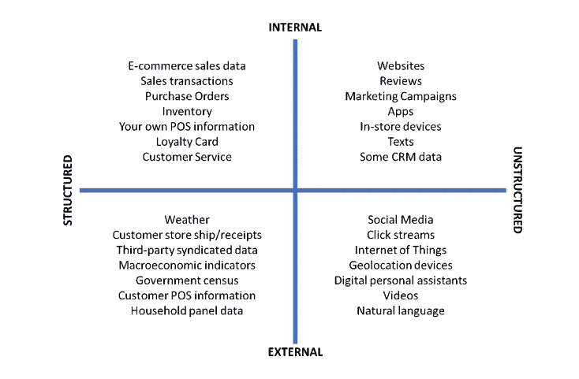

# 基于机器学习的零售业需求预测

> 原文：<https://medium.com/geekculture/demand-forecasting-in-retail-using-machine-learning-9112ba09af21?source=collection_archive---------12----------------------->

Source: Unsplash

*机器学习正在改变零售商做生意的方式！*

从杂货到服装，再到科技产品，零售领域的可能性充满了希望。零售商可以获得大量的客户数据。通过对这些数据应用机器学习，它可以预测对某些产品的需求，提供量身定制的产品推荐，提供促销活动，还可以识别欺诈性购买。

需求预测是关于公司如何有效地使用可用数据并获得可操作的见解。这是预测未来特定产品需求的关键过程。在这个过程中，它确定当前和未来的客户想要购买的东西，并向零售商推荐他们应该关注的东西。

对特定产品或服务的需求通常与不同的不确定性相关联，这些不确定性会使需求变得不稳定且难以预测。库存、生产、存储、运输、营销——业务的每个方面都受到准确预测的影响。

在本文中，我们将了解机器学习方法如何帮助零售业进行需求预测。

**现在什么是机器学习中的需求预测？**

随着产品复杂性和市场波动性的不断上升，传统方法难以为继。通过应用机器学习算法，企业现在能够比以往任何时候都更有效地处理非常大的数据集。

机器学习技术用于预测特定产品/服务的需求。与传统的需求预测方法相比，这种技术可以识别数据中隐藏的模式，加快数据处理速度，分析更多的数据，创建健壮的系统，并提供更准确的预测。

**机器学习算法使用的不同数据源是什么？**

我们有结构化和非结构化的内部和外部数据源。几个例子包括销售交易、采购订单、客户评论、市场调查、IOT、天气预报、社交媒体(赞、转发、分享)等等。

Source: Institute of Business Forecasting and Planning

**需求预测有什么好处？**

**提高准确性—** 有许多技术可以提高需求预测的准确性。老实说，它可能不是 100%精确，但它可以精确到足以帮助您实现您的业务目标。事实上，随着时间的推移，ML 算法可以做出更好的预测。

**更好的客户关系** —需求预测允许您预测特定时期的客户需求/要求。这提高了客户满意度和品牌忠诚度。当零售商在实体上发展他们的业务并扩大他们的在线产品时，购物者在微观层面上获得了定制化的体验。

内曼·马库斯集团首席执行官卡伦·卡茨说:“伟大的客户体验将来自科技与更个性化的触摸的融合。”。

**更好的供应商关系—** 机器学习模型有助于根据客户需求为未来储备供应。这使得增加或减少供应商的数量变得容易。

**更好的物流—** 有了更好的供应链管理，产品更有可能有货。同时，未售出的商品不会占据黄金零售空间。

**嗯，机器学习需求预测是基于时间框架来执行的。**

*   **短期预测—** 做 6 个月或 12 个月以内。短期预测的目的是提供不间断的产品/服务供应、财务维护、招聘需求、销售目标、绩效评估。
*   **长期预测—** 通常是指一段较长的时间，比如说一年多。长期预测的目的包括长期财务规划、业务拓展和年度战略规划。

现在，我们对机器学习需求预测有了更好的了解，让我们了解一下零售业中使用的 ML 模型及其工作原理。

事实上，从内部和外部来源收集的历史数据往往并不理想。在使用这些数据之前，需要对其进行清理、相关性检查、异常检查和恢复。一旦数据被清理/准备好，它就有了一个结构，然后就可以进行可视化了。

下一步是选择机器学习模型。没有“放之四海而皆准”的预测算法。需求预测功能使用多种 ML 算法，这些算法考虑了多种因素，如业务目标、数据可用性、数据质量和其他外部因素。

在这篇文章中，我们将看看下面提到的适用于零售业的 ML 方法

*   时间序列方法
*   随机森林
*   特征工程
*   线性回归

**时间序列法**

时间序列是按连续顺序排列的数字数据点序列。时间序列预测使用有关历史值和相关模式的信息来预测未来活动。这涉及到趋势分析、周期性波动分析和季节性问题。

在零售部分，ARIMA 和萨里玛是最适用的时间序列模型。ARIMA(自回归综合移动平均)适用于单变量时间序列趋势，没有季节成分。它对需求、销售和生产等短期预测做出准确的预测。

SARIMA(季节性自回归综合移动平均)适用于单变量时间序列趋势和/或具有季节性成分。它是对 ARIMA 的扩展，支持季节成分的直接建模。

如果数据点仍然不稳定，那么我们可以应用平滑序列。通过应用平滑，我们可以对序列及其组成部分有更好的了解。这也使得该系列更可预测。

**随机森林**

随机森林既是一种监督学习算法，也是一种集成算法，它创建多个决策树，并对它们的预测进行平均。单个决策树本身可以非常有效地学习非线性关系。然而，由于高方差，它们很容易过度拟合。随机森林通过平均许多树来减少这种差异。

射频在电子商务中用于确定客户是否真的喜欢该产品。使用某种模式，并根据客户对产品的兴趣，您可以向客户推荐类似的产品。

**特色工程**

要素工程是根据现有要素创建新的输入要素，以提高模型性能。这些新的输入特征捕获了在原始特征集中不容易显现的附加信息。因此，算法获得了更多的预测能力。有不同的技术来执行特征工程。实践和经验会教会你哪种技术最适合你的领域/问题。

少数基本技术涉及插补、处理异常值、特征分割、缩放、宁滨、对数变换等。领域知识的使用和特征的创建使得机器学习模型预测更加准确。

**线性回归**

线性回归是最常用的预测建模技术之一。这是一种监督学习算法，用于根据过去的值预测连续值。使用输入特征和输出标签来训练算法。回归有助于通过估计一个变量如何影响另一个变量来建立变量之间的关系。它由方程𝑌 = 𝑎 + 𝑏𝑋表示，其中 a 是截距，b 是直线的斜率。该方程可用于根据给定的预测变量预测目标变量的值。例如，它可以根据销售数据预测杂货店的食物供应量，这有助于避免食物浪费。它还可以根据房地产数据预测房价。

如需进一步了解，可以阅读我文章中的回归主题——[机器学习介绍](https://haripriya-devarajulu.medium.com/machine-learning-34f7fc24e39f)。

**结论**

机器学习不仅限于需求预测。它有能力解决零售业中更多的问题，依靠它的零售商将在这样的竞争环境中占据上风。这项技术的未来潜力取决于我们如何利用它。

*原载于 2021 年 3 月 31 日*[*【https://www.numpyninja.com】*](https://www.numpyninja.com/post/demand-forecasting-in-retail-using-machine-learning)*。*