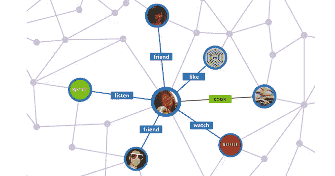
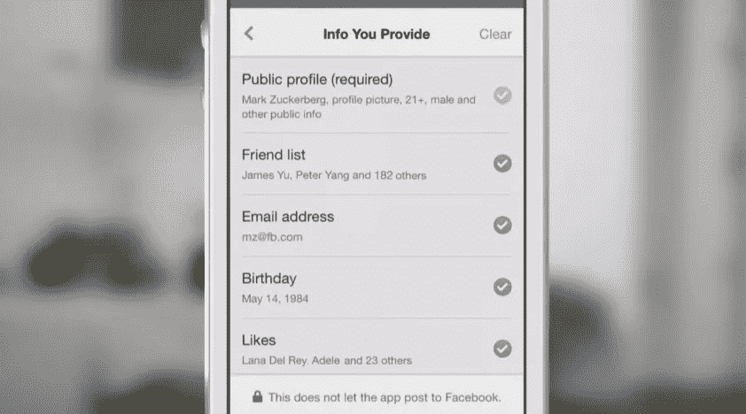
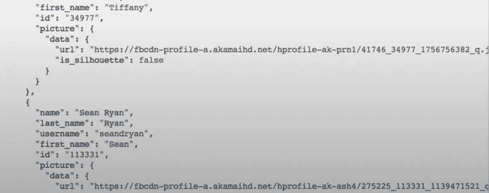
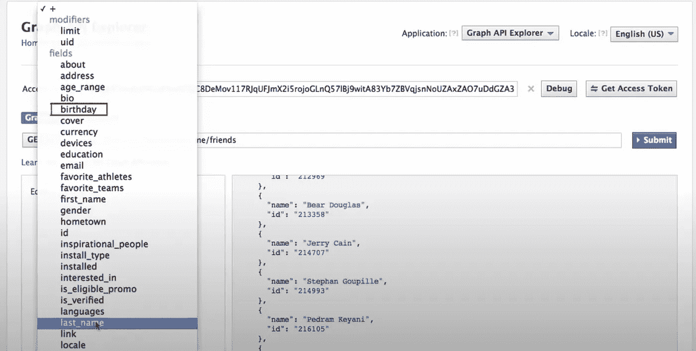
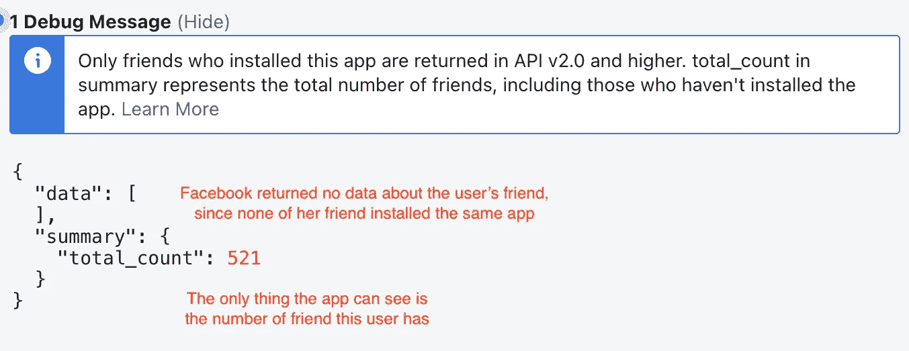
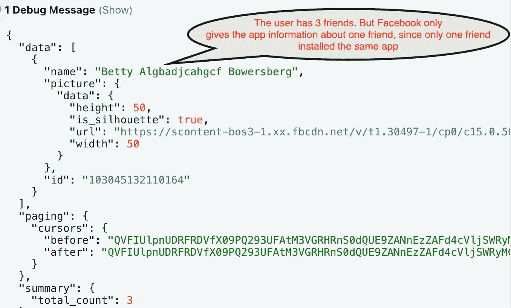
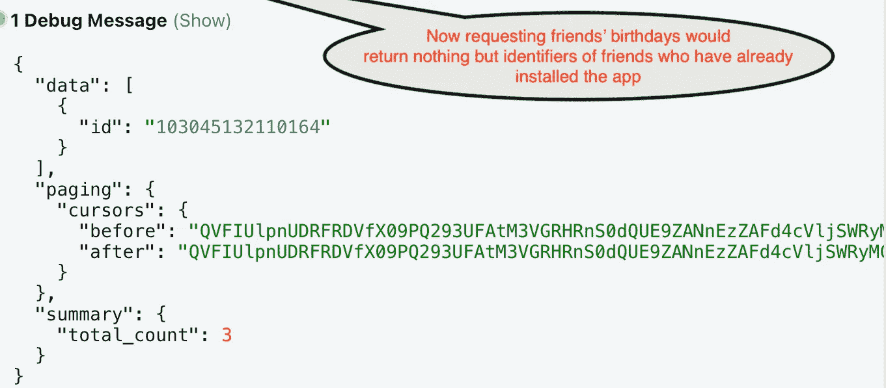

# 演示:应用程序如何访问脸书上的用户好友列表

> 原文：<https://medium.com/geekculture/demo-how-apps-access-user-friend-lists-on-facebook-1fe307cde141?source=collection_archive---------16----------------------->

## 隐私保护的加强引发了反垄断诉讼

Source: [TechCrunch](https://techcrunch.com/2015/04/28/facebook-api-shut-down/)

 [## 科技捕手

### 关于技术、隐私、人工智能伦理及其政策含义的简短片段和内容监管

techcatcher.io](https://techcatcher.io) 

2021 年 8 月，一群应用开发者要求美国上诉法院[重新考虑他们对脸书的反垄断诉讼](https://techcatcher.io/docs/15863.pdf)。争论的焦点是脸书在 2014 年决定限制应用开发者访问用户的好友列表。

原告声称，脸书将一些产品不与之竞争的应用列入白名单，同时将竞争对手的应用排除在数据生态系统之外。但是用户通常认为这是 T2 向隐私迈出的积极一步:和某人成为朋友并不会让他或她控制你的数据。

Source: [TechCrunch](https://techcrunch.com/2015/04/28/facebook-api-shut-down/)

作为一项实验，我创建了一个[脸书应用](https://developers.facebook.com/docs/development/)，来测试第三方开发者现在可以在脸书上看到什么类型的“朋友数据”，以及与 2014 年之前的情况相比如何。

由于不可能完全重现 2014 年之前的情况，我从脸书官方账户找到了一个 2013 年的 YouTube 教程[，它可以帮助我们回到过去。当时，当用户授予应用程序访问其好友列表的权限后，该应用程序可以获得每个朋友的姓名、用户名和个人资料图片，无论该朋友是否使用该应用程序。](https://www.youtube.com/watch?v=WteK95AppF4)

Source: [Facebook Developers](https://www.youtube.com/watch?v=WteK95AppF4)

在 2014 年之前，如果用户同意，该应用程序还可以获取更多私人信息，如朋友的生日，即使朋友本人没有明确同意。

Source: [Facebook Developers](https://www.youtube.com/watch?v=WteK95AppF4)

现在，2021 年，脸书已经[收紧了开发者对用户好友信息的访问](https://techcrunch.com/2014/05/02/f8/?_ga=2.147827831.1524117740.1629893183-1213452606.1629204269)。现在第三方开发者还是可以知道一个用户总共有多少好友。但他们只能访问也安装了他们应用程序的朋友的详细信息。因为我的朋友中没有一个安装了我的测试应用程序，所以向脸书请求“friend_list”会给我一个空输出。这还是在用户允许我访问她朋友的信息之后。

Source: [Tech Catcher](https://techcatcher.io)

下一步，我在一个假想的测试用户 Daniel 上安装了我的测试应用程序，他有三个脸书朋友。然后，我在他的一个朋友贝蒂身上安装了这个应用程序，并获得了丹尼尔的允许，与我分享他朋友的信息。现在从脸书请求丹尼尔的朋友的数据只会返回贝蒂的公开信息。

Source: [Tech Catcher](https://techcatcher.io)

如果 Betty 没有明确授予我(这个测试应用程序的开发者)这样的权限，访问 Betty 的私人信息，比如她的生日，现在[不再可能](https://stackoverflow.com/questions/3393610/how-to-get-friends-birthday-list-using-facebook-api)。这还是在丹尼尔同意与我的应用程序分享贝蒂的信息之后。

Source: [Tech Catcher](https://techcatcher.io)

我的快速演示表明，在 2014 年收紧应用程序访问用户朋友数据的方式后，脸书确实使用户数据更加安全。但这并不是说第三方开发者提出的集体诉讼完全没有可取之处。相反，它指出了在保护用户隐私和维护数据自由流动的竞争性市场之间的政策困境。

***在*** 找到更多这样的故事

 [## 科技捕手

### 关于技术、隐私、人工智能伦理及其政策含义的简短片段和内容监管

techcatcher.io](https://techcatcher.io)