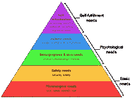

# 这个我眼中的民主(diot？)mm 格兰特！

> 原文：<https://medium.com/geekculture/democracy-in-the-eyes-of-this-i-diot-mmigrant-c002736c5ec8?source=collection_archive---------15----------------------->

这是一篇关于我的专业领域的文章，但是是关于我非常熟悉的主题。这是我个人对民主和时事的体验。

我在 2022 年 10 月 30 日，也就是我国迄今为止最激烈的总统竞选的这一天写下这篇文章。Bolsonaro 和 Lula 在民意调查中不分上下，在辩论中针锋相对-导致我认识的许多人站在一边，对那些利用他们的宗教或出身作为他们主要动机/倾向的卖点的政客们来说，他们完全是白痴。

巴西的情况极端两极化，正如最近在其他国家所知和看到的那样——最大的例子是美国最近的选举和国会大厦的场景。回到我的祖国，如果卢拉获胜，对 Bolsonaro 的选民(反对派亲切地称之为“牲口”)会做什么的担忧仍在隐现——我想补充一点，这是我渴望看到的事实，希望看到他们支持民主。

The Brazilian voter: “I’m voting in the chocolate cake” — cartoon by Andre Dahmer — [https://twitter.com/malvados/status/1376238689903378437](https://twitter.com/malvados/status/1376238689903378437)

# 巴西的民主

在巴西，民主仍处于萌芽阶段，在经历了整个 60 年代到 80 年代中期的漫长独裁时期后才得以形成(消息来源[https://pt.m.wikipedia.org/wiki/Ditadura_militar_brasileira](https://pt.m.wikipedia.org/wiki/Ditadura_militar_brasileira))我自己，不知道为什么，在巴西时经历了大部分时间，并从 18 岁开始参与。

但是巴西的民主是什么样的呢？从本质上来说，这是一个腐烂的过程，一种被贪婪和冷漠玷污了其“*存在理由*”的特权。请允许我解释。

根据法律，这是强制性的。从 16 岁到 18 岁也是可选的。对于参加选举的人来说，当选意味着 4 年的公共服务，意味着就业——没有任何教育或伦理/道德要求(尽管有些人是预期的，尽管常见的腐败指控)——这对许多巴西人来说是最好的工作。以至于在过去的几次选举中，任何人加入竞选都变得极其普遍——这给整个过程带来了难以置信的愚蠢。巴西 HBO 电视台在这段视频中提到了一些例子:

流行(或能够流行一时)是唯一的要求。一些我永远也做不到的事，所以我想这不是我的职业选择。虽然我出身卑微，但我可以用这笔钱。

政治和该国指挥链日益增长的不确定性是我决定移民的一些原因——因此，我想，巴西臭名昭著的政治场景(及其对市场和金融状况的影响)是改变我生活的事件之一。

# 移居

作为一名移民，在新国家的几年里没有投票权，继承了被破坏的民主进程的观点，并明确关注我的职业生活，假设民主不在我的优先事项列表中——正如马斯洛的需求金字塔所示，safeta 优先考虑更成熟的心理和社会学问题。

不过，这是我的经验。很明显，一个移民，带着一个家庭，一个更稳定的环境和一个更高的社会地位，必然会对民主进程有更敏锐的眼光——当然，他们应该密切关注这一点。

一个当地人，从来没有任何第三世界国家民主进程的经验，只在第一世界国家生活过，他们自己的需求总是被好运照顾，没有移民的背景，不可能理解为什么外国人不会加入他们新祖国的选举进程。

# 伊多塔

以我的经验来看，在一个(显然总是)选择暴力而非深思熟虑的上层阶级、当地公民眼里:下层阶级的移民就是白痴的缩影。他高兴地向作者指出:

“你没投票吗？那我就可以正式称你为白痴了”——对此，他很快补充道，当然是合理的:“白痴这个词来自希腊语 Idiota，意思是不参加民主进程”。

> 出自[古希腊](https://en.wikipedia.org/wiki/Ancient_Greek) [ἰδιώτης](https://en.m.wiktionary.org/wiki/%E1%BC%B0%CE%B4%CE%B9%CF%8E%CF%84%CE%B7%CF%82#Ancient_Greek) (idiṓtēs，“不参与公共事务的人，俗人”)，出自 [ἴδιος](https://en.m.wiktionary.org/wiki/%E1%BC%B4%CE%B4%CE%B9%CE%BF%CF%82#Ancient_Greek) (ídios，“私人”)。

一个和他们交谈的移民可能会意识到这个事实，因为一个受过良好教育的移民至少会两种语言，并且意识到乙炔学的重要性。

然而，移民必须尊重好公民的通常行为(他最好是，在这样一个备受尊重的环境中！生活在上层社会中的受过教育的下层公民的标注行为)。

# 决赛成绩

民主、阶级意识的自我和归属感——根据一位移民的观点。

巴西和这个国家的民主进程万岁！穷人和有需要的人万岁/寻找更好的生活。

> *"笔锋一转，笔锋一转
> Conseguimos conquistar com brao forte
> Em TEU seio，óliber Dade
> Desafia o nosso Pei to a própria morte*
> 
> *ópátria amada
> idol atrada
> Salve！药膏！”*

自由万岁，生活和表达思想的能力万岁，不论出身如何。

了解有关我的云和安全项目的更多信息:https://linktr.ee/acamillo

考虑订阅 Medium(此处),获取更多内容，增强你的能力！

感谢您的阅读，并留下您的想法/评论！