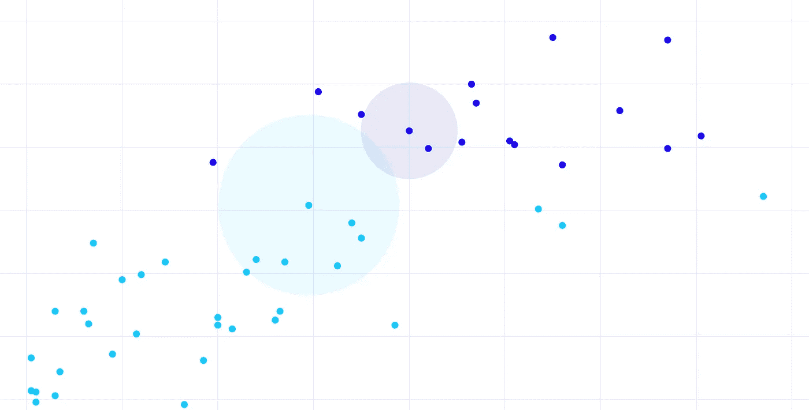
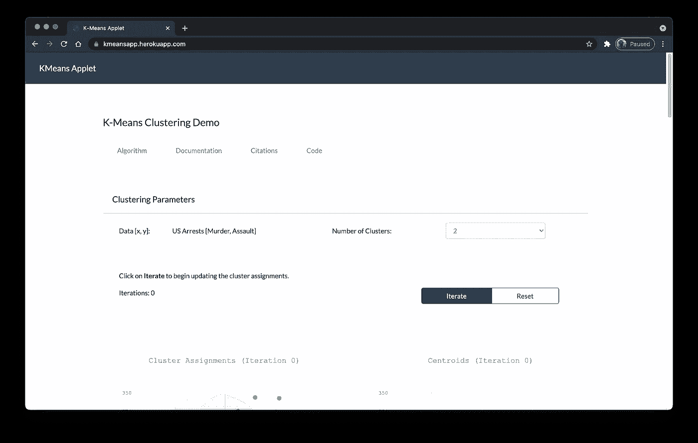
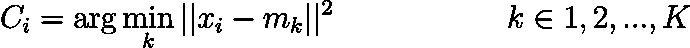
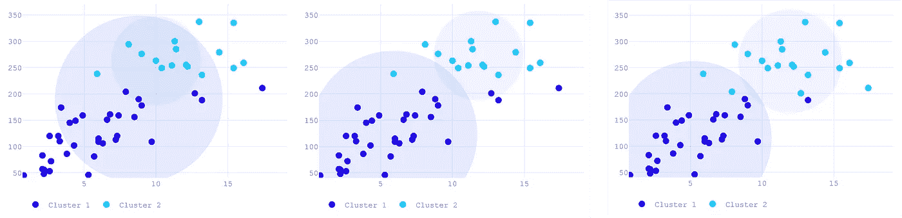

# 用一个最小的 Javascript Applet 演示 K-Means 集群

> 原文：<https://medium.com/geekculture/demonstrating-k-means-clustering-with-a-minimal-javascript-applet-57b0d716ace7?source=collection_archive---------24----------------------->

我时常喜欢做一些我称之为周末部署的事情:基本上是一个我会在周末创建和部署的小项目。由于我是一名专业的数据科学家，同时也从事一些后端 web 开发工作，所以我并不太担心项目的获得。事实上，我经常觉得自己处理了太多的项目，宁愿把所有空闲时间都花在阅读或和女朋友出去上。

但是编码是一项乏味的工作。不管你的代码有多干净([通常不是](https://javascript.plainenglish.io/writing-clean-code-is-a-myth-ca2637e1ba4d))，或者你的系统架构有多好规划(从来都不是)。迟早，你会遇到这样一种情况，你会连续几天盯着同一段代码优化训练率，寻找错误，并在最后一刻进行前端调整，因为你的副总裁一个月前要求的配色方案显然“对企业不再有吸引力”。

因此，为了打破沉闷，我喜欢在周末暂停一切，让自己沉浸在一个有趣的小项目中，来做一点系统更新。更全面的人现在可能会惊讶地看着我，想，那么，为了脱离代码，你在做与*不同的*代码？为什么不去听音乐会什么的？嗯，因为我们都被隔离了，因为把你的热情变成一份日常工作有一个不言而喻的负面影响:当你的日常工作开始让你紧张时，你真的没有别的事情可做。

Pictures: me “having fun” (Photo by [Tim Gouw](https://www.pexels.com/@punttim?utm_content=attributionCopyText&utm_medium=referral&utm_source=pexels) from [Pexels](https://www.pexels.com/photo/man-in-white-shirt-using-macbook-pro-52608/?utm_content=attributionCopyText&utm_medium=referral&utm_source=pexels)).

所以这是新密码。这不仅给了我解决一系列新问题的机会，完成周末部署也是获得成就感的一种简单方式，这种成就感来自于完成*任何*项目，无论大小。本周，我决定创建一个最小的 applet 来说明 K-Means 算法是如何工作的。

# 简而言之的意思是

虽然不像它更著名的表亲那样花哨或深奥(它只是不像“神经网络”那样成为头条新闻)，但 K-Means 算法在任何数据科学家的工具箱中都占有重要位置。它在广泛的应用中非常有用，从[分析市场细分](https://towardsdatascience.com/customer-segmentation-using-k-means-clustering-d33964f238c3)到[检测信用卡欺诈](https://link.springer.com/article/10.1007/s10586-018-2118-y)。它的地位可以和支持向量机相提并论:建立在一个简单的理论上，却惊人的有效。人们甚至会想，最初的 K-means 算法，来自 Stuart Lloyd 1982 年的论文(尽管他早在 1957 年就已经提出了这种方法)，怎么会出现在最小二乘回归理论之后的*。*

K-Means 背后的想法非常简单:给定一组在任意数量的维度(或机器学习行话中的特征)上定义的数据点，是否有可能将数据分成相似点的 *K* 组或簇。由此你已经可以想象一个简单的想法是如何应用到几乎任何研究领域的。这些群体可以代表客户的不同消费习惯、信用卡交易类型(假的或合法的)、网飞/Youtube 推荐系统的不同娱乐偏好。

我认为编写这样的 applet 对于任何正在寻找项目的初露头角的数据科学家或 web 开发人员来说都有很大的价值。首先，除非你愿意逃避，简单地用一个已经为你做了大量工作的预建包 *npm -i* ，否则你将不得不自己编写算法。也就是说，从地面向上。这个小程序完全是用普通的 Javascript 编写的，只有 [Bootstrap](https://getbootstrap.com/) (用于 CSS)和 [Plotly](https://plotly.com/) (用于漂亮的数据可视化)作为依赖项。当你对一个算法有了如此近距离和个人化的了解，你就更有可能理解它是如何工作的，以及它什么时候会失败。

The applet can be accessed at [kmeansapp.herokuapp.com](https://kmeansapp.herokuapp.com/). Alternatively, the code is [also available on github](https://github.com/dominicdayta/kmeans).

# 小程序

这个小程序演示了基于劳埃德算法的 K-means 聚类的一个非常基本的实现。对于数据，我使用的是直接从 R 数据集库中提取的[美国逮捕数据集，特别是*谋杀*和*袭击*变量。理论上，该算法可以用于您需要的(或可用的)任意多的变量，但是因为我想演示每个单独的数据点如何在整个迭代过程中改变集群分配，所以我决定坚持使用二维的情况。](https://stat.ethz.ch/R-manual/R-patched/library/datasets/html/USArrests.html)

该算法首先分配一组初始均值或“质心”。为了将数据分成 *K* 个簇，我们随机选择 *K* 个数据点作为我们的初始质心。然后，我们遍历每个数据点，并根据欧几里德距离将它们分配到离它们最近的质心。在下面的符号中， *C* 表示每个数据点 *x* 的聚类分配。

此时，数据中的每个点 *x* 都应该被分配到一个特定的质心。是时候通过平均每个聚类的所有成员点来更新我们的初始质心了。随着质心位置的更新，我们返回到分配步骤，根据每个点最近的新质心重新分配每个点 *x* 。

实际上，applet 在演示算法方面的价值在于展示了每个数据点如何在每个质心之间切换“成员资格”。applet 显示了下面的图，当用户在每个迭代中移动时，图中显示了从一个邻域移动到另一个邻域的数据点。

Iterations are arranged from left to right. From the random assignment of the centroid, each update step “refines” the centroid locations until their neighborhoods are more or less separated from each other.

该小程序还提供了质心本身如何在数据空间中移动的视图，因为该算法细化了它们的位置，以便产生或多或少分离良好的邻域或“簇”。

Each update step tends to separate the centroids from each other, as the algorithm finds their respective clusters.

在每一步，我们测量每个点和它们指定的质心之间的总(欧几里德)距离。一旦该距离的变化不超过设定的容差，算法就停止。在这个小程序中，公差设置为 1e-100，但是为了捕捉不收敛的情况，最多只允许 20 次迭代。这通常发生在算法努力寻找其目标函数的局部最小值时，劳埃德算法已经被证明经常经历这种情况。

应该注意的是，因为 applet 是用原始(或普通)javascript 编写的，所以我不得不使用 Math.random()方法，据我所知，它没有设置种子的功能。因此，重置 applet 导致不同的簇随机分配，这又导致不同的簇分配。

# 密码

我的小程序[的完整代码可以在我的 Github](https://github.com/dominicdayta/kmeans) 上查看。您可以随意派生和修改以供自己使用，甚至可以对现有的 applet 提出改进建议。我一直在考虑允许用户上传和使用他们自己的数据，但这需要用 PHP 或 Node JS 为 applet 建立一些必要的基础，因为它现在还很简单。

如果你是一名初级的数据科学家或 web 开发人员，我认为在不同的算法上做一个类似的项目(比如支持向量机，或[最短距离算法](/codex/dijkstras-algorithm-16c14151f89c))可能是一个值得你自己“周末部署”的项目