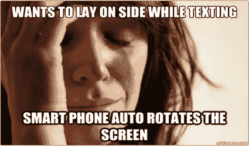

# 揭开 Android 的神秘面纱..！

> 原文：<https://medium.com/geekculture/demystify-orientations-in-android-a810bb970b96?source=collection_archive---------10----------------------->

我最近开发了一个需求，在这个需求中，我必须限制手持设备的方向为纵向，同时允许平板电脑的方向为开放式。就在那时，我陷入了对不同取向的困惑。希望我也能消除你的疑虑。

> **基于设备类型的阻塞方向**