# 揭秘人工智能

> 原文：<https://medium.com/geekculture/demystifying-artificial-intelligence-bdd9a117d4a6?source=collection_archive---------10----------------------->

# 介绍

人工智能围绕着我们，它已经成为我们日常生活中不可或缺的一部分——无论我们是否意识到。数字人工智能机器人是我们在日常使用的应用程序上体验的几乎所有事情的机制。从网飞到 Instagram explore 页面，我们 feed 上的所有推荐和图片，这就是人工智能在发挥作用。人工智能使脸书和 Twitter 等社交媒体巨头能够极其精确地为他们的客户定向广告。AI 存在于我们的家中；对温度或光线变化做出反应的智能设备。在我们的有生之年，将会有一个由人工智能驱动的自动驾驶汽车的范式转变，这已经开始了。我们生活在令人兴奋的时代——处于技术“人工智能革命”的前沿。现在你可能在想:AI 是什么？是会走路会说话有感情的机器人吗？没有——至少现在还没有。

## 什么是人工智能？

> 在计算机、数学和数据的交汇处，有人工智能；旨在模仿人类决策过程的计算机程序。

把 AI 想象成一把伞——在这把伞下面有；机器学习和深度学习。

> ML 是 AI 的一个子集，它使用统计学习算法来构建智能系统。
> 
> DL 是人工智能的一个子集，它使用人工神经网络来模仿人脑过滤信息的方式。

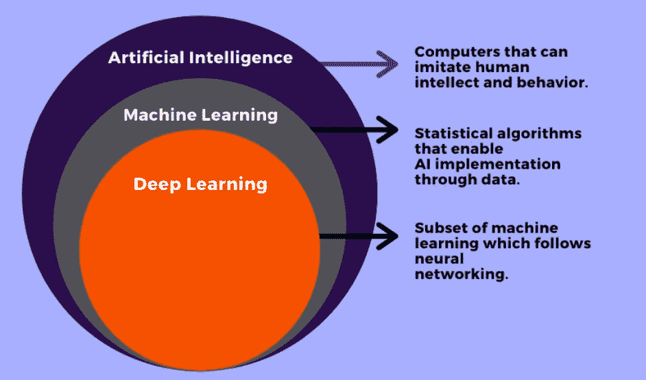

你以前可能听说过一些(如果不是全部的话)以上信息——所以我想把这篇文章从网上无数的人工智能文档中分离出来，通过阐明人工智能实际上是什么以及它如何工作的“黑箱”。 ***特指输入&输出之间的连接；*** 我们如何构建一个 AI 模型，接受数据，输出预测。以及看一些真实世界的例子。

## 内容/结构

*   这两个部分都将从上到下介绍一个真实的人工智能任务的例子；以一种整体的方式分解它，分别想象拼图的所有部分，以及它们如何连接形成我们所说的“人工智能”。
*   机器学习——它是什么，它是如何工作的。 ***真实世界例子:鸢尾花卉物种数据集，分类任务。***
*   深度学习——它是什么，它与 ML 有什么不同，它是如何工作的。 ***真实世界示例:$AAPL 股票预测，回归任务。***

## 学习目标

*   创建对人工智能的概念和文字理解
*   区分 AI、ML 和 DL
*   区分现代 AI 和未来 AGI(人工通用智能)
*   识别两种不同类型的人工智能任务——分类/回归
*   理解生物神经元和人工神经元的异同
*   识别人工智能的真实世界用例

为了保持技术和非技术读者之间的平衡，我没有在本文中包含任何代码。所有源代码都可以在底部的 GitHub repo 中找到。

# 机器学习——它是如何工作的？

> **I.** 选择&准备数据集
> 
> **二世。**实现期望的算法(建立 AI 模型)，并在准备好的数据上对其进行训练
> 
> **三世。**确定模型指标

下面将深入探讨第二步；什么是“期望算法”，模型如何“训练”

## 选择和准备数据集

让我们从探索一个简单和通用的 ML 数据集开始。

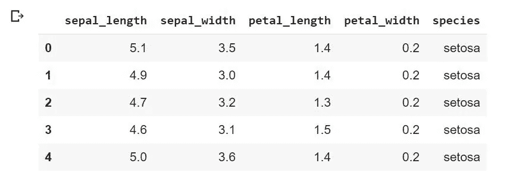

IRIS DATASET — first five rows

该数据集包含三种花卉种类的信息。注意有五列—前四列是关于花的数据，最后一列是花的种类。这种结构是所有人工智能最基本的组成部分。

> 前四列称为“功能”，最后一列称为“目标”。

***ML 算法将使用特征数据来识别花卉种类。*** 下一步是将数据分割成“特征”和“目标”。通常称为特征矩阵和目标向量。

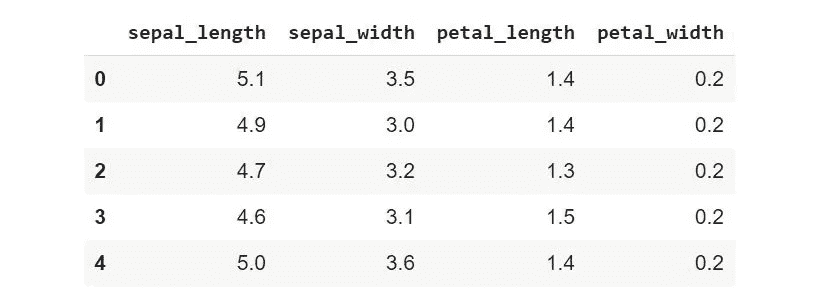

Feature Matrix

Target Vector

这意味着 ***特征矩阵中的每一行特征数据，直接等于目标向量*** 中对应的花卉种类的行值。现在是时候根据特征数据训练一个人工智能模型来识别花卉物种了。

## 建立和训练机器学习模型

机器学习可以进一步分解为两个任务；分类和回归。这个例子探索了一个分类任务。分类和回归的区别在于， ***分类任务寻求将预测“分类”到不同的类，*** 如我们的花卉例子中的不同花卉种类。 ***回归任务寻求预测连续值*** 。在这里，两者之间可以有明显的区别；

**学习目标** —

> 分类任务:预测 AAPL 股票明天是涨还是跌
> 
> 回归任务:预测 AAPL 股票明天的收盘价

人们可以利用大量的机器学习算法，有些算法比其他算法更强大。大多数最大似然算法的雏形被称为决策树，一旦你看到下面的信息图，我想你会很快意识到它为什么被命名。对于这个例子，一个简单的决策树就足够了。虽然有 ML 算法包含数百甚至数千棵树，称为随机森林，这是一个非常简单的任务，可以用一棵树精确地解决。*(注意——决策树是这项任务的“理想”算法，上文提到过)*

一个 ML 模型如何学习根据花的数据预测花的种类？很棒的问题！让我们想象一下模型的训练过程。

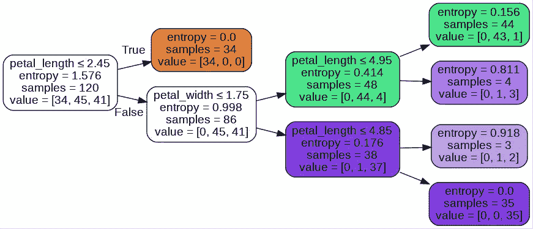

Simple Decision Tree Classifier

这是人工智能的“学习”——那么，这里到底发生了什么？让我们仔细看看。

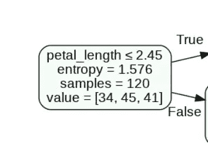

Root Note

这被称为节点，为了清楚地形象化这个过程，我有时将它们称为分割。

> 该模型通过在每个特征列上进行分割来学习，并识别具有最低熵的特征。

记住，这个模型的特征是数据集中的前四列；萼片长度，萼片宽度，花瓣长度，花瓣宽度。

通过查看根节点；我们可以看到熵最低的特征是花瓣长度，值是 2.45。

> 熵可以定义为:“缺乏秩序或可预测性；逐渐衰退为无序。”

这可能看起来违反直觉，但是把它想象成你是模型，做这些决定；**熵代表每种花卉在决策中的数量。**在这种情况下，决定是花瓣 _ 长度≤2.45。**一个简单的类比来进一步分解这一点；**想象一袋 9 个高尔夫球，每个都有不同的特征(大小、质地、品牌等)。有三种不同的可能颜色(目标)；白色，绿色，红色。能不能看到 AI 模型结构成型；特征和目标。好，继续——如果每种颜色有 3 个球，熵就很高。如果有 7 个红球，1 个白球，1 个绿球；熵非常低。如果我把我的手随机放在袋子里，把相似的特征组合在一起，然后把球分离出来——我会最小化熵。这本质上就是 AI 模型在训练的时候做的事情。

如果我看数据集，特别是第一列。sepal_length，我看到一堆值:5.1，4.9，4.7 等等。如果我分离出那一列中的每一个独特的数字，并计算每个独特数字上下的所有物种——这将产生熵。这正是模型正在做的，查看每个特性列中的每个值，然后用熵最低的特性值创建“节点”或“分裂”。重复这个过程，直到熵为零，或者尽可能接近零。

如你所见，熵在根节点非常高。随着模型“学习”，你可以看到它在减少。这就是最小化熵的模型——也就是“学习”。 ***模型是这样计算熵的:***

> 熵

Shannon Entropy Formula

**其中:**

P(i) =物种数(i) /总样本数

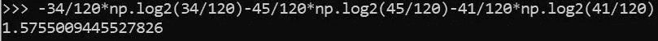

Entropy at the root node

在训练期间“学习”的分裂是导致最小熵的决策。这些是上面信息图中看到的节点。这就是模型如何对新数据的发展做出决策。当新数据输入到模型中时，它将首先查看 petal_length，看它是否小于或等于 2.45，如果是，我们知道它是 setosa 物种，如果不是，模型将遵循该过程的其余部分，继续最小化熵。

## 确定模型指标

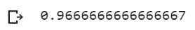

Model accuracy — 96%

如您所见，该模型在根据花卉数据预测花卉种类方面非常准确。

# 深度学习——它是如何工作的？

从上面开始遵循相同的步骤。

> **I.** 选择&准备数据集
> 
> **二世。**实现期望的算法(建立 AI 模型)，并在准备好的数据上对其进行训练
> 
> **三世。**确定模型指标

## 选择和准备数据集

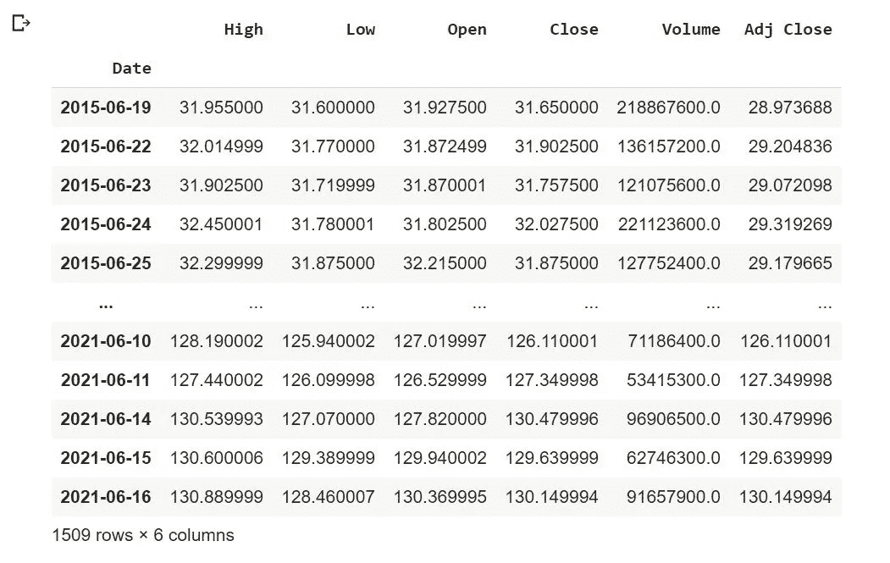

Six Years of $AAPL OHLC Stock Data

对于这个例子，我将通过一个 ***深度学习回归*** 任务来尝试和预测$AAPL 收盘价。深度学习在数学上比上面显示的 ML 模型复杂得多，也是大多数人在谈论现代人工智能时所指的。

> 尽管如此，步骤是相同的。开盘价是特征数据，收盘价是模型目标。

这意味着模型将使用开盘价来学习收盘价。显然，这是相当明显的。这篇文章不是投资建议——但预测股票价格是了解人工智能的一种有趣方式。

现在，是时候将数据分成特征/目标了。深度学习模型需要大量数据来进行适当的训练，这就是为什么我取了 6 年的每日 OHLC 价格。在上面的 ML 例子中；预测花卉物种，因为这不是一项非常密集的任务，所以在训练模型之前没有必要对数据进行大量的预处理。然而，这个 DL 模型确实需要一些预处理，这将在下面解释。

> 步骤 1:将数据分为要素/目标
> 
> 步骤 2:重塑和缩放特征和目标

**第一步:**

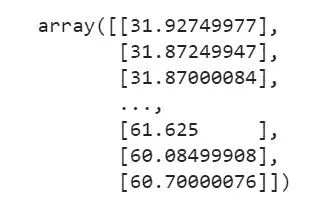

Feature Data — Isolated Open Prices

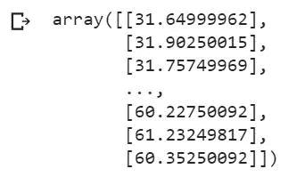

Target Data — Isolated Close Prices

如你所见，我所做的只是将数据分成开盘价和收盘价。您可以通过查看上面的数据框进行验证。

**第二步:**

**这一部分极其重要**——如上所述，这是一项非常密集的任务，因此我需要做大量的预处理，而不仅仅是分离特征和目标。

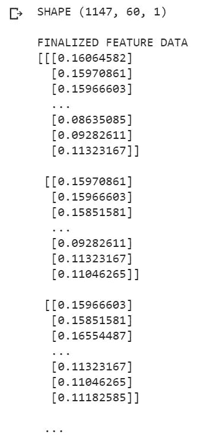

Final feature data — ready for model input

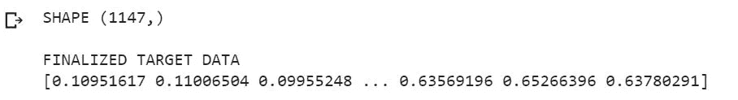

Final target data — ready for model input

***记住——特征数据只是开盘价，目标数据只是收盘价。他们看起来和他们在漂亮的“OHLC 数据框”上看起来有点不同，我将在下面解释为什么。***

**细目:**

*   **缩放特性&目标数据:**缩放 0-1 之间的所有数据。这意味着特征数据中的每个原始开盘价和目标数据中的每个原始收盘价 ***都被赋予一个 0-1 之间的值，与其原始值成比例。***
*   **特征数据:**我创建了一个具有 60 天回顾期的数据结构，这意味着数据被分成了 1，147 个 60 天的“块”——也可以通过查看“形状”在图片中看到。 ***这意味着模型将对 60 天的开盘价进行训练，以预测一个收盘价。***
*   **目标数据:**和特征数据一样，我也创建了一个包含 1，147 个 60 天“块”的数据结构——通过查看“形状”可以在图片中看到。除了不是每个块中的 60 开盘价，而是一个收盘价，特别是第 60 天的收盘价。 ***这意味着模型将被训练来预测当天的收盘价。***

数据选择和预处理到此为止。数据已经成形、缩放，并为模型训练做好了准备。跟着看一个人工神经网络的构造！

## 建立和训练机器学习模型

深度学习算法由神经网络组成，神经网络由神经元组成，通常称为节点。就像 ML 一样——有许多算法可以利用，有些比其他的更复杂。 ***人工神经网络的目标是模仿人类前脑中生物神经网络的结构。***

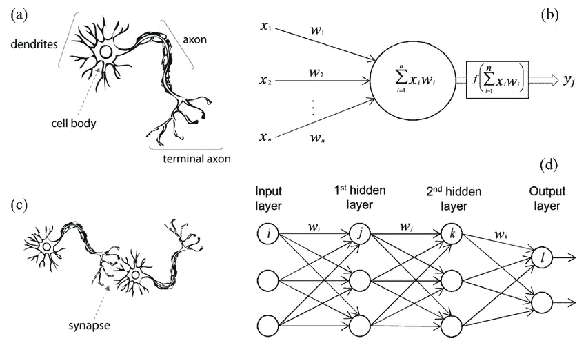

Biological Intelligence vs Artificial Intelligence

**故障:**

左边是一个生物神经元(a)，和一个生物神经网络(c)。右边是人工神经元(b)和人工神经网络(d)。

*   **图一:** **生物神经元。** *树突*接受输入，传递给细胞体(细胞核)，轴突携带输出。
*   **图 B:人工神经元。**【x1，x2，x3…】是输入，它们被传入*节点*，后者输出一个预测。
*   **图 C:** **生物神经网络。**它描绘了两个生物神经元之间的连接，称为*突触*。
*   **图 D:** **人工神经网络，俗称‘ANN’。**这描绘了人工神经元的连接。表示为 W(i)的线，被称为*“权重向量”或“参数”*，是神经突触的人工神经网络等价物(下面将详细介绍)。

**其中:**

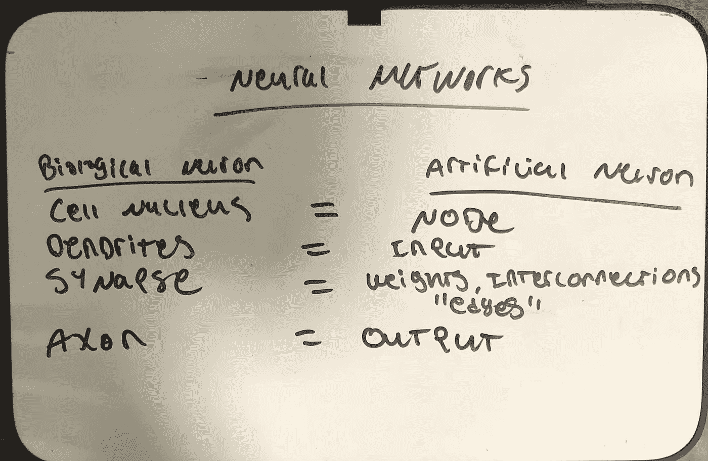

Biological Neuron vs Artificial Neuron

**有趣的事实:**

**人类神经网络**——“神经元数量~ 860 亿，突触数量~ 150 万亿，另一种概括:每个神经元平均突触数量~ 1744。”

**专门的人工神经网络**——“GPT-3 的完整版拥有 1750 亿个机器学习参数的容量。"

*(旁注——GPT 3 是世界上最强大的人工智能。* ***此处阅读更多:****[*GPT-3—维基百科*](https://en.wikipedia.org/wiki/GPT-3#:~:text=%20Generative%20Pre-trained%20Transformer%203%20%28%20GPT-3%29%20is,OpenAI%2C%20a%20San%20Francisco-based%20artificial%20intelligence%20research%20laboratory.) *)**

*所以现在我们有东西可以比较了，记住，所有这些数字都是近似值。让我们把事情简单化:*

> *大脑突触的数量:150 万亿*
> 
> *专业人工智能中的参数数量:1500 亿*
> 
> *150 万亿/1500 亿= 1000。换句话说——最强大的人工智能必须扩展 1000 倍，它们的连接才能与大脑相媲美……*

*学习目标 —现在你应该明白现代人工智能和未来人工智能的区别了(AGI)。GPT 3 号是我们离 AGI 最近的一次，它离完全复制人类思维还很远。*

***回到构建模型！***

*模型如何学习根据 60 个最近的开盘价预测收盘价？让我们来看看！*

*如上所述，有许多 DL 算法可以利用，因为这是一个广泛的任务，一个简单的前馈神经网络；就像上面信息图中描述的那样(图 d)，是不够的。这里我将利用一种特殊类型的人工神经网络，称为 LSTM RNN。这代表 ***长短期记忆递归神经网络。基本的人工神经网络没有记忆能力，它们只是简单地前馈数据。****

> *之所以选择 LSTM RNN 作为这个任务的“理想”算法，是因为 LSTM RNNs 具有记忆顺序数据的独特能力。*

*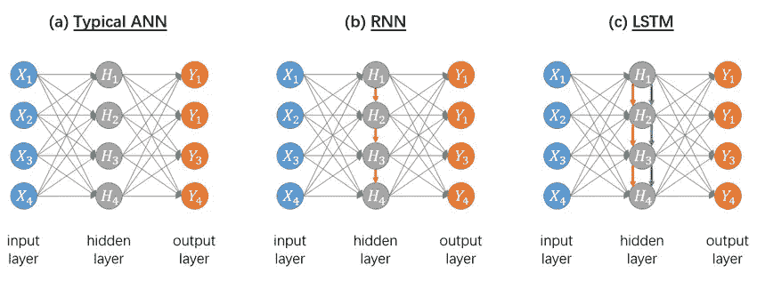*

*ANN vs RNN vs LSTM RNN*

*让我们通过放大每个网络中的特定节点来进一步研究这一点。*

> *基本人工神经网络节点*

*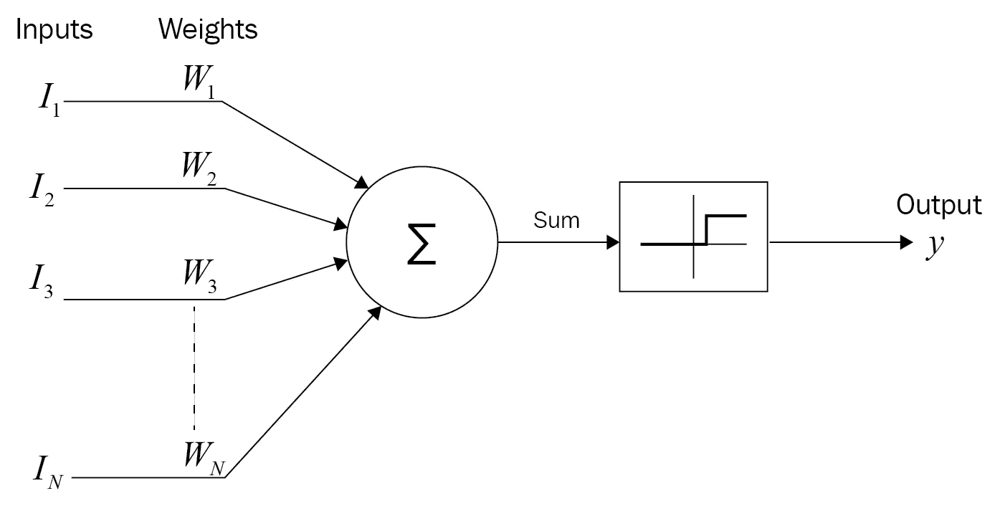*

*ANN node*

*这是在一个基本的人工神经元中发生的一切。它是所有人工神经网络中最基本的组成部分。输入与权重相结合(下面将详细介绍)，并通过“激活”功能发送。*

**(在这里阅读更多关于激活函数的内容:* [*神经网络中的激活函数—GeeksforGeeks*](https://www.geeksforgeeks.org/activation-functions-neural-networks/)*)**

***公式***

*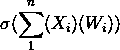*

*Basic ANN node*

*这也称为标量函数。标量函数接受多个输入，并返回一个值。*

> *在这种情况下，节点可以定义为:包含单个标量函数的单元*

***其中***

*X =输入向量(在我们的示例中—预处理的开盘价)*

*W =权重向量，这些是“学习参数”*(下面详细解释)**

*(∑(X)(W)) =输入向量 x(i-n)和权重向量 w(i-n)的点积*

*σ = sigmoid 激活函数*

**进一步分解一下—**

*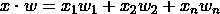*

*Dot Product of inputs (x) and weights (w)*

*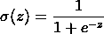*

*Sigmoid activation function*

> *复杂人工神经网络节点——LSTM·RNN*

**

*LSTM Unit*

***其中***

*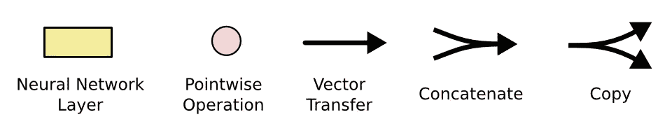*

*LSTM Unit Notation*

*深入研究这个数字可能需要一整篇文章，所以我将省略技术细节，只给出一个简要的概述。如您所见，在这个 LSTM 单元中有一个标量函数(节点)的集合。LSTM 单元本质上由人工神经网络节点组成，这些节点根据重要性过滤信息。 进一步分解；一个普通 LSTM 单元由一个**输入门**，一个**输出门，**一个**遗忘门，**和一个**单元状态组成。**每个门实质上代表一个 ANN 节点，这些门调节信息在&中流出单元状态。细胞状态是 LSTM rnn 和“普通”rnn 之间的对比——充当 LSTM 的记忆机制。*(在这里阅读更多关于 LSTMs 的信息:* [了解 LSTM 网络— colah 的博客](https://colah.github.io/posts/2015-08-Understanding-LSTMs/) *)**

*虽然看起来令人生畏，但 LSTM 单元只是一个节点集合，它控制着进入单元状态的数据流。*

***主要学习目标** —权重向量背后的概念，在上述所有信息图中用“W”表示，非常复杂，有点超出了本文的范围。然而，它是人工神经网络的一个组成部分，必须加以讨论，即使只是简单地讨论。*

*与 ML 模型在训练时最小化熵的方式相同，DL 模型在训练时通过*学习*正确的权重向量来最小化其误差，通常称为“成本”。 ***这是一个被称为梯度下降的过程。****

> *梯度下降算法支持所有现代深度学习方法。*

**(在这里阅读更多关于渐变下降的内容:* [*渐变下降——维基百科*](https://en.wikipedia.org/wiki/Gradient_descent) *)**

*当模型接收到输入数据时，它会通过网络进行正向传递，这意味着它会通过那些具有随机生成的权重的数学函数(节点)来传递所有输入数据。然后，它进行反向传递，通常称为反向传播，即执行梯度下降，以最小化其损失函数的误差。 ***该模型能够通过学习正确的权重参数来最小化损失，梯度下降就是“教导”模型正确的权重。****

*术语“损失”在这里只是模型预测值和正确值之间的差异。*(注意——此类损失函数仅适用于回归任务，因为我们可以对两个连续值之间的差异进行建模)**

*就像有许多不同的 DL 算法一样，也有许多不同的损失函数。为这项任务选择的人；均方差。*

> *均方误差*

**

*MSE formula*

***例子***

*模型预测收盘价= [126，122，128]*

*实际收盘价= [123，125，129]*

*MSE = 6.33333*

> *快速回顾一下——我们是如何走到这一步的？*

*当训练一个人工智能模型时，我们给它特征数据和目标数据。特征数据通过神经网络传递，模型输出预测。MSE 公式捕捉的是同一时刻模型预测输出( **ŷ** )和目标数据( **y** )之间的距离(又名“误差”)。记住有 1，147 个实例，所以 MSE 公式捕捉了所有实例的这个误差。*

***再一次，回到构建模型！***

*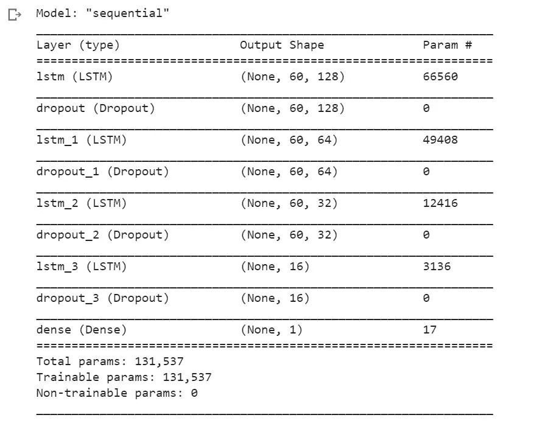*

*Model summary*

***故障***

*   *我建造了一个四层的 LSTM RNN。第一层 128 个 LSTM 单位，第二层 64 个单位，第三层 32 个单位，第四层 16 个单位。*
*   *如您所见，大约有 130，000 个参数*

*如果你能记住这一节的开头；我创建了一个数据结构，其中有 1，147 个实例，每个实例中有 60 个开盘价。现在，终于到了使用它，并训练模型的时候了！*

*现在发生的是，模型通过整个数据集进行预编程数量的循环，这些循环被称为历元。每个时期，模型将在 32 个实例之后更新权重参数，这 32 个实例被称为批量大小。*

> *快速回顾一下！*

*记住，每个实例有 1，147 个 60 开盘价的实例，所以 MSE 公式捕捉了所有实例的这个误差。通过调整权重，该模型每 32 个实例就进行调整以最小化该误差。在本例中，整个过程在多个时期重复进行；25.*

> *时期、批量大小、层数、节点数=超参数*
> 
> *权重向量=参数*
> 
> *参数和超参数的区别在于超参数是人为控制的，谁建立模型谁决定超参数。权重向量被称为参数，因为它们不受人的控制，模型自己学习权重。*

*经过 25 个周期的训练，模型的损失很小。*

*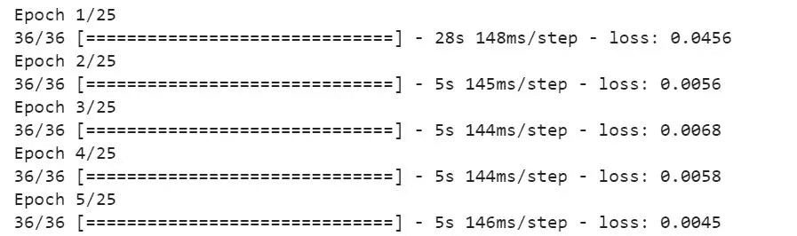*

*Loss after first five epochs*

*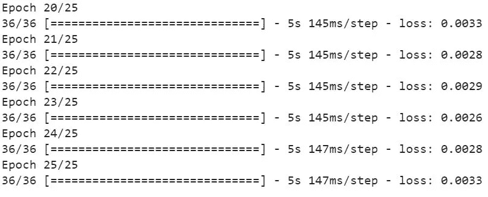*

*Loss after last five epochs*

*如你所见，随着时代的延续，损失在减少。这意味着模型正在学习。*

***做出预测***

*我将输入 60 美元 AAPL 最近的开盘价，看看模型显示什么！*

*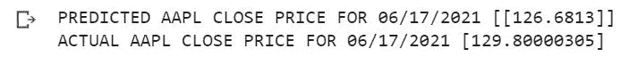*

*Model predictions*

*相当准确，非常酷！*

# *结论*

*有无限多的方法来解决任何一个编程任务，这也适用于人工智能任务。正如你在上面看到的，有大量的选择；如何准备数据，如何配置模型——这些事情都包含大量的决策。*

*所有这些决策都会影响模型的学习方式以及在生产环境中的使用方式。*

*我希望在这一点上，你已经对人工智能实际上是什么有了一种直觉，这实际上只是数学，简单来说，就是特征和目标数据之间的联系。*

***链接:***

*笔记本:[揭秘-ai-article/揭秘 _ ai . ipynb at main j0 sephsasson/揭秘-ai-article(github.com)](https://github.com/j0sephsasson/demystifying-ai-article/blob/main/demystifying_ai.ipynb)*

*LinkedIn: [约瑟夫·萨森| LinkedIn](https://www.linkedin.com/in/joseph-sasson23/)*

***感谢您的阅读，快乐学习！***