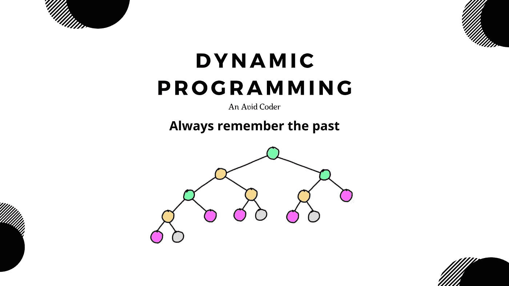
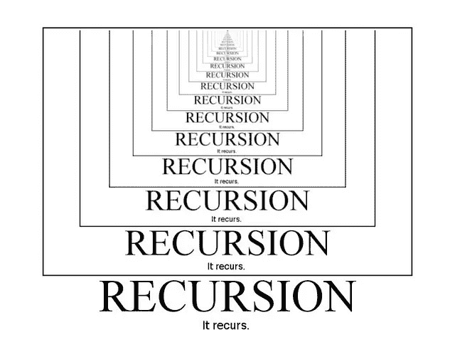
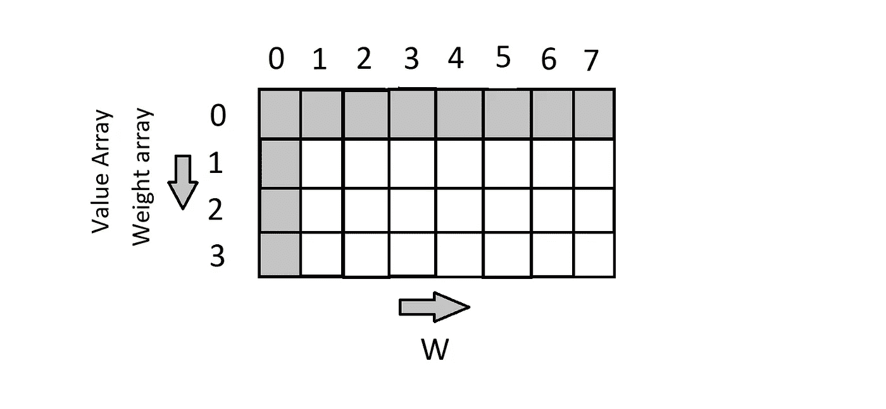
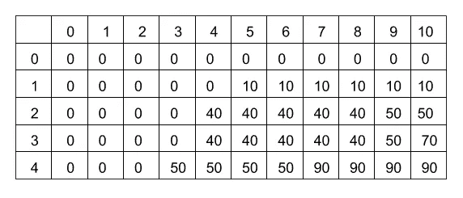

# 用 Java 揭开动态编程的神秘面纱—第一部分

> 原文：<https://medium.com/geekculture/demystifying-dynamic-programming-with-java-part-i-9e501d94bfe6?source=collection_archive---------6----------------------->

如果你记不起过去，就注定要重蹈覆辙。~动态编程

*抓紧了，我们开始吧。*

Dynamic Programming

在开始之前，请阅读这句话来激发你的动力。

> 如果你不能飞，那就跑，如果你不能跑，那就走，如果你不能走，那就爬，但无论如何，继续前进。小马丁·路德·金。

现在，我们开始:)

## 什么是递归？

对于更小的问题，这是一个类似的重复过程，或者你可以说，在一个更小的子问题**的代码中调用相同的函数，直到达到基本条件。**

上面的图示可以帮助你理解递归。

所以，你一定在想递归在动态编程中是做什么的？？

## 什么是动态编程？

动态编程只不过是对普通递归的优化。每当我们看到一个更小的子问题的重复递归调用时，我们可以在动态编程的帮助下优化这个递归调用。这个想法就是简单地存储结果，这样我们就不必一次又一次地重新计算这个子问题。

**动态编程=递归+记忆。**

让我们借助一个例子来理解

斐波纳契数:1，1，2，3，5，8，13，21，34，55…

它只是前一个数字和当前数字的总和。

**使用递归方法返回第 n 个斐波那契数:**

你可以看到，我们正在调用(n-1)和(n-2)的函数，直到达到基本条件，并相加以获得另一个新数字。**具有指数级的时间复杂度。**

**使用 DP 方法返回第 n 个斐波那契数:**

在上面的要点中，你可以看到我在 dp 数组中保存了之前的值。**具有线性时间复杂度。**

## 背包的类型:

1.  **分数背包:-** 需要贪婪范式来解决问题。
2.  **0/1 背包:-** 需要动态规划。
3.  **无界背包:-** 需要小改动的动态编程。

## 自下而上的方法又称制表法

在这种方法中，我们初始化 2d 矩阵的第一行和第一列，答案在每个单元格中累积，最终，在 2d 矩阵的最后一个单元格中，您将获得所需的答案，每个单元格中存储的值只是存储的较小子问题的值。

我们将借助列表法(自下而上)来解决这个问题。

# 0/1 背包

给你 **N** 件物品的重量和价值，将这些物品放入一个容量为 **W** 的背包中，获得背包中最大的总价值。请注意，每种商品只有**一个数量。
换句话说，给定两个整数数组 **val[0..N-1]** 和 **wt[0..N-1]** ，分别代表与 **N** 项相关联的值和权重。同样给定一个表示背包容量的整数 W，找出 **val[]** 的最大值子集，使得这个子集的权重之和小于等于 **W.** 不能分解一个物品，**要么挑完整的物品，要么不挑(0–1 属性)**。**

## 投入

val[] = {60，100，120}

wt[] = {10，20，30}

W = 50

## 输出

220

**故障:**

*   你有 N 件物品。
*   背包的总容量是 **W** 。
*   **val[0…N-1]** 数组描述值数组， **wt[0…N-1]** 数组描述项目的权重。
*   你必须**最大化利润**并且每种商品只能有**一个数量。**

**解决问题的方法:**

做一个 2d 数组 dp matrix — dp[N+1][W+1]，+1 因为我们要从第 0 行第 0 列开始初始化。

dp 矩阵的 x 轴(行)将表示背包 0，1，2…的容量..因为我们将存储更小的子问题的答案。

dp 矩阵的 y 轴(列)将表示数组 0，1，2…的长度..普通

我们将用 0 初始化第 0 行和第 0 列，因为如果 val 数组或 wt 数组为空，那么最大利润将为 0，因为我们不能向背包添加任何东西，如果 W 为 0，那么我们不能向背包添加任何东西，因此利润将为 0。

最后你的答案会存储在**DP【n】【W】。**

**这里试出问题** [**0/1 背包**](https://practice.geeksforgeeks.org/problems/0-1-knapsack-problem0945/1) **。**

# 无界背包

无界背包又称重复物品背包。这里，表里不一是允许的，不像 0/1 背包。

我们将用列表法解决这个问题

**Q)** 给定一组 N 个项目，每个项目都有一个权重和一个值，以及一个权重限制 w。找出包含任意次数 **N 个项目的集合的最大值**，使得总权重小于或等于 w。

## 投入

val[] = {1，4，5，7}

wt[] = {1，3，4，5}

W = 8

## 输出

11

**细分:**

*   你有 **N** 件物品。
*   背包的总容量是 **W** 。
*   **val[0…N-1]** array 描述值数组， **wt[0…N-1]** array 描述项目的权重。
*   你必须**最大化利润**你也可以**多次选择一个项目。**

**接近**

我们将用 0 初始化第 0 行和第 0 列，因为如果 val 数组或 wt 数组为空，那么最大利润将为 0，因为我们不能向背包添加任何东西，如果 W 为 0，那么我们不能向背包添加任何东西，因此利润将为 0。

最后，你的答案会存储在 **dp[n][W]中。**

Unbounded backpack 中唯一的小变化在上面代码的第 17 行。

在 0/1 背包中，我们不能多次选择一个项目，因此我们减少了数组的大小，因为我们不想包含它。因此代码行是:

DP[I][j]= math . max(val[I-1]+**DP[I-1]**[j-wt[I-1]]，dp[i-1][j])

在无界背包中，我们可以多次选择一个物品，因此我们不会减少数组的大小。

DP[I][j]= math . max(val[I-1]+**DP[I]**[j-wt[I-1]]，dp[i-1][j])

**这里试出问题** [**无界背包**](https://practice.geeksforgeeks.org/problems/knapsack-with-duplicate-items4201/1)

# 结束语:

谢谢你到目前为止阅读这篇文章，也祝你未来的努力一切顺利。我希望这篇文章能帮助你理解这个概念，也希望你们都能成为自己的优化版。

敬请关注更多文章。

在下一部分，我们将解决更多关于字符串的有趣问题

> 对知识的投资回报最高。

**查看 GitHub 上的要点:-**[https://gist.github.com/akshat-fsociety](https://gist.github.com/akshat-fsociety)

如果有疑问，你们可以联系我

**LinkedIn:-**[https://www.linkedin.com/in/akshat-srivastava-4812271a9/](https://www.linkedin.com/in/akshat-srivastava-4812271a9/)

**GitHub:-**https://github.com/akshat-fsociety

**数据结构算法库:-**[https://github . com/AK shat-fsociety/Data-Structures-Algorithms](https://github.com/akshat-fsociety/Data-Structures-Algorithms)