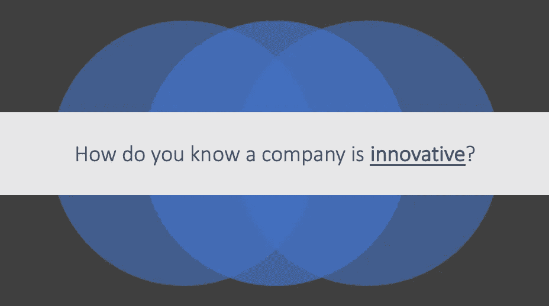
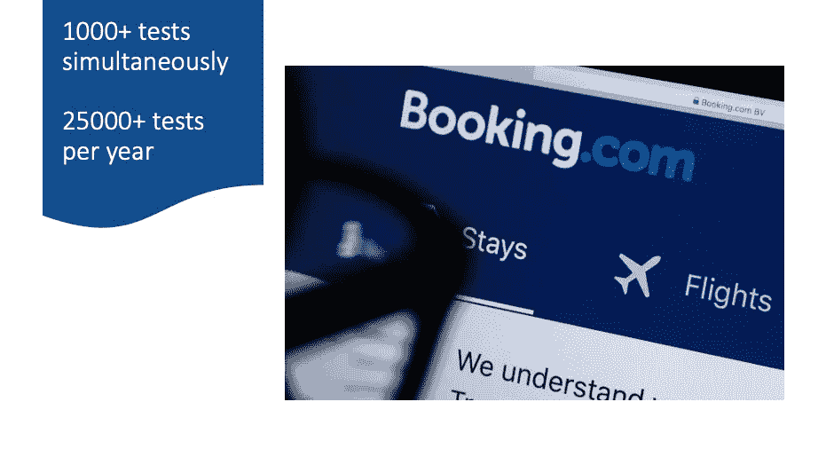
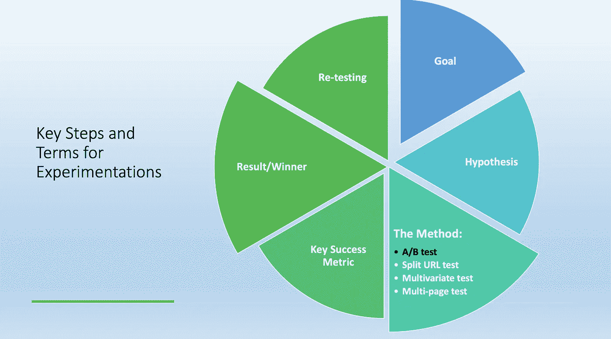

# 揭开数据驱动决策实验的神秘面纱

> 原文：<https://medium.com/geekculture/demystifying-experimentation-for-data-driven-decisions-d12c57484506?source=collection_archive---------30----------------------->

欢迎阅读一篇短文，在这篇短文中，我将揭开数据驱动决策的商业实验的神秘面纱。在本文中，我将介绍一些关于实验的关键术语，最常见测试(AB 测试)的步骤，以及一个案例研究。

在这篇文章的结尾，你将能够确定什么是实验，为什么它是重要的，理解最常见的实验的实际步骤。你也将能够定义和分析不同类型实验之间的差异。如果你准备好了，让我们开始吧。

在深入细节之前，现在我需要你暂停阅读，思考以下问题的答案:

> 你怎么知道一个公司是创新的？是基础设施吗？是人吗？是思想吗？

我确信你的答案很可能是**创新**的一部分。但研究表明，衡量创新的一个简单易行的方法是:在一家公司里，“实验有多普遍”。

# 因为我是一名数据科学家，在旅游行业工作，所以我经常给我的同事举一个最相关的测试和实验的例子，那就是 Booking.com。

根据 Stefan Thomke 的估计，Booking.com 每年同时进行超过 1000 项严格的测试(T5)和超过 25000 项测试(T7)。Booking.com 运行如此大量的实验，不是因为他们有足够的基础设施、数据管道和成千上万的数据科学家，而是因为他们有强大的实验文化，并授权每个员工独立运行此类测试。

# 什么是实验？

实验简单来说就是科学地检验想法。在设计实验之前，你需要知道并采取几个步骤:

1.  **目标**:你需要建立你实验的目标。例如，如果你想增加利润，就要确定你希望公司的净收入增长多少以及何时增长。
2.  **假设:**之后，你必须定义一个假设，在这个假设中，你要考虑在你的工作场所的一个行动是否会导致你期望达到的目标或结果。
3.  实验的类型:然后你需要决定你想用什么类型的实验来检验你的假设。最常见的实验是 AB 测试。 **A/B 测试(也称为分割测试)是同时向网站访问者的不同部分显示同一网页的两个变体，并比较哪个变体驱动更多转换的过程**。
4.  **关键衡量指标:**然后你需要弄清楚如何定义关键绩效指标(KPI)，以便准确衡量你的实验是否成功。

在你成功地设计了你的实验之后，你将会弄清楚这种疗法是否是赢家。

# 什么是 AB 检验和多元检验？

简单的 A/B 测试可以在几天内建立起来，通常会持续至少一周。有第三方工具可以让每个员工测试想法。

对于更严格的测试，您的数据科学家可以帮助您设计实验并分析结果。

多元测试是另一种常见的实验类型:虽然它类似于 AB 测试，但这种方法允许您一次测试两个以上的变化。你需要在你的公司、团队或项目中民主化实验。

# 在整个公司培养实验文化

当从实验的变革力量中获益时，承诺是关键。随着时间的推移，实验文化将为你的公司带来巨大的长期利益。