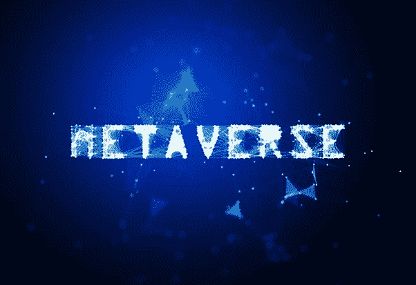
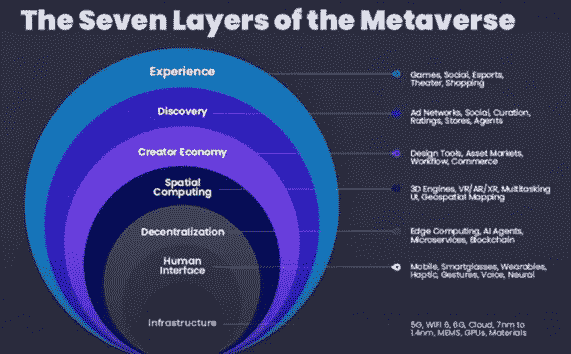
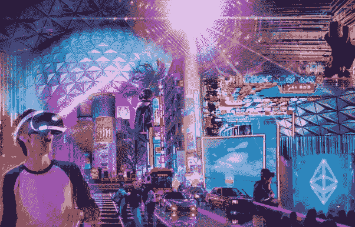
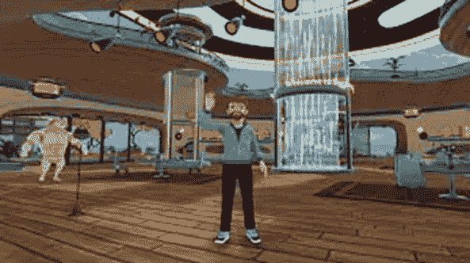
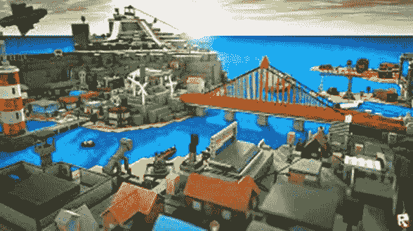

# 揭秘元宇宙

> 原文：<https://medium.com/geekculture/demystifying-metaverse-a468b76ec92d?source=collection_archive---------10----------------------->

# **序言**

这些天来，上网很难不遇到有人对和赞不绝口，不管是出于敬畏还是嘲笑。这变得非常像五个盲人摸象的故事，类似地，各种各样的观点被表达出来，这是互联网不可避免的未来或亿万富翁的幻想；一个游戏乌托邦，一个“无限的工作场所”，一个品牌战略，和 NFT 游乐场，或者一个科幻梦。

> 因此，问题仍然是元宇宙的潜在理念是什么，这使得马克·扎克伯格将此作为他未来的职业，以及为什么其他科技公司对这一概念的各种其他解释投注了大量资金。

还有一个有待回答的问题；加密货币和区块链技术将在实现这一愿景中扮演什么角色。最重要的是，这些会对你的生活产生什么影响？

在这篇文章中，我们将揭开元宇宙概念的神秘面纱。然而，由于这个领域仍在发展，我们都在学习这个不断发展的概念，以及为什么不同的公司和个人都在全力支持它。

**定义**

在某些方面，元宇宙已经存在于虚拟现实聊天等平台或第二人生等视频游戏中。它是一种技术混合体，结合了虚拟现实、增强现实和视频，允许用户在数字领域中“生活”。

> 各种技术进步为真正的元宇宙铺平了道路，这是一个集成了增强现实、虚拟现实、3D 全息化身、视频和其他通信模式的在线虚拟环境。随着元宇宙的扩张，它将为你提供一个超真实的另一个宇宙来共存。

元宇宙设想其用户通过从音乐会和会议到虚拟环球旅行的活动来工作、娱乐和与朋友保持联系。

有些人把元宇宙定义为一个高级版本的互联网，你置身其中，而不仅仅是看着它。你作为一个化身在这个独特的 3D 世界里走来走去，与其他化身互动；可以买卖虚拟商品，可以上班，可以组建社区，可以玩游戏，可以发动战争。

**体验元宇宙**

元宇宙存在于我们周围。《第二人生》和《魔兽世界》等 MMORPGs 的早期试验引入了游戏化社交平台的概念，吸引了用户，以至于武器和服装等数字商品以及游戏中的住所都承载着巨大的现实世界价值。现有的社交网站，如脸书、Instagram 和 Twitter，已经实现了伪匿名互联网化身身份的构建，以及用户可以分享新闻、讨论信息和与朋友交流的互动虚拟房间。

> 人们对通过外部屏幕完成数字沉浸感并不陌生，无论是在谷歌聚会上，与同事的变焦通话中，还是多人游戏中。然而，有一些新兴技术有潜力赋予数字世界更多意义、持久性和显著性。

提高远程呈现的一个重要因素是模拟人类体验的能力，这将有助于元宇宙的发展。在这方面，虚拟现实(VR)耳机和运动跟踪设备可以发挥关键作用，越来越逼真的描绘创造了一种完全的感官沉浸状态。一些创新的例子包括 SuperHot，这是一种矩阵风格的游戏，时间的移动速度与玩家一样快，以及 VR Chat，这是一种社交平台，玩家可以在公共虚拟房间中创建 3D 化身进行互动。

虚拟现实(VR)寻求创建一个与物理空间分离的沉浸式虚拟世界，而增强现实(AR)通过虚拟显示器增强物理现实。微软的 Hololens 是一款增强现实耳机，它可以跟踪我们正在看的东西和我们的身体运动，以叠加虚拟图像和图标，允许令人信服的用例，可以帮助我们导航，识别物体，并与物理世界进行虚拟互动。

想象一个世界，你可以戴上 AR 眼镜，看看一个人那天选择穿哪双虚拟鞋，或者在你桌子上存在的完全虚拟的屏幕上玩游戏。AR 眼镜可以基于传感器实时更新，提供信息并强调日常体验。

AR 的目标是无缝融合虚拟和物理，以令人兴奋、实用和真实的方式改善日常生活。

**元宇宙元素**

以下要素构成了为元宇宙的发展创造必要环境所必需的生态系统。

***硬件:*** 销售和支持用于访问、交互或开发元宇宙的物理技术和设备。这包括面向消费者的硬件(如 VR 耳机、手机和触觉手套)和企业硬件(如用于操作或创建虚拟或基于 AR 的环境的硬件，如工业相机、投影和跟踪系统以及扫描传感器)。此类别不包括计算机专用硬件，如 GPU 芯片和服务器，以及网络专用硬件，如光纤电缆或无线芯片组。

***联网:*** 由主干网提供商、网络、交换中心和在它们之间路由的服务，以及那些管理消费者“最后一英里”数据的提供商提供持久、实时的连接、高带宽和分散的数据传输。

***计算能力:*** 支持元宇宙的计算能力的启用和供应，支持物理计算、渲染、数据协调和同步、人工智能、投影、运动捕捉和翻译等多样化和高要求的功能。

***虚拟平台:*** 创建和操作身临其境的数字(通常是三维的)模拟、环境和世界，用户和企业可以在其中探索、创建、社交和参与各种体验(例如，赛车、绘画、上课、听音乐)，以及从事经济活动。这些业务不同于传统的在线体验和多人视频游戏，因为它们有一个由开发人员和内容创作者组成的大型生态系统，这些开发人员和内容创作者制作了大部分内容和/或收集了基础平台产生的大部分收入。

***交换工具和标准:*** 作为实际或事实上的互操作性标准的工具、协议、格式、服务和引擎，使元宇宙的创建、运行和持续改进成为可能。这些标准支持渲染、物理和人工智能(AI)，以及资产格式及其从一个体验到另一个体验的导入/导出、前向兼容性管理和更新、工具和创作活动以及信息管理。

***支付:*** 支持数字支付流程、平台和运营，包括到纯数字货币和金融服务(如比特币和以太网)的菲亚特入口(一种数字货币交换)以及其他区块链技术。

***元宇宙内容、服务和资产:*** 与用户数据和身份相关的数字资产(如虚拟商品和货币)的设计/创建、销售、转售、存储、安全保护和财务管理。这包括“构建在元宇宙之上”或“服务于”该平台但未被平台所有者垂直整合到虚拟平台中的所有业务和服务，以及专门为元宇宙构建且独立于虚拟平台的内容。

[***用户行为***](https://www.matthewball.vc/all/userbehaviorsmetaverse) ***:*** 消费者和企业行为(包括花费和投资、时间和注意力、决策和能力)的可观察变化，这些变化或者与元宇宙直接相关，或者以其他方式促成它，或者反映它的原则和理念。当这些行为第一次出现时，它们几乎总是以“趋势”(或者更贬义地说，“时尚”)的形式出现，但后来却显示出持久的全球社会意义。

**元宇宙的地层**

元宇宙就像一个有几层的洋葱，下面突出显示了重要的几层:

**第一层:经验**

虚拟现场活动的进行展示了元宇宙体验的另一个方面:内容-社区复合体。而过去只是内容的被动消费者的消费者现在也变成了内容的创造者和放大者。“用户生成内容”的概念以前仅限于博客评论或上传视频等功能，现在已经转变为利用元宇宙的各种工具(主要是 3D 和 AR/VR 应用程序)来创建完整的体验。

体验的最大应用将是体育运动和以社交娱乐为目的的在线社区。传统的基于体验的行业，如旅游、教育和现场表演，将围绕游戏思维和丰富的虚拟经济进行重塑。

**使用元宇宙应用程序的一些体验包括 3D 游戏，如游戏机上的堡垒之夜、虚拟现实耳机上的 Beat Saber 和计算机上的 Roblox。这些体验式应用还包括客厅中的 Alexa、虚拟办公室中的 Zoom、手机上的 Clubhouse 和家庭健身房中的 Peloton。**

**第二层:发现**

发现层是关于向人们介绍新体验的推和拉。发现系统可以被广泛地归类为营销概念，要么是个人主动寻找关于某个经历的信息，要么是个人没有特别要求的营销，即使他们选择加入。以下事情将导致元宇宙的发现过程:

> 1.实时在线
> 
> 2.社区驱动的内容
> 
> 3.真正的搜索引擎在元宇宙的体验目的
> 
> 4.对应用商店中列出的特色应用进行监管，并得到“影响者”的认可。
> 
> 5.垃圾邮件(电子邮件、LinkedIn、Discord)
> 
> 6.通知

上述大多数概念目前为互联网用户所熟悉，因此重点在于社区驱动的内容和实时呈现的各个方面，这将提升元宇宙的重要性。

首先，社区驱动的内容是一种比大多数营销形式更具成本效益的发现新内容的方式。如果人们关心他们所涉及的内容或事件，他们就会传播消息。随着内容在更多的元宇宙环境中变得更容易交换、交易和共享，它也将成为一种营销资产。

实时呈现特征有助于发现各种类型的社区。在元宇宙，这一点尤为重要，因为通过分享经历与朋友互动将带来巨大价值。因此，对于创作者来说，最激动人心的发现机会之一是跨越元宇宙众多活动的实时存在检测。

**第三层:创造者经济**

在元宇宙出现之前，想要为给定的技术创造体验的人没有可用的工具，所以他们习惯于从头开始构建一切。早期，网站直接用 HTML 编码；人们为电子商务网站实现他们的购物车；程序员直接为游戏编写图形硬件。

如今，人们可以在几分钟内启动一个电子商务网站，而不需要知道一行代码。可以使用多种工具在线创建和维护网站，这些工具具有内容管理和数据驱动的功能。在 Unity 和 Unreal 等游戏引擎中，可以使用工作室环境中的视觉界面创建各种 3D 图形体验，而无需接触底层渲染。

# 元宇宙的体验将越来越生活化、社会化，并不断更新。到目前为止，元宇宙中由创建者驱动的体验都是围绕着集中管理的平台。

元宇宙的体验将变得越来越沉浸式、社交化和实时化。这导致了在元宇宙围绕集中管理的平台建立的快速发展的创造者驱动的体验。因此，制作它们的创造者的数量呈指数增长。

这一层包含了创作者每天用来创造人们喜欢的体验的所有技术。

**第四层:空间计算**

空间计算是一种混合真实/虚拟计算的特定类型的计算，它模糊了虚拟和真实世界之间的区别。这种类型的计算需要将空间带入计算机，有时还需要将计算注入对象。空间计算最重要的目标是创造超越传统屏幕和键盘界限的系统，而不会陷入各种界面的泥沼。

空间计算已经发展成为一种广泛的技术，允许我们进入和操纵 3D 空间，以及用额外的信息和体验增强现实世界。导致空间计算的软件的关键方面包括:

> 显示几何图形和动画的 3D 引擎
> 
> 地理空间映射和对象识别将内部和外部世界融合在一起
> 
> 语音和手势识别
> 
> 来自设备的数据集成(物联网)
> 
> 来自人的生物指标(用于识别目的以及在健康/健身方面的量化自我应用)。

**第五层:去中心化**

元宇宙的理想结构是一个分散的结构，没有单一的实体控制增长和使用。当选择最大化，系统可以互操作，并且建立在创作者可以完全控制他们的数据和创作的竞争性市场中时，实验和增长就会飞速增长。

去中心化的最早例子之一是域名系统(DNS)。它将单个 IP 地址映射到名称上，让你不必每次想上网时都输入一个数字。

然而，分布式计算和微服务提供了一个全新的去中心化世界，为开发者提供了一个可扩展的生态系统。这使他们能够利用在线资源——从商业系统到专门的人工智能到各种游戏系统——而无需专注于构建或集成后端功能。

区块链技术时代的到来已经实现了软件之间的价值交换，并带来了拆分和捆绑内容和货币的新方式，这导致了巨大的去中心化。一个名为 Web3 的新创新领域通过将金融资产从集中控制和托管中解放出来，推动了元宇宙的创建。

随着专门为游戏和元宇宙体验所需的微交易而设计的 NFTs 和区块链的出现，将会出现一波去中心化市场和游戏资产应用的创新浪潮。

**第六层:人机界面**

技术增强了我们周围的世界，它增强了人类的体验和能力，也将我们的现实扩展到数字和虚拟世界。随着身体互联网(IoB)的逐步发展，这些正在走向电脑-人界面。

可穿戴的计算设备正变得与我们的身体更加亲密，将我们转变为电子人。智能手机不再被认为是手机。它们是高度便携、始终连接、功能强大的计算机，预装了一个电话应用程序。技术进步和进一步小型化正在使便携式手机配备正确的传感器、嵌入式人工智能技术，以及对强大的边缘计算系统的低延迟访问。这种电话将能够从元宇宙吸收越来越多的应用和经验。

> 疫情实施的隔离导致了对新平台的实验，将沉浸式技术推向了极限，并以不同寻常的方式进行合作，从眼球跟踪技术和面部跟踪到生物计量和大脑控制界面。

**第七层:基础设施**

基础设施层包括支持我们的设备、将设备连接到网络以及交付内容的技术。网络正在显著提高带宽，同时减少网络争用和延迟

为了实现下一代移动设备、智能眼镜和可穿戴设备所需的无束缚功能、高性能和小型化，将需要功能越来越强大、体积越来越小的硬件。随着微电子机械系统(MEMS)的发展，微电子芯片正在以 3 纳米及更高的工艺制造，这将允许微小的传感器；和小巧耐用的电池。

> 因此，基础设施主干将主要由半导体领域的发展来构建。

**一些宣传元宇宙的领先公司**

**梅塔/脸书:**这个科技巨擘的前身是脸书，事实上，它已经更名为梅塔，以站在元宇宙革命的最前沿。Meta 设想了一个虚拟世界，其中数字化身通过 VR 头戴设备进行互动，用于工作、旅行或娱乐。这位创始人对元宇宙非常乐观，认为它有潜力取代我们目前所理解的互联网。Meta 首席执行官马克·扎克伯格在透露公司的新名称后表示:“下一个平台和媒体将是一个更加身临其境、更加具体化的互联网，让你身临其境，而不仅仅是看着它。”。

**微软:**这家软件巨头已经部署了全息图，并正在开发混合和扩展现实(XR)应用程序，通过其微软网格平台将现实世界与增强现实和虚拟现实结合起来。微软正计划在 2022 年前将混合现实，包括全息图和虚拟化身，引入其视频会议实用工具微软团队。为了进一步利用元宇宙的机会，它还在探索零售和工作场所的 3D 虚拟互联空间，并希望在明年推出。这家公司有可能成为元宇宙未来舞台上的主要参与者之一。

Epic Games: “众所周知，Epic 投资建造了《元宇宙》，”这家公司的首席执行官蒂姆·斯维尼声称，该公司利用广泛的 3D 沉浸式功能创作了非常受欢迎的游戏《堡垒之夜》。该公司通过举办音乐会、电影预告片和音乐首发式，非常重视元宇宙带来的身临其境的体验。此外，通过开发其工具超人类创造者，它有助于创建逼真的数字人类，这可以使你在未来的开放世界游戏中定制你的数字二重身。

Roblox: 这个平台成立于 2004 年，是元宇宙的先驱，因为它容纳了大量用户生成的游戏，包括角色扮演产品，如 Bloxburg 和 Brookhaven，用户可以在这里构建家庭、工作和游戏场景。Roblox 创始人兼首席执行官 David Baszucki 在 IPO 当天表示，“我们离实现#元宇宙的愿景又近了一步”。从那以后，Roblox 与滑板鞋公司 Vans 合作创建了 Vans World，这是一个虚拟的滑板公园，玩家可以穿着新的 Vans 装备，并开设了一个有限的古驰花园，在那里你可以为虚拟的自己试穿和购买衣服和配件。

**《我的世界》:**这是另一个受孩子们欢迎的虚拟世界，本质上是乐高的数字等价物，玩家可以创造他们的数字角色，建造他们想要的任何东西。《我的世界》目前拥有超过 1.5 亿活跃用户。在疫情期间，它在被迫更加依赖虚拟联系的儿童中变得越来越受欢迎。

**结论**

概括地说，元宇宙的概念可以用以下方式来定义:

> 元宇宙没有被称为“一个”元宇宙。多元宇宙是下一代互联网。这个空间中的无数冒险将会在社交上和图像上围绕着我们。
> 
> 元宇宙是一个专注于社交互动的三维虚拟世界网络。该术语经常被用来描述互联网的一种新的迭代，即通过使用虚拟和增强现实耳机而成为可能的单一、通用的虚拟世界。
> 
> 元宇宙不再是白日梦；它现在正在成为现实，由于这项技术，我们的现实世界将在未来几天变得更加虚拟。虚拟现实将会发展并将我们的体验带到一个新的高度。

很快，元宇宙将会存在，它将由一个互联的虚拟世界网络组成。我们未来的目标应该是让任何人都能够简单、可信、分散地建立自己的身份并进入这些世界。如果这一愿景成功，元宇宙将能够充分发挥其潜力，同时保持自由并向所有人开放。