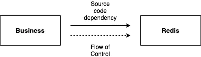
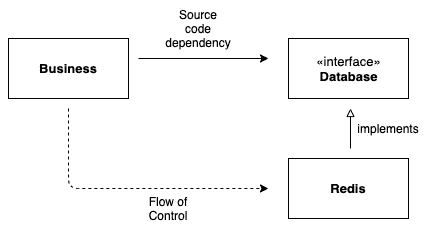

# 从软件架构师的角度揭开面向对象编程的神秘面纱

> 原文：<https://medium.com/geekculture/demystifying-object-oriented-programming-in-a-software-architect-perspective-4191186aebe2?source=collection_archive---------40----------------------->


Photo by [Alex wong](https://unsplash.com/@killerfvith?utm_source=medium&utm_medium=referral) on [Unsplash](https://unsplash.com?utm_source=medium&utm_medium=referral)

工作的软件和正确工作的软件是有区别的。构建有效的软件，只考虑它的行为，是一项半途而废的工作。软件工程师应该通过考虑软件的结构来构建灵活且可伸缩的软件。好的软件来自好的结构，好的结构来自好的架构。因此，像软件架构师一样思考是很重要的。

## 面向对象编程

十之八九的人将面向对象编程(OOP)描述为“模拟现实世界的一种方式”，或者使用以下概念:**封装**、**继承**和**多态**。然而，封装、继承和多态对于 OOP 来说并不独特，也不新奇；事实上，这些概念已经在 c 等非面向对象语言中广泛使用。

> 如果所谓的 OOP 概念不是 OOP 独有的，是什么让 OOP 如此强大和特别？

Bob 叔叔回答这个问题时说**“OO 是使用多态性获得对系统中每个源代码依赖的绝对控制的能力。”**

我认为他的回答揭示了我们为什么使用 OOP 的本质。在面向对象语言出现之前，多态性是手工操作的，而且有风险，因为工程师必须显式地使用指向函数的指针。然而，面向对象语言使多态更加容易和安全，允许工程师最大化多态的好处。在本文中，我将用具体的例子来论证他的答案。

> 当我使用术语**多态**时，我指的是动态多态，也称为运行时多态。

## 多态性概述

多态性是采取多种形式的能力。当子类或基类从超类继承一个方法并重新定义它时，多态性通过方法覆盖来实现。您可以通过使用继承重写超类的方法或实现接口的方法来重写方法。

*   **继承**是在子类中使用超类的结构和行为。继承使用 *extend* 关键字对“is-a”关系进行建模。
*   接口正在用方法签名定义一组行为。接口使用*实现*关键字来建模“能够”关系。

## 为什么我们使用多态性

多态性可以概括、分离和消除源代码之间的依赖性。让我们看一个非常简化的例子。

假设您有一个将用户名保存到数据库 Redis 的业务类。Redis 类是一个简单的类，具有读写方法。

如图所示，依赖关系和控制流是一致的。业务类**依赖于**Redis 类，因为业务类明确地提到并访问 Redis 类。



这个系统运行良好，直到你的经理要求你使用不同的数据库。如果你想增加或改变数据库，你必须**改变**业务类的代码。现在，这将是一个很好的时机来想办法**消除商业类对 Redis 类的依赖**。这就是**多态性**发挥作用的地方。

## 多态性和依赖性倒置

通过使用多态性，我们可以完全控制源代码的依赖性。回到例子，让我们抽象 Redis 类并创建一个数据库接口。

Redis 类可以实现数据库接口并覆盖读写方法。

现在，我们可以将 Redis 实例化为一种数据库类型。

```
Database redisDatabase = new Redis();
```

然后，我们可以更改 saveName 方法，将 Database 而不是 Redis 作为其参数。

现在发生了什么？商务类对 Redis 一无所知，也不提 Redis 类。换句话说，业务类不再依赖于 Redis 类。



Redis 实现并依赖于数据库接口，但是控制流是从业务类到 Redis 类的。因此，Redis 和数据库接口之间的代码依赖与控制流的方向相反。这就是**依赖反转**！根据依赖倒置原则(DIP)，"**最灵活的系统是那些源代码依赖仅指抽象而非具体化的系统。**“在我们的例子中，数据库接口是抽象的，Redis 类是具体化的。

使用多态性，当我们想要添加或更改数据库时，我们不再需要更改业务类。我们所要做的就是创建一个实现数据库接口的新的具体类。

```
Database redisDatabase = new Redis();
business.saveName(redisDatabase, "Sohee");Database mySqlDatabase = new MySql();
business.saveName(mySqlDatabase, "Sohee");
```

面向对象语言中的多态性给了工程师们很大的力量来构建一个更加灵活的系统，并且可以扩展。特别是在变化频繁的易变系统中，依赖倒置有助于打破耦合。我希望你能更好地理解鲍勃叔叔的观点。如果有人问 OO 是什么，你可以引用他的话，说"**它是通过使用多态性，获得对系统中每个源代码依赖的绝对控制的能力。**

> 这篇文章基于罗伯特·c·马丁的《干净的建筑》。鲍勃叔叔。我使用的所有引语都来自这本书。我强烈推荐阅读它。