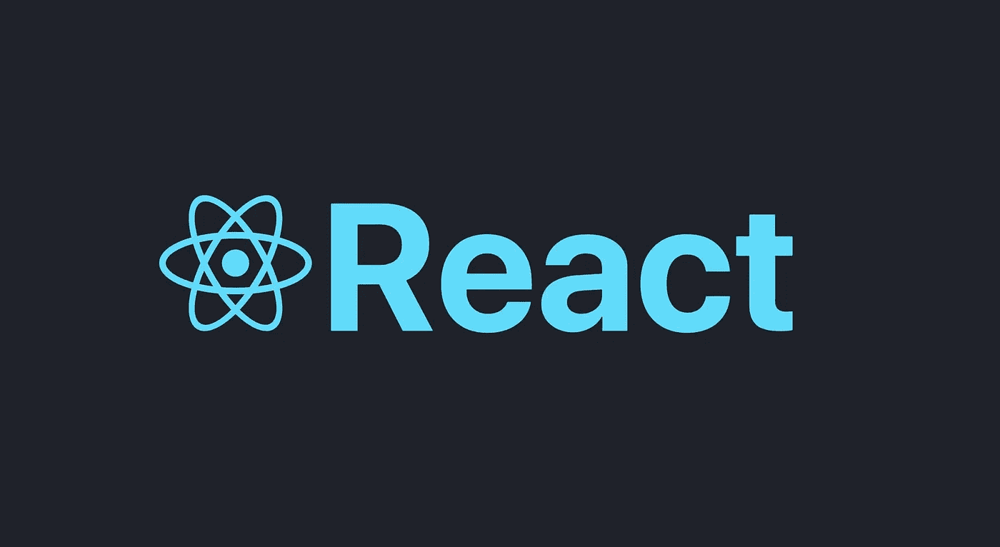
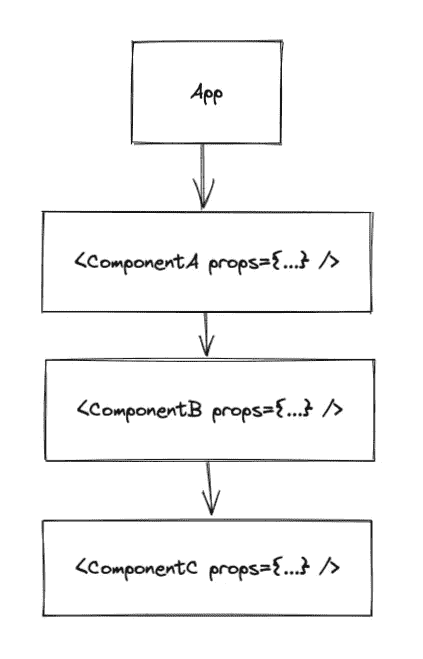

# 揭秘 React 的上下文 API

> 原文：<https://medium.com/geekculture/demystifying-reacts-context-api-9fa9951d80ee?source=collection_archive---------8----------------------->

什么是上下文 API，什么时候应该使用它？

## 支柱钻井的问题是

您是否发现在 React 中组件之间传递数据很麻烦？尤其是在跨多个嵌套组件传递数据时。

在典型的 React 应用程序中，数据通过 props 在组件之间传输。但是，当应用程序中的许多组件(例如登录凭证、UI 主题)都需要数据时，或者您必须通过多个中间组件传递数据时，这就变得难以处理了。

Prop Drilling in React

这个的解决方法？React 的上下文 API。

上下文 API 负责处理状态管理，并解决了许多与支柱钻井相关的问题；它允许您拥有一个可以直接注入任何消费组件的中央存储。让我们通过一个简单的例子来说明这是如何工作的！

## 初始化上下文和提供程序

Context

Provider

React 的上下文 API 已经实现了*提供者消费者模式*。提供者管理消费者组件可以订阅的数据。创建一个上下文对象，该对象可用于创建提供者和消费者。

`Provider`组件接受一个可以传播给后代组件的`value`属性。在我们的`value` prop 中，我们有当前用户的信息和一个函数`updateUser`来更新`Provider`中用户的状态。

当`value`属性改变时，消费组件将使用更新后的值重新呈现。需要注意的一点是，重渲染并不局限于消费类组件；当`value`改变时，从`provider`派生的所有组件将重新渲染。

## 实现消费者

Consumer

App

`useContext`函数允许您的功能组件订阅之前实例化的`Context`。该函数接受`Context`对象，从`useContext`返回的参数将是树中离调用组件最近的`Provider`的状态。

在`ChildComponent`中，值`user`和`updateUser`已经从`Provider`传播。当点击按钮时，函数`updateUser`将被调用，并且`user`将在上下文中被更新。

我们的 app 现在用的是上下文 API！

## 使用带有自定义挂钩的上下文 API

在我们的`ChildComponent`中，我们直接访问`useContext`钩子。但是如果`ChildComponent`不是`Provider`的后代会怎么样呢？返回值将解析为在`createContext`中定义的默认值，即`undefined`，而我们并不知道。这很容易发生在大型应用程序中，其中有许多组件，并且`Provider`不在我们应用程序的顶层。

此外，为每个需要上下文的组件实现检查会很快变得很麻烦。将`useContext`提取到一个定制的钩子中并在钩子中执行检查要简单得多。

让我们用自定义钩子重写我们的`ChildComponent`。

Custom Hook

Consumer with custom Context Hook

## 什么时候应该使用上下文 API？

尽管 React 的上下文 API 与 Redux 等其他状态管理工具相比实现起来很简单，但它是以这样一种方式构建的，即每当上下文的值发生变化时，所有派生组件都会重新呈现。组件的不断重新渲染可能会降低应用程序的性能，尤其是当它扩展和增长时。

如果您需要一个不经常更新的全局状态，那么在实现中央存储时，上下文 API 会比 Redux 更有效。在这个场景中，上下文 API 大放异彩，因为 Redux 需要更广泛的设置才能与 React 应用程序集成。

可以使用上下文 API 的场景:

*   共享用户界面主题(暗/亮模式)
*   共享用户信息
*   跨多个组件共享数据，不需要频繁更新

## 结论

Context API 是跨 React 应用程序的多个组件共享数据的有用工具。但是，我们应该谨慎使用它，因为它会导致重新渲染的问题，并且使组件重用更加困难。

## 额外资源

[https://reactjs.org/docs/context.html](https://reactjs.org/docs/context.html)