# Javascript 中的依赖注入

> 原文：<https://medium.com/geekculture/dependency-injection-in-javascript-2d2e4ad9df49?source=collection_archive---------0----------------------->

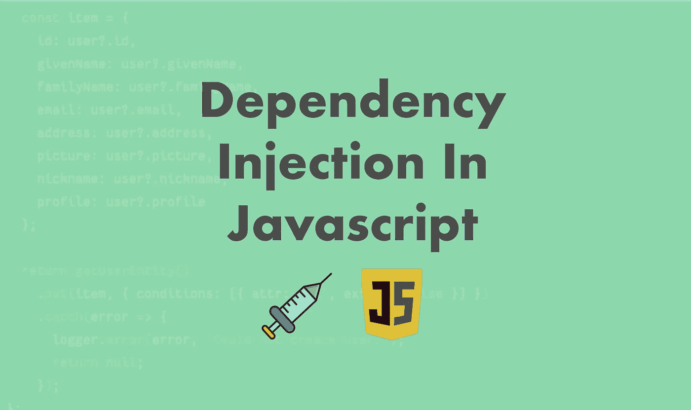

[依赖注入](https://en.wikipedia.org/wiki/Dependency_injection) (DI)是一种编程模式，其中使用参数传递依赖，而不是在函数或类中实例化它。DI 支持在应用程序代码中创建独立的组件，并使将来随着需求的变化切换这些依赖关系变得容易。将参数作为依赖项传递还允许通过注入它们的模拟版本来轻松地对那些组件进行单元测试。

本文使用**高阶函数**探索 Javascript 中的依赖注入，并将其与类进行比较。这种模式适用于任何支持独立函数定义的语言。

对于本文的其余部分，让我们假设我们正在构建一个简单的假设应用程序，它有一个`Course`实体，并且课程有`Lesson`。`AWS DynamoDB`存储课程，`S3` bucket 将课程存储为 JSON 对象。

首先，为了理解这种模式，让我们探索如何使用类实现依赖注入，然后我们将探索使用 javascript 函数的这种模式的一些例子。

# 使用类的依赖注入

首先，让我们探索使用类的依赖注入，然后我们可以将它与使用高阶函数的依赖注入进行比较。

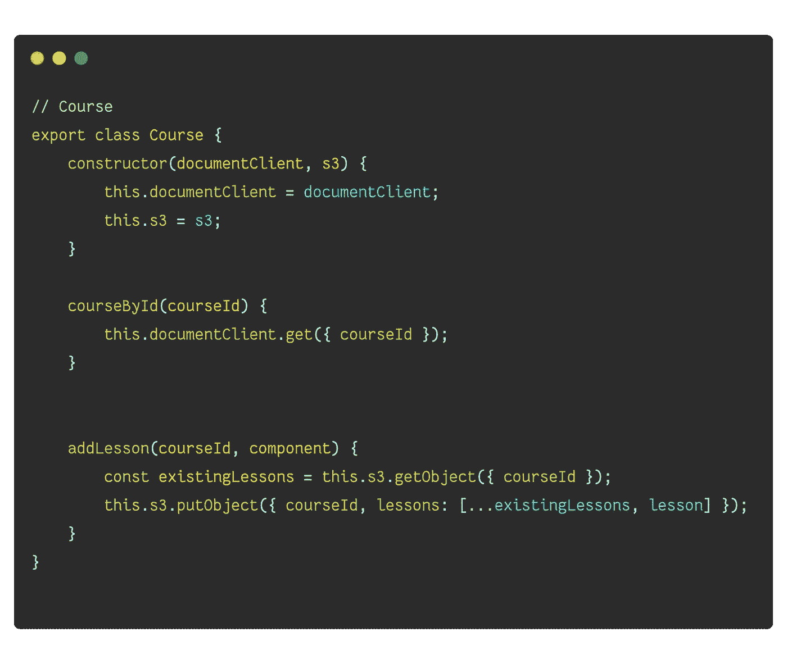

DI using classes

在上面的例子中，我们定义了一个拥有两种方法的课程类。`courseById`从 DynamoDB 获得课程`addLesson`给 S3 增加了一堂课。我们还从`aws-sdk`注入了`documentClient`和`S3`。

现在我们有了这个类和一些方法，让我们看看如何使用它。为了在我们的应用程序中使用它，我们首先需要创建一个`Course`的实例。除非我们使用依赖注入框架，否则我们通常使用`Factory`类来实现。

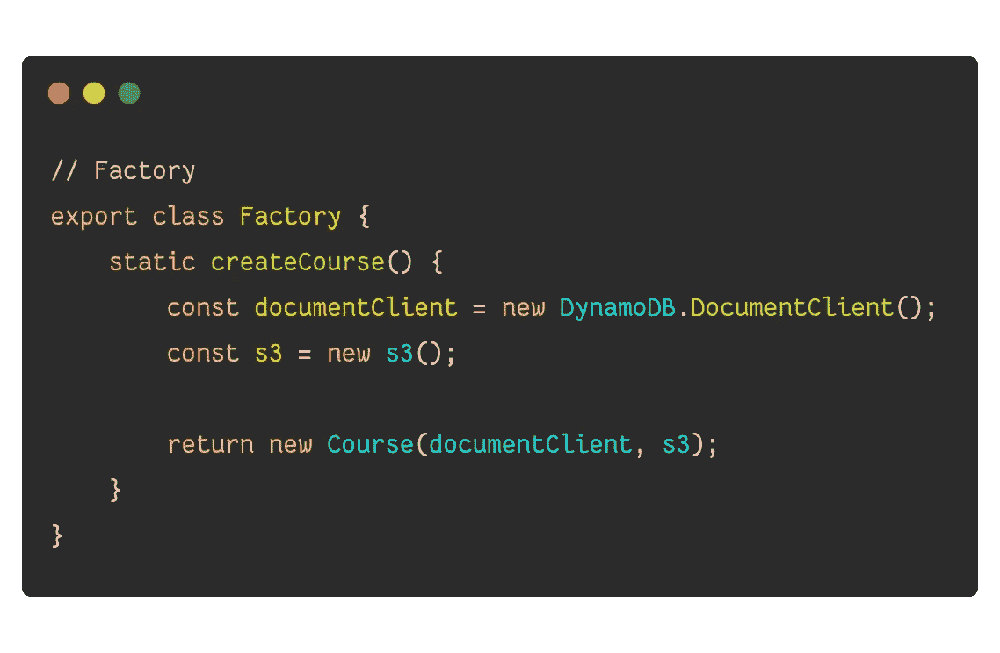

然后，我们可以在应用程序中使用`Factory.createCourse`来创建一个实例，当然，然后调用适当的方法。我们可以扩展`Factory`来包含其他静态方法，以创建类似`Lesson`的其他实体的实例。

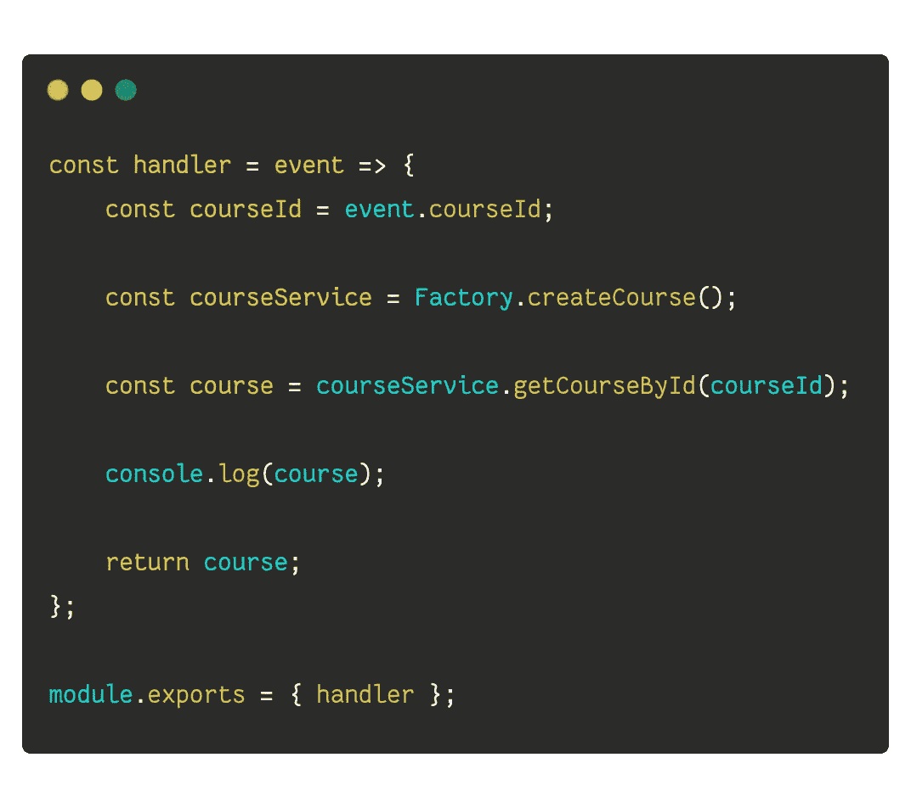

现在，如果将来需求发生变化，我们需要将`Course`存储在其他商店中，那么我们可以更新`Factory`或`Course`此外，我们的业务逻辑将保持不变。

# 使用高阶函数的依赖注入

在使用类的例子中，注意我们总是需要有一个`S3`和`DocumentClient`的实例，然后才能有一个`Course`的实例。

想象一个场景，我们有一个网络钩子或`AWS Lambda Function`，它的工作是`getCourseById`。在这个场景中，我们将最终创建一个实例`S3`，尽管我们不会在这个请求中使用它。

在实际的应用程序中，可能有更复杂的逻辑来设置和拆除每个依赖项，这可能会降低性能。

让我们来探讨函数级的依赖注入。

这种模式的前提是基于一个函数返回另一个函数(**高阶函数**)。高阶函数接受子函数执行其工作所需的所有依赖性。

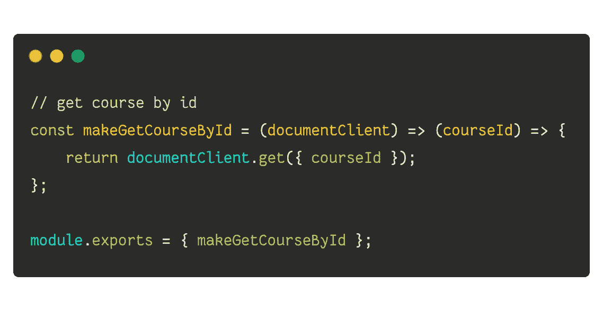

DI with a higher-order function

在上面的例子中，我们创建了一个名为`makeGetCourseById`的函数。它的工作是创建一个函数，我们可以用它通过 id 获取课程。

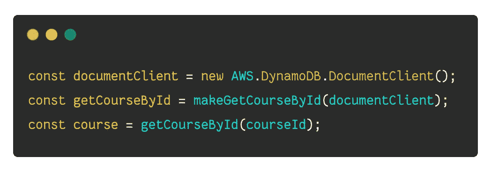

然后，我们可以在应用程序代码中使用上面提到的高阶函数。对于`addLesson`，我们可以遵循相同的模式。

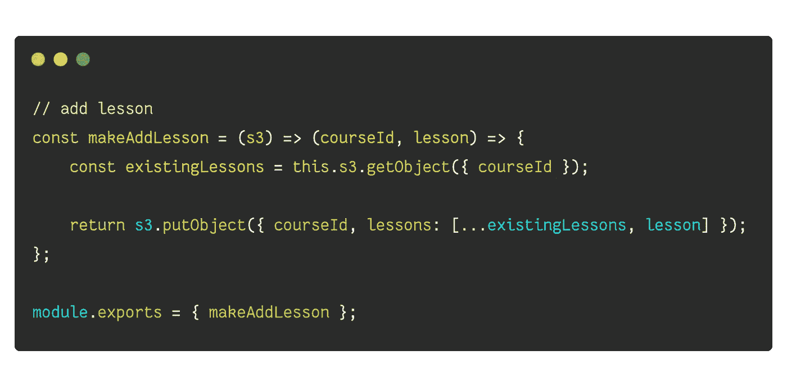

DI with a higher-order function

高阶函数的想法是，我们一次性创建像`getCourseById`或`addLesson`这样的独立函数，并在我们的应用程序中传递实例。如果我们不使用高阶组件，那么每次我们想通过 id 获取课程时，我们都需要传递一个`documentClient`或`s3`的实例。

以下代码示例演示了如何在`AWS Lambda Handler`中使用高阶函数。

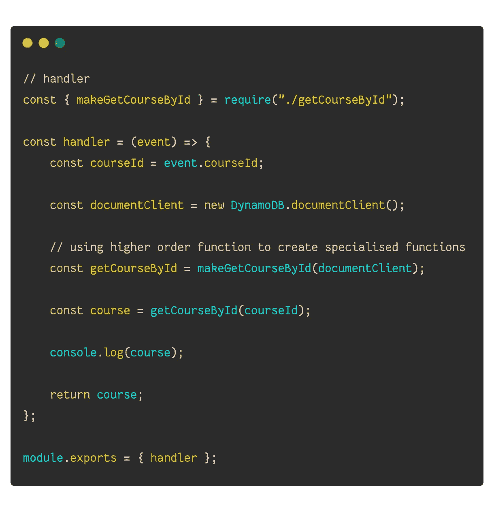

# 创建具有高阶函数的服务

有些情况下，我们可能需要创建一个方法集合来使用，而不需要初始化每个方法。例如，我们想在`GraphQL`上下文中附加一个带有方法集合的服务，以便在 GraphQL 解析器中使用它们。

为了实现这一点，我们可以创建一个函数来返回一个包含函数集合的对象。

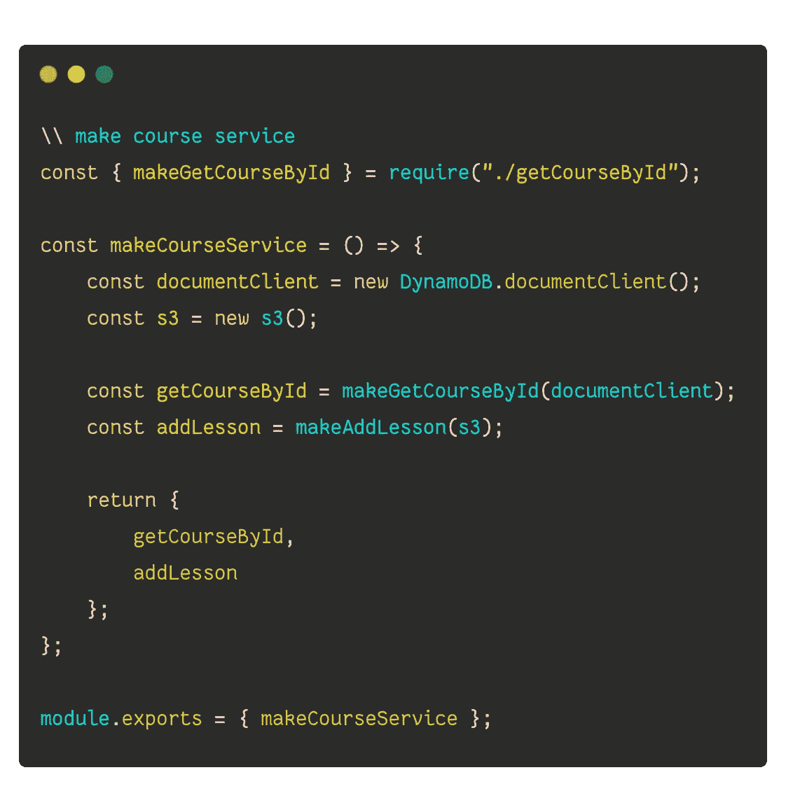

然后，我们可以在应用程序代码中使用它，如下所示。请记住，如果可能的话，我们会在每次应用程序执行时创建一个`courseService`的实例，甚至可以在必要时缓存它。

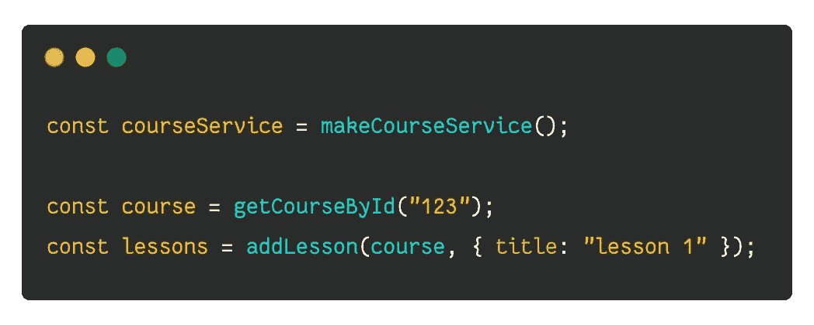

# 传递方法

我们经常会遇到这样的情况，我们可能想要在一个高阶函数中使用另一个高阶函数。例如，我们可能希望在添加课程之前检查该课程是否存在。我们可以通过在参数中接受`getCourseById`和`S3`来解决这个问题。

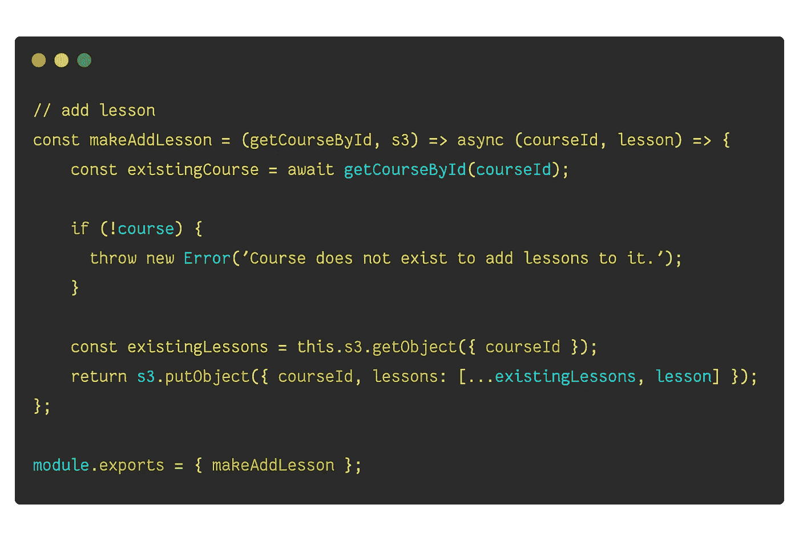

应用程序代码将如下所示:

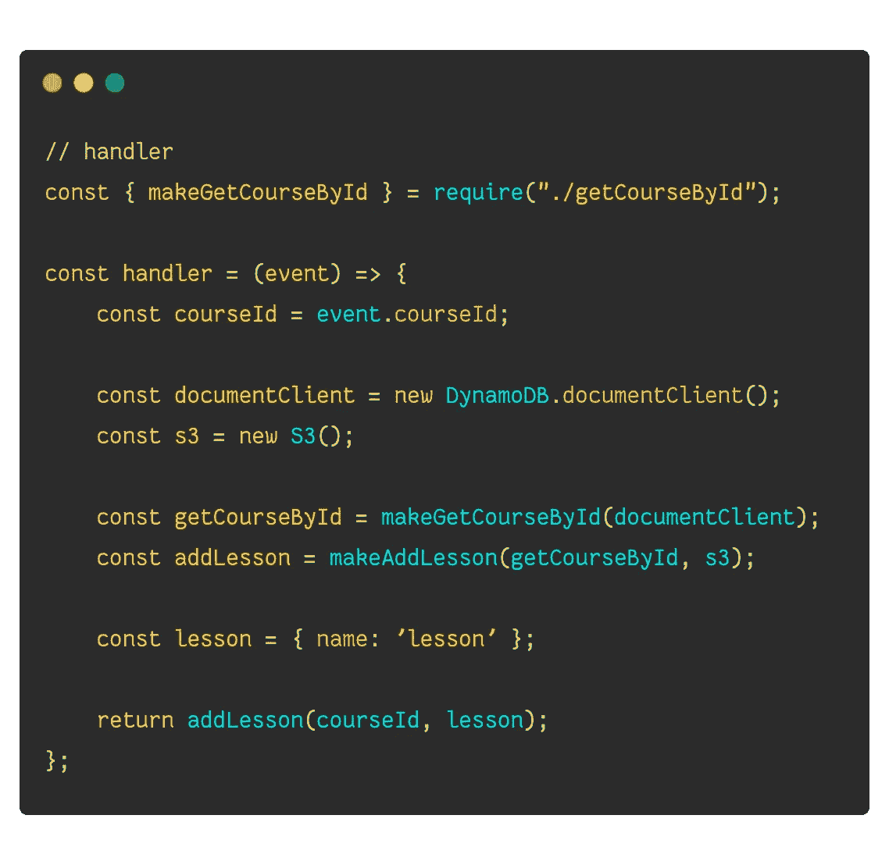

# 摘要

我们探索了在 Javascript 中实现依赖注入的两种不同方法。在 Javascript 中实现依赖注入的一种方式是使用`Class`和`Factory`。另一种方法是使用高阶函数来实现函数级的粒度注入。根据不同的应用用例，最好选择一种方法并坚持下去。高阶函数使用起来相对简单，并且比 Javascript 类更灵活。

*在* [*Twitter*](https://twitter.com/adikari) *上关注我或者在*[*Github*](https://github.com/adikari)*上查看我的项目。*