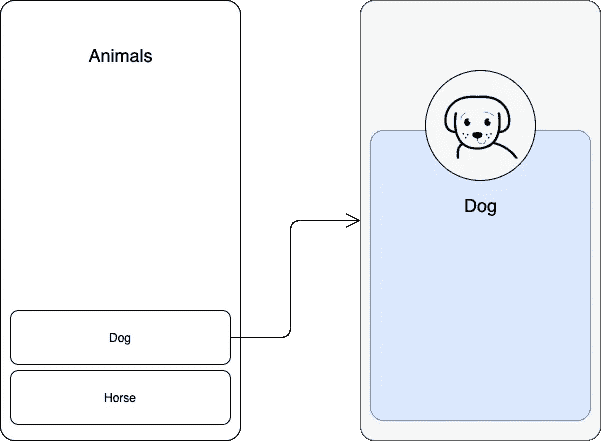
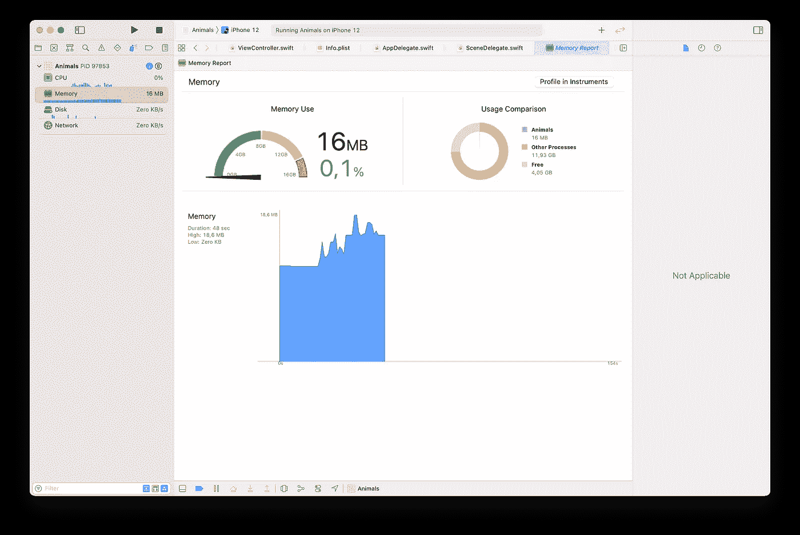
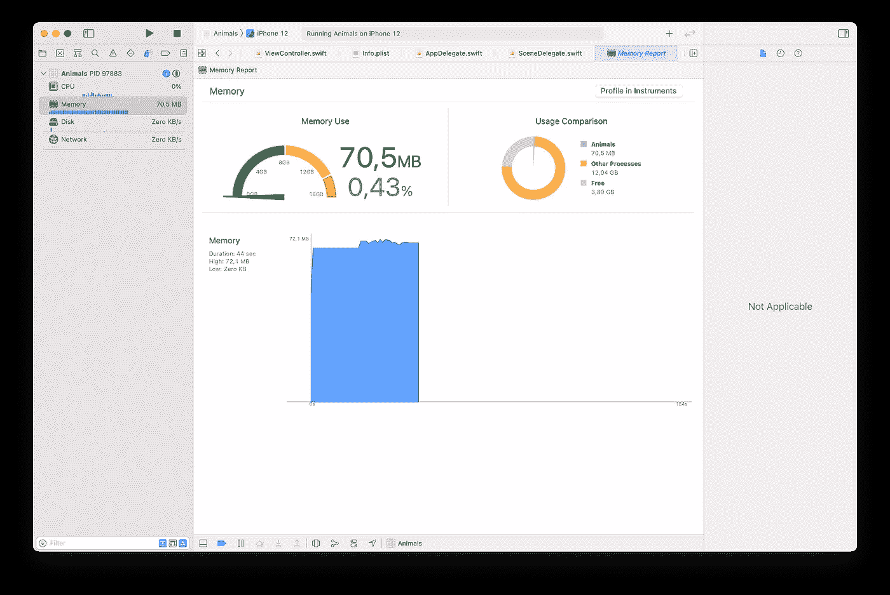
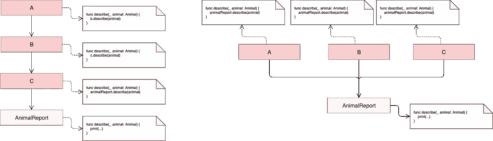
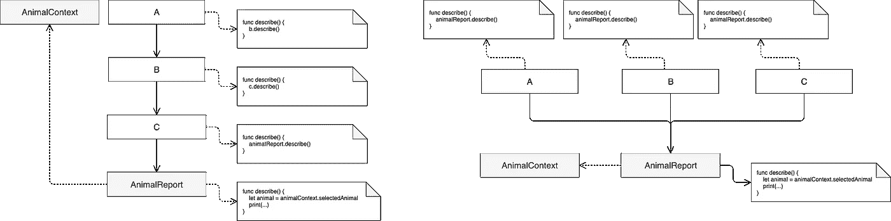

# 移动开发中的依赖注入。

> 原文：<https://medium.com/geekculture/dependency-injection-in-mobile-development-ebee1cc73b25?source=collection_archive---------14----------------------->

依赖注入带来了很多好处，比如解耦、可重用性、更简单的测试以及防止对我们的代码库进行彻底的修改。尽管如此，移动开发给游戏带来了一些新的挑战，我们现有的大多数参考资料都不是面向移动的，也没有触及我们在移动应用中应用该模式时遇到的问题。在这篇文章中，我们将讨论使用 DI 开发应用程序时可能遇到的一些问题，以及我们可以考虑的解决方案。

# 一切开始的地方

当我们第一次开始编程时，我们大多数人都学习了一个使用动物的简单例子。大概是这样的:

我们可以创造一些动物:

今天我们将回到这个例子，并使用 DI 对其进行扩展。它将作为本文的基础。所以要牢记在心。

# 依赖注入出现了

当您第一次开始应用 DI 时，您可能注意到了它带来的改进。制作解耦和可重用的代码要简单得多，更不用说测试了。然而，很快就会出现一些问题，特别是因为移动应用的性质:它们通常会争夺资源，它们处理一堆屏幕，并且在用户交互方面非常动态。

# 一个适合所有人的地方

如果你对 DI 有经验，你可能已经注意到它几乎**请求我们**有一个**组合根**。换句话说，应用 DI 通常会推动依赖关系的实例化，直到我们有了一个创建所有依赖关系和类的地方，称为复合根，通常在应用程序启动时。如果你为此使用一个容器，它可能只被定义一次，也只被调用一次，因为你已经有了一个完整的系统图。这是理论上的，实际上我们可能会面临同样更复杂的情况。

这给我们带来了第一个问题:

## 1.所有的类都应该创建在复合根吗？

一般的理解是，如果 B 是 A 的依赖，就应该注入 A。

想象一下下面的场景:我们的应用程序显示了一个动物列表。一旦我们选择了一个，应用程序就会显示一个带有动物信息的*详细信息屏幕*。没有动物的细节视图没有意义，因为它依赖于动物。在这种情况下，应该将动物注射到视图中。让我们把第一个屏幕叫做*列表视图*，第二个叫做*页面细节。*

我们如何通过 DI 实现这一目标？

## 1.1 在合成根中加载视图

**a)使用构造函数注入**

如果动物的列表在应用程序开始时是已知的，我们可以为它们中的每一个加载一个页面细节，并让两个列表都被传递到列表视图。就像这样:

那会非常好。然而，这合理吗？加载一堆我们甚至不知道用户是否会看到的视图有意义吗？

在手机中，我们不断地争夺其他应用程序、进程和系统使用的资源。如果你的 app 占用内存过多，系统会发出警告，最终[甚至终止](https://developer.apple.com/documentation/xcode/improving_your_app_s_performance/reducing_your_app_s_memory_use)。一个表现不佳的应用程序会影响整个系统。

一个复杂的应用程序可以有数千个视图。想象一下，如果应用程序一启动，应用程序中的每一个视图都被加载到复合根。与延迟分配所有内存相比，这会消耗多少内存？这是一个很难回答的问题，因为为了比较这些数字，你可能需要在你的项目中做一些大的改变。

使用我们之前的例子，在组合根创建 10，000 只动物，只有 1 个细节视图，结果平均使用 16 MB 内存:

相比之下，预先实例化所有 10k 细节视图，每只动物一个，将导致 70 MB 的内存使用:

这是一个很大的区别，尽管我的详细信息屏幕非常简单:它由一个堆栈视图和 3 个标签组成。当然，复杂的视图会占用更多的资源。

**b)利用房产注入**

*“但是我们不需要多个页面细节，我们只需要一个！”—* 你现在可能在想:你是对的。正如您可能注意到的，我们只是被迫创建多个细节视图，因为它们在构建时需要动物依赖。如果我们使用属性注入，我们可以只实例化一次细节视图，问题就解决了！或者是？

这就是我们使用属性注入可以做到的:

这个很好用。在这种情况下，属性注入允许我们为每个屏幕创建一个实例，而不是多个实例。如果您正在使用 Storyboard，这通常是常见的方法，通过 **prepare(for:sender:)** 方法进行属性注入。

但是，即使我们只有一个 ListView 实例和一个 PageDetails 实例，如果用户从未选择动物，他/她也不会使用该资源。在一个复杂的应用程序中，情况会变得更糟，因为许多独特的视图可能永远也不会被访问。例如，如果初始屏幕可以将用户引导到另外 5 个不同的屏幕，每个屏幕都需要大量的视图和可能的网络连接，但是只有一个屏幕是经常访问的，为什么要首先加载其他屏幕呢？

> 与此同时，依赖注入渴望一个复合根，一个应用渴望懒惰分配。

**那么，所有的类都应该创建在复合根吗？**

终于可以回答问题了，答案是:我不这么认为。如果我们可以在用户与应用程序交互时分配资源，这样我们只加载需要或经常使用的资源，通常会更好。这将需要惰性分配，我们可以使用 DI 来实现这一点，我们将进一步检查这一点。

下面进入下一个问题。

## 2.我们应该如何传递运行时数据？

另一个关于依赖注入的常见问题是如何传递运行时数据。对此有一些可能的解决方案:

**a)物业注入**

如果你的类 A 依赖于 B，而 B 依赖于 A 提供的运行时数据，你就不能依赖于构造函数注入。这类似于我们之前在详细信息页面中看到的场景。为了创建 A，你必须解析 B，为了解析 B，你必须解析运行时依赖，它是由 A 延迟定义的。

让我们稍微修改一下之前的例子，除了一个*动物选择外，还有一个*动物报告*。*Animal Report 类有一个函数*描述依赖于动物的*。让我们尝试使用构造函数注入:

传递运行时数据的一个可能的解决方案是从 B 的构造函数中删除你的运行时参数，让它通过一个属性注入(正如我们在 **1.1 b** 一节中看到的)。这样我们就可以解析 B，B 会被注入到 A，然后 A 会懒洋洋地设置 B 的运行时数据。

这种做法有什么问题？**animal report . describe()**工作的前提条件不明确。我们必须知道，我们必须设置一些变量( **animalReport.animal** )才能让它工作。最重要的是，这引入了时间耦合，意味着这只能以特定的顺序工作。我们不能在设定动物之前调用 describe。

有更好的方法吗？

b)通过方法传递运行时数据

在这种情况下，更好的替代方法是通过方法传递运行时数据。让我们稍微修改一下我们的场景，将动物传递给真正需要它的函数:

正如我们所看到的，我们的两个问题都得到了解决:前提条件很清楚——**描述**方法需要一个动物才能工作。此外，时间耦合消失了——在调用 **describe** 函数之前，我们不需要设置任何东西。

那么，有什么缺点吗？

这种方法的问题是，如果使用运行时数据的类在我们的程序中嵌套很深或者有很多客户，它可能需要对代码进行彻底的修改。例如，如果 AnimalReport 的 API 发生变化，A、B 和 C 类将受到影响:

“上下文”类中的运行时数据

另一种选择是使用包含这类数据的上下文类(当然最好是抽象类)。可以达到上下文类或抽象，以便获得运行时数据，而无需将更改传播到客户端。大概是这样的:

注意，我们从方法签名中删除了运行时数据，现在选择的动物由上下文类提供。在我们的示例中，这看起来有点像下面这样:

同样，为了让*描述*正常工作，它需要一些上下文。然而，这解决了传播变化的问题，当*设置*或*消耗*动物属性的类没有直接关系时，这也很有用。

**d)使用工厂**

将运行时数据传递到构造函数中的整个问题是，我们不能在组合根解析依赖关系。然而，如果我们使用惰性分配，我们可以解决这个问题。例如，我们可以推迟依赖项的创建，直到我们真正知道运行时数据。

这种方法的缺点是我们现在依赖于另一个类:工厂。

## **3。服务定位器呢？**

有些人会因为读了这样的东西而抓狂；但是首先我们必须了解对该模式的主要批评是什么，并且肯定有一些严重的问题。

众所周知，在我们的类中使用静态工厂方法调用容器不是一个好主意:

然而，由于应用程序的“惰性分配特性”，我们可能会考虑使用该模式，因为它允许类延迟到达服务，从而能够传递运行时数据以解决依赖性。

关于该模式的一个主要问题是，由于 *AnimalSelection* 依赖于容器来获得其依赖关系，并且容器可以访问所有服务，因此 *AnimalSelection* 的消费者不可能知道该类依赖于哪个服务；该类可能包含 1 或 10 个来自容器的依赖项，我们并不真正知道。另一个问题是对容器本身的静态函数的依赖。对该 API 的任何更改或者将容器切换到另一个(例如，从不同的框架)会导致使用它的所有类和模块的彻底更改。更不用说测试了，在测试 AnimalSelection 之前，我们必须在注册表中注册所有被模仿的类。在这种情况下，仅仅依赖注册表可能是危险的，因为只有当您尝试运行它时，您才会知道是否有问题，因为如果您忘记注册服务，编译器将无法帮助您。与 DI 相比，您实际上不需要注册服务，因为类不依赖于容器，它们在构造时直接依赖于其他类。

尽管如此，我们还是有办法使用该模式并避免这样的问题，比如为容器/定位器创建一个独立的接口，正如福勒在他的文章([https://martinfowler.com/articles/injection.html](https://martinfowler.com/articles/injection.html))中所建议的那样。类似这样的东西

现在 *AnimalSelection* 类对服务的访问有了更多的限制:它只能访问它需要的服务。此外，该类不再使用静态工厂方法，它依赖于抽象，这可以很容易地由容器本身或另一个类实现。这也使得测试变得更容易:如果设置中有任何问题，编译器会警告你，而不是使用容器的注册表。

因此，如果您想使用服务定位器，请确保只通过接口或抽象来访问/创建依赖关系。这将防止使用静态方法，将类的范围限制到服务，并将使测试更容易。

# **那么我们应该如何在移动开发中使用 DI 呢？**

现在你要问自己——“我愿意得到什么样的取舍”？

如果你在构造函数中传递运行时数据，你可能不得不像在**工厂**例子中一样坚持惰性分配，并处理多一个依赖项。你也可以在接口/抽象背后使用一个**服务定位器**，但是它很可能像工厂一样工作。

如果你**不**在构造函数中传递运行时数据，你将可能不得不处理时态耦合和缺乏前提条件，就像在**属性注入**和**上下文类**例子中一样。或者您可以**通过需要它的方法**传递运行时数据，但是在某些情况下，您可能最终不得不在整个代码中执行许多更改。

选择最适合您情况的解决方案。在我参与的项目中，**上下文类**和**工厂**更适合，但对你来说可能不是这样。正如我们所见，没有完美的解决方案，这完全取决于您的具体情况。

## 大家总结一下！

1.  让所有的类都创建在复合根，特别是视图和重对象，可能不是一个好主意。
2.  **在构造函数**中传递运行时数据可能会使复合根变得困难，从而导致懒惰分配。这可能会迫使你使用:
    a) **抽象工厂**或**服务定位器/容器，**传递运行时参数。
    **👍优势:**没有时间耦合，不满足依赖关系就不可能创建资源。**👎不利方面:**在客户机中多处理一个依赖项。
3.  **在构造函数**中不传递运行时数据可能会导致你使用
    a) **属性注入**。
    👍好处:没有额外的依赖。
    **👎不利方面:**时间耦合和不明确的前提条件。通过方法传递运行时数据。
    **👍好处:**没有附加依赖，没有时间耦合，前提条件明确。
    **👎不利方面:**会导致翻天覆地的变化。
    c) **语境类。
    👍好处:**容易改变 API 而不影响客户端，避免大范围的改变。向没有直接连接的类发送数据。
    **👎缺点:**多处理一个依赖和时间耦合。

那是一篇很长的文章，但是我希望你能理解这里暴露的问题。此外，我希望这篇文章能帮助您了解解决您的特定问题的不同途径。感谢您的阅读！