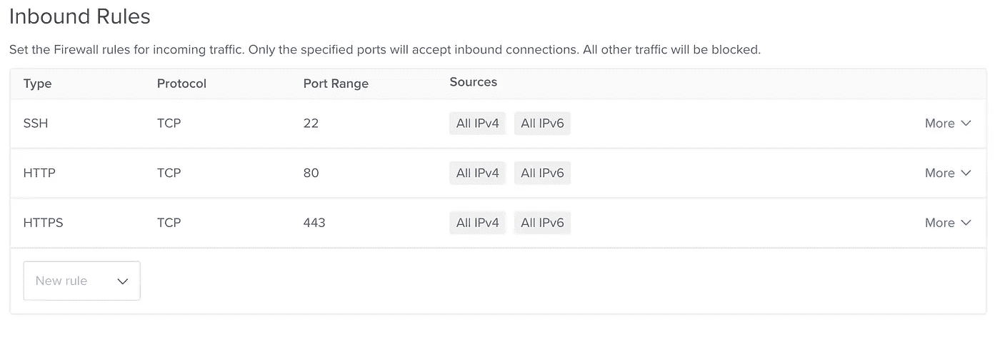
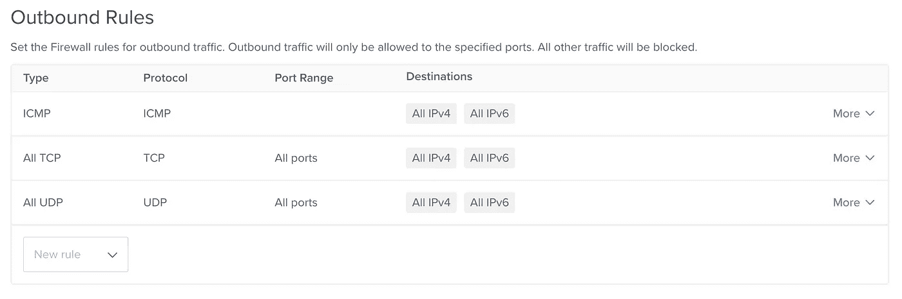
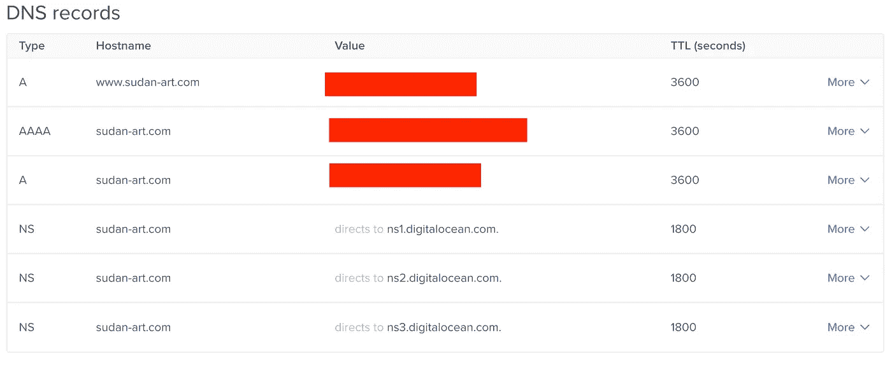

# 将 MVP Django/React Web 应用程序部署到数字海洋

> 原文：<https://medium.com/geekculture/deploy-a-mvp-django-react-web-application-to-digital-ocean-1a35a4359a5b?source=collection_archive---------0----------------------->


A not so Digital Ocean — photo by [Michael Olsen](https://unsplash.com/@mganeolsen?utm_source=unsplash&utm_medium=referral&utm_content=creditCopyText) on [Unsplash](https://unsplash.com/s/photos/digital-ocean?utm_source=unsplash&utm_medium=referral&utm_content=creditCopyText)

## 概观

我最近在数字海洋上部署了一个 Django/React 应用程序——你可以在这里看到代码库[。它有一个 Django 容器、一个 NGINX 容器、一个 Certbot 容器，都是由 Docker Compose 提供的。注意，这里没有 React 容器，因为 NGINX 服务于通过运行`npm run build`创建的包。](https://github.com/osintalex/sudan-art/tree/prod)

虽然有一些关于如何做到这一点的很好的文章，但它们倾向于更多地关注生产，这对 MVP 来说不是很好。例如，这些有用的[文章](https://www.digitalocean.com/community/tutorial_series/from-containers-to-kubernetes-with-django)涉及到扩展三台虚拟机，其成本是简单 MVP 所需成本的三倍！

所以，这就是我在这篇文章中要介绍的内容，下面是它的大概样子:

1.  设置一个数字海洋水滴(一个 linux 虚拟机)；
2.  建立可管理的数字海洋 Postgres SQL 数据库；
3.  添加自定义域；
4.  将 NGINX 设置为 web 服务器，为应用程序的 React 部分提供服务，并充当 Django 后端的反向代理；
5.  将证书添加到您的网站，以便您可以确保一切都在 HTTPS 上运行。
6.  用 Docker Compose 运行整个事情！

## 如何设置 Droplet

数字海洋[在这里](https://www.digitalocean.com/community/tutorials/initial-server-setup-with-ubuntu-18-04)很好地总结了进行初始配置所需的步骤。

我建议你做到所有这些，尤其是设置一个超级用户，这样你就不会以 root 身份运行所有的东西。你可以使用 ufw，如果你想或者你可以使用数字海洋云防火墙，这是很容易设置的。你只需点击网络，然后进入你的数字海洋帐户的防火墙。

如何设置将取决于您的应用程序，但一个很好的默认设置是，当您正在进行设置并且还没有弄清楚您需要什么时，允许所有出站流量，然后将所有入站流量限制为 SSH、HTTP 和 HTTPS 协议。下面是它的截图:



Inbound rules



Outbound rules

一旦完成并连接到你的 droplet，确保你运行`sudo apt-get update`和`sudo apt-get upgrade`进行一般的软件更新。

现在，您需要的另一个主要依赖项是 Docker 和 Docker Compose。同样，最好的做法是遵循各自的安装说明[这里](https://docs.docker.com/engine/install/ubuntu/)和[这里](https://docs.docker.com/compose/install/)。

一旦你安装了它们，确保你运行了`docker run hello-world`和`docker-compose --version`。前者应该拉一个图像并运行它，后者应该只是给你一个输出，说 Docker Compose 有一个版本。

## 如何设置托管 Postgres SQL 数据库

[这里的](https://docs.digitalocean.com/products/databases/postgresql/quickstart/)是关于如何通过点击控制面板，进入数据库并选择 Postgres SQL 选项来设置的数字海洋文档。

完成后，通过从控制面板导航到数据库并单击数据库来获取集群的连接参数。从连接详细信息框中获取它们。

现在，您需要在 Droplet 上设置一个客户机，这样您就可以在创建数据库之后连接到它。打`sudo apt install postgresql-client`做那事。然后:

```
psql -U username -h host -p port -d database --set=sslmode=require
```

其中用户名、主机、端口、数据库指的是您刚刚获取的凭证。现在，您应该连接到一个提示符下，让您设置数据库。是时候按照数字海洋的建议进行设置了；我将在这里详细讲解他们自己的教程[中的关键步骤。](https://www.digitalocean.com/community/tutorials/how-to-build-a-django-and-gunicorn-application-with-docker)

1.  创建数据库`CREATE DATABASE your_database_name;`
2.  切换到这个数据库`\c your_database_name;`
3.  现在添加一个带密码的用户——确保选择一个安全的密码并保存它！`CREATE USER your_username WITH PASSWORD 'your_password';`
4.  根据 Django 和 Digital Ocean 的建议修改一些连接参数`ALTER ROLE your_username SET client_encoding TO 'utf8';
    ALTER ROLE your_username SET default_transaction_isolation TO 'read committed';
    ALTER ROLE your_username SET timezone TO 'UTC';`
5.  让用户成为管理员`GRANT ALL PRIVILEGES ON DATABASE polls TO your_username;`
6.  退出提示！打`\q`。

## 连接自定义域

第一，买你的域名；-).我建议从数字海洋有具体文档的地方开始，你可以在这里看到他们的列表。

完成后，你需要点击控制面板→网络→数字海洋中的域。在数字海洋[这里](https://docs.digitalocean.com/products/networking/dns/how-to/manage-records/)有更多关于如何做到这一点的细节，但至少你现在需要获得 A 记录、AAAA 记录和 NS 记录。这是一个完整版本的样子:



Sample DNS records. The A records should have your droplet’s IPv4 format addresses and the AAAA record should have your droplet’s IPv6 address.

简而言之，NS 代表名称服务器，它告诉连接到您网站的计算机在哪里查找，A/AAA 记录将您的 droplet 的 IP 地址与您刚买的域名联系起来。

## 配置 NGINX Web 服务器

首先，这样做的目的是什么？总的来说，NGINX 的性能非常好。所以那很好！我还需要某种服务器来交付我为 React 应用程序运行`npm run build`后获得的捆绑文件。

但是姜戈怎么办？在我为这个 MVP 使用的配置中，我已经有了一个使用 gunicorn 运行的后端服务器，这对于 Flask 和 Django web 应用程序来说是很常见的事情。那么除此之外，为什么我还需要一个反向代理 NGINX 服务器呢？

简单地说，python 并不擅长处理进入 web 服务器的各种请求——一个例子是处理静态文件，如图像或 CSS。如果你好奇，你可以在[栈溢出](https://serverfault.com/questions/331256/why-do-i-need-nginx-and-something-like-gunicorn)上阅读一位 gunicorn 开发者的更详细的回答。

我认为设置它的一个好方法是使用一个 NGINX 容器，并将其添加到我们的 Docker Compose 中。事实上，是时候深入研究了——下面是我为这种配置制作的 Docker 合成文件:

Docker Compose File

docker compose 规范定义了三种服务——Django、NGINX 和 Certbot。Django 处理由 gunicorn 提供服务的后端 web 应用程序，NGINX 是它的反向代理，服务于捆绑的 react 前端，Certbot 处理证书生成，这样我就可以使用 HTTPS 了(我将在本文后面介绍)。

现在，我只关注第 28-38 节的 NGINX 部分。首先，构建语句对应于前端的构建上下文，您可以在 Github [上看到这里的](https://github.com/osintalex/sudan-art/tree/prod/sudan-art/react-frontend)。这意味着当我运行 Docker compose 时，它会运行这个目录中的 Dockerfile。稍后将详细介绍该文件中的内容…

然后，我指定我希望重新启动服务，除非我手动停止它，并确保 NGINX 服务端口映射到 droplet 上的端口 80 和 443，这两个端口分别对应于 HTTP 和 HTTPS 流量。

我还想说明这取决于 Django，因为我不想在 Django 服务启动之前启动这个服务。这是因为在我可以使用 NGINX 作为反向代理之前，服务于 Django 后端 web 应用程序的 gunicorn 必须启动并运行。否则不会有任何东西以代理形式出现！

现在可以忽略这些卷——它们只是链接来自 Certbot 服务的文件，我将需要这些文件来获得 HTTPS 证书。

好了，现在是时候看看当我用 Docker compose 启动 NGINX 服务时它构建的 Dockerfile 了:

现在这个 Docker 文件实际上有点厚脸皮，因为它利用多阶段构建来一次做两件事，并减少最终 Docker 图像的大小。首先，在第 3–9 行中，它构建了 React 应用程序。一旦完成，它会直接构建 NGINX 服务器，并在第 15 行复制 React 应用程序构建的文件。它通过使用引用 React 构建的别名`builder`来做到这一点；它可以做到这一点，因为在第 1 行中构建是别名。

您可能会注意到，在第 12 行，我复制了一个本地文件`nginx.conf`。这是非常重要的。它定义了 NGINX 服务器的配置，所以我将在下面完整地介绍它。如果其中任何一个变得太混乱，我建议在这里查看完整的 NGINX 文档[。](https://nginx.org/en/docs/dirindex.html)

File defining the NGINX configuration

这里发生了很多事情…所以让我们一步一步来看:

*   第 1 行只是一个安全措施——如果你不知道确切的软件版本，就很难侵入你的服务器；
*   第 5 行和第 6 行定义了日志在服务中的位置。如果您使用运行 NGINX 服务的 Docker 容器，这就是日志所在的位置。
*   然后我定义了两台服务器——一台用于端口 80 上的 HTTP 流量，另一台用于端口 443 上的 HTTPS 流量。从第一个开始，第 11 行只是使用 IPV6 监听端口 80 上的内容的一种方式。
*   然后，我指定服务器域名，阻止用户上传大于 15M 的文件，并在第 15–17 行提供对 Certbot 将用来生成证书的文件夹的访问。最后，第 19–21 行发回一个 301 响应代码，并将用户重定向到 HTTPS 站点。
*   从第 24 行开始的下一个服务器块有点复杂。它与 25–32 中的前一个非常相似，只是它指定了用于启用 HTTPS 的证书的文件位置。接下来，在第 34–38 行，我告诉 NGINX 应用程序的 React 前端部分的文件在哪里。
*   现在，在第 40–50 行，我为 Django 后端定义了 URL 选项。每个位置指令都指向一个我在我的 [urls.py](https://github.com/osintalex/sudan-art/blob/prod/sudan-art/django-backend/django_backend/urls.py) 中定义的 url。我将所有这些链接到 proxy_api 变量，该变量在第 52–59 行中定义。
*   现在，第 52–59 行配置了一个反向代理设置，这样通过 HTTPS 发送给 NGINX 应用程序的所有请求都可以与运行 Django 后端的 gunicorn 服务器对话，并再次被发送回来。

唷！就这样:-)现在我只需要查看 Django 服务。就服务定义而言，相对于我讨论过的 NGINX，没有太多新的东西，除了有更多的环境变量。这是一件好事，因为它使部署更加安全；您可以在一个`env`文件中指定所有这些文件，然后告诉 Docker Compose 在运行时在哪里找到它。

现在，这里是用于构建 Django 应用程序的 docker 文件:

这要做几件事——获取更新，为 Django 用来连接 Postgres SQL 数据库的 pyscopg 安装依赖项，然后为了安全起见，作为非根用户安装所有 python 依赖项。它也很实用——如果你以 pip 为根安装它，东西可能会坏掉。

最后一行代码 19 运行带有 gunicorn 的应用程序，guni corn 作为 python 依赖项的一部分安装在`requirements.txt`文件中。

## 使用 Certbot 添加证书

如果到目前为止一切都已启动并运行，那就太好了！但是有一个小问题——我们使用了重定向来强制所有通过端口 80 发送到端口 443 的请求，因此它们使用 HTTPS。但是我还没有证书，这将意味着一切都坏了！

所以我需要拿到那个证书。这里有一篇关于这个[的很棒的文章](https://mindsers.blog/post/https-using-nginx-certbot-docker/)，我将在这里总结我的方法。您可能已经注意到，在上面的`nginx.conf`文件的第 15–17 行，如果请求被发送到众所周知的 acme challenge 路线，我没有重定向请求。这意味着我可以向该端点发出 HTTP 请求。

如果您向上滚动到上面的 Docker Compose 文件，您还可以看到在第 36–38 行和第 41–43 行，我定义了一些卷来在 Certbot 和 NGINX 之间共享文件。我还设置了他们的权限— `:ro`和`:rw`分别表示只读和读写，这与两个服务需要的权限有关。

现在设置完成了，您可以用下面的命令测试它(不要发送太多的请求，否则 Certbot 不会工作):

```
docker compose run --rm  certbot certonly --webroot --webroot-path /var/www/certbot/ --dry-run -d yoursite.com
```

这应该会让您成功通过，如果通过，您可以继续运行以下命令:

```
docker compose run --rm  certbot certonly --webroot --webroot-path /var/www/certbot/ -d yoursite.com
```

现在你应该有了你的网站在 HTTPS 运行所需的证书——是时候放手一搏了。

如果您需要运行这个，那么您可以使用命令`docker compose run --rm certbot renew`来更新证书。将它放在 cron 作业中可能是个好主意，因为它们每 3 个月过期一次。

## 用 Docker Compose 运行它

现在所有的配置都完成了，我可以用一个简单的`git clone myurl`将代码从 github 下载到服务器上，然后运行:

```
sudo docker-compose --env-file env up --build
```

其中 env 指的是一个`env`文件，在该文件中使用以下语法定义环境变量:

```
DJANGO_SECRET_KEY=<YOUR KEY GOES HERE>
DATABASE_ENGINE=<YOUR DATABASE ENGINE GOES HERE>
DATABASE_NAME=<YOUR DATABASE NAME GOES HERE>
...
```

您可能需要设置您的 Django 数据库，下面是您如何做的:

```
docker ps -a to get the id of the django container
docker exec -it <container id goes here> /bin/bash
python manage.py makemigrations
python manage.py migrate
python manage.py createsuperuser
python manage.py collectstatic
exit
```

就是这样！部署总是非常复杂，但是一旦全部启动并运行起来，就变得非常好和健壮了！

## 排除故障

如果所有这些都出错了，这里有一些有用的调试技巧:

使用此命令构建一个没有缓存的 docker 文件并获取控制台消息。您可以将此与`RUN echo $(ls mydir/)`结合起来，看看目录中有哪些文件。

```
docker build --progress=plain --no-cache .
```

运行`docker ps -a`获得所有容器 id 后，您可以点击`docker logs <container id>`查看日志，并使用`docker exec -it <container id> /bin/bash`或`/bin/sh`获得容器上的外壳并查看日志。