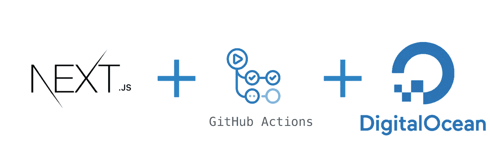

# 使用 Github Actions 和 Docker 将 NextJs 应用程序部署到 DigitalOcean

> 原文：<https://medium.com/geekculture/deploy-a-nextjs-app-to-digitalocean-using-github-actions-and-docker-db7127bca3aa?source=collection_archive---------4----------------------->

Nextjs, Github Actions, docker and DigitalOcean

在本教程中，你将学习如何使用像 [Docker](https://www.docker.com/) 和 [Github Actions](https://github.com/features/actions) 这样的工具建立一个 Nextjs 应用的连续交付。我们将在[数字海洋](https://www.digitalocean.com/)上使用 Ubuntu (20.04)微滴来托管我们的应用。

# 先决条件

以下是本教程所需的先决条件。

*   一个 Github 账号 [Github](https://github.com/)