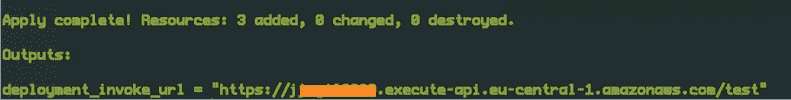

# 使用 Terraform 在 AWS API 网关上部署带有代理方法的 Rest API

> 原文：<https://medium.com/geekculture/deploy-a-rest-api-with-a-proxy-method-on-aws-api-gateway-with-terraform-f19b3161006a?source=collection_archive---------10----------------------->


在本教程中，我们将看到如何使用 Terraform 在 AWS 上部署一个带有代理方法的 Rest API。

**开始之前的先决条件:**您需要在您的本地机器上完成 terraform、AWS-CLI 和配置。

**Terraform 安装指南:**[https://learn . hashi corp . com/tutorials/terra form/install-CLI？in = terra form/AWS-入门](https://learn.hashicorp.com/tutorials/terraform/install-cli?in=terraform/aws-get-started)

**AWS CLI 安装**:[https://docs . AWS . Amazon . com/CLI/latest/user guide/install-CLI v2 . html](https://docs.aws.amazon.com/cli/latest/userguide/install-cliv2.html)，将默认帐户设置为您将用于 terraform 的帐户。如果没有，您也可以从 AWS 控制台创建一个专门用于 terraform 的新帐户(推荐)，然后通过将该帐户凭据分配到本地计算机中的“AWS_PROFILE”变量中，将其与 Terraform 一起导出，以便在您的 CLI 上使用。

例如:

```
export AWS_PROFILE=terraform-aws
```

完成这些先决条件后，您需要一个目录的基本结构，如下所示，

*   main.tf
*   providers.tf
*   变量. tf

**main.tf** :可以用来存放我们在本教程中将要创建的资源的所有代码块。[我们将在设置的每个步骤中实现该文件中的代码]

页（page 的缩写）s:不一定要将这个文件命名为“main.tf ”,但是因为我们在本教程中的唯一目标是在这个项目中设置 API 网关，所以它可以在这个文件上进行更一般的定义，因此有了这个文件名。

**providers.tf** :这是我们让 terraform 知道我们将使用哪个云提供商的地方

**variables.tf:** 我们可以在这个文件中定义您在 AWS 上使用的首选区域，这个区域在上面的 providers 文件中被引用

好了，现在我们已经完成了基本的目录设置，我们可以运行第一个命令来初始化 terraform 需要的所有必要文件。

在上面提到的三个文件所在的根目录中，您可以运行下面的命令。

```
terraform init
```

这段代码将下载并初始化你的目录中的 terraform 资源，你可能会看到一个名为。运行此命令后，将创建 terraform。

现在，我们已经具备了 terraform 与您的 AWS 客户和地区合作所需的一切，让我们继续创建真正的交易。Rest API。

1.  **使用将请求转发到代理 HTTP 调用的路径创建 API。**

让我们使用资源" **aws_api_gateway_rest_api** 创建一个 API，它将包含一个名为"**post**的路径，在这里它将**代理**请求返回到一个示例 HTTP 服务器。在这个例子中，我们将著名的模拟 API[https://jsonplaceholder.typicode.com](https://jsonplaceholder.typicode.com/posts)与“/posts”路由一起使用。

既然我们已经编写了用代理方法创建新的 Rest API 的代码定义，让我们进入下一步。

**2。定义 API 部署:这是我们告诉 AWS 应该部署哪个 API 的地方**

在这段代码中，您会注意到 3 段代码，

*   **rest_api_id** :这是我们上面定义的 Rest API Id
*   **触发器**:重新部署:这是一个触发器，告诉 API Gateway 在上面定义的 API Gateway 主体发生变化的情况下重新部署。
*   **生命周期**:这告诉 API 网关在销毁旧的之前创建一个新的。

3.**定义 API 阶段**

通过定义一个阶段，我们可以保持部署的不同版本，我们可以用它在不同的环境中进行测试。例如:测试、开发、生产

4.**打印部署 URL**

最后，让我们获取部署的 API URL，这样我们就可以测试我们的 endpoint‌了

好了，现在我们已经有了所有的代码块，是时候调用一些 terraform 命令来部署这个 API 了。

首先，我们应该跑，

```
terraform plan
```

该命令将检查验证您的代码，然后检查您在代码中定义的 AWS 资源定义，如果没有错误，您应该会看到类似下面的内容

‌ `Plan: 3 to add, 0 to change, 0 to destroy.`

现在，您可以浏览终端中提到的所有内容，如果一切正常，运行下面的命令。

```
terraform apply
```

同样，这将是一个类似的输出，只是这次您必须键入“yes”进行确认，然后 Terraform 将创建代码中定义的所有资源。

在 apply 命令完成之后，您应该会看到这样的内容以及创建的端点，



如果你访问这个网址，你会得到这个消息，

**{** “消息”:“缺少认证令牌” **}**

因为它不是一个已知的路径，因为我们将路径创建为/posts，所以您可以在阶段名“test”之后这样做，如下所示，

[https://{API-ID}。execute-api.eu-central-1.amazonaws.com/test/posts](https://{API-ID}.execute-api.eu-central-1.amazonaws.com/test/posts)

如果一切设置正确，您将看到来自代理路径的 JSON 占位符端点的示例 posts 响应。

你有它！使用 Terraform 创建 AWS 网关代理端点的简单方法——将基础设施作为代码。

希望这篇教程对你有用，我希望在接下来的文章中写一些部署 Rest APIs 和 Terraform 的其他方法和高级选项。