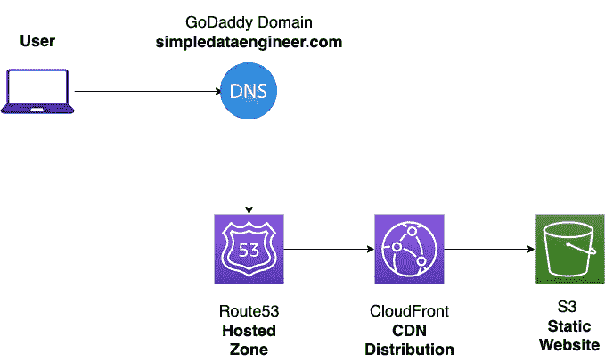

# 使用 AWS S3 和 CloudFront 部署静态网站

> 原文：<https://medium.com/geekculture/deploy-a-static-website-using-aws-s3-and-cloudfront-55cfdbea1f4?source=collection_archive---------1----------------------->

简单演练如何将 AWS CloudFront CDN 添加到 S3 托管的静态网站，并通过 Route53 将其连接到您的个人域

如果您在这里，您可能知道 CloudFront 通过利用边缘节点上的缓存和为网站访问者启用 HTTPS，使您能够更高效地为世界各地的人们提供网站服务。因此，我们将一头扎进去…