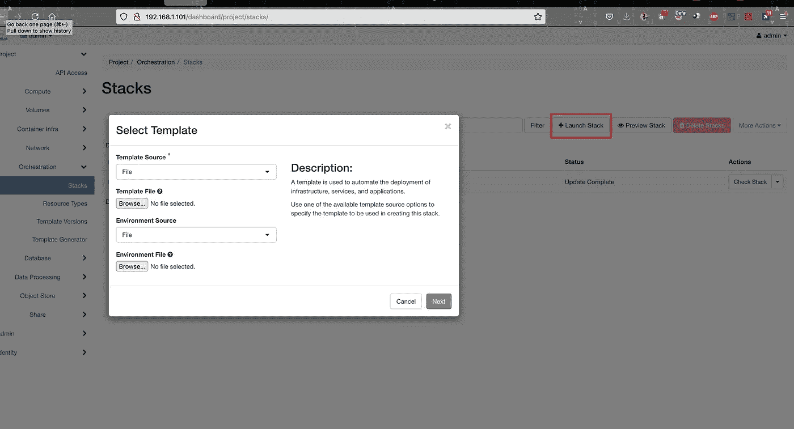
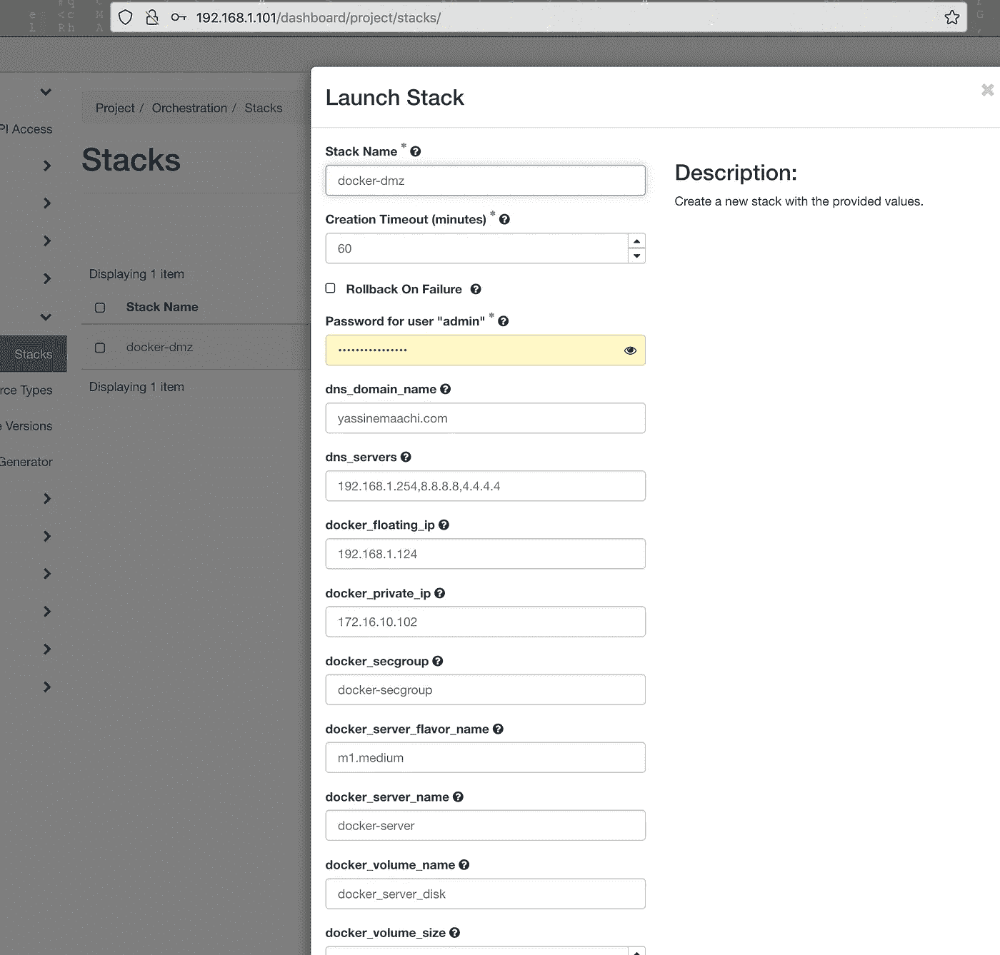
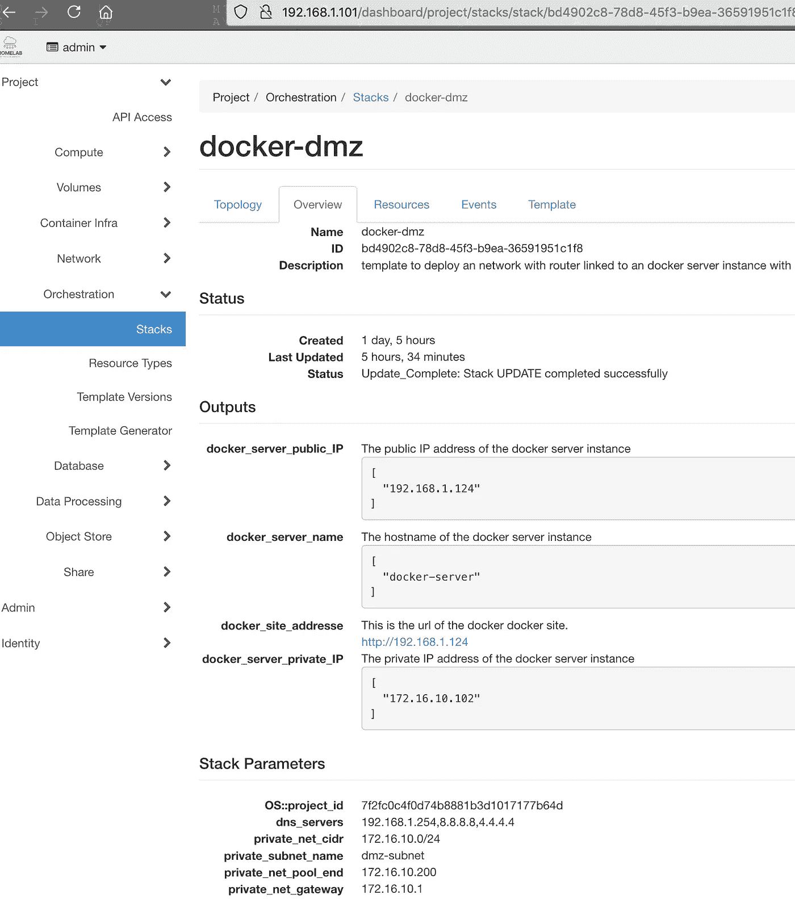
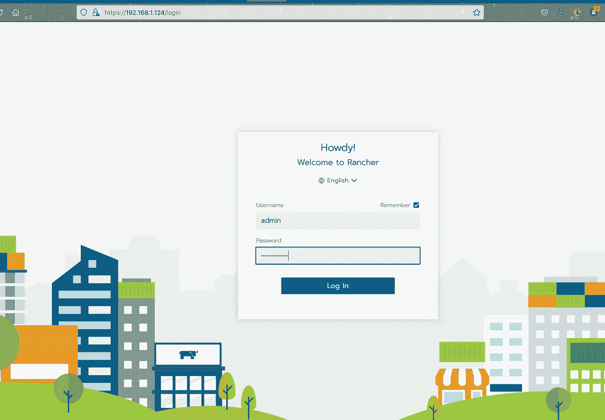

# 使用安装了 docker 和 rancher 的 heat 模板在 openstack 中部署虚拟机

> 原文：<https://medium.com/geekculture/deploy-a-virtual-machine-in-openstack-then-install-docker-and-rancher-on-it-ea21d40da700?source=collection_archive---------42----------------------->


在本文中，我们将在 Openstack 中部署一个虚拟机，然后使用 Heat Orchestration 模板在其上安装 docker 和 rancher。

原文:

 [## 如何在 openstack 中使用 docker 和 heat 午餐牧场主

### 在本文中，我们将在 Openstack 中部署一个虚拟机，然后使用 Heat 在其上安装 docker 和 rancher

blog.yassinemaachi.com](https://blog.yassinemaachi.com/2021/06/how-to-lunch-rancher-using-docker-and.html) 

如果您想使用 openstack 在家中部署私有云，请查看之前的文章:

[](https://yassinemaachi5.medium.com/how-to-create-a-personal-cloud-at-home-using-openstack-24061f991048) [## 如何使用 Openstack 在家中创建个人云

### 3 台使用 packstack 的物理机

yassinemaachi5.medium.com](https://yassinemaachi5.medium.com/how-to-create-a-personal-cloud-at-home-using-openstack-24061f991048) 

下面的模板来部署一个网络，其中路由器通过专用子网链接到带有 Rancher 的 docker 服务器实例。

```
heat_template_version: 2015-04-30description:  template to deploy a network with router linked to a docker server instance with Rancher.parameters:
  public_net:
    type: string
    default: external_network
    description: >
      ID or name of public network for which floating IP addresses will be allocated
  dns_servers:
    type: comma_delimited_list
    default: 192.168.1.254,8.8.8.8,4.4.4.4
    description: Comma separated list of DNS nameservers for the private network.
  router_name:
    type: string
    default: dmz_router
    description: Name of the router
  dns_domain_name:
    type: string
    default: yassinemaachi.com
    description: Name of the DNS Domain
  private_net_name:
    type: string
    default: dmz-network
    description: Name of private network to be created
  private_subnet_name:
    type: string
    default: dmz-subnet
    description: Name of private subnet to be created
  private_net_cidr:
    type: string
    default: 172.16.10.0/24
    description: Private network address (CIDR notation)
  private_net_gateway:
    type: string
    default: 172.16.10.1
    description: Private network gateway address
  private_net_pool_start:
    type: string
    default: 172.16.10.100
    description: Start of private network IP address allocation pool
  private_net_pool_end:
    type: string
    default: 172.16.10.200
    description: End of private network IP address allocation pool
  key_name:
    type: string
    label: Key Name
    default: rootATcompute01
    description: Name of key-pair to be used for compute instance
  image_name:
    type: string
    label: Image ID
    default: CentOS-7-x86_64-GenericCloud
    description: Image to be used for compute instance
  docker_server_flavor_name:
    type: string
    default: m1.medium
    description: Type of instance (flavor) to be used
  docker_server_name:
    type: string
    default: docker-server
    description: Name of the Instance.
  docker_volume_size:
    type: number
    default: 50
    description: Size of the Volume.
  docker_volume_name:
    type: string
    default: docker_server_disk
    description: Name of the Volume.
  docker_secgroup:
    type: string
    default: docker-secgroup
    description: Name of the docker server Security Group.
  docker_private_ip:
    type: string
    default: 172.16.10.102
    description: Fixed IP Address for docker server.
  docker_floating_ip:
    type: string
    default: 192.168.1.124
    description: IP address of the floating IP.resources: private_network:
    type: OS::Neutron::Net
    properties:
      name: { get_param: private_net_name } private_subnet:
    type: OS::Neutron::Subnet
    properties:
      name: { get_param: private_subnet_name }
      network_id: { get_resource: private_network }
      cidr: { get_param: private_net_cidr }
      gateway_ip: { get_param: private_net_gateway }
      dns_nameservers: { get_param: dns_servers }
      allocation_pools:
        - start: { get_param: private_net_pool_start }
          end: { get_param: private_net_pool_end } router:
    type: OS::Neutron::Router
    properties:
      name: { get_param: router_name }
      external_gateway_info:
        network: { get_param: public_net }
        enable_snat: true router_interface:
    type: OS::Neutron::RouterInterface
    properties:
      router_id: { get_resource: router }
      subnet_id: { get_resource: private_subnet } docker_services_secgroup:
    type: OS::Neutron::SecurityGroup
    properties:
      name:  { get_param: docker_secgroup }
      description: SSH HTTP HTTPS
      rules:
        - protocol: tcp
          remote_ip_prefix: 0.0.0.0/0
          port_range_min: 22
          port_range_max: 22
        - protocol: tcp
          remote_ip_prefix: 0.0.0.0/0
          port_range_min: 80
          port_range_max: 80
        - protocol: tcp
          remote_ip_prefix: 0.0.0.0/0
          port_range_min: 443
          port_range_max: 443 docker_server_port:
    type: OS::Neutron::Port
    properties:
      network: { get_resource: private_network }
      fixed_ips:
        - ip_address: { get_param: docker_private_ip }
      security_groups:
      - { get_resource: docker_services_secgroup } docker_server_floating_ip:
    type: OS::Neutron::FloatingIP
    properties:
      floating_network: { get_param: public_net } docker_server_floating_asso:
    type: OS::Neutron::FloatingIPAssociation
    depends_on: docker_server_instance
    properties:
      floatingip_id: { get_resource: docker_server_floating_ip }
      port_id: { get_resource: docker_server_port } docker_volume:
    type: OS::Cinder::Volume
    properties:
      size: { get_param: docker_volume_size }
      name: { get_param: docker_volume_name } volume_attachment:
    type: OS::Cinder::VolumeAttachment
    properties:
      volume_id: { get_resource: docker_volume }
      instance_uuid: { get_resource: docker_server_instance } docker_server_instance:
    type: OS::Nova::Server
    properties:
      name: { get_param: docker_server_name }
      key_name: { get_param: key_name }
      image: { get_param: image_name }
      flavor: { get_param: docker_server_flavor_name }
      networks:
      - port: { get_resource: docker_server_port }
      user_data_format: SOFTWARE_CONFIG
      user_data: {get_resource: docker_server_init} docker_server_init:
    type: OS::Heat::MultipartMime
    properties:
      parts:
      - config: {get_resource: install_docker}
      - config: {get_resource: install_rancher} install_docker:
      type: OS::Heat::SoftwareConfig
      properties:
        group: script
        outputs:
        - name: result
        config: |
          #!/bin/sh -x
          sudo yum remove docker docker-client docker-client-latest docker-common docker-latest docker-latest-logrotate docker-logrotate docker-engine
          sudo yum install -y yum-utils
          sudo yum-config-manager --add-repo [https://download.docker.com/linux/centos/docker-ce.repo](https://download.docker.com/linux/centos/docker-ce.repo)
          sudo yum -y install docker-ce docker-ce-cli containerd.io
          sudo systemctl enable docker
          sudo systemctl start docker
          sudo  mkfs.ext4 /dev/vdb
          sudo mount -o defaults /dev/vdb /data/
          sudo echo '/dev/vdb /data ext4 defaults 0 0' >> /etc/fstab install_rancher:
      type: OS::Heat::SoftwareConfig
      properties:
        group: script
        outputs:
        - name: result
        config: |
          #!/bin/sh -x
          sudo mkdir -p /data/rancher-data
          # Install Rancher on Openstack Instance
          sudo docker run -d --restart=unless-stopped -v /data/rancher-data/:/var/lib/rancher --privileged --name=homelab-rancher -p 80:80 -p 443:443 rancher/rancher:v2.5.9-headoutputs:
  docker_server_name:
    description: The hostname of the docker server instance
    value:
    - { get_attr: [ docker_server_instance, name ] }
  docker_server_private_IP:
    description: The private IP address of the docker server instance
    value:
    - { get_attr: [ docker_server_instance, first_address ] }
  docker_server_public_IP:
    description: The public IP address of the docker server instance
    value:
    - { get_attr: [ docker_server_floating_ip, floating_ip_address ] }
  docker_site_addresse:
    description: This is the url of the docker docker site.
    value:
      str_replace:
        params:
          site_ip: { get_attr: [ docker_server_floating_ip, floating_ip_address ] }
        template: [http://site_ip](http://site_ip)
```

连接到您的 horizon dashboard，并转到流程编排部分下的堆栈页面:



复制模板并点击午餐按钮运行新的堆栈。使用直接输入将代码粘贴到模板数据中:



然后进入堆栈，等待终止，从堆栈输出中获取服务器的浮动 ip:



使用此 ip 访问牧场主服务器:

