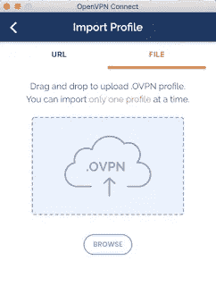
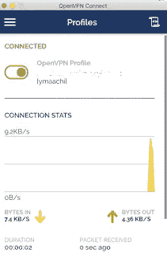

# 用 Docker 部署 VPN 服务器

> 原文：<https://medium.com/geekculture/deploy-a-vpn-server-with-docker-9bd512f2be2b?source=collection_archive---------24----------------------->

# 什么是 VPN？

一个**虚拟专用网** ( **VPN** )跨公共网络扩展了一个[专用网](https://en.wikipedia.org/wiki/Private_network)，并使用户能够跨共享或公共网络发送和接收数据，就像他们的计算设备直接连接到专用网一样。因此，跨 VPN 在计算设备(例如，膝上型电脑、台式电脑、智能手机)上运行的应用可以受益于专用网络的功能、安全性和管理。加密是 VPN 连接的一个常见部分，尽管不是其固有部分。[1]

# Docker 是什么？

[2] Docker Engine 是一种开源的容器化技术，用于构建和容器化您的应用程序。Docker 引擎充当客户端-服务器应用程序，具有:

*   具有长期运行的守护进程的服务器`[dockerd](https://docs.docker.com/engine/reference/commandline/dockerd/)`。
*   API，它指定了程序可以用来与 Docker 守护进程对话并向其发出指令的接口。
*   命令行界面(CLI)客户端`[docker](https://docs.docker.com/engine/reference/commandline/cli/)`。

本文介绍了如何在主机(虚拟或物理)上安装带有 docker 的 VPN(虚拟专用网络)服务器。

# 要求

在开始之前，你需要在你的主机上安装 Docker。看看这篇[文章](https://blog.yassinemaachi.com/2019/12/install-docker-on-centos-or-ubuntu.html)，看看如何安装 Docker 社区版。

# 安装

初始化$VPN_DATA 容器卷名。
$ VPN _ DATA = " homelab-VPN-DATA "

创建将由 Openvpn 容器挂载的卷，以保存服务器配置文件和证书。
$ sudo docker volume create—name $ VPN _ DATA

运行服务器，使用您的服务器公共 url 生成一个认证机构，该认证机构将从 WAN 进行访问。
$ sudo docker run-v $ VPN _ DATA:/etc/openvpn—log-driver = none—RM Kyle manna/openvpn ovpn _ gen config-u UDP://VPN . yassinemaachi . com

容器将提示输入密码短语，以保护新生成的证书颁发机构使用的私钥(例如:>ca . key pass phrase:50m esecretc 0 de)。
$ sudo docker run-v $ VPN _ DATA:/etc/openvpn—log-driver = none—RM-it Kyle manna/OpenVPN ovpn _ init PKI

使用容器的默认公开端口启动 OpenVPN 服务器进程，并挂载配置卷
$ sudo docker run-v $ VPN _ DATA:/etc/OpenVPN—restart =除非停止—name = homelab-VPN-d-p 1194:1194/UDP

# 创建新客户端

生成带有密码短语的客户端证书(容器将提示输入密码短语，该密码短语将用于从客户端连接到此 vpn 服务器)
$ sudo docker run-v $ VPN _ DATA:/etc/openvpn—log-driver = none—RM-it Kyle manna/openvpn easy RSA build-client-full y machi

生成不带密码短语的客户端证书
$ sudo docker run-v $ VPN _ DATA:/etc/openvpn—log-driver = none

# 测试连接

首先，确保您的防火墙(如果您的网络中有)授权端口 1194 使用 udp 协议。
您可以使用安装在笔记本电脑或手机上的 OpenVPN 客户端连接到您的服务器。
安装 OpenVPN 客户端后，您可以上传生成的客户端配置文件(ymaachi.ovpn):

然后单击连接:

享受您的安全连接！

链接:

*   [1][https://en.wikipedia.org/wiki/Virtual_private_network](https://en.wikipedia.org/wiki/Virtual_private_network)
*   [2][https://docs.docker.com/install/](https://docs.docker.com/install/)