# 使用 Terraform 部署 AWS EKS 集群

> 原文：<https://medium.com/geekculture/deploy-an-aws-eks-cluster-using-terraform-965fe680f9d4?source=collection_archive---------3----------------------->

# 什么是 AWS EKS？

**亚马逊弹性 Kubernetes 服务**(亚马逊 EKS)是由 AWS 提供的托管 Kubernetes 服务。通过 **AWS EKS** 我们可以在不安装和操作 Kubernetes 控制平面或工作节点的情况下运行 Kubernetes。 **AWS EKS** 帮助您提供高度可用和安全的集群，并自动执行关键任务，如打补丁、节点供应和更新。

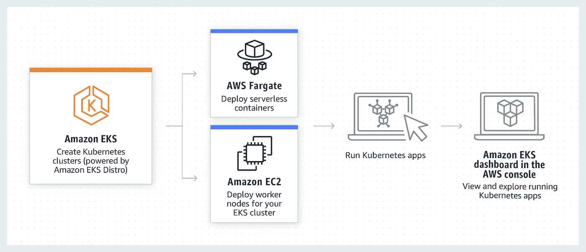

AWS EKS

# 什么是 Terraform？

**Terraform** 是一个免费的开源**基础设施 as code (IAC)** ，可以帮助自动化远程服务器的部署、配置和管理。Terraform 可以管理现有的服务提供商和定制的内部解决方案。

从 [**这里**](https://www.terraform.io/intro/index.html) **阅读更多关于 Terraform 的内容。**

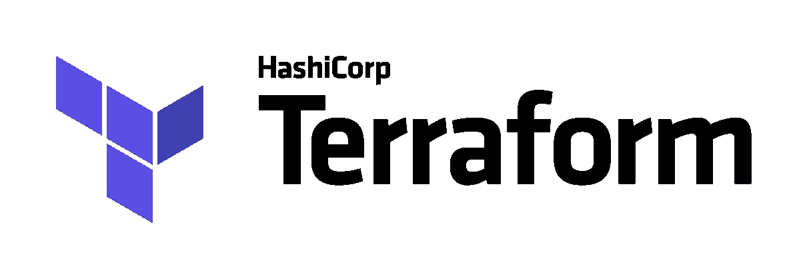

Terraform

在本教程中，我将在 Terraform 脚本的帮助下创建一个 AWS EKS 集群。

# 先决条件:

*   **AWS 账户**
*   基本了解 **AWS** 、**terra form**&**Kubernetes**
*   **GitHub 账户**

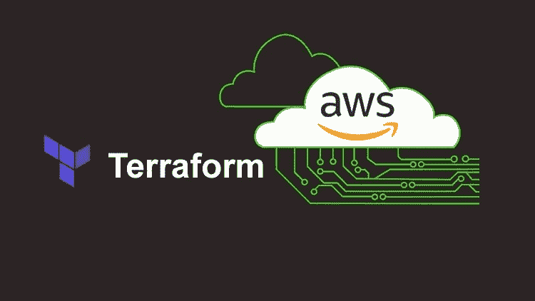

Terraform-AWS-EKS

现在，让我们开始为 Kubernetes 集群创建 terraform 脚本。

**第一步:-** 创建**。用于存储环境变量的 tf** 文件

*   创建`vars.tf`文件并在其中添加以下内容

```
variable "access_key" {
  default = "<Your-AWS-Access-Key>"
}variable "secret_key" {
    default = "<Your-AWS-Secret-Key>"
}
```

**第二步:-** 创建**。AWS 配置的 tf** 文件

*   创建`main.tf`文件并在其中添加以下内容

```
provider "aws" {
    region = "us-east-1"
    access_key = "${var.access_key}"
    secret_key = "${var.secret_key}"
}data "aws_availability_zones" "azs" {
    state = "available"
}
```

*   `data “aws_availability_zones” “azs”`将提供`us-east-1`区域的可用区域列表

**第三步:-** 创建**。 **AWS VPC** 的 tf** 文件

*   为 **VPC** 创建`vpc.tf`文件，并在其中添加以下内容

```
variable "region" {
    default = "us-east-1"
}data "aws_availability_zones" "available" {}locals {
    cluster_name = "EKS-Cluster"
}module vpc {
    source = "terraform-aws-modules/vpc/aws"
    version = "3.2.0"
    name = "Demo-VPC"
    cidr = "10.0.0.0/16"
    azs = data.aws_availability_zones.available.names
    private_subnets = ["10.0.1.0/24", "10.0.2.0/24", "10.0.3.0/24"]
    public_subnets =  ["10.0.4.0/24", "10.0.5.0/24", "10.0.6.0/24"]
    enable_nat_gateway = true
    single_nat_gateway = true
    enable_dns_hostname = truetags = {
    "Name" = "Demo-VPC"
}public_subnet_tags = {
    "Name" = "Demo-Public-Subnet"
}private_subnet_tags = {
    "Name" = "Demo-Private-Subnet"
}
}
```

*   我们正在使用 **AWS VPC** 模块进行 VPC 创作
*   以上代码将在`us-east-1`区域创建`10.0.0.0/16` CIDR 范围的 **AWS VPC**
*   **VPC** 将有 3 个**公共**和**私有**子网
*   `data “aws_availability_zones” “azs”`将提供`us-east-1`区域的可用区域列表
*   我们已经启用了`NAT Gateway` & `DNS Hostname`

**第四步:-** 创建。 **AWS 安全组**的 tf 文件

*   为 **AWS 安全组**创建`security.tf`文件，并在其中添加以下内容

```
resource "aws_security_group" "worker_group_mgmt_one" {
    name_prefix = "worker_group_mgmt_one"
    vpc_id = module.vpc.vpc_idingress {
        from_port = 22
        to_port = 22
        protocol = "tcp"cidr_blocks = [
            "10.0.0.0/8"
        ]
    }
}resource "aws_security_group" "worker_group_mgmt_two" {
    name_prefix = "worker_group_mgmt_two"
    vpc_id = module.vpc.vpc_id

    ingress {
        from_port = 22
        to_port = 22
        protocol = "tcp"cidr_blocks = [
            "10.0.0.0/8"
        ]
    }
}resource "aws_security_group" "all_worker_mgmt" {
    name_prefix = "all_worker_management"
    vpc_id = module.vpc.vpc_idingress {
        from_port = 22
        to_port = 22
        protocol = "tcp"cidr_blocks = [
            "10.0.0.0/8"
        ]
    }
}
```

*   我们正在为 2 个工作节点组创建 2 个安全组
*   我们只允许 **22** 端口用于 **SSH** 连接
*   我们正在限制对`10.0.0.0/8` CIDR 数据块的 SSH 访问

**第五步:-** 创建**。 **EKS 集群**的 tf** 文件

*   为 **VPC** 创建`eks.tf`文件，并在其中添加以下内容

```
module "eks"{
    source = "terraform-aws-modules/eks/aws"
    version = "17.1.0"
    cluster_name = local.cluster_name
    cluster_version = "1.20"
    subnets = module.vpc.private_subnetstags = {
        Name = "Demo-EKS-Cluster"
    }vpc_id = module.vpc.vpc_id
    workers_group_defaults = {
        root_volume_type = "gp2"
    }workers_group = [
        {
            name = "Worker-Group-1"
            instance_type = "t2.micro"
            asg_desired_capacity = 2
            additional_security_group_ids = [aws_security_group.worker_group_mgmt_one.id]
        },
        {
            name = "Worker-Group-2"
            instance_type = "t2.micro"
            asg_desired_capacity = 1
            additional_security_group_ids = [aws_security_group.worker_group_mgmt_two.id]
        },
    ]
}data "aws_eks_cluster" "cluster" {
    name = module.eks.cluster_id
}data "aws_eks_cluster_auth" "cluster" {
    name = module.eks.cluster_id
}
```

*   对于 EKS 集群的创建，我们使用的是 terraform AWS EKS 模块
*   下面的代码将创建 2 个 worker 组，具有所需的 3 个类型为 **t2.micro** 的实例的容量
*   我们将最近创建的安全组附加到两个工作节点组

```
workers_group = [
        {
            name = "Worker-Group-1"
            instance_type = "t2.micro"
            asg_desired_capacity = 2
            additional_security_group_ids = [aws_security_group.worker_group_mgmt_one.id]
        },
        {
            name = "Worker-Group-2"
            instance_type = "t2.micro"
            asg_desired_capacity = 1
            additional_security_group_ids = [aws_security_group.worker_group_mgmt_two.id]
        },
    ]
```

**第六步:-** 创建**。terraform **Kubernetes** 提供者的 tf** 文件

*   创建`kubernetes.tf`文件并在其中添加以下内容

```
provider "kubernetes" {
    host = data.aws_eks_cluster.cluster.endpoint
    token = data.aws_eks_cluster_auth.cluster.token
    cluster_ca_certificate = base64encode(data.aws_eks_cluster.cluster.certificate_authority.0.data)
}
```

*   在上面的代码中，我们使用最近创建的集群作为`host`，使用认证令牌作为`token`
*   我们将`cluster_ca_certificate`用于 **CA 证书**

**第七步:-** 创建**。**输出**的 tf** 文件

*   创建`outputs.tf`文件，并在其中添加以下内容

```
output "cluster_id" {
    value = module.eks.cluster_id
}output "cluster_endpoint" {
    value = module.eks.cluster_endpoint
}
```

*   上面的代码将输出我们集群的名称，并公开我们集群的端点。

**第 8 步:-** 将我们的代码存储到 **GitHub 库**

*   现在，我们已经完成了所有的 terraform 脚本，让我们将代码存储在 GitHub 存储库中

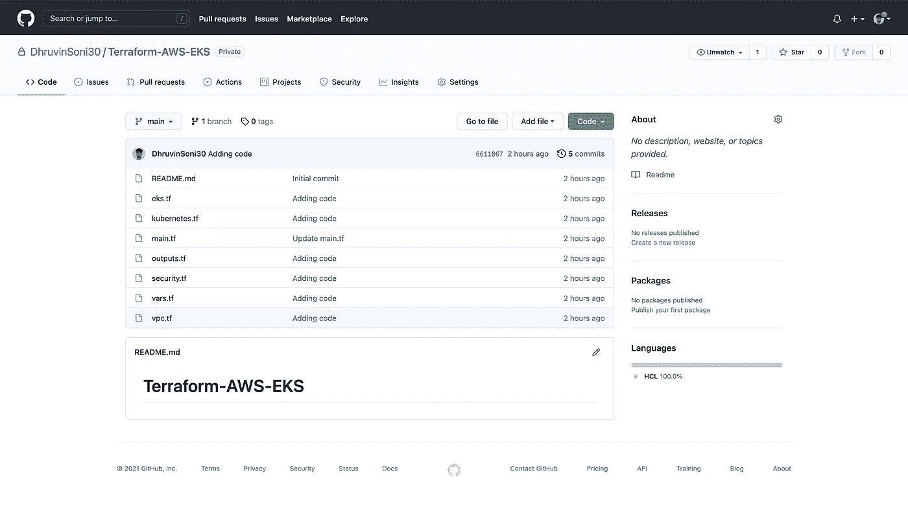

GitHub Repository

**步骤 9:-初始化**工作目录

*   运行工作目录中的`terraform init`命令。它将下载所有必需的提供程序和所有模块

**第十步:-** 创建一个**地形图**

*   运行工作目录中的`terraform plan`命令。它会给出执行计划

```
Plan: 50 to add, 0 to change, 0 to destroy.Changes to Outputs:+ cluster_endpoint = (known after apply)+ cluster_id       = (known after apply)
```

**步骤 11:-** 在 **AWS** 上创建**集群**

*   运行工作目录中的`terraform apply`命令。它将在 **AWS** 上创建 Kubernetes 集群
*   Terraform 将在 AWS 上创建以下资源

1.  **VPC**
2.  **路由表**
3.  **我的角色**
4.  **NAT 网关**
5.  **安全组**
6.  **公共&私有子网**
7.  **EKS 集群**

**第 12 步:-** 验证 **AWS** 上的资源

*   导航到您的 **AWS** 帐户并验证资源

1.  **EKS 集群:**

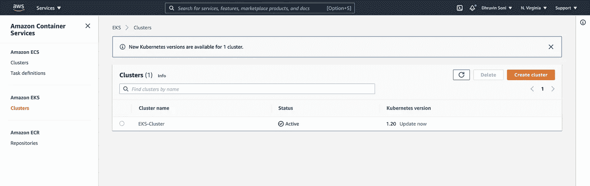

AWS EKS

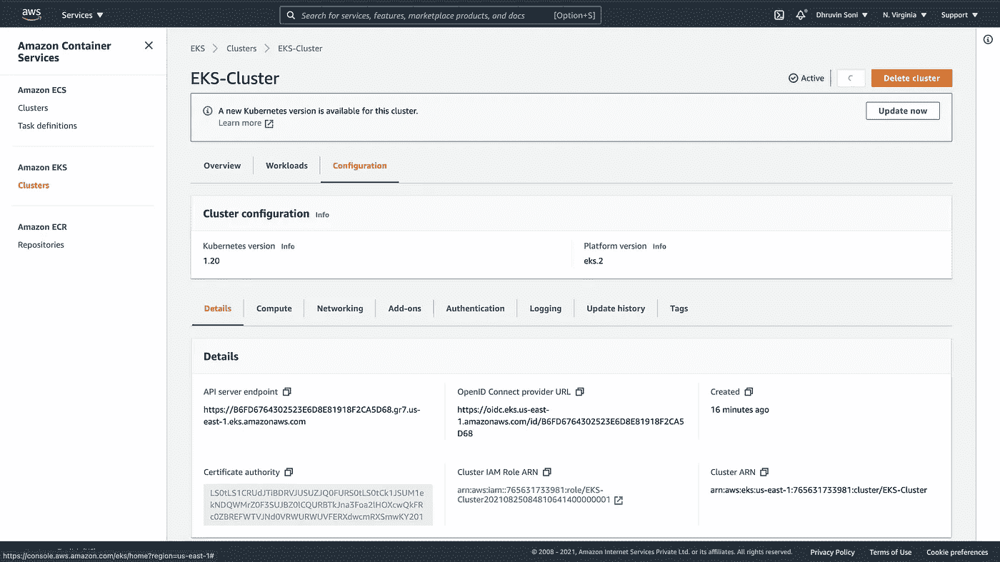

AWS EKS

**2。VPC &其他资源:**

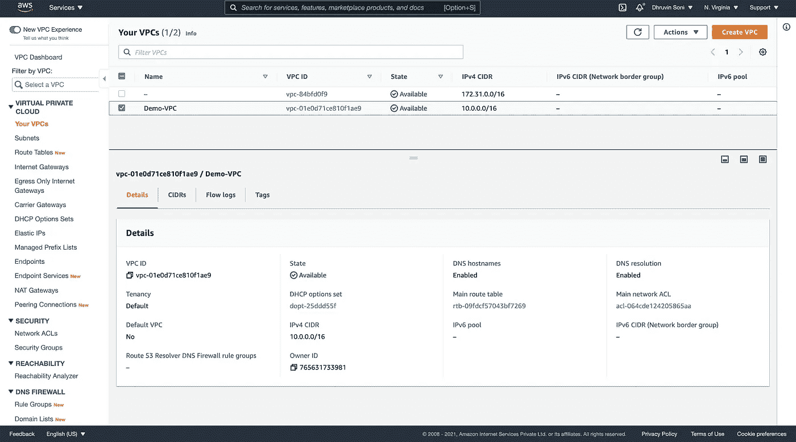

AWS VPC

**3。子网:**

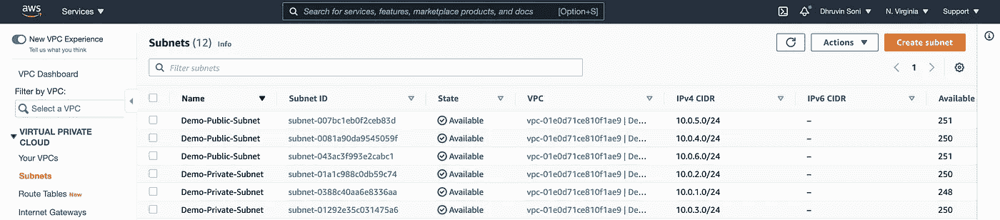

AWS Subnets

**4。安全组:**

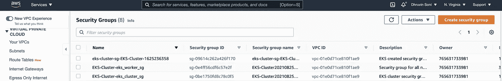

AWS Security Group

**5。IAM 角色:**

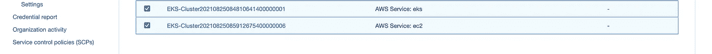

AWS IAM Role

6。自动缩放组:

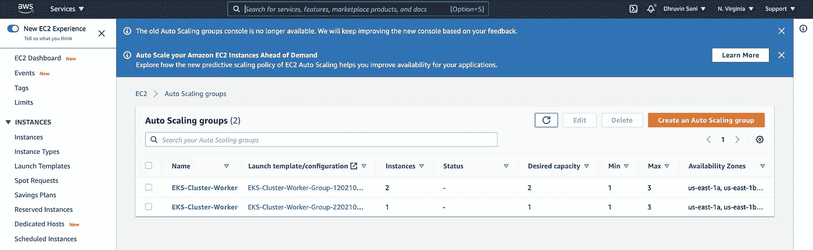

AWS ASG

**7。EC2 实例:**

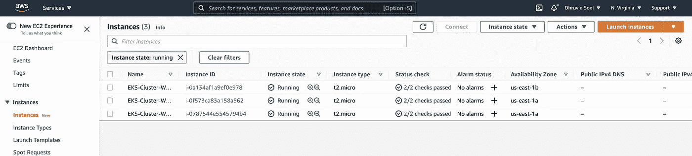

AWS EC2 Instances

至此，您已经学习了如何使用 Terraform 创建 AWS EKS 集群。您现在可以使用它并对其进行相应的修改。

你可以在我的 [**GitHub**](https://github.com/DhruvinSoni30/Terraform-AWS-EKS) 账号找到完整的代码。也可以随意查看我的其他库。

如果您觉得本指南很有帮助，请点击👏按钮，也可以随意发表评论。

关注更多类似的故事😊