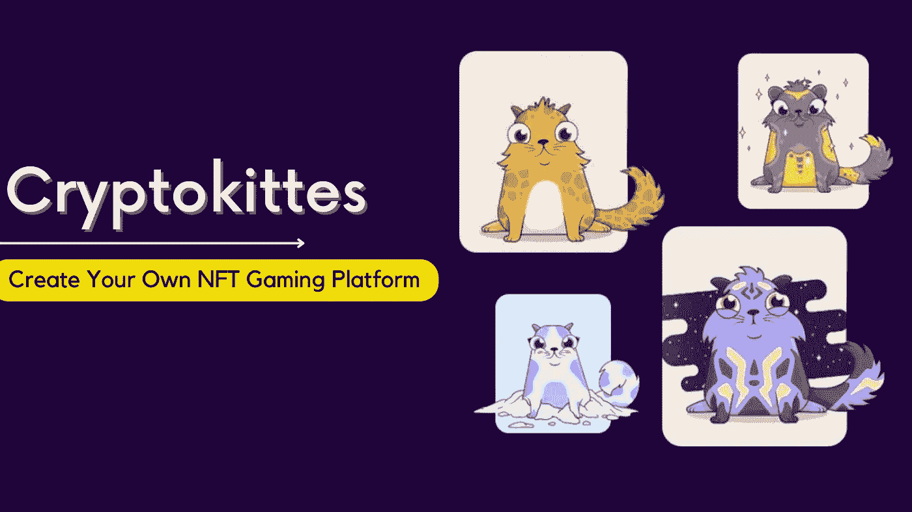
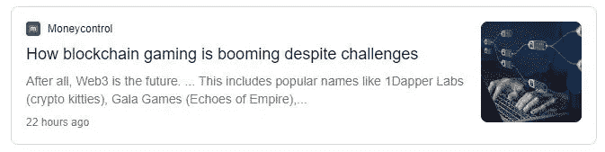
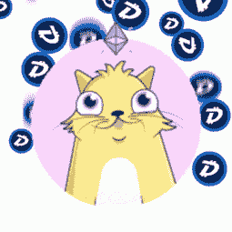

# 部署 Cryptokitties 等独家 NFT 游戏平台

> 原文：<https://medium.com/geekculture/deploy-an-exclusive-nft-gaming-platform-like-cryptokitties-f3d6479e522?source=collection_archive---------18----------------------->

如果我说时间旅行在接下来的几十年里是可能的，你会相信吗？你的本能和情感方面会同意这一点，但是，实际和逻辑方面会犹豫是否承认和相信这一疯狂的现象。几年前，当有人暗示数字化世界及其资产时，可能会发生同样的情况。

不断发展的数字领域创造了前所未有的里程碑和机遇。依靠人工智能不会太冒险吗？在开始使用网上银行、KYC 功能等的时候，同样的想法操纵着我们。但是，最终，现在即使是一家小商店也有了二维码功能和 UPI 交易设施。同样，犹豫和怀疑的现象随时可能变成现实。

一个从未完全解决的热门话题是来自一个叫做 Cryptokitties 的 Dapp 游戏的“创世猫”的交易。 [**Dapp 游戏** s **像 Cryptokitties**](https://www.appdupe.com/cryptokitties-clone) 以其显著的虚拟猫和游戏机制在市场上出现了显著的上升。

首先，在这些数字化的猫和它们的繁殖过程上花费数百万看起来很蹩脚。后来，它慢慢地以某种方式变得有意义，信不信由你，区块链技术为未来的数字世界奠定了基础。

# 这个密码术有什么特别之处？

自二战以来，密码学一直发挥着巨大的作用。信息和机密材料的传递都是通过这种技术实现的。但是，如果加密全部以数字方式进行会怎么样呢？

对这个世界上的一个人、一件事或任何东西进行估价的关键总是依赖于它的独特性、质量和稀有性。这项技术很有用，但有一个巨大的缺点，那就是复制信息，并有第三方介入，这也导致了隐私和保密性的缺乏。

对于暴民来说，这种复制粘贴问题并不是什么大问题，因为他们不太担心丢失个人信息，并开始考虑如何数字化地利用和交易收入。

基于密码学的区块链技术彻底扭转了局面，消除了弊端，并在数字世界掀起了一场革命。在这项技术被引入这个世界后，复制和第三方干预不再是一种选择。

那么，对于那些不需要任何第三方帮助就可以交易和拥有的数字货币或资产(如果需要的话，被骗的机会和隐私可能会受到威胁)，你该怎么办呢？

Money control about cryptokitties

# **加密货币——数字资产的基准**

看过标题后，比特币将是你脑海中第一个闪现的东西。很明显，比特币价值的突然提升让整个股票市场崩溃，让人们为之疯狂。

这一突然崛起背后的原因完全是区块链技术。 [**【去中心化金融(De-fi)**](https://en.wikipedia.org/wiki/Decentralized_finance) 使这些资产免受政府、银行等第三方的影响，这意味着你的数据被加密，除了你之外，任何人都无法访问。这种加密硬币的有限可用性使其更有价值。

## **以太坊——领先一步**

以太坊作为一种加密货币，因其先进的计算能力走在了加密货币的前面。综上所述，比特币在区块链账本上做了 2 维加减法。然而，以太坊通过使用区块链建立一个平台来创建一些令人敬畏的吸引大众的计算，如在其上运行应用程序、运行计算代码等，从而达到了更高的维度水平。

一个这样的应用是 Cryptokitties。这个去中心化的应用程序(d App)是建立在区块链的以太坊上的。

## 这个应用程序与众不同的地方是什么？

就拿一个票房很高的游戏——使命召唤来说吧。这个游戏可以让你进入，随心所欲地玩，并购买你想要的战利品和皮肤。但是，他们可以完全访问你的游戏和凭证，这可能会导致复制，甚至删除你的帐户，如果他们不得不这样做。基于区块链的游戏是免费的，因为你和只有你是你的小猫的主人，你可以访问它们。

猜猜这些应用程序可以被预先设计为 [**Cryptokitties 克隆**](https://www.appdupe.com/cryptokitties-clone) 与一些大鱼，从而让企业家立即开始他们的创业。

# **在 Cryptokitties 克隆脚本中您应该期待什么:**

*   Dapp 应该在采购和育种活动的多重交易中是可行的。
*   它应该能够使用智能对比跟踪他们想要的角色的所有权。
*   并且角色应该以这样的方式设计，它们应该能够繁殖并且将它们的角色和特征反馈给后代。

## 以下功能是实现该应用程序完全集成所必需的:

*   智能合约:ERCN72 合约确保了角色的安全。这个 Dapp 的主要成分是 Kittycore。
*   **流动性**:流动性特性让用户可以随时随地轻松进行交易或购买自己的角色和配件。
*   **定制**:一个典型的 Cryptokitties 克隆脚本必须具备这个定制特性。这是一个让用户以有趣和吸引人的方式玩游戏的特性。可定制的头像也提供了更多的游戏内购买。
*   **内置集成钱包**:此处角色为不可替换的代币(NFT)。因此，玩家需要一个集成了密码的钱包来进行交易和购买。智能合约让用户拥有自己的角色，这样就没有黑客或第三方可以访问它。但是，如果他失去了访问钱包的权限，即使是开发团队也无法找回钱包。

## **少数预后:**

这个不断增长的区块链产业不仅为资产铺平了道路，它还通过利用创业愿景(如 Cryptokitties 克隆脚本)为你的职业生涯带来了创造资产的机会，并让其他人瞠目结舌！