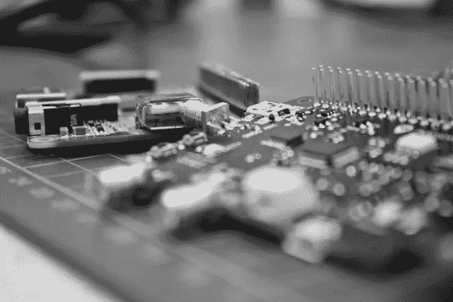

# 使用远程系统资源管理器(Eclipse 插件)部署和测试应用程序

> 原文：<https://medium.com/geekculture/deploy-and-test-an-application-with-remote-system-explorer-eclipse-plugin-885a010087bd?source=collection_archive---------0----------------------->

## 先决条件

如果您是初学者，我建议您首先查看在 Windows/Linux 上用 Eclipse IDE 编写第一个 C 语言程序的教程: