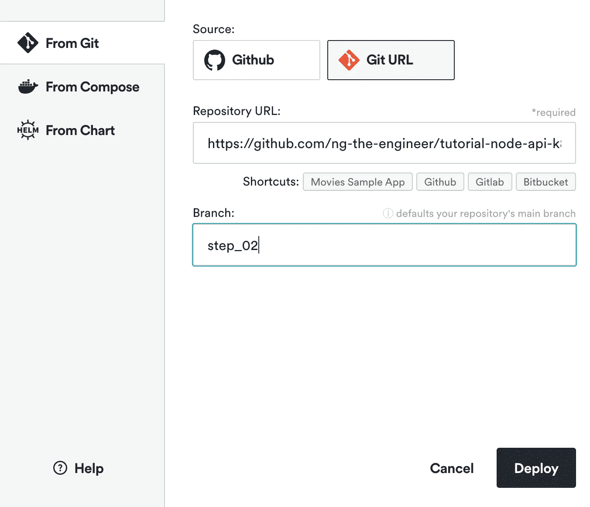
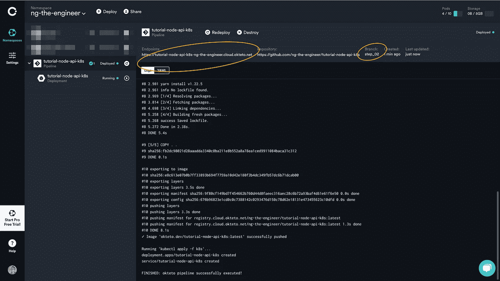
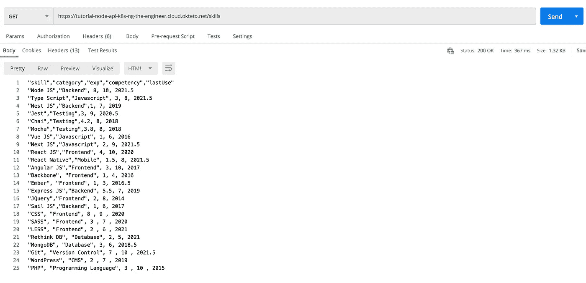
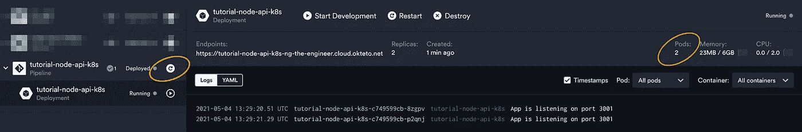

# 免费在 Kubernetes 上部署 API

> 原文：<https://medium.com/geekculture/deploy-api-on-kubernetes-for-free-ffe6889aad9d?source=collection_archive---------17----------------------->

## 在 Kubernetes 集群上创建节点后端的 5 分钟指南


Photo by [Karim MANJRA](https://unsplash.com/@karim_manjra?utm_source=unsplash&utm_medium=referral&utm_content=creditCopyText) on [Unsplash](https://unsplash.com/s/photos/signs-free?utm_source=unsplash&utm_medium=referral&utm_content=creditCopyText)

Kubernetes 获得了极大的欢迎，并成为事实上的容器编排工具，因为它提供了负载平衡、自动伸缩、自动重新部署、健康检查，最重要的是，它与供应商无关。

它使微服务商店能够运行零停机应用程序，并成为开发人员的一项关键技能。尽管如此，Kubernetes 的学习曲线是陡峭的，这不仅是因为庞大的生态系统和复杂的架构，也是因为提供基础设施的高额资金成本。Minikube 有助于模拟 Kubernetes 在本地机器上的工作方式。如果您想在一个真正的多节点集群上进行试验，这是最好的开发方式，但并不理想。 [Kubesail](https://kubesail.com/) 是另一个在自有硬件上配置 Kubernetes 集群的优秀工具。它非常适合拥有现有裸机或 Raspberry Pi 等物联网设备的开发人员。

假设您想在零成本的真实集群上进行实验和学习。是啊！它是免费的。这个教程绝对适合你。

你在开玩笑吗？让我们通过与我一起参加一个简短但令人兴奋的研讨会来寻找答案。

长话短说。我们将在 3 分钟内创建一个托管在 Kubernetes 集群上的可访问互联网的端点。

# 目录

第 1 节:创建一个 API 服务器

第 2 部分:Kubernetes 配置

第 3 节:部署到 Kubernetes 集群

第 4 部分:扩展 pod

# 第 1 节:创建一个 API 服务器

本节将创建一个简单的节点应用程序，dockerise it，并将 Docker 映像上传到 [**Okteto**](https://cloud.okteto.com/) 注册表，这就是我们今天所依赖的 PAAS 魔术。

## 启动项目

在 Github 上创建一个存储库，并将其保存到您的本地机器上。

启动项目以生成`package.json`。

```
yarn init -y
```

`express`是这个项目中唯一的依赖。让我们安装它。

```
yarn add express
```

该应用程序的重点是以 CSV 格式公开技能数据作为 GET 端点。所以我们将跳过生产需求，比如错误处理、安全性和节流。

## 1)创建节点应用程序

创建一个简单的节点应用程序，在端口`3001`上公开一个端点`/skills`。如果前端应用程序使用 API 响应，我们通过添加三个 Access-Control-Allow*头来允许 CORS，以使浏览器满意。

端点读取文件`skills.csv`，并将内容写入 HTTP 响应。

使用`node app.js`在本地运行，并在`http://localhost:3001/skills`上查看结果。

## 2)docker ice 应用程序

创建一个`Dockerfile`并在容器上暴露端口`3001`。

接下来，我们要建立一个图像。**注意图像名称必须以** `**okteto.dev/**` **开头，然后是项目名称**，因为`Okteto`会将图像上传到它自己的 Docker 图像库。酷！我们甚至不需要自己上传到 Docker 注册表。

```
docker build -t okteto.dev/tutorial-node-api-k8s .
```

运行容器，并使其在本地机器的端口 8001 上可访问。

```
docker run -d -p 8001:3001 okteto.dev/tutorial-node-api-k8s
```

API 驻留在`[http://localhost:8001/skills](http://localhost:8001/skills.)` [上。](http://localhost:8001/skills.)🔥

[第一节源代码](https://github.com/ng-the-engineer/tutorial-node-api-k8s/tree/step_01)👈

# 第 2 部分:Kubernetes 配置

将容器引入集群涉及两种配置。一个`k8s/deployment.yaml`决定了如何创建一个`pod`。在我们的例子中，我们告诉 Kubernetes 容器图像在`okteto.dev/tutorial-node-api-k8s`的位置和`replicas`计数。

A `k8s/service.yaml`定义了 pod 通信的方式。**我们需要注意第 7 行的** `**annotations**` **中的一个 Okteto 特定属性** `**dev.okteto.com/auto-ingress**` **被配置为** `**true**`，所以`ingress`会自动公开一个服务端点。💪

够简单吗？

像许多 CI/CD 工具一样，Okteto 需要一个管道来详细描述发布应用程序的步骤。我们将在项目根中创建一个`okteto-pipeline.yaml`来构建映像并执行`kubectl apply`命令。

现在我们已经有了最低限度的配置。让我们用`git commit`和`git push`来远程 Github 仓库。

[第二节源代码](https://github.com/ng-the-engineer/tutorial-node-api-k8s/tree/step_02)👈

# 第 3 节:部署到 Kubernetes 集群

用你的 Github 帐户注册 [Okteto](https://okteto.com/) 。

Okteto 将使用您的 Github 帐户名创建默认名称空间。

导航至左上角菜单上的`Deploy`。


指定项目和分支的 URL。点击`Deploy`按钮。



Okteto 正在部署 pod 和服务，它将在一分钟内创建一个服务端点。



让我们前往[https://tutorial-node-API-k8s-ng-the-engineer . cloud . ok teto . net/skills](https://tutorial-node-api-k8s-ng-the-engineer.cloud.okteto.net/skills)。👈



# 第 4 部分:扩展 pod

为了体验一下 CI/CD，把`replicas`更新到 2。提交并推动变革。

点击 Okteto 仪表盘上的`redeploy`。它将在一分钟内创建一个新的 pod。



两个舱已经启动并运行了！

查看[完整的源代码](https://github.com/ng-the-engineer/tutorial-node-api-k8s)👈

恭喜你！🙌您已经在 Kubernetes 上部署了一个简单的后端，并且在 5 分钟内没有刷信用卡。

让我们回顾一下我们在研讨会中学到的东西。

1.  构建了一个节点后端。
2.  对接节点应用程序。
3.  定义 Kubernetes 配置。
4.  使用 [Okteto](https://okteto.com/) 管道在 Kubernetes 集群上推出应用。
5.  纵向扩展集群。

感谢您阅读❤️！

请给我鼓掌👏如果你喜欢这个想法，请分享。

如果您有任何想法，请随时在 hi@valubees.co.uk 与我们交流。

声明:本文与 Okteto 无关。