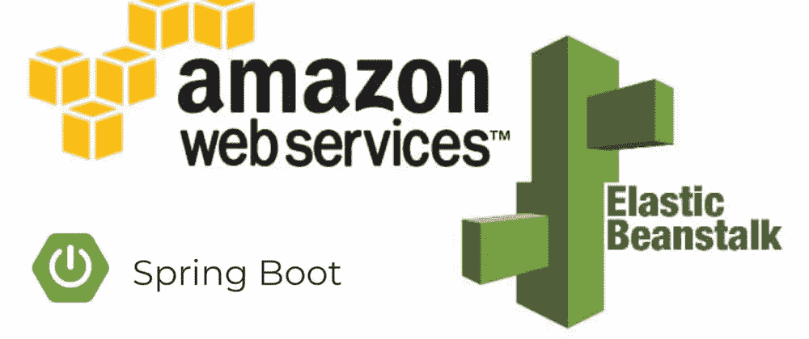
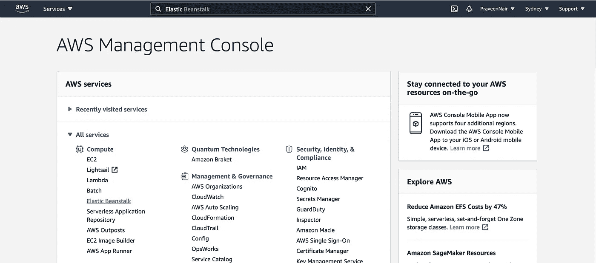
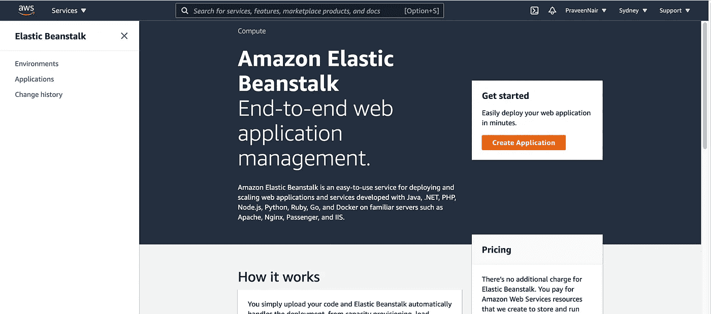
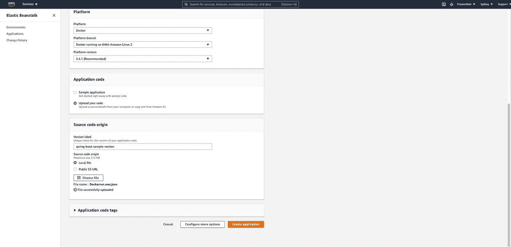
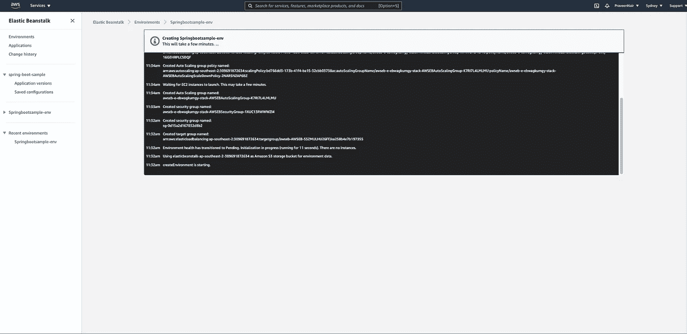
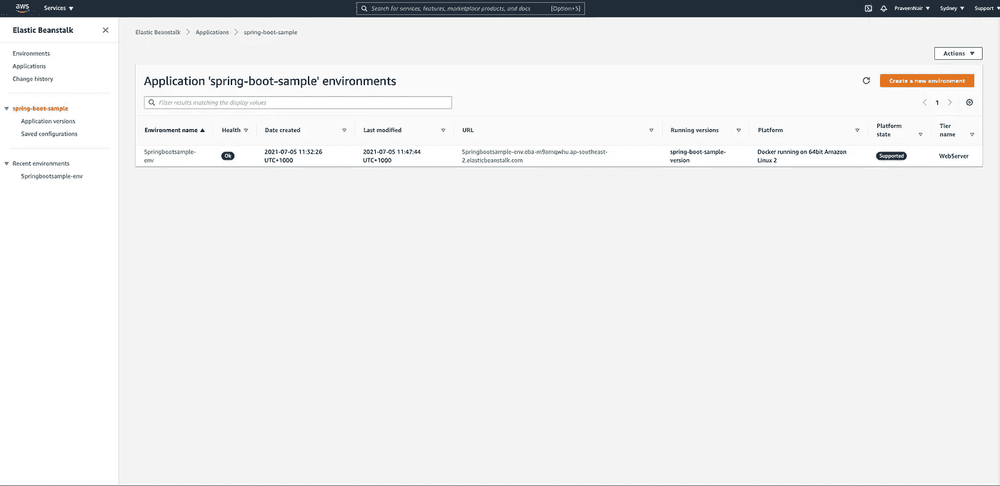
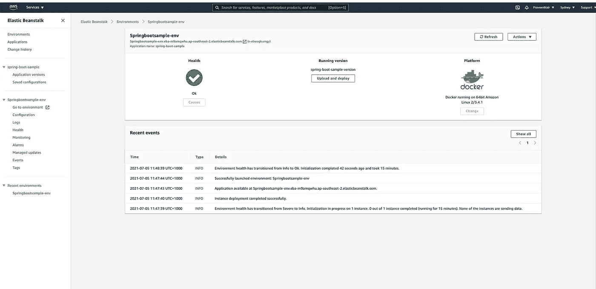

# 在 AWS Elastic Beanstalk 上部署 Docker 应用

> 原文：<https://medium.com/geekculture/deploy-docker-apps-on-aws-elastic-beanstalk-82a0c6871297?source=collection_archive---------14----------------------->



AWS Beanstalk + Spring boot

## 概观

Elastic Beanstalk(EB)是一个 AWS 服务，它在内部利用了亚马逊 EC2 和 S3。它还可以为您部署、管理和扩展应用程序。

> AWS Elastic Beanstalk 是一个易于使用的服务，用于部署和扩展用 Java 开发的 web 应用程序和服务。NET、PHP、Node.js、Python、Ruby、Go、Docker 在 Apache、Nginx、Passenger、IIS 等熟悉的服务器上。

使用 Elastic Beanstalk 部署应用程序有多种方式。您可以使用管理控制台、CLI 或 API 进行部署。Elastic Beanstalk 的惊人之处在于，一旦你上传了你的应用程序，它就会负责负载平衡、健康监控、伸缩等工作。查看更多关于[弹性豆茎](https://aws.amazon.com/elasticbeanstalk/)的信息。

在这篇博客中，我们将探讨如何在 [AWS Elastic Beanstalk](https://aws.amazon.com/elasticbeanstalk/) 上部署 docker 映像的以下步骤:

1.  用一个简单的控制器创建一个非常简单的 [Spring Boot](https://spring.io/projects/spring-boot) 应用程序。
2.  将这个 Spring Boot 应用程序 Docker 化，并将其推送到 [Docker hub](https://hub.docker.com/) 。
3.  从 docker hub 中提取这个 dockerized Spring Boot 应用程序映像，并将其部署到 [Amazon Elastic Beanstalk。](https://aws.amazon.com/elasticbeanstalk/)

因此，本教程分为 3 个部分:创建应用程序，将应用程序 Dockerize，以及使用 Elastic Beanstalk 部署应用程序。

***注意*** *:我跳过第 1 步和第 2 步，因为我在之前的* [*帖子*](https://praveeng-nair.medium.com/containerize-your-spring-boot-app-with-jib-plugin-50127d99a22f) *中已经这样做了。你不限于使用我在以前的* [*教程*](https://praveeng-nair.medium.com/containerize-your-spring-boot-app-with-jib-plugin-50127d99a22f) *中创建的一个 spring boot 应用程序，如果你已经有任何 dockerized 应用程序，请随意跳过第 1 和第 2 部分。*

## 要求

1.  创建一个 AWS 账户。AWS 提供了一个免费层，可以访问许多很酷的服务，如亚马逊 EC2 和 S3。
2.  你也可以下载 [Docker](https://docs.docker.com/docker-for-mac/install/) 。
3.  任何最喜欢的 IDE。我选择 Visual Studio 代码。

# 第 1 部分:创建应用程序

参考我之前的[帖子](https://praveeng-nair.medium.com/containerize-your-spring-boot-app-with-jib-plugin-50127d99a22f)。

# 第 2 部分:对应用程序进行分类

参考我之前的[帖子](https://praveeng-nair.medium.com/containerize-your-spring-boot-app-with-jib-plugin-50127d99a22f)。

# 第 3 部分:在弹性 Beanstalk 上部署应用程序

无论您选择哪个选项，您总是将单个文件上传到 Elastic Beanstalk 进行部署。该上传可以是:

1.  一份简单的文件。
2.  普通的 Docker.aws.json 文件。
3.  包含 Dockerfile 或 Dockerrun.aws.json 以及其他应用程序资产的 Zip 文件。

我们将使用第二个选项，即 **Dockerrun.aws.json** 定义文件，因为我们已经在 docker hub 中有我们的图像。

*图像名称*:在之前[帖子](https://praveeng-nair.medium.com/containerize-your-spring-boot-app-with-jib-plugin-50127d99a22f)中创建的 docker 图像的名称。从[对接毂](https://hub.docker.com/layers/104823926/prgnr173/springboot-jib/0.0.1-SNAPSHOT/images/sha256-092c4140156535e128676e616cd57e20e131550afee4098988e68eaa1d4a9044?context=explore)中拉出。如果您想运行任何其他应用程序，只需更新上述文件中的映像名称和端口。

1.  登录 [AWS 管理控制台](https://console.aws.amazon.com/console/home?#)。选择**弹性豆杆**维修。



AWS Management Console

2.每个弹性 Beanstalk 应用程序的第一步都是一样的——只需单击创建应用程序，填写名称和描述:



Create Application

3.选择平台 **Docker，**上传 Dockerrun.aws.json 文件，点击创建应用。



Upload Dockerrun.aws.json file

4.这将在我们的应用程序的后台启动安全组、目标组、负载平衡器、自动扩展组和 EC2 实例。您可以看到如下的日志。我们可以等到它结束。



Starting App and logs

5.一旦部署完成，过一会儿我们会看到一个应用程序创建了主动健康。如果我们点击 URL，我们会看到欢迎文本。



6.为我们的应用程序创建的默认环境在左侧有健康、事件、平台和其他配置的详细信息，这将帮助您定制应用程序的任何行为。



```
$ curl http://springbootsample-env.eba-m9amqwhu.ap-southeast-2.elasticbeanstalk.com/Welcome to Jib sample app
```

## 摘要

就这么简单。只需点击几下，我们就可以在 AWS Elastic Beanstalk 上部署我们的 dockerized 应用程序。我们可以使用 AWS CLI 命令执行相同的步骤。

您不需要担心手动设置 EC2 实例、供应或扩展，所有这些都由 Elastic Beanstalk 为您完成。请记住，使用 Elastic Beanstalk，您不仅限于使用 Docker 或 CLI，Elastic Beanstalk 为您提供了使用多种语言和平台的选项，以及适合您需求的不同应用部署方式。

现在，如果您已经注意到在 beanstalk 中创建的 URL 是一个 **HTTP** URL。由于**是 rest 通信的安全方式，我们将在我的下一篇[帖子](https://praveeng-nair.medium.com/installing-a-self-signed-ssl-certificate-on-aws-elastic-beanstalk-1d4acd2c0cd)中看到，我们如何为 beanstalk 应用程序创建一个 **HTTPS** url。**

**编码快乐！！**

## **参考**

 **[## 从 Docker 容器部署弹性 Beanstalk 应用程序

### Elastic Beanstalk 支持从 Docker 容器部署 web 应用程序。使用 Docker 容器，您可以…

docs.aws.amazon.com](https://docs.aws.amazon.com/elasticbeanstalk/latest/dg/create_deploy_docker.html)**