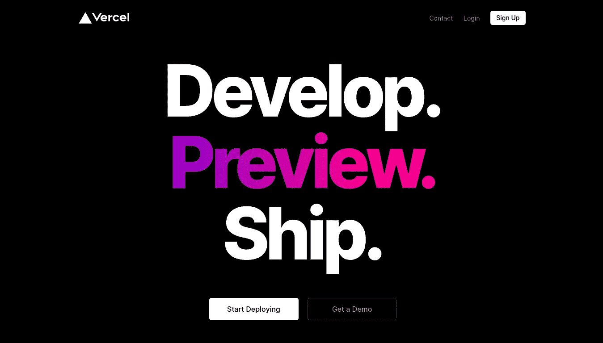
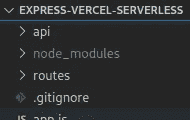
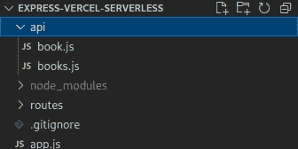
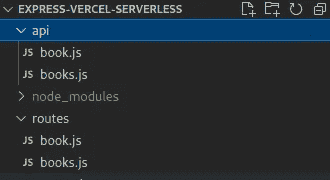
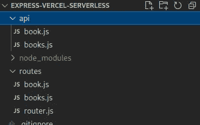
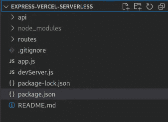

# 将 Express 项目与到 Vercel 的多条路由一起部署为多个无服务器功能

> 原文：<https://medium.com/geekculture/deploy-express-project-with-multiple-routes-to-vercel-as-multiple-serverless-functions-567c6ea9eb36?source=collection_archive---------4----------------------->



[Vercel](https://vercel.com/) 凉了。对于开发人员来说，将 NextJs 应用程序部署到 Vercel 非常容易。因为平台就是为它而生的。但对于一个有多条路线的传统快递应用程序，如果你按照 Vercel 的文档部署快递应用程序，它最终将被部署为一个单一的无服务器功能。

正如我们所知，考虑到在 Vercel 平台上实施的[限制](https://vercel.com/docs/platform/limits)，用一个单一的无服务器函数来处理所有请求对于生产来说并不是一个好主意。

让我们直接进入使用多条路线部署 ExpressJS 应用程序的新方式。

所以一开始你可能已经用 [**快速路由器**](https://expressjs.com/en/5x/api.html#router) **定义好了所有的路线。**

在 source 目录下，创建一个 *routes* 文件夹。现在将您的所有路线移动到*路线*文件夹中。然后在源文件夹中创建另一个文件夹 *api* 。

现在，您的目录清单将如下所示。



*routes* 文件夹将以不同路由的形式包含您的所有应用程序逻辑。在 *api* 文件夹中，Vercel 查找要作为无服务器功能添加到平台中的 api 端点。

接下来，对于应用程序中的每条路线，您可以在您的 *api* 文件夹中创建一个 your-fancy-route-name.js 文件，命名为/api/your-fancy-route-name.js。

例如，如果您有一个/api/user 路径，您可以在 *api* 文件夹中创建一个 user.js 文件。您可以创建任意多的函数，但是请记住，如果您使用免费计划，Vercel **上的每个部署限制是 12 个函数。**



这里我们有两个示例路径，分别叫做 **/api/book** 和 **/api/books** 。现在我们需要在每个函数中初始化 ExpressJS。因此，我们将转到 **/api/book.js** ，并将这段代码放在那里:

```
const express = require(“express”);
const app = express();
```

接下来，我们必须在第二个示例 API 端点 **/api/books 中做同样的事情。**

# 但是有一个问题。

将这些行添加到 *api* 文件夹中的每个文件会带来大量的代码重复。所以我们将把它放在一个名为 **app.js (** 或者你想叫它什么)的文件中，这个文件将驻留在你的源文件夹中。

```
const express = require(“express”);
const app = express();module.exports = app;
```

现在在我们的 **/api/books.js** 和 **/api/books.js** 中我们可以直接导入这个 Express app 实例。

```
const app = require(“../app”);
```

接下来，我们可以将路由从/routes 导入相应的 api 端点文件，以便在应用程序中使用它们。

在我的示例应用程序中，我有两条路线，它们的名称就像它们所属的路线一样。



在 **/routes/book.js** 文件中，我将拥有我的 **/api/books** 路径的逻辑。

```
const book = require("express").Router();book.get("/book", async function (req, res) { const { bookId } = req.query; if (bookId) { res.status(200).send(
           { bookName: "Some Book", bookId: bookId }
       ); } else { res.send("No book ID"); }});book.post("/book", async function (req, res) { const { bookId, bookName } = req.body; //do something res.send("Something done");}); module.exports = book;
```

如你所见，我们将**快速路由器**导入为 **book，然后**将 GET 和 POST 方法添加到 **book** 中。现在我们有了 **/api/book** 路径的逻辑，我们可以在 **/api/book.js** 文件中使用这个路径。

你可以在这里 找到这个 **/routes/book.js** 文件 [**。**](https://github.com/qnxdev/express-vercel-serverless/blob/master/routes/book.js)

只需导入这条路线并使用它。在 **/api/book.js**

```
const app = require("../app");
const route = require("../routes/book");app.use("/api/", route);module.exports = app;
```

请注意，该文件的默认导出是我们在其中使用相应的路径后从 **app.js** 导入的 app。这将在您部署时由 Vercel NodeJS 运行时运行。

参见我的 **/api/book.js** 文件 [**此处**](https://github.com/qnxdev/express-vercel-serverless/blob/master/api/book.js) 。

## 类似地，我们可以将逻辑添加到 *routes* 文件夹中的所有其他路由，并将其导入到 *api* 文件夹中的相应端点。

现在我们完成了路由和 api 端点。

如果您想在 Express 应用程序中添加自定义中间件，您可以在我们首次初始化 Express 应用程序的 **app.js** 文件中完成。就像这样简单:

```
const express = require("express");
const cors = require("cors");
const helmet = require("helmet");var corsOptions = {
    //...cors options...
}const app = express();app.use(helmet());
app.use(cors(corsOptions));module.exports = app;
```

上面的例子展示了如何添加中间件，比如[**CORS**](https://www.npmjs.com/package/cors)**和 [**头盔**](https://www.npmjs.com/package/helmet) 。**

**参见完整的 **app.js** 文件 [**此处**](https://github.com/qnxdev/express-vercel-serverless/blob/master/app.js) 。**

**如果你想添加路由特定的中间件，你可以做同样的**app . use(your middleware)；**在 *api* 文件夹中的特定端点文件中。**

# **万岁！现在，我们已经为我们的 Express 应用程序设置了多条要在 Vercel 上部署的路线。**

## **但是等等。还有更多..**

**由于我们已经修改了我们的路由，我们可能已经完全搞乱了我们的本地开发服务器配置。我们可以通过三个步骤解决这个问题。**

## ****1。添加一个常用的 routes.js 文件****

****

**如你所见，在*路由*文件夹中有一个 **router.js** 。您可以在您的 *routes* 文件夹中创建一个新的 **routes.js** 文件。**

**在这个文件中，我们将为开发服务器定义路由逻辑。**

```
const routes = require("express").Router();const book = require("./book");
const books = require("./books");routes.get("/", async function (req, res) { 
      res.send(`Reached home!`); 
});routes.use("/", book);
routes.use("/", books);module.exports = routes;
```

**这里我们导入快速路由器，并将其分配给**条路由。有一个为`/'定义的 GET 路由，它将服务于字符串“到达家！”对于每个请求`/`。****

**请注意，我们已经在这里导入了我们的示例 **book** route 和 **books** route，并将其用于 **routes。****

**你可以在这里 **找到完整的 **/routes/router.js** 文件 [**。**](https://github.com/qnxdev/express-vercel-serverless/blob/master/routes/router.js)****

## **2.为本地开发服务器创建一个 devServer.js**

**在源文件夹中创建一个文件 **devServer.js** 或者任何你想添加到本地服务器的文件名。在该文件中，我们将从 **app.js** 文件中导入之前定义的 Express App 初始化。**

```
const app = require(“./app”);
```

**然后导入我们在步骤 1 中创建的**路线**，并与 app 一起使用。**

```
const app = require("./app");
const routes = require("./routes/router");app.use("/", routes);app.listen(3000,function () {
      console.log("Server started. Go to http://localhost:3000/");
});
```

**正如你在上一部分看到的，我在端口 3000 启动了服务器。**

## **3.将运行脚本添加到 **package.json****

**在你的 ***package.json*** 中你可以添加这个脚本**

```
"scripts": {
    "dev": "nodemon devServer.js"
},
```

**是的，你需要 nodemon 来完成这项工作**

```
npm i nodemon//*then*npm run dev
```

**最终的目录结构将看起来像这样..**

****

**你可以在 Github 上找到这个项目**

> **[***https://github.com/qnxdev/express-vercel-serverless***](https://github.com/qnxdev/express-vercel-serverless)**

**跟着我*无处可去*😝**

## **好吧。是的。完成了。完美。喝茶时间到了。☕️**

## **再见**