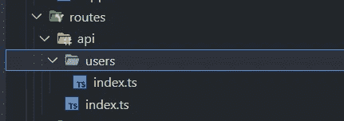

# 将 Fastify 应用程序部署到 AWS Lambda

> 原文：<https://medium.com/geekculture/deploy-fastify-app-to-aws-lambda-89cce91c1e4e?source=collection_archive---------7----------------------->

**Fast** est 库运行于 **fast** est API: AWS HTTP API

有史以来最著名的一句名言据说是美国总统、国务活动家本杰明·富兰克林说过的:“时间就是金钱”。我真诚地认为，在我们这个时代，这句话比以往任何时候都更加正确。虽然今天大多数编程语言都很快，但我们努力寻找一种更快的语言。JavaScript 库也是如此。今天我将帮助你了解一个号称最快的库，它的名字“ **FASTify** ”中甚至有 **fast** 。所以一定是真的。

## 为什么选择 Fastify？

> Fastify 是一个高度专注于以最少的开销和强大的插件架构提供最佳开发者体验的 web 框架。它的灵感来自哈比神和 Express，据我们所知，它是目前最快的 web 框架之一。([https://www.fastify.io/](https://www.fastify.io/))

为了测试这个说法，我将被放在一个每一毫秒都很重要的恶劣环境中。是的，我正在使用这个库创建一个 REST 应用程序并部署 AWS Lambda。

为了获得最大的速度，我们需要一个快速的 API，比如 AWS 中最快的:HTTP API。AWS 在 2020 年宣布了全新的网关 **HTTP API** ，作为广受欢迎的 REST APIs 的继任者。基本上， **HTTP API** 减少了**延迟**和**降低了成本。**

> HTTP APIs 旨在与 AWS 服务(包括 AWS Lambda 和 HTTP 端点)进行低延迟、经济高效的集成。HTTP APIs 支持 OIDC 和 OAuth 2.0 授权，并内置了对 CORS 和自动部署的支持。上一代 REST APIs 目前提供了更多的特性。(docs.aws.amazon.com)

一些值得注意的缺失功能:

1.  API 缓存
2.  请求主体转换
3.  请求/响应验证
4.  测试调用
5.  边缘优化
6.  自动气象站 X 射线

## 比较 Fastify 和 Express

ExpressJS 是 NodeJS 生态系统中使用最多的框架。我假设你知道 Express，但是如果需要复习，你可以查看我的另一个教程，我在里面复习了 ExpressJS。([此处](/geekculture/creating-and-deploying-express-app-to-lambda-811463ce7be2))

下面您可以查看基本请求处理的结构。我注释掉了一些部分，只是为了让 TypeScript 高兴。看着眼熟？

> 在 ExpressJS 中，几乎所有东西都是中间件，而在 Fastify 中，所有东西都是插件。

尽管我们可以用它来代替 ExpressJS，但还是有一些不同之处。从一开始，您就可以看到 Fastify 甚至在路由处理程序中对 async/await 提供了强大的支持。此外， **Fastify** 是用 TypeScript 构建的，因此使用它的用户可以享受很好的体验。

一个更微妙的区别是，在 **Fastify** 中，**响应**被称为**回复**。

一个值得注意的区别是，Fastify 没有使用中间件来获取相关数据，而是使用钩子，通过使用钩子，你可以直接与 Fastify 的生命周期进行交互。有请求/回复挂钩和应用程序挂钩:

*   [onRequest](https://www.fastify.io/docs/latest/Reference/Hooks/#onrequest)
*   [正在准备](https://www.fastify.io/docs/latest/Reference/Hooks/#preparsing)
*   [预验证](https://www.fastify.io/docs/latest/Reference/Hooks/#prevalidation)
*   [前置处理器](https://www.fastify.io/docs/latest/Reference/Hooks/#prehandler)

验证和序列化 Fastify 推荐 **JSON 模式。**

**JSON 模式**是一个词汇表，允许您**注释**和**验证** JSON 文档。([https://json-schema.org/](https://json-schema.org/))

好处:

*   描述您现有的数据格式。
*   提供清晰的人和机器可读的文档。
*   验证对有用的数据。
*   自动化测试。
*   确保客户提交数据的质量。

基本上，使用 JSON 模式提高了安全性，并在反序列化/解析请求和重放方面获得了不错的速度提升。


## 构建应用程序

让我们构建应用程序。很快。

为了快速启动和运行，我们将安装 **fastify-cli** ，然后生成 app *fastify-lambda* 项目。最后，我们需要安装依赖项。

```
npm i fastify-cli
fastify generate --lang=ts fastify-lambda
cd fastify-lambda
npm install
```

## 路线

在项目目录中，我们可以看到 routes 文件夹中已经定义的路由`example`。 **Fastify CLI** 使用`fastify-autoload`插件自动配置与文件夹结构匹配的路由。就像另一个伟大的框架，但对于前端，NextJS，如果我们创建一个名为 *api、*的新文件夹，在其中，我们有另一个名为 *users* 的文件夹，路径将是`api/users`。



The route will be /**api/users**

## 模型

我们可以像一个快速应用程序一样运行，它会工作，但我们会错过所有使 Fastify 变得伟大的功能。就像我之前提到的，我们需要为重放和响应提供 JSON 模式。让我们用用户模型做个例子。

这只是一个示例，但是您可以看到，它需要您指定许多属性，并且您还需要创建一个 typescript 模型。但是不用担心，有一个插件为我们做了大部分工作。这个插件叫做***JSON-schema-to-ts***，它从模式中生成 typescript 模型。

**Pro 提示**对导出`as const`很重要；

要获得 typescript 模型，我们只需编写:

```
type User = FromSchema<typeof userSchema>;
```

现在我们可以在控制器中使用它，用新的**用户模式**替换类型。

下面是一个小的 post 请求，您可以看到**主体**属于类型**用户。**因为我们添加了一个请求类型方案，所以当我们析构主体时，我们得到了智能建议。

完整的代码可以在我的 GitHub 上找到，以后可以在这里查看。

最后，一些帮助您开始使用 Fastify 的基本命令:

1.  **npm 运行开发** // *启动本地开发环境*
2.  **npm run start //** *为产品*启动服务器

## *AWS 无服务器应用模型*

*AWS 无服务器应用程序模型(SAM)是一个用于构建无服务器应用程序的开源框架。它允许你写一个小的 YAML 文件来描述函数和端点。同样，只需一个简单的命令，应用程序就可以部署到 AWS Lambda 并配置所有的设置供应。*

更多关于 SAM 的深入教程，你可以在这里查看我的帖子。

基本 SAM 推荐:

1.  `sam build`
2.  `sam deploy`将应用部署到云
3.  `sam validate`查看配置文件
4.  `sam delete`从 Lambda 删除应用

或者，如果您只想从头开始并使用预定义的 AWS SAM 模板，请使用以下命令:`sam init`

最基本的配置如下所示:

我使用新的 HTTP Api 来获得最佳性能，并将应用程序打包成 ZIP 格式。

可选步骤。让我们创造一个 S3 桶:

```
aws s3api create-bucket --bucket my-bucket-<**Random**> --region **<region>** --create-bucket-configuration LocationConstraint=**<region>**
```

** **Pro-tip** :给名字添加一些随机字符，因为它在整个 s3 中必须是唯一的。并设置区域。并将名字放入 *samconfig.toml* 。

有时`samconfig`没有生成，所以您必须手工编写它，下面是一个例子，替换区域名并添加 bucket 的 id。

## 将应用程序转换为 Lambda

为了在我们的应用程序中从 AWS Gateway 获取事件和所有数据，我们需要一个额外的层。幸运的是，我们不必从头开始写，因为有一个库可以用于这个目的。它叫做 **aws-lambda-fastify。**安装使用吧。

```
npm i aws-lambda-fastify
```

现在我们需要用库来包装我们的应用程序。

## **部署**

只差一步就可以全面部署了。AWS SAM 知道这是一个 NodeJS app，也知道应该如何构建，但是我们也在使用 Typescript，所以它需要先编译项目。为了完成这项任务，我们可以在 **package.json** 中添加一个函数调用，使用 Typescript 编译项目。此外，需要将 TypeScript 添加到生产依赖项中。

完整的 **package.json** 文件如下所示:

祝贺我们成功了。现在，我们要做的就是构建应用程序，并使用 SAM CLI 进行部署:

```
sam build
sam deploy
```

到目前为止，这个应用程序非常快，但与我以前使用 Express 的应用程序相比并没有太大变化。

完整的代码可以在 GitHub [这里](https://github.com/BogdanNic/fastify-lambda)找到。在那里你也可以找到 Lambda 的 Docker 文件，尽情享受吧！

如果你对更多的教程感兴趣，请订阅并鼓掌！

## 助手链接:

[](/geekculture/creating-and-deploying-express-app-to-lambda-811463ce7be2) [## 创建 Express 应用程序并将其部署到 Lambda

### 学习使用 AWS Sam 和 API 网关构建和部署全功能 ExpressJs 应用程序

medium.com](/geekculture/creating-and-deploying-express-app-to-lambda-811463ce7be2) [](https://www.fastify.io/docs/latest/Guides/Serverless/) [## 无服务器

### 使用您现有的 Fastify 应用程序运行无服务器应用程序和 REST APIs。默认情况下，Fastify 不能在…

www.fastify.io](https://www.fastify.io/docs/latest/Guides/Serverless/) 

AWS CLI 配置指南:[此处](https://docs.aws.amazon.com/cli/latest/userguide/cli-configure-quickstart.html#cli-configure-quickstart-creds)

AWS SAM 指南[此处](https://docs.aws.amazon.com/serverless-application-model/latest/developerguide/serverless-getting-started-hello-world.html)

创建 S3 铲斗的指南[此处](https://awscli.amazonaws.com/v2/documentation/api/latest/reference/s3api/create-bucket.html)