# 在 Docker 上部署机器学习模型

> 原文：<https://medium.com/geekculture/deploy-machine-learning-model-on-docker-6685fd9f401d?source=collection_archive---------18----------------------->

Created by Dipaditya Das

在本文中，我们将使用 Python 编程语言创建我们的机器学习模型。

应用程序变得越来越复杂。要求更快发展的呼声日益高涨。这给您的基础架构、IT 团队和流程带来了压力。Linux 容器帮助您缓解问题并更快地迭代——跨多个环境。

# 什么是 Linux 容器？

Linux 容器是一种技术，允许您将应用程序与其整个运行时环境(运行所需的所有文件)打包并隔离。这使得在环境(开发、测试、生产等)之间移动包含的应用程序变得容易。)同时保留全部功能。集装箱也是 [IT 安全](https://www.redhat.com/en/topics/security)的重要组成部分。通过[在容器管道中构建安全性](https://www.redhat.com/en/topics/security/container-security)并保护您的基础设施，您可以确保您的容器是可靠的、可伸缩的和可信的。

# 为什么要使用 Linux 容器？

Linux 容器通过划分职责范围来帮助减少开发和运营团队之间的冲突。开发者可以专注于他们的应用，而运营团队可以专注于基础设施。而且，因为 Linux 容器是基于[开源](https://www.redhat.com/en/topics/open-source/what-is-open-source)技术的，所以一旦它们可用，您就可以获得最新和最大的改进。容器技术——包括 [CRI-O](http://thenewstack.io/cri-o-make-kubernetes-center-container-ecosystem/) 、 [Kubernetes](https://www.redhat.com/en/topics/containers/what-is-kubernetes) 和[Docker](https://www.redhat.com/en/topics/containers/what-is-docker)——帮助您的团队简化、加速和协调应用程序开发和部署。

# Docker 是什么？

Docker 是一个工具，旨在通过使用容器使创建、部署和运行应用程序变得更加容易。

容器允许开发者将一个**应用程序**和它需要的所有部分打包在一起。我们可以下载机器学习所需的所有依赖项。

在本文中，我们将简单地使用 **Python** 对**工资数据集**制作一个**线性回归模型**。

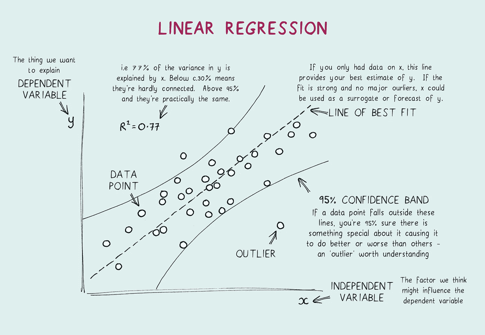

Image by [Dan White 1000](https://www.shutterstock.com/g/Dan+White+1000) on Shutterstock

## 我们将在[**red hat Linux Enterprise 8(rhel 8)**](https://www.redhat.com/en/enterprise-linux-8/details)**中进行所有的练习。**

## 步骤 1:为 Docker 配置 Yum 存储库

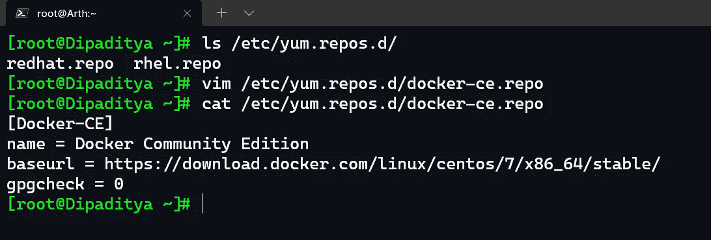

如我们所见，我们已经创建了一个`**docker-ce.repo**` 文件，并提供了名称、baseurl(官方存储库链接)和 gpgcheck。我们禁用了软件签名检查，因为我们已经提供了 Docker 社区版的官方链接。

## 步骤 2:安装 Docker 社区版

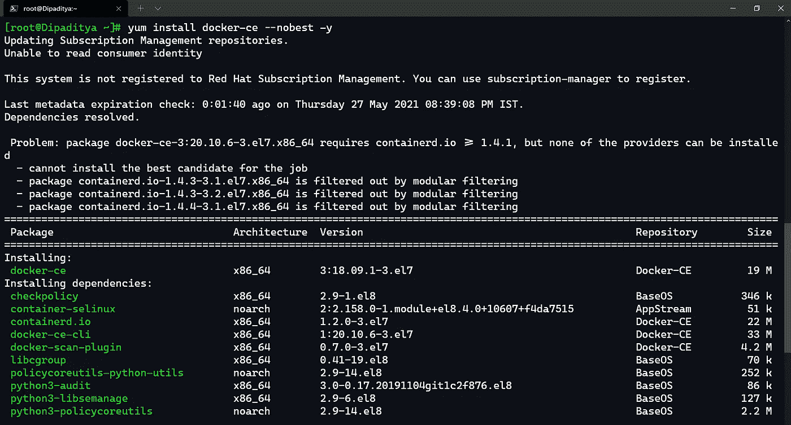

为了安装 Docker 社区版，我们将编写以下命令。

> `**yum install docker-ce --nobest -y**`

在 RHEL 8 和 Fedora 中，yum 是包管理器。我们都使用过 nobest 选项，这有助于跳过任何不支持的 Docker 引擎版本。

## 步骤 3:在 RHEL 启用 Docker 服务 8

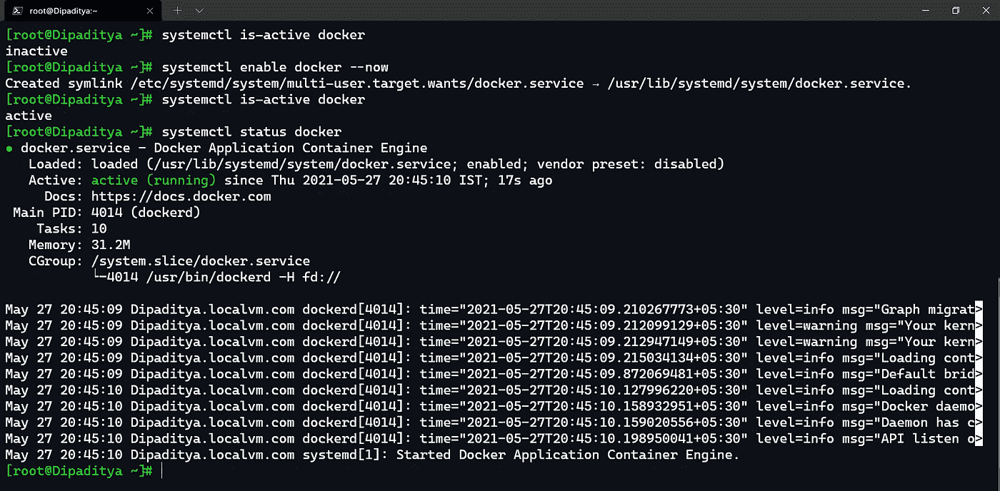

> `**systemctl is-active docker**`

这个命令帮助我们检查 docker 服务是否正在运行。

> `**systemctl enable docker --now**`

这个命令帮助我们启动并启用 docker 服务，这样在重新启动后 docker 服务将对我们可用。

> `**systemctl status docker**`

这个命令帮助我们详细检查 docker 服务的状态。

## 步骤 4:为 Docker 引擎启用防火墙

在 Docker 引擎上启动容器之前，我们必须确保为容器启用了入口和出口流量。

为了做到这一点，我们需要启用伪装。专注于防火墙，我意识到禁用`**firewalld**`似乎可以达到目的，但我不想这么做。在用`**iptables**`检查网络规则时，我意识到切换到`**nftables**`意味着`**iptables**`现在是一个抽象层，只显示了`**nftables**`规则的一小部分。这意味着`**firewalld**`配置的大部分——如果不是全部的话——将在`**iptables**`的范围之外应用。

**长话短说**——为了工作，我必须启用伪装。看起来`**dockerd**`已经通过`**iptables**`做到了这一点，但显然，这需要专门为防火墙区域启用，以便`**iptables**`伪装工作。

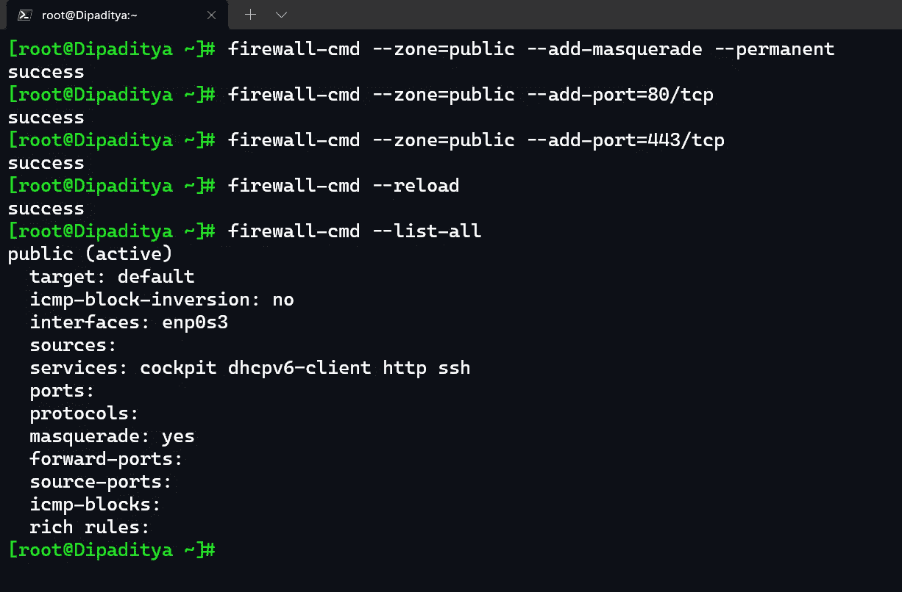

## 步骤 5:提取最新的 Centos Docker 图像

> `***docker images***`

这个命令帮助我们检查本地系统中的图像。

> `***docker pull centos:8***`

**CentOs 版本 8** 是[**docker hub**](https://hub.docker.com/)**中 CentOs 的**最新图像**。我们将从公共存储库中提取图像。**

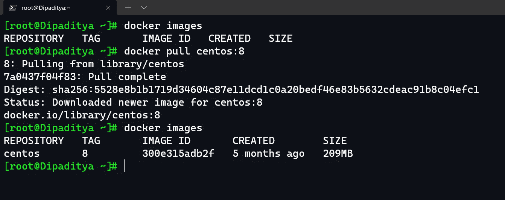

## 步骤 6:创建 Docker 容器

现在，在`**docker ps**` 命令的帮助下，我们看到容器是什么运行状态。

> `**docker create -it --name MLOps centos:8 /bin/bash**`

上面的命令创建了一个名为 CentOs version 8 的 MLOps 的容器，提供了一个交互式 bash 终端。在它被创建之后，我们需要启动我们的容器，为此，我们将编写下面的命令。

> `**docker start MLOps**`

启动 MLOps 容器后，我们需要使用交互式终端，为此，我们需要使用以下命令。

> `**docker attach MLOps**`

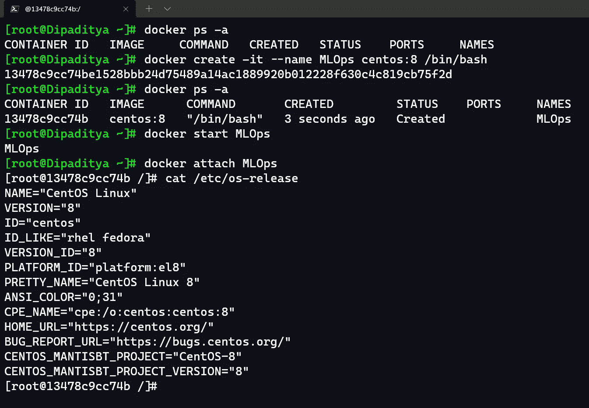

现在我们在容器内部，我们可以看到操作系统是“centos”，版本是“8”。

## 步骤 7:安装 Python 和 Git

> `**yum install python38 git**`

这将在 outr 系统中安装 python-3.8 和最新的 git 软件。

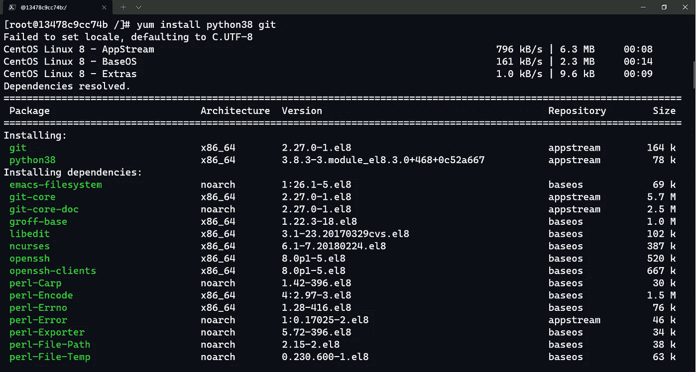

## 步骤 8: Git 克隆 Python 代码

我们将克隆 GitHub 存储库，在那里我们的 Python 代码是可用的。

 [## dipadtiyadas/salary predictionappondocker

### 通过在 GitHub 上创建一个帐户，为 dipadtiyadas/salary predictionappondocker 开发做出贡献。

github.com](https://github.com/DipadityaDas/SalaryPredictionAppOnDocker) 

> `**git clone <Repository_URL>**`

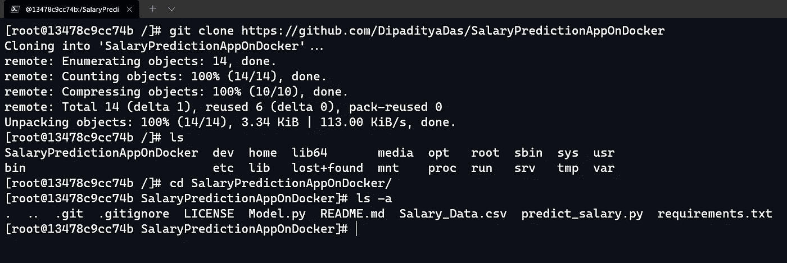

## 步骤 9:创建我们的线性回归模型

我们创建了一个名为 **Model.py.** 的 python 程序

Created by Dipaditya Das

首先，我们安装了程序正确运行所需的所有库，没有任何错误。

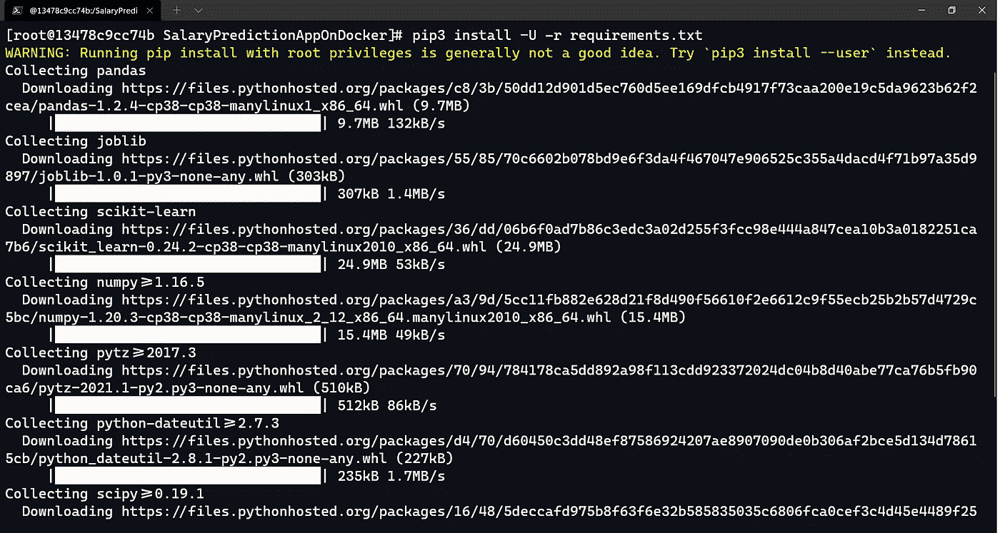

现在我们将使用 Python3 解释器来执行我们的程序。

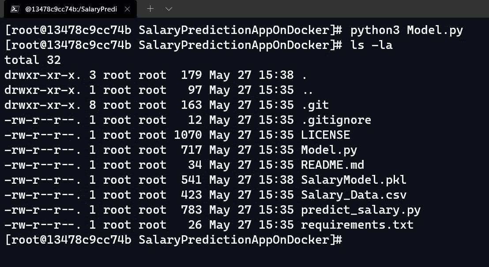

执行后，我们会看到一个名为**“salary model . pkl”**的 pickle 文件已经被创建。

在“ **predict_model.py”中，**我们已经加载了 pickle 文件，提供了用户输入，并以适当的方式打印了结果。执行后是这样的。

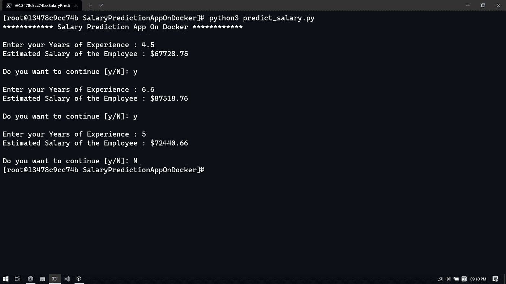

所以我们最终部署并运行了我们的模型。

## 奖金

我们可以使用下面的命令停止容器。

> `**docker stop MLOps**`

我们可以使用下面的命令删除容器。

> `**docker rm <container_id_MLOps>**`

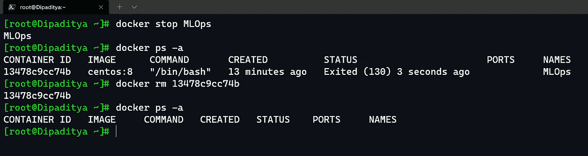

我要感谢 **Vimal Daga Sir** 给了我们一个重要的课题去研究和实践，并弄清楚这个架构的重要性。

> **“阅读……心灵的假期……”—戴夫·巴里**