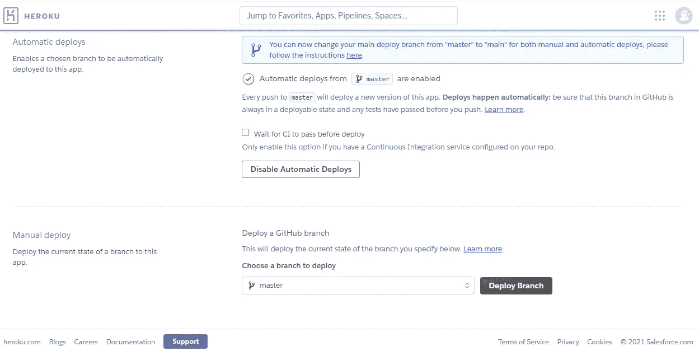
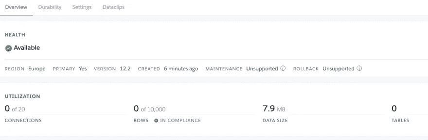
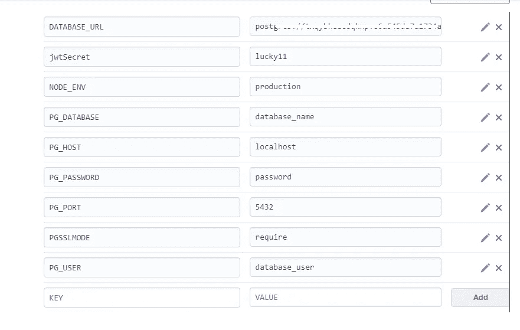
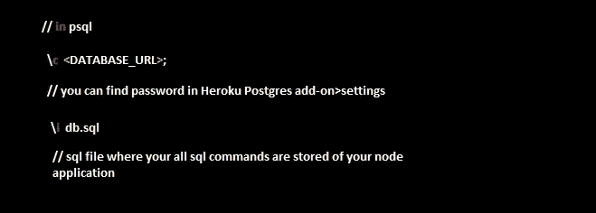

# 将节点应用程序和 Postgresql 数据库部署到 Heroku

> 原文：<https://medium.com/geekculture/deploy-node-application-and-postgresql-database-to-heroku-6efaa6be3b9b?source=collection_archive---------7----------------------->


Heroku Postgres

在全栈开发中，部署全栈应用是一件非常棒的事情。由于部署在 Heroku 上起初看起来令人生畏，我把部署一个工作的全栈应用需要遵循的所有步骤放在一起。这是一件迅速而直接的事。

*创建 PostgreSQL 数据库和设置 express 应用程序超出了本博客的范围。*

你应该做的第一件事是在。env 文件，基本应用程序所需的变量如下。

```
jwtSecret=lucky11
PG_USER= postgres_user
PG_PASSWORD= password
PG_HOST= localhost
PG_PORT= 5432
PG_DATABASE= database_name
NODE_ENV=development
```

*确保你的****git ignore****the。env 文件，因为保持这些环境变量打开和可访问是一件不安全的事情。*

现在，你应该检查的下一件事是你**正确地**编写了你的数据库连接程序，下面的代码举例说明了一个合适的**数据库连接程序**，用于在开发和生产中运行全栈应用。

```
const Pool = require("pg").Pool;
require("dotenv").config();const isProduction = process.env.NODE_ENV === "production";const connectionString = `postgresql://${process.env.PG_USER}:${process.env.PG_PASSWORD}@${process.env.PG_HOST}:${process.env.PG_PORT}/${process.env.PG_DATABASE}`;const pool = new Pool({
    connectionString: isProduction ? process.env.DATABASE_URL : connectionString,
    ssl: {
        rejectUnauthorized: false,
    },
});
module.exports = pool;
```

*connectionString 变量是将数据库连接到应用程序的变量，所以要确保连接字符串的拼写正确。*

如果你想在**开发中运行你的应用程序，**注释掉 **SSL** 代码块。因为开发服务器不支持 SSL。

```
ssl: {
        rejectUnauthorized: false,
    },
```

但是一定要为生产添加 SSL，这是用户在 Heroku 部署中最容易出错的地方。

需要注意的一件重要事情是，在部署之后，Heroku 将运行**“开始”脚本**，所以要确保你在 **package.json** 中正确地添加了它

```
"script":{
 "start":"node index.js"
}
```

您必须添加的另一个文件是**Procfile.txt .**web:node index . js 将这一行添加到 procfile . txt

现在你已经在代码编辑器中准备好了，剩下的就是将它部署到 Heroku 并设置 Heroku



heroku

注册/登录到[*www.heroku.com*](http://www.heroku.com)，进入新建>创建新应用开始。

添加应用名称和地区，并点击**创建应用。**

在部署方法中，选择 **Github** ，搜索您想要选择的 repo 名称，同时在同一个选项卡上点击**启用自动部署**。完成上述操作后，点击手动部署部分的**部署分支**。

正确完成上述步骤后，您将看到以下消息。


heroku

现在我们需要将 Postgresql 数据库添加到 Heroku。

为此，转到“**资源**标签搜索 **Heroku-Postgres** 附加组件，然后选择**爱好开发免费**版本的免费东西，然后点击**供应**按钮。

返回**资源**选项卡，点击 **Heroku Postgres** ，您将能够看到下图，其中表格显示为 0。



**连接到数据库。**

Heroku 将生成 **DATABASE_URL** ，您也可以使用它来连接 Heroku 生成的数据库。

这可以在**设置**和**显示配置变量**中找到。

**重要** : *在 Heroku* ***设置*** *选项卡>点击* ***显示配置变量*** *现在将所有的环境变量添加到 Heroku 中。* ***env 文件*** 。

您必须添加一个新的环境变量并更改一个现有的环境变量，即**NODE _ ENV = production**
并添加 **PGSSLMODE=require**



environment variables in Heroku

现在转到您的 **psql** 并运行以下命令。



run in psql