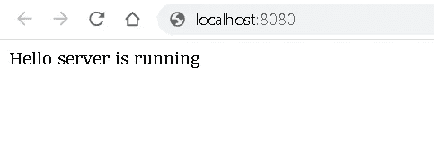
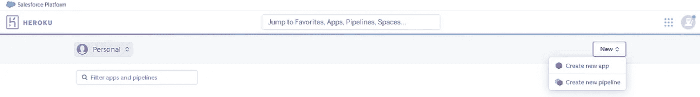
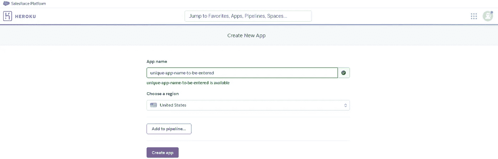
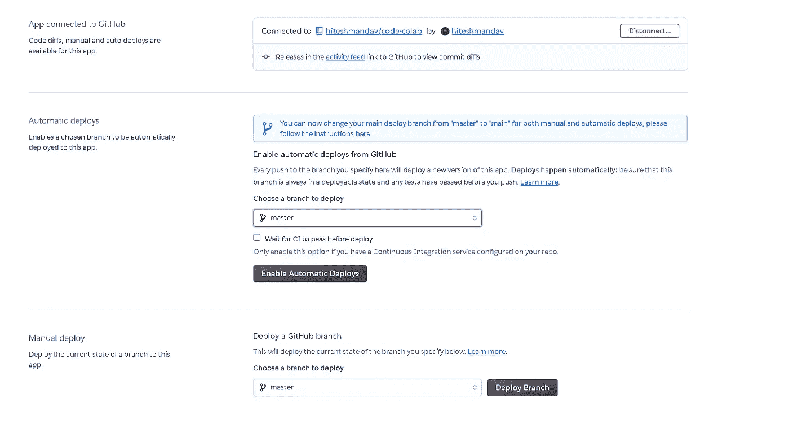

# 如何轻松部署您的节点。Heroku 上的 Js 应用程序

> 原文：<https://medium.com/geekculture/deploy-node-applications-on-heroku-a89ed51e0a34?source=collection_archive---------0----------------------->


作为初学者，我们通常会构建多个项目和应用程序，但这只是难题的一半。我们还希望全世界都能访问这些应用程序，无论是为了演示，潜在的招聘人员，还是只是为了让大家使用和测试我们新的疯狂想法。为此，我们需要在公共服务器上部署这些应用程序。

本文将向您展示如何轻松地将您的第一个 Node.js 应用程序部署到 Heroku。

这不是一个帮助您学习 Node.js 的教程，它假定您已经完成了开发并准备好部署。然而，我们将从启动和部署开始设置一个基本的 node js 项目。

本教程将涵盖:

*   创建示例 Node.js 应用程序
*   部署示例 Node.js 应用程序
*   使用 Heroku CLI 部署
*   使用 Git 自动部署

假设您的机器上安装了 node.js，请按照下面的步骤操作。

## 创建示例 Node.js 应用程序

创建一个文件夹，打开 cmd 进入你创建的文件夹，运行`npm init`这将创建一个`package.json`文件。它会提示您输入一些内容，包括应用程序的名称、版本等。对于这个例子，我们将接受所有的默认值。

现在您将拥有一个 package.json 文件。

```
//package.json
{
  "name": "first-node-app",
  "version": "1.0.0",
  "description": "my first nodejs express app",
  "main": "index.js",
  "scripts": {
    "test": "echo \"Error: no test specified\" && exit 1"
  },
  "author": "",
  "license": "ISC"
}
```

现在运行下面的命令来安装 express，因为我们将使用这个中间件来构建我们的服务器。

```
npm install express --save
```

现在在你的 package.json 脚本对象里面添加`“start”: “node index.js”`。

现在创建一个 server.js 文件并添加下面的代码。

```
const express = require('express');
const app = express();

app.get('/', (req, res) => {
  res
    .status(200)
    .send('Hello server is running')
    .end();
});

// Start the server
const PORT = process.env.PORT || 8080;
app.listen(PORT, () => {
  console.log(`App listening on port ${PORT}`);
  console.log('Press Ctrl+C to quit.');
});
```

现在，您可以通过运行以下命令在本地测试这个应用程序

```
npm start
```



在你的项目中创建一个文件并命名为 **Procfile** 并复制下面一行。这将告诉 *Heroku 服务器如何执行我们的项目*。

`web: node server.js`

## 部署示例 Node.js 应用程序

在这里创建一个免费的 Heroku 账户[。如果您已经有帐户，请登录并转到仪表板。](https://signup.heroku.com/)

这里你需要创建一个新的应用程序。



并输入唯一的应用程序名称



## **使用 Heroku CLI 进行部署**

你需要在你的机器上安装 Heroku CLI，你可以从[这里](https://devcenter.heroku.com/articles/heroku-cli)安装，并通过运行`heroku --version`来验证安装。

如果您在上述安装方法中遇到任何问题，您可以运行`npm install -g heroku`命令，假设您已经安装了 npm 和节点，然后尝试再次验证。

现在，一旦安装成功，您需要转到您的服务器端项目，并在终端中运行下面的命令。

```
heroku login
```

这将把您重定向到浏览器，或者在终端中提示您输入 Heroku 登录凭证。一旦您成功登录，您就可以部署您的代码了。

现在，初始化工作目录中的 git 存储库，并使用第二个命令和您的应用程序名称将其连接到 Heroku 应用程序。

```
$ git init
$ heroku git:remote -a unique-app-name-to-be-entered
```

现在，您可以使用以下命令添加并提交到 Heroku 主分支。

```
$ git add .
$ git commit -m "your commit message"
$ git push heroku master
```


完成后，您将能够在 Heroku 应用概述的最新活动部分看到构建和部署成功。现在，您可以单击顶部的 app 按钮来查看您的节点应用程序。

## **使用 Git 自动部署**

现在部署完成了，但是无论何时你在代码中做了修改，你都必须把你的修改推送到 Heroku git 来部署你的修改。你很可能会有一个 git hub 存储库，在那里你已经提交了你的代码，我们不想每次都做这些额外的工作。

因此，为了处理这个问题，Heroku 提供了一个解决方案，你可以将 GitHub 存储库连接到 Heroku 应用程序，每当你将更改推送到 Github 时，Heroku 就会自动进行部署。

要做到这一点，你可以去你的 Heroku 应用程序。在 deploy 部分，您需要选择第二个选项 GitHub。(如果你的 Heroku 账户没有连接到 git hub，你必须登录 GitHub 并连接你的 Github 账户。)并且您将能够看到一个输入框，用于搜索与您的 git hub 帐户相关联的存储库。你可以找你的回购，点击连接。


一旦连接了存储库，您可以选择**enable automatic deployments**，现在一切都完成了，只要有推送到您的 Github repo，Heroku 就会自动部署更改。



感谢您的阅读，如果您遇到任何问题或想建议更好的方法，请在下面做评论。