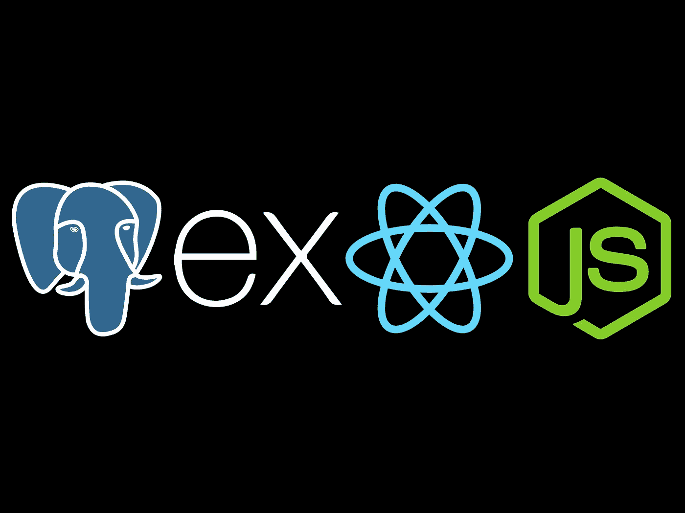
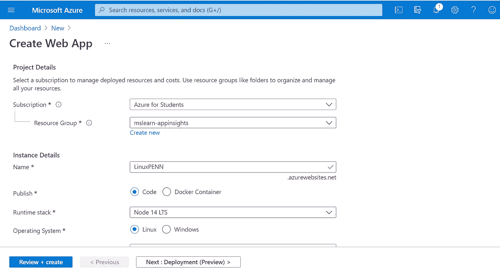
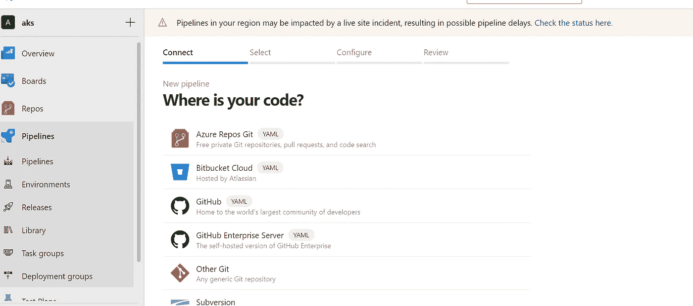
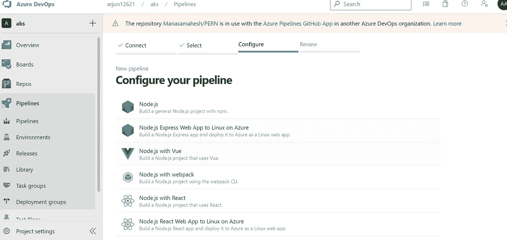
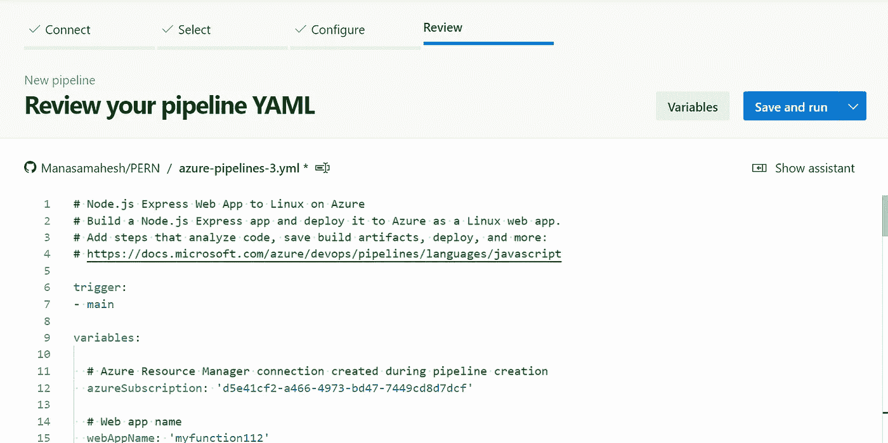
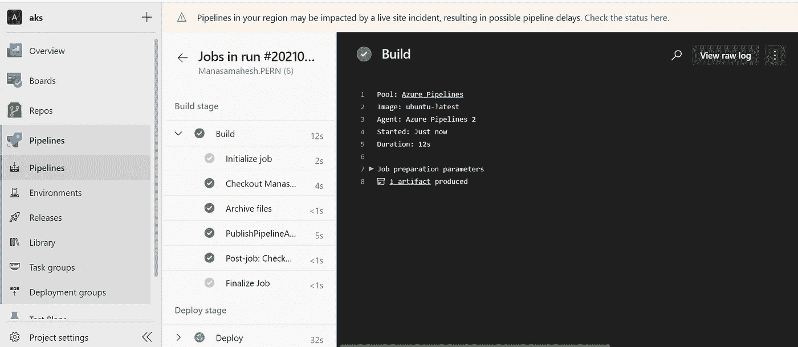
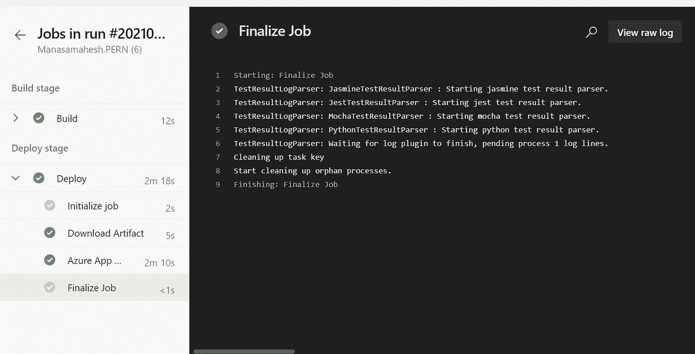

# 在 Azure Linux 虚拟机中部署 PENN Stack Web App

> 原文：<https://medium.com/geekculture/deploy-penn-web-app-in-azure-linux-virtual-machine-bd790b1bc487?source=collection_archive---------17----------------------->

## PENN 是其组成部分的缩写:Postgres、Express、Next js 和 Nodejs。



PENN 由以下技术组成:

Postgres : 它是对象关系数据库，提供创建函数、触发器、继承和函数重载等功能。

**Express**:Nodejs 的后端 web 应用框架。

**Next JS :** 一个构建图形用户界面的前端 java 脚本库，构建在 React JS 之上。

**Nodejs:** 用于执行 java 脚本源代码的 java 脚本运行时环境。

**初始设置:**

找到 [**PENN stack**](https://github.com/Manasamahesh/PERN) 的完整代码，这是 PENN stack 的示例项目。

在开始使用 PENN stack 之前安装一些需求。检查节点是否已安装

> `$ node -v`

这将显示我们系统中已安装的节点版本。如果不存在，则安装[节点 js](https://nodejs.org/en/download/) 。

现在，我们将使用 create-next-app 创建基本的 next js-project，npx 或 yarn 命令可用于创建它。

> `$ npx create-next-app project name or yarn create-next-app project name`

上面的命令用给定的项目名创建文件夹，模板是 basic nextjs 和所有安装的依赖项。

转到这个目录。

> `$ cd project name`

通过运行以下命令启动开发 web 服务器:

> `$ npm start`

**后端文件夹:**

创建新的文件夹后端并更改为后端文件夹:

> `$ mkdir backend`
> 
> `$ cd backend`

我们创建 package.json 并安装依赖项。

> `$ npm init -y`
> 
> `$ npm install express cors pg`
> 
> `$ npm install -g nodemon`

CORS 允许远程主机访问资源，pg 使 Nodejs 与 postgres 数据库交互。nodemon 工具，通过在节点文件发生更改时重新启动服务器来帮助基于 Nodejs 的应用程序。

在后端目录中创建 index.js 作为服务器，将拥有 CORS、express、端点并创建端口 5000 进行监听。

现在我们可以通过在 index.js 中添加下面一行来连接到我们的数据库

> `const pool = require (“pg”).pool;`

**配置数据库连接:**

> `const pool = new pool({ user:”postgres”, password:”WE1", host:”localhost”, port: 5432, database:”pernStack” });`

**创建基础数据库:**

创建数据库 PERN 堆栈以保存从用户界面接收的数据。

> `create Database pernStack;`
> 
> `create Table pernTable( pern_id SERIAL primary key description VARCHAR(255));`

**前端:**

Next js 为 React js 的[缺点](https://nextjs.org/learn/basics/create-nextjs-app)提供解决方案。下一个 js 页面是从`.js`、`.jsx`、`.ts`或`.tsx`导出的 React 组件。文件名映射到目录中页面的路由路径。例如，如果我们创建的 page/intro.js 导出了一个如下所示的 React 组件，那么它在 endpoint /intro 中是可用的。

```
function intro() {
  return <div>Hello World</div>
}

export default intro
```

React 组件显示从数据库中获取的详细信息，还显示了一个用户界面，从中可以获取详细信息并保存到数据库中。发生变化时，React 将重新渲染。

```
$ npm start
```

**通过 Azure 管道部署到 Azure Linux 机器:**

Azure Devops 提供完整的项目生命周期—从规划到测试。

Azure Devops 由以下项目服务组成:

1.  Azure Board- 它是一个用于跟踪项目中任务的服务，同时也为 scrum 和看板提供支持。
2.  Azure Repos - 是 Azure 提供的版本控制服务
3.  **Azure pipeline-** 它是用于构建和部署项目的管道服务
4.  Azure 测试计划- 它提供了测试已部署项目的详细计划
5.  **工件-** 它存储用于管道部署的包。

**创建 Linux Web 应用:**

1.  从 azure dashboard 创建资源。
2.  选择 web 应用程序并选择 Linux 服务器，然后选择发布为代码。
3.  选择运行时作为节点。
4.  操作系统为 Linux，检查并创建它。
5.  现在在 Linux 服务器内部配置 [postgres 数据库](https://www.postgresqltutorial.com/install-postgresql-linux/)。
6.  创建数据库和创建表。

> `*create Database pernStack;*`
> 
> `*create Table pernTable( pern_id SERIAL primary key description VARCHAR(255));*`



**Azure devo PS 的初始设置:**

1.  登录 [Azure Devops](https://azure.microsoft.com/en-in/services/devops/) 。
2.  创建新项目。

选择 Azure 管道并创建新管道，选择 GitHub。



repository selection



configure pipeline type



review pipeline save and run

**后端部署管道:**

1.  为 Azure 管道提供访问存储库的授权。
2.  现在选择的资源库已经从 GitHub 中列出。
3.  配置您的管道以构建 Node JS App 并将其部署到 Azure Linux web app 中。
4.  选择订购详情并登录帐户。
5.  选择您的帐户中已有的 Linux 服务器，如果没有创建 Linux 服务器，则按照步骤创建服务器。

> 转到仪表板并创建资源，选择 web 应用程序，然后提供带有节点的 Linux 服务器的详细信息，单击查看并创建。

9.现在在回顾阶段，你会发现 azure 管道配置的 yaml 代码，在这里我们可以添加或删除要在 Linux 服务器中执行的内联脚本的行。

10 .单击保存并运行，它会将 yaml 提交到 GitHub 存储库中。

11.现在开始构建后端，并成功部署。

**前端部署管道:**

1.  为 Azure 管道提供访问存储库的授权。
2.  现在选择的资源库已经从 GitHub 中列出。
3.  配置您的管道以构建 React JS 应用程序，并将其部署到 Azure Linux web 应用程序中。
4.  选择订购详情并登录帐户。
5.  选择部署了后端服务的 Linux 服务器。
6.  现在在回顾阶段，你会发现 azure 管道配置的 yaml 代码，在这里我们可以添加或删除要在 Linux 服务器中执行的内联脚本的行。
7.  点击保存并运行，它会将 yaml 提交到 GitHub 库。
8.  现在开始构建后端，并成功部署。



pipeline build



pipeline deployment