# 将 React 应用部署到 Firebase

> 原文：<https://medium.com/geekculture/deploy-react-app-to-firebase-43c9651c2417?source=collection_archive---------12----------------------->

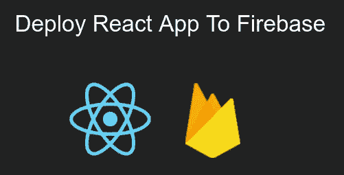

Deploy React App To Firebase

**入门**

今天，我们将把 React 应用程序部署到 Firebase。

要部署我们的 React 应用程序，首先我们应该有一个 React 应用程序，并创建了一个 firebase 项目。

要创建一个 firebase 项目，你可以点击这个[链接](https://console.firebase.google.com/)。

请选择“添加项目”并继续使用该表单，从上面的[链接](https://console.firebase.google.com/)创建一个 firebase 项目。

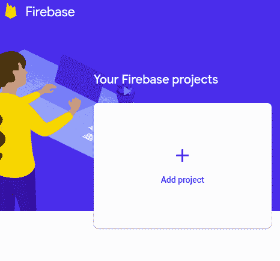

Add firebase project

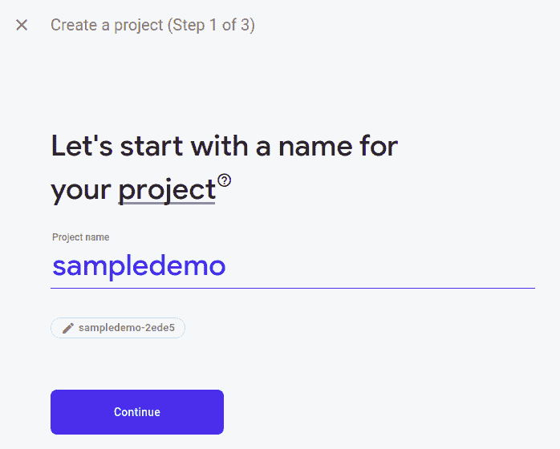

Type firebase projects name

在这里，我选择了项目名作为 firebase 上的 sampledemo。

> React 应用程序和 firebase 项目的名称可以不同。

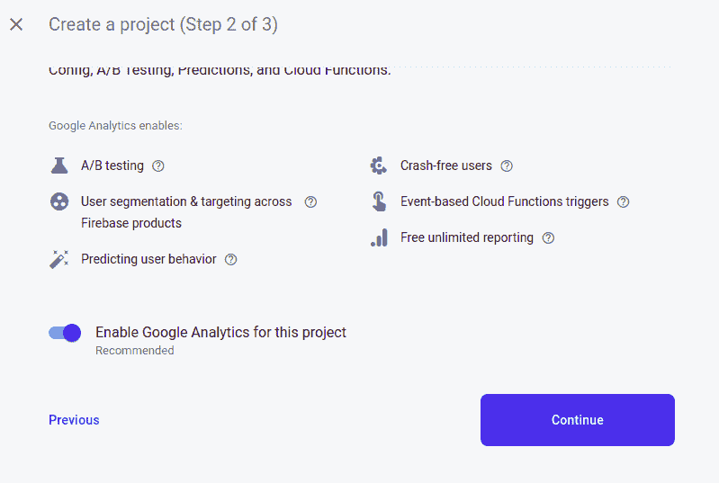

Selection of Google Analytics

对于谷歌分析，你可以选择启用或不启用。在这里，我将启用它。

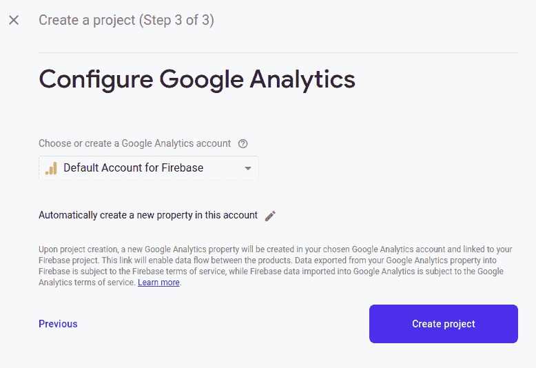

启用谷歌分析后，你应该选择谷歌分析的帐户。在这里，我选择默认的 firebase 帐户。

然后 google 会创建你的 firebase 项目。

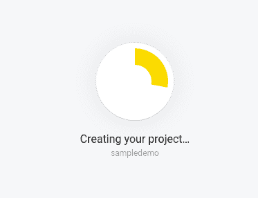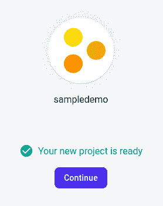

选择继续，您将被定向到您的项目仪表板。

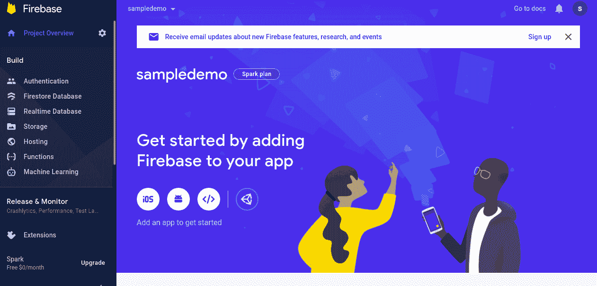

Firebase project dashboard

你可以随时通过这个[链接](https://console.firebase.google.com/)访问你的 firebase 项目。

现在，让我们创建一个示例 React 应用程序。

我希望您已经安装了 React 应用程序所需的包，如 npm 和 yarn 包。

我将使用纱包。

打开您的终端或 powershell，导航到您想要的目录并创建一个名为 sampledemo 的 React 应用程序。

```
$ yarn create react-app sampledemo
```

在成功创建 react 应用程序之后，进入您的项目目录(sampledemo)。

然后第一次运行你的应用。

```
$ yarn start
```

您将被定向到浏览器中的以下选项卡。

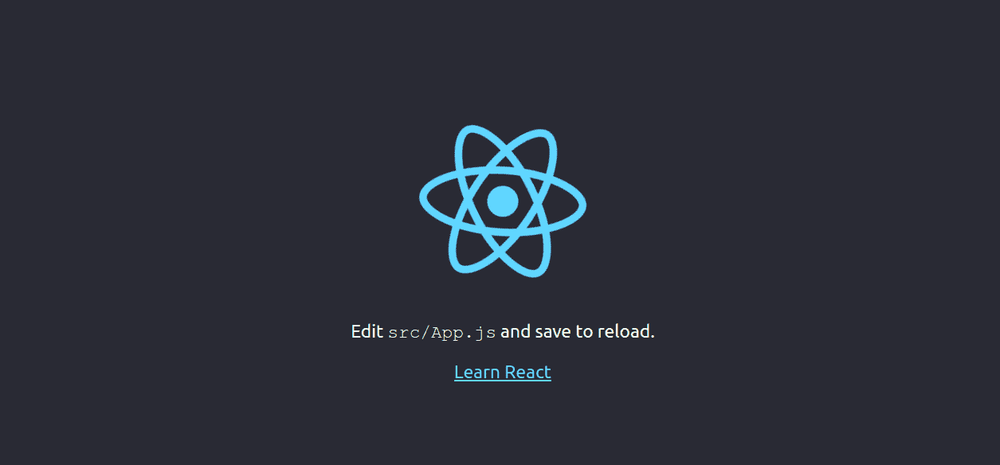

React App

到目前为止，我们已经建立了一个 react 应用程序和一个 firebase 项目。

通过终端中的 *Ctrl+c* 停止 react 应用程序。

**设置 Firebase CLI(命令行界面):**

我们需要通过以下方式安装 firebase CLI 工具:

```
$ yarn add firebase-tools
```

运筹学

```
$ npm install -g firebase-tools
```

也可以跟着这个[链接](https://firebase.google.com/docs/cli)。

安装后，我们应该登录到我们的 firebase 帐户。

```
$ firebase login
```

您将被重定向到浏览器进行身份验证。

**消防基地部署:**

现在，让我们初始化 firebase 项目。

```
$ firebase init
```

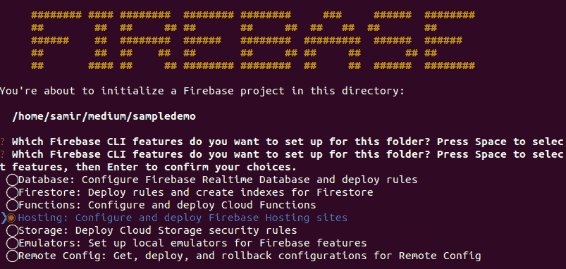

Firebase Project Initialization using Firebase CLI

在这里，我们将看到如上图所示的内容。

我们必须选择我们的选择，现在是托管。用上/下箭头将光标移动到主机，按空格键选择，然后按*进入*。

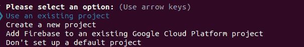

然后选择*使用现有项目*并按*键进入*。

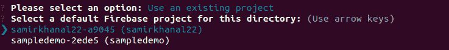

这是你的 firebase 项目列表。我将选择名为***sample demo-2e de 5***的项目，然后按*键进入*。

然后按照下面的图像:

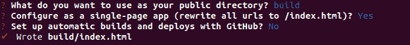

之后，我们的项目设置就完成了。

我们现在将构建项目。

```
$ yarn build
```

这将把生产文件捆绑到项目目录中名为 build 的目录中。

现在，将项目部署到 firebase:

```
$ firebase deploy
```

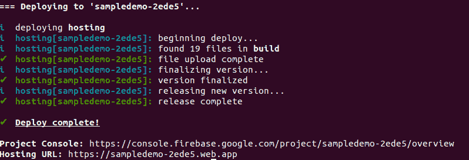

它还会给我们主机的网址。

你可以在这里查看我托管的 sampledemo React 应用[。](https://sampledemo-2ede5.web.app)

您也可以从[这里](https://console.firebase.google.com/)查看 firebase 项目仪表板的 url，并在左侧选择托管内部构建。

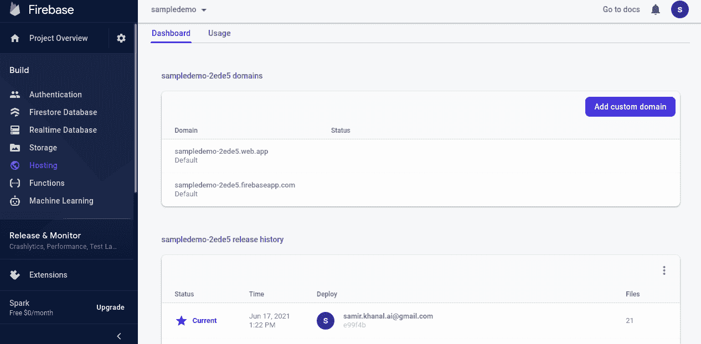

Firebase project dashboard with projects hosting overview

在这里，你可以看到你的网址，你部署的版本，你也可以添加你的自定义域。

> 我们也可以先构建我们的项目，然后初始化 firebase 项目。但是，在初始化 firebase 项目时，我们必须选择不替换构建目录中的 index.html**文件。**

**参考文献:**

**[**Firebase CLI 参考**](https://firebase.google.com/docs/cli)**