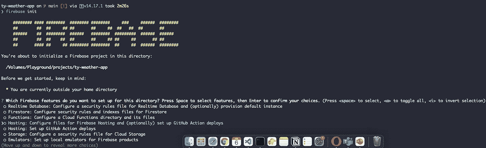
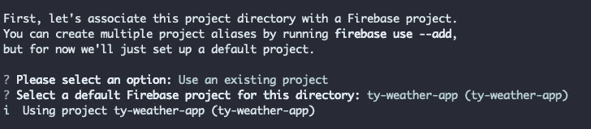
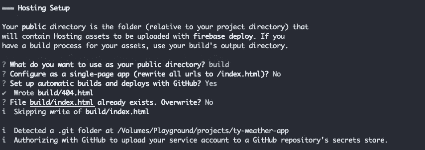
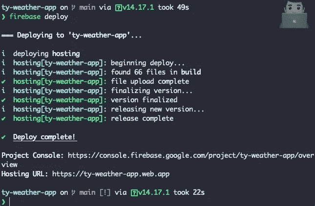

# 将 React 应用程序部署到 Google Firebase🔥

> 原文：<https://medium.com/geekculture/deploy-react-application-to-google-firebase-7d46c635d526?source=collection_archive---------44----------------------->

让我们开始将 React app 部署到 firebase。

# 第一步**第二步**

你必须建立一个 firebase 项目。你可以从 [firebase 控制台](https://console.firebase.google.com/)设置一个 firebase 项目。


The firebase project which I have created

# 第二步

现在我们需要准备好 React 应用程序进行部署。

```
npm run build
```

通过运行上面的命令，我们可以用我们的应用程序的生产版本创建一个`build`目录。

# 第三步

我们需要配置火焰基地。要用 firebase 托管我们的站点，我们需要 firebase 命令行工具。通过运行以下命令，我们可以在您的计算机上全局安装 firebase CLI。

```
npm install -g firebase-tools
```

# 第四步

好了，现在我们已经在全球范围内安装了 Firebase CLI，现在我们需要登录 Firebase。但为此，我们必须位于 react 应用程序的根目录下。运行以下命令。

```
firebase login
```

如果您没有登录，这将生成一个链接，您可以使用该链接登录 firebase。

# 第五步

登录 firebase 后，我们需要启动项目。用于运行以下命令。

```
firebase init
```



现在你可以看到问题列表。让我们从这个列表中选择以下选项。

托管:为 firebase 托管配置文件，并(可选地)设置 Github 操作部署。


然后选择**使用现有项目**



选择您希望用 firebase 托管的项目。



作为公共目录，选择我们通过运行 ***npm run build 创建的构建文件夹。***

选择是否需要将 firebase 应用程序配置为单页应用程序。我选择了否。

配置完这些设置后，我们就可以开始部署应用程序了。

# 第六步

# 部署到火力基地

只需运行以下命令来部署您的应用程序:

```
firebase deploy
```



现在 firebase 将运行它的部署过程，在完成这个过程后，它会给你一个唯一的 url。

我的情况是:[https://ty-weather-app . web . app](https://ty-weather-app.web.app)

现在，您已经在 firebase 中托管了 react 应用程序。🙌🏻

更多信息请参考 firebase 文档的[托管部分](https://firebase.google.com/docs/hosting)。:)