# 两分钟内将 React/Javascript 应用部署到 Netlify

> 原文：<https://medium.com/geekculture/deploy-react-javascript-app-to-netlify-in-2-minutes-a46b03894f9e?source=collection_archive---------11----------------------->

部署和维护 Heroku、AWS 或 Azure 等应用程序的方式有成千上万种。在本文中，我们将学习如何使用最简单的方法之一 Netlify 部署 React/Javascript 应用程序。Netlify 与 Let's Encrypt 集成，并自动提供、分发和续订您的证书。此外，您的站点或应用程序是用 Netlify 的 true auto SSL 免费设置的。

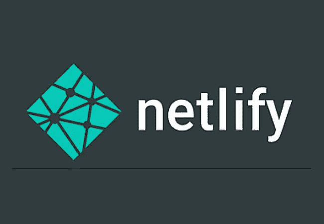

我们可以使用版本控制 Github、Gitlab 或 Bitbucket 来支持将我们的应用程序部署到 Netlify。但是，我们将在本文中重点介绍 Github 版本控制系统。

首先，您应该创建一个 Github 和一个 Netlify 帐户。成功拥有 Github 帐户后，下一步是创建一个新的存储库。

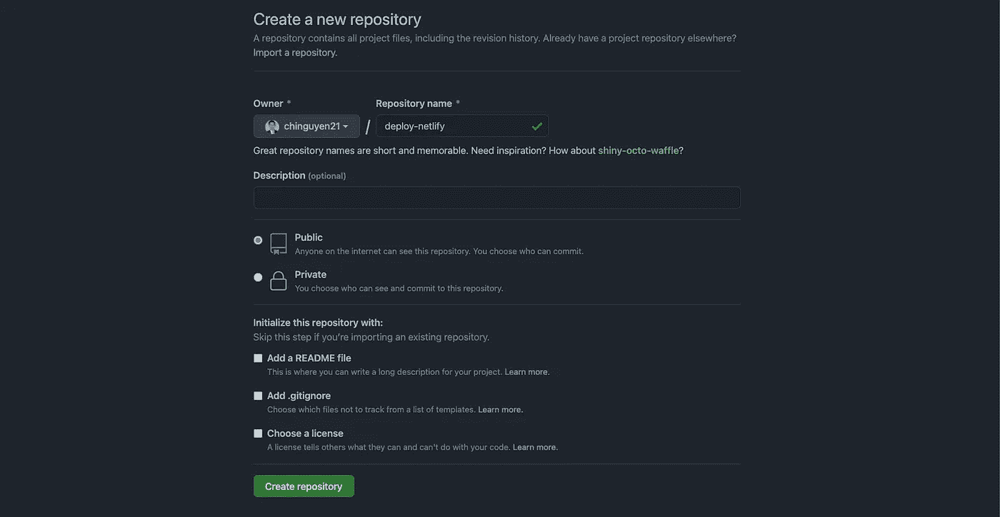

现在转到本地 React/Javascript 应用程序的目录，然后按照下面 Github 上的说明操作。

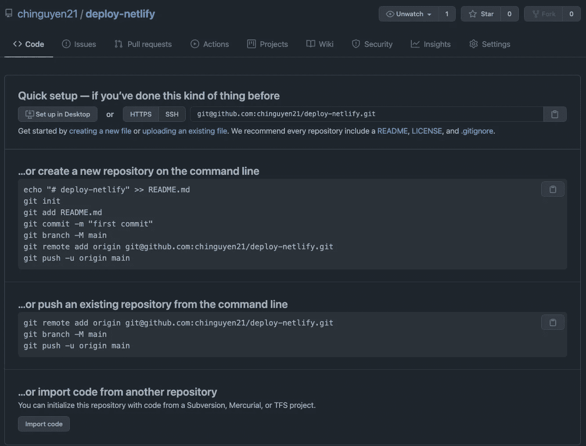

因为你已经有了你的 app，所以记得做" *git add。*“先于” *git 提交*。

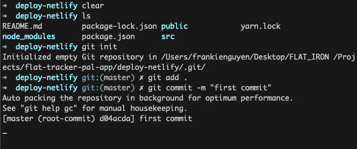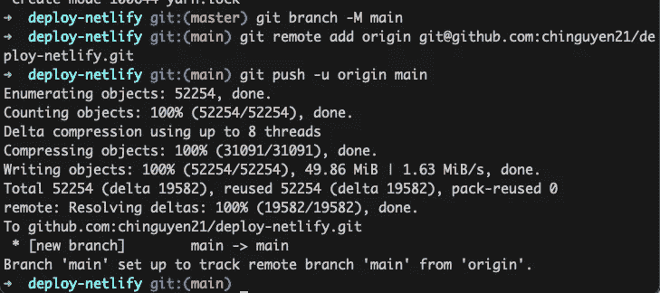

现在在" *git push* "之后，看到它运行到 100%。您的应用程序成功存储在 Github 上。刷新 Github 页面以查看更改。

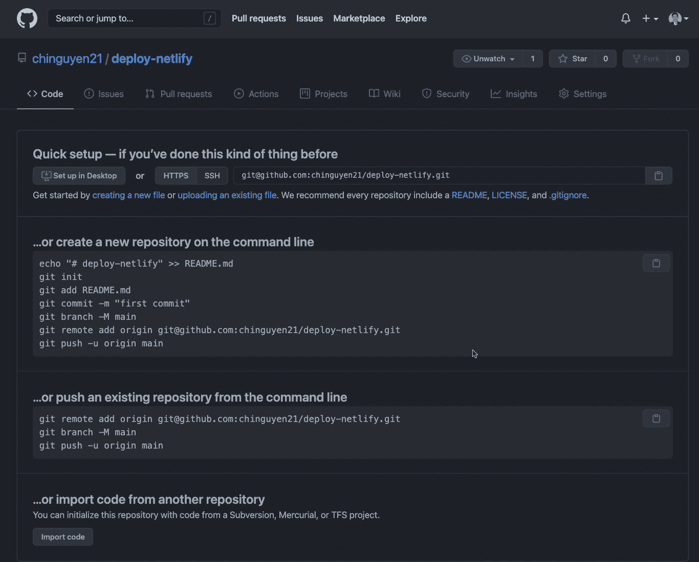

现在去 Netlify 创建一个[新站点](https://app.netlify.com/start)。选择 Github 作为主机。然后向 Netlify 授权您的 Github 帐户。

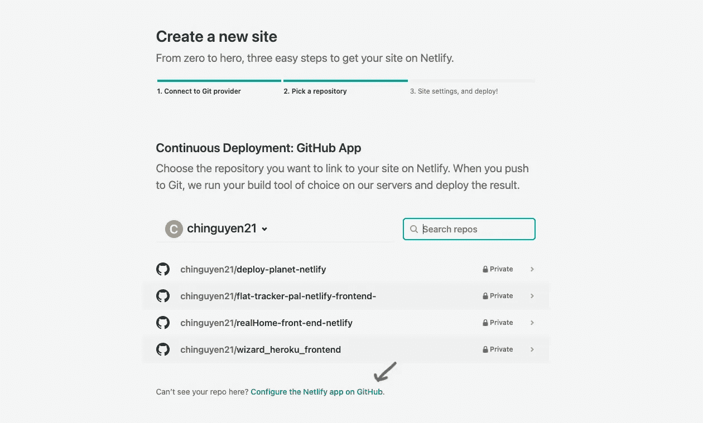

如果找不到刚刚部署到 Github 的 repo，点击“*在 Github 上配置 Netlify app*”。然后点击“*选择仓库*，找到您的回购，点击“*保存*”。

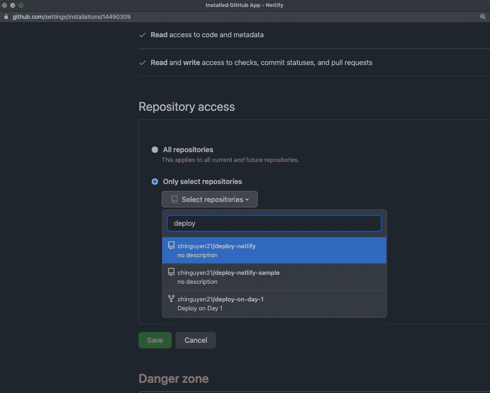

返回 Netlify 并点击“**部署站点**”，然后 Netlify 将为您启动部署流程。

如果您的应用程序没有任何潜在问题，它将在几分钟内部署完毕。但是如果你的应用有如下问题，应该是部署失败。

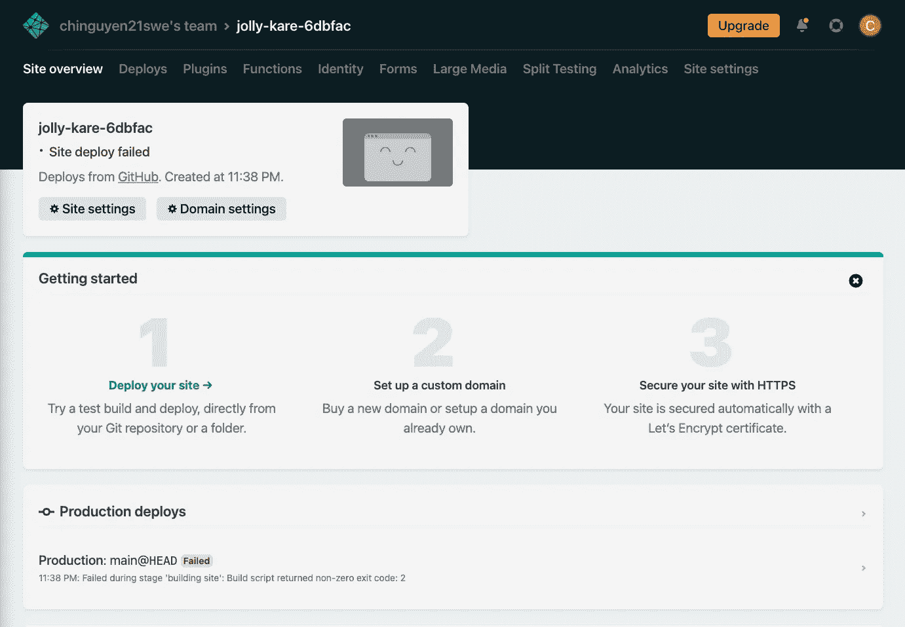

现在使用“ *npm start* ”在本地运行 React 应用程序。然后编辑你的 app，直到看到编译成功的“*！*“消息是这样的。

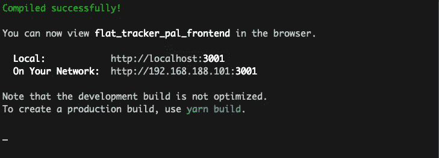

如果您对显示黄色“*编译警告的应用程序做出反应，仍然可能是“*无法部署*”。*“像下面这样:

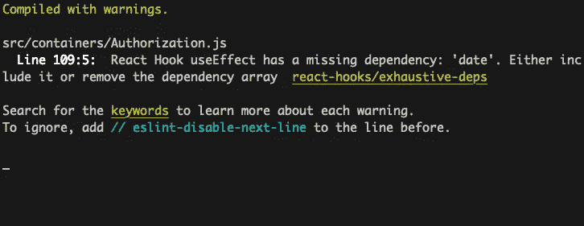

只需按照说明移除 React 应用程序中一些未使用的变量或组件。然后别忘了将 ***添加、提交、推送*** 到你的 Github repo。

然后转到 Netlify，点击“**清除缓存并部署站点**”再次部署您的应用。一旦您成功部署了您的应用程序，它将会是这样的。Netlify 将为您自动生成一个 Netlify 域。您可以通过点击“**站点设置**，然后点击“**更改站点名称**，然后更改您想要但尚未被使用的任何名称，来更改您的个人域名或只是更改网络域名。

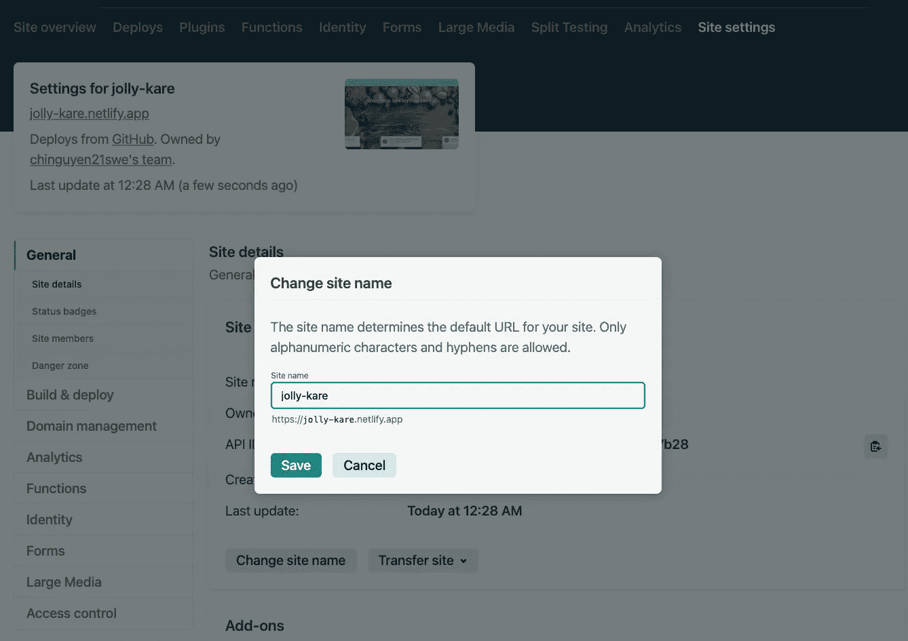

祝贺您成功部署您的应用程序！现在，您的应用程序将存在于您选择的域中。一旦你熟悉了 Netlify，只需 2 分钟就能部署好你的应用。

点击了解更多关于如何将你的 Rail 后端应用部署到 Heroku [的信息。](https://chinguyen21.medium.com/how-to-deploy-a-built-rails-app-with-sqlite3-to-heroku-c5db4febe069)

*快乐编码！*