# 将单一 spa 部署到 AWS Fargate (Docker)

> 原文：<https://medium.com/geekculture/deploy-single-spa-to-aws-fargate-docker-5ee71549274b?source=collection_archive---------8----------------------->

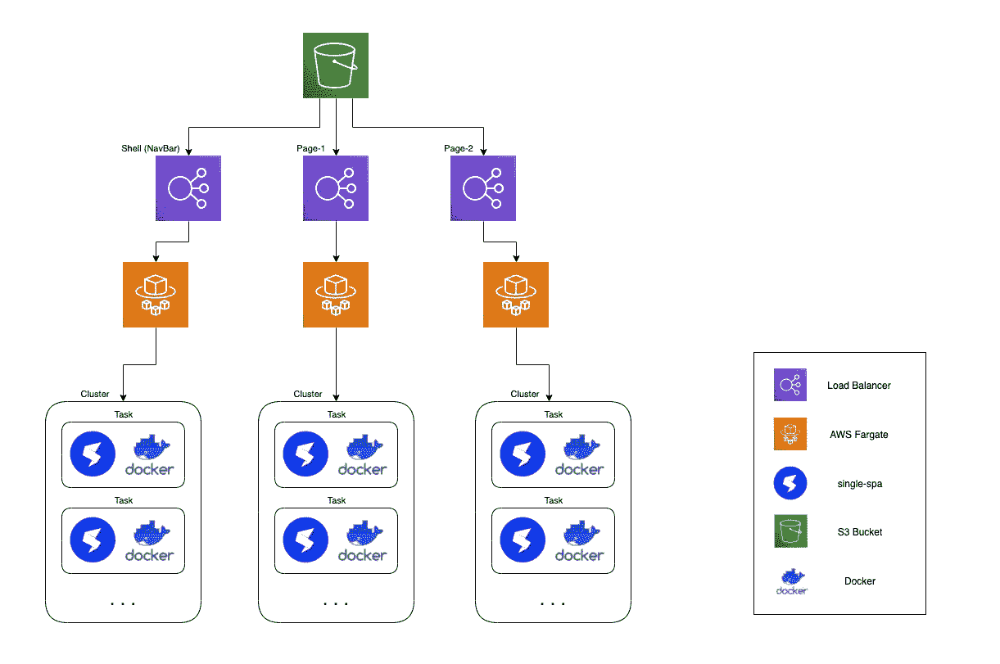

Architecture Diagram

# **概述**

在过去的几周里，我一直在寻求挑战自己，构建一些需要一点故障排除，但仍然与当今世界相关的东西，甚至可能是 web 开发的未来。这时候我偶然发现了[单温泉](https://single-spa.js.org/)。现在首先，你可能会说，那是什么，命名为单个 spa 是不是有点多余，它扩展为单页应用程序？我们会在最后回到这个话题，为了真正理解这个名字的由来，你首先需要使用这个框架。

在我看来，Single SPA 已经改变了我对 web 开发的看法，从一个静态的构建块转变为更多的乐高积木的流体连接。 [React](https://reactjs.org/) 在 2013 年改变了 web 开发的格局，javascript 文件的 JSX 被编译成传统的 HTML/CSS 块，这使得你的 web 应用可以正常工作。这介绍了:

*   一种更快速的网络开发形式
*   易于编写干净/简洁的代码
*   允许开发人员轻松地增加逻辑的复杂性。

所以，你可能知道，我认为 React 很酷。然而，尽管 React 使 web 开发变得更加容易，但它只是一个里程碑。Web dev 随着像 single spa 这样的新想法和概念不断发展，开始再次改变景观。单个 spa 具有强大的能力，能够抢先对微前端的概念做出反应。想象一下，构建三个完全不同的 React 项目，目的是让它们像一个项目一样运行在一个 web 页面上，但是独立开发。这正是单一水疗中心背后的理念。

单一 spa 的工作理念是我们有一个头部外壳，在它下面是我们的微型前端。这是一个强大的工具，尤其是当您开始考虑集中操作时，比如身份验证。现在，我们可以在 shell 级别上共享一个一致的身份验证模式，同时让开发团队能够完全控制彼此隔离的应用程序的开发。

但是，正如我所说的，说得够多了，要明白我们必须建设，那就让我们建设吧。

# 车间

## 克隆和验证您的微前端

我们要做的第一件事是提取我们将在本实验中使用的代码库。我们可以通过将以下 repo 克隆到一个安全的工作区来实现这一点:

```
git clone [https://github.com/oconpa/single-spa-on-Fargate.git](https://github.com/oconpa/single-spa-on-Fargate.git)
```

在这个项目中，您应该可以找到四个子文件夹，标题为:

*   历史
*   navshell
*   科学
*   壳

我们将要部署的项目是一个大学网站的概念验证。该网站将有一个主页，一个科学网页，和一个历史网页。历史和科学页面完全由他们自己的独立团队管理，而 navbar 和外壳则由大学进行顶层管理。这个想法是，每个开发团队应该对他们的页面有自己独立的控制，但总体上他们必须坚持大学的模式(外壳)。

在将我们的应用程序部署到我们的集群之前，我们应该首先验证它们是否能够工作。让我们先测试一下我们的 navshell。我们可以通过进入该文件夹，下载相关的包，并运行一个本地独立服务器来实现。

```
cd navshell
npm install
npm run start:standalone
```

如果运行上述命令没有收到任何错误，您现在应该能够在端口 8080 上点击您的本地主机，以查看类似于下面显示的视图。

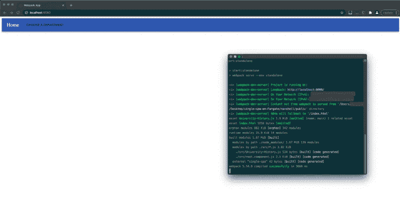

太棒了，我们现在可以渲染我们的基本导航条了。要验证科学和历史页面的工作情况，请对这两个子文件夹重复上述步骤，检查端口 8080 以确保它们能够正确呈现。

一旦您验证了所有网站的工作，我们现在可以继续部署他们。

## 部署您的微前端

我现在将向您展示如何为 navbar 部署微前端。在这一部分结束时，你必须对历史和科学页面重复这些步骤。

首先，因为我们正在使用 docker，所以我们需要检查我们是否安装了它，您可以在您的终端中使用以下命令来检查:

```
docker --version
```

如果安装了 docker，该命令应该返回一个版本，否则从[这里](https://docs.docker.com/get-docker/)安装。

一旦安装完毕，你需要登录到 [**AWS 控制台**](https://aws.amazon.com/console/) 并导航到**弹性容器注册(ECR)** 服务。在那里，选择左边的存储库选项，然后**创建存储库。**

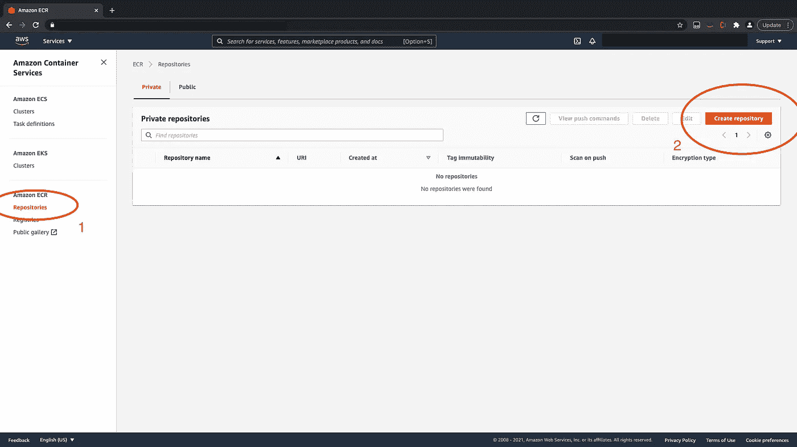

给你的存储库起一个你自己选择的名字，我选择了【navbar >】创建存储库。

现在，您的存储库应该已创建，并可从 ECR 存储库页面查看。准备就绪后，选择新创建的存储库，并选择服务右上角的**查看推送命令**(见下文)。

> 确保您安装了 AWS cli [并配置了](https://docs.aws.amazon.com/cli/latest/userguide/install-cliv2.html)和来与您的 AWS 帐户对话。

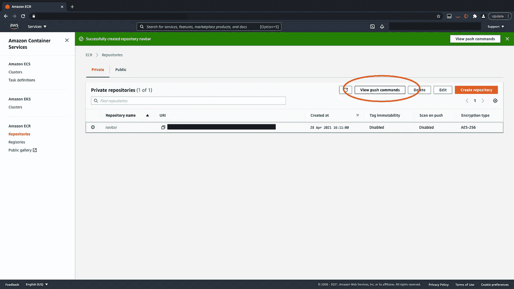

在本地终端中运行这些命令来构建 docker 并将您的映像上传到 ECR。

一旦映像在 **ECR** 中，我们现在可以设置我们的 **Fargate 集群，**但是首先，我们需要设置我们的负载平衡器。我们的负载平衡器将用于向互联网公开我们的集群，我们将为我们的每个集群执行此操作。

导航到 **EC2 服务**。

在那里，滚动到左侧菜单的最底部，你会在**负载平衡下找到**负载平衡器**。**

然后，您需要选择**创建负载平衡器>应用程序负载平衡器。**

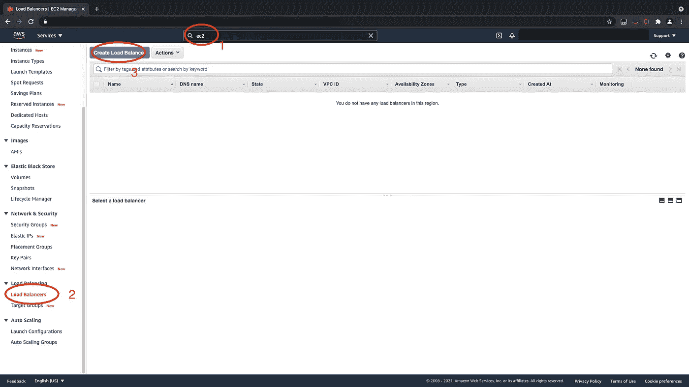

为您的负载平衡器命名，并选择您选择的 VPC 下所有可用的子网。负载平衡器必须面向互联网并监听端口 80 (HTTP)。**下一个**

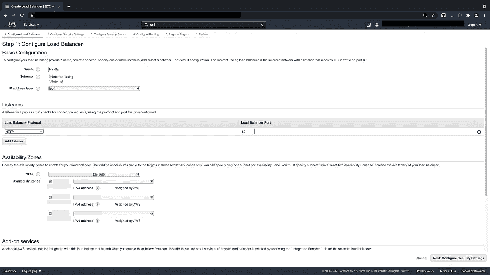

在**配置安全设置**页面，点击**下一步。**

创建一个新的安全组，确保它对端口 80 (HTTP)开放，然后**下一个**。

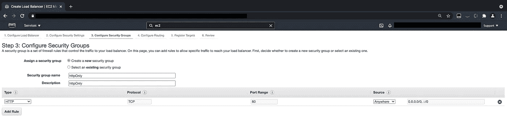

对于**配置路由**，选择以下选项:

*   **名字**自定义名字，我放 NavBar。
*   **目标类型** : IP

**点击下一步。**

第五步:注册目标，**点击下一步**

**然后创建。**

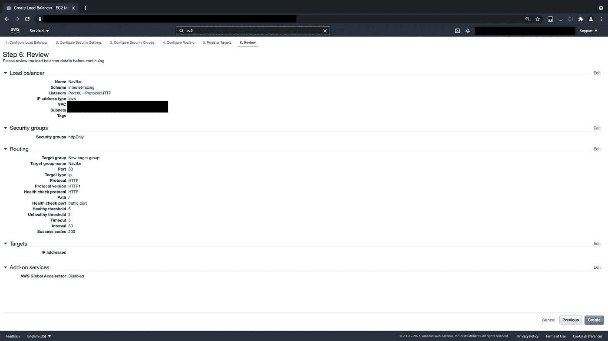

创建负载平衡器后，导航回 **ECS** ，创建我们的集群。

从那里选择**创建集群>仅联网>下一步。**

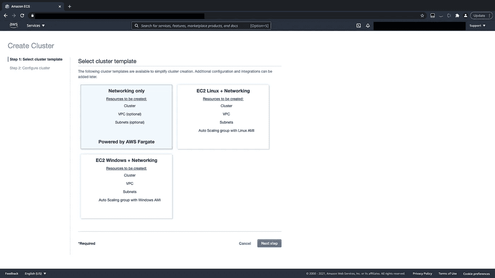

给你的集群起个名字，我给我的 navbar-cluster > **创建**。

> 如果失败，请再次尝试创建群集。

太棒了，我们已经创建了第一个集群，现在让我们创建一个任务定义；这将指向我们的 docker 映像，并告诉我们的集群我们正在旋转什么。

在 **ECS** 的左侧菜单中，选择**任务定义>创建新的任务定义。**

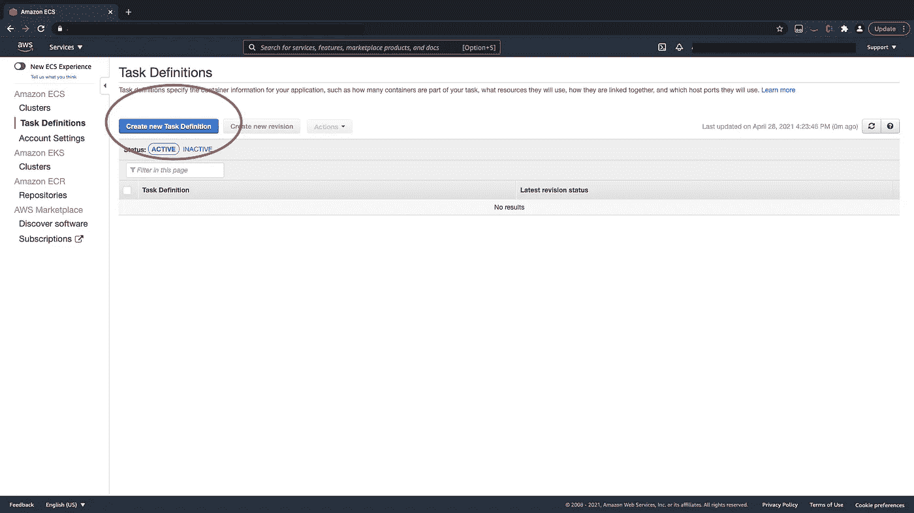

在**上选择发射类型兼容性，**选择 **FARGATE >下一步。**

对于**配置任务和容器定义**你必须给你的任务定义一个唯一的名字，我给了我的 navbar-task。

然后为任务大小选择:

*   任务内存(GB) : 0.5GB
*   任务 CPU (vCPU) : 0.25 vCPU

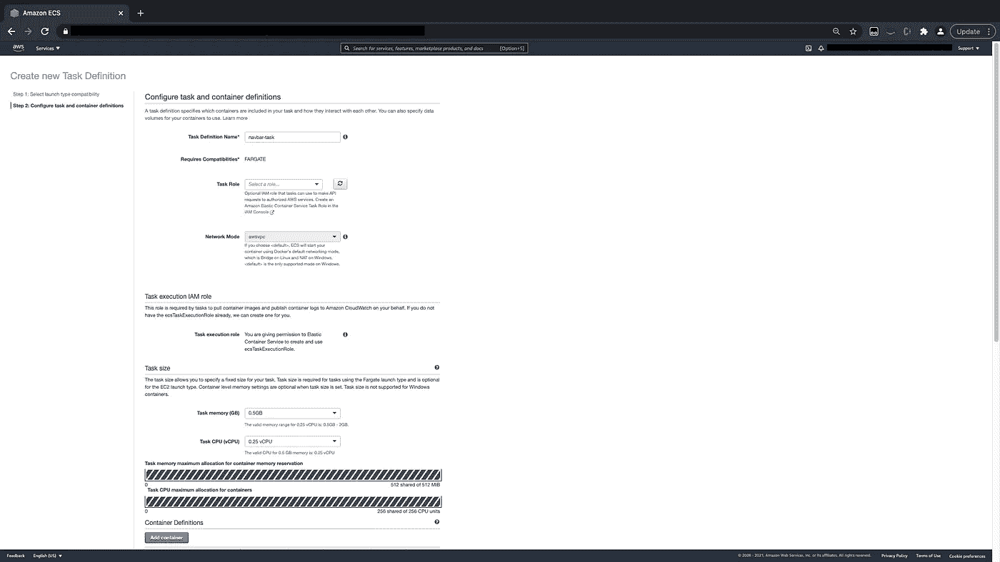

然后**在容器定义>下添加容器。**

然后，您应该会看到右侧出现一个弹出菜单。您只需填写以下字段:

*   **容器名**:我给了 navbar-container。
*   **图片**:这将是您在本实验开始时在 ECR 中创建的存储库的 URL。例如，应该沿着 143681329876.dkr.ecr.us-east-1.amazonaws.com/navbar.的路线寻找
*   **端口映射** : 80。

一旦完成，选择**添加>创建**。

完成任务定义后，返回任务定义以查看新创建的定义。选择此**定义>动作>创建服务。**

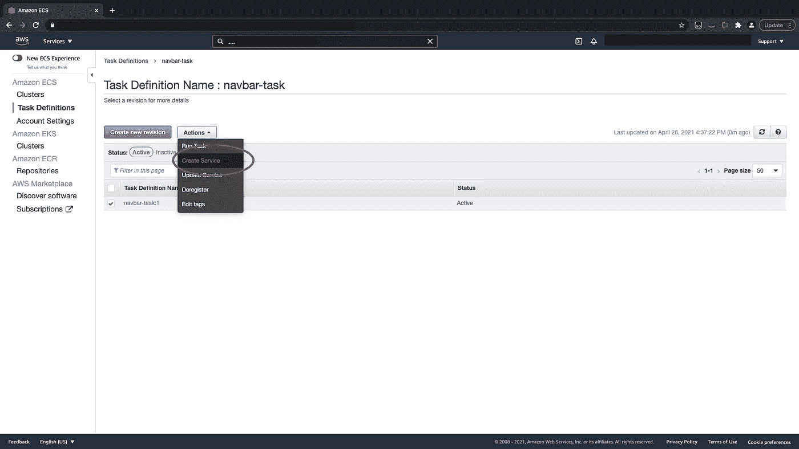

快到了，我保证😊。

创建服务是我们在集群中执行任务的方式，它向集群传达我们希望它包含的内容。

当指向**步骤 1:配置服务**的**创建服务**页面时，输入以下内容:

*   **发射类型** : Fargate
*   集群:我们之前制作的集群，在我的例子中是 navbar-cluster
*   **服务名**:给你的服务一个自定义名，我给我的 navbar-service
*   **任务数量** : 1

然后**下一步**

对于**配置网络**，选择以下选项:

*   **集群 VPC** :选择相同的 VPC 作为你的负载均衡器，我选择默认。
*   **子网**:我选择全部
*   **负载平衡器类型**:应用负载平衡器
*   **负载平衡器名称**:从下拉列表中选择您创建的负载平衡器
*   **容器名称:端口**:选择你的 navbar 容器**选择添加到负载均衡器**
*   **生产监听端口:**从下拉列表中选择 80:HTTP
*   **目标组名称:**从下拉列表中选择您使用负载平衡器创建的目标组

**下一步。**

在设置自动缩放上，点击**下一步。**

**创造服务。**

如果您查看 navbar 服务中运行的任务，几分钟后它应该变成绿色(正在运行)，这意味着它已成功部署。您可以通过点击负载平衡器 DNS 来测试网站。如果你回到下面的页面，这意味着它的工作。

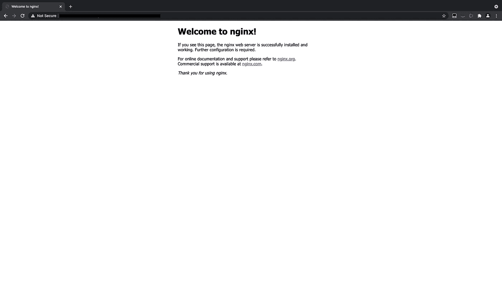

***重要*** :你现在已经成功部署了三个微前端中的第一个。现在，在继续之前，回去对科学和历史重复上述步骤。

# 加载您的 shell(本地)

到目前为止，您应该已经在云上的 Fargate 集群中启动了所有的微前端。现在让我们在本地启动我们的 shell 并使用大学网站。

为此，您必须返回到 shell 子文件夹中的克隆 repo。

```
cd shell
```

在您选择的代码编辑器中打开该文件夹，因为我们需要将负载平衡器端点添加到 shell 中。在文件 **src > index.ejs** 中，您应该在第 52–57 行看到以下内容:

```
"@University/root-config": "//localhost:9000/University-root-config.js",
   "@University/nav": "http://<ADD NAVBAR LOAD BALANCER HERE>/asset-manifest.js",
   "@University/history": "http://<ADD HISTORY LOAD BALANCER HERE>/asset-manifest.js",
   "@University/science": "http://<ADD SCIENCE LOAD BALANCER HERE>/asset-manifest.js"
}
```

要连接您的 shell，您必须将您在上一节中创建的三个负载平衡器添加到这个文件中，替换它所说的添加特定负载平衡器的位置。

添加负载平衡器端点后，您必须首先下载相关的依赖项，然后在本地运行应用程序。

```
npm install
npm start
```

这将在端口 9000 上启动一个本地服务器，它将呈现您已经部署的集群中的所有页面。

> 注意:如果在尝试加载应用程序时遇到 CORS 问题，或者网站无法加载，请尝试将此扩展添加到您的浏览器([此处](https://chrome.google.com/webstore/detail/allow-cors-access-control/lhobafahddgcelffkeicbaginigeejlf?hl=en))中，然后在重新加载页面之前将其打开。

# 结论

在本文的开始，我提到了 single-spa(单页应用程序)的名字。所以现在你已经使用了它，你可能开始理解它背后的命名约定。

React 本身是一个单页面应用程序，因为从用户的角度来看，整个网站在第一次加载后就会加载到浏览器中。微前端的想法为 React SPA 增加了另一层 single，因此创造了单一 SPA 的整体体验。

我希望你喜欢这个研讨会，现在开始考虑这个框架可以用在你自己的个人项目中的什么地方。请继续关注更多的帖子，因为我将继续探索这个框架的局限性，以及我可以在它的基础上构建什么功能。