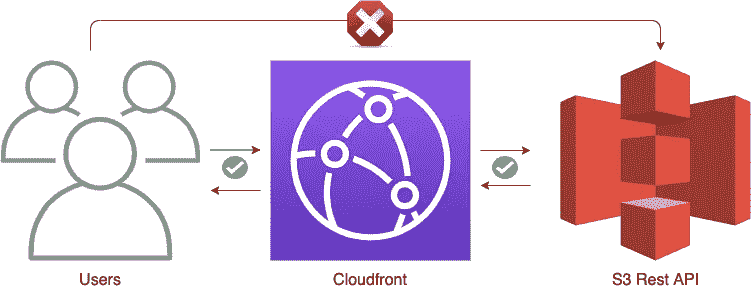
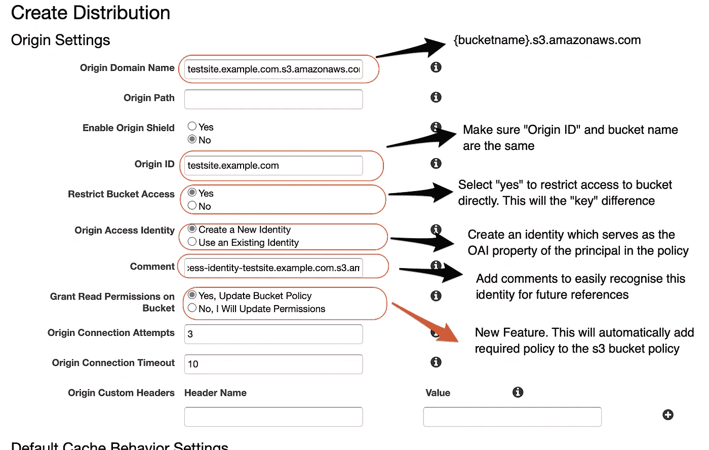
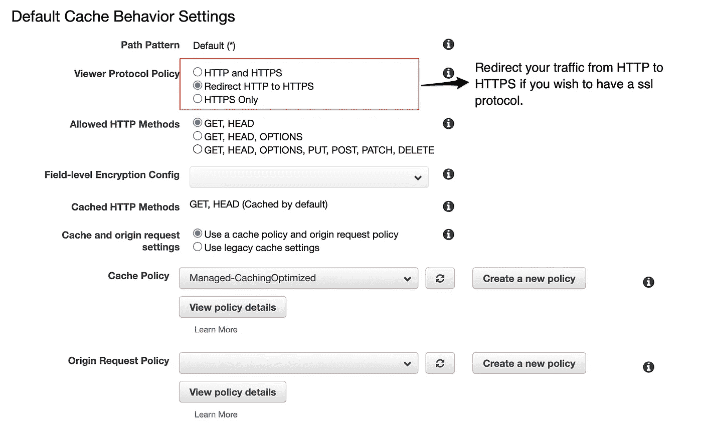
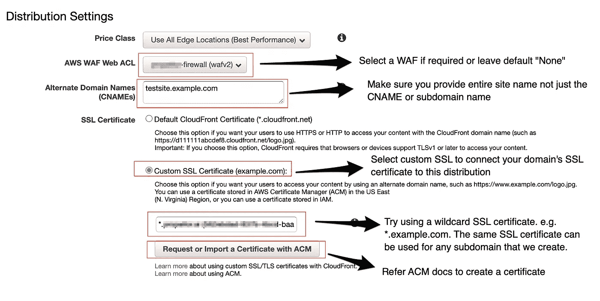
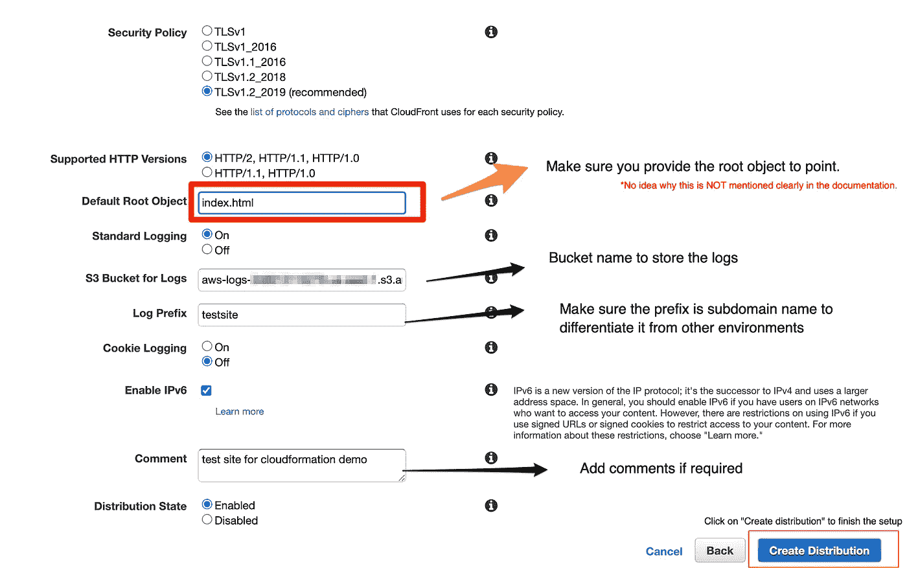

# 使用 s3 RestAPI 和 Cloudfront 部署静态网站——无需公开 s3 存储桶

> 原文：<https://medium.com/geekculture/deploy-static-website-using-s3-restapi-cloudfront-without-making-s3-bucket-public-3b1e244b64cb?source=collection_archive---------7----------------------->

Restrict Diagram

在我们开始之前，请理解通过 s3 网站端点和 s3 RestAPI 部署静态网站的区别。

**以下是网站端点和由 CloudFront 发行版提供服务的 REST API 端点之间的主要区别**

此外，AWS 有一个 cloudformation 模板，用于通过 s3 website Endpoint 部署一个静态站点，并有一个部署它的手动分步说明。你可以在这里找到这些细节[。](https://docs.aws.amazon.com/AmazonS3/latest/userguide/website-hosting-custom-domain-walkthrough.html)

我没有找到任何文章可以帮助我部署一个静态网站**而不**将 s3 存储桶**公开**，这是这篇文章的目标。通过遵循这些步骤，您的用户只能通过 CloudFront 发行版访问文件，而不是直接从 S3 存储区访问。你可以在这里找到这个配置[细节的链接。](https://docs.aws.amazon.com/AmazonS3/latest/userguide/website-hosting-custom-domain-walkthrough.html#root-domain-walkthrough-before-you-begin)

以下是 AWS 推荐的步骤，以及它们在两种配置之间的区别。

✅不需要更改❌需要更改配置

Configurations steps that vary

我将所有这些步骤总结为 4 步，但在第 3 步中添加了一个详细的 Cloudfront 配置截图。

# 配置流程

**第一步:**

使用所需的子域名或根域名创建一个 s3 存储桶作为存储桶名称。例如*testsite.example.com*或*example.com*

**第二步:**

上传以**index.html**为根的静态内容。即 testsite.example.com/index.html

**第三步:**

使用以下配置创建一个 cloudfront 发行版。您的亚马逊 S3 RestAPI 端点遵循以下格式。

*{ bucket-name } . S3 . Amazon AWS . com*

**第一步:**

Cloudfront Origin Settings

**第二步:**

Cloudfront Default cache Behaviour Settings

**第三步:**

Cloudfront Distribution Settings

**第四步:**

Logging Settings

**第四步:**

配置您的 DNS 以将流量重定向到 cloudfront 分发。

参考:

 [## 如何在 AWS S3 和 CloudFront 上用 SSL 托管一个静态网站

### 静态网站包含具有固定内容的网页，网站上的这些单独的网页包括静态…

说明](https://elucidata.io/how-to-host-a-static-website-on-aws-s3-and-cloudfront-with-ssl/)  [## 使用 CloudFront 为亚马逊 S3 托管的静态网站提供服务

### 我想主办一个亚马逊简单存储服务(亚马逊 S3)桶静态网站。然后，我想为我的…

aws.amazon.com](https://aws.amazon.com/premiumsupport/knowledge-center/cloudfront-serve-static-website/)  [## 使用您的 CloudFront 发行版来限制对亚马逊 S3 桶的访问

### 我想限制对我的亚马逊简单存储服务(亚马逊 S3)桶的访问，这样对象只能被访问…

aws.amazon.com](https://aws.amazon.com/premiumsupport/knowledge-center/cloudfront-access-to-amazon-s3/)