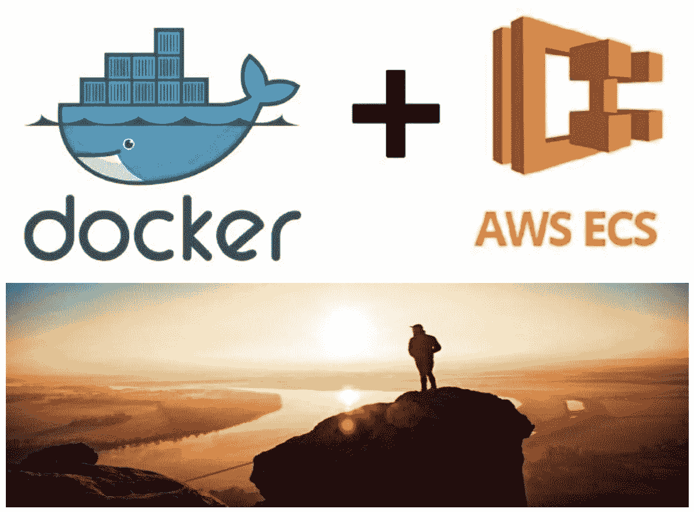
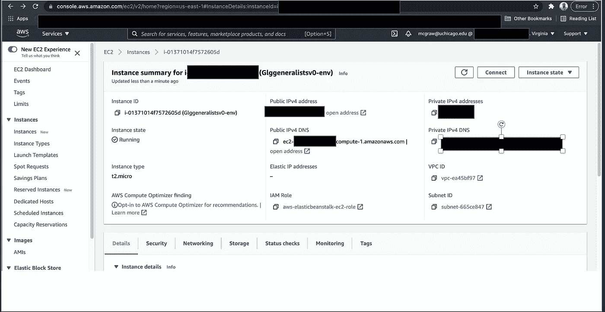

# 10 分钟内部署到 AWS，Docker！

> 原文：<https://medium.com/geekculture/deploy-to-aws-docker-in-10-minutes-68a60724dcb9?source=collection_archive---------28----------------------->

今天可能是 7 月 4 日，但我不会在没有部署的情况下结束今天！



容器、图像、docker 文件，天啊！

让我们进入正题，您刚刚完成了您的模型，并且需要部署它，所以让我们开始吧。Docker 是什么，我们为什么需要它？Docker 是构建和共享容器化应用程序的事实标准。Docker 让您快速部署代码，并显著减少编写代码和在生产中运行代码之间的延迟。一旦您的团队开发了应用程序/模型，下一个阶段就是部署，最终结果是生产环境中的服务或应用程序可供您的客户访问。

因此，在接下来的 9 分钟里，我将介绍 Docker 的应用程序部署。

首先，让我们回顾一下这些术语。Docker 对象

**容器** —容器是一个图像的可运行实例。

**Docker 映像**—Docker 映像是一个只读模板，支持创建应用程序的可运行实例，具体来说，Docker 映像为应用程序、任何基本代码、配置文件和用于启动容器的依赖项提供执行环境。

**Docker file**—Docker file 是一组简单的指令，用于创建 Docker 映像。

现在让我们把这些放在一起。

要构建 Dockerfile 文件，请使用以下预定义的指令:

```
FROM -        to set the base image
RUN -         to execute a command
COPY & ADD  - to copy files from host to the container
CMD -         to set the default command to execute when the container starts
EXPOSE -      to expose an application port
```

下面是一个 docker 文件的例子，它的目标是打包一个 python 应用程序([参见这里的报告](https://github.com/Milan-Chicago/GLG-Automated-Meta-data-Tagging)):

```
# Simple Docker that aims to package a simple Python application (this same code will be use for the Fourthbrain.com Capstone deployment day July 8th, 2021).# The first instruction is FROM:  which specifies the base image as being Python in version 3.8FROM python:3.8

# Set and define the working directory which feature commands will be executed from /appWORKDIR /app

# Copy will add the current directory contents into the container file system at /appCOPY . /app

ENTRYPOINT [ "python3" ]

# This file contains all the dependencies and libraries that your Python application requires to execute successfully.RUN pip3 install -r requirements.txt

#Expose indicates the ports (in this case 8080) that the container should listen to for connections.EXPOSE 8080

# The CMD command provides the command to run within the container when it starts.
# Run your application!CMD ["run.py"]
```

创建 docker 文件后，现在构建**映像**。

什么是 **Docker Image** 来着？

**Docker 映像**—Docker 映像是一个只读模板，支持创建应用程序的可运行实例，具体来说，Docker 映像为应用程序、任何基本代码、配置文件和用于启动容器的依赖项提供执行环境。

# 现在运行您的应用程序…

最重要的两行代码是:第一行，构建映像，第二行，运行应用程序。

1st —构建映像。

```
docker build -t app-basic .
```

2nd —启动容器并将端口 8080 绑定到您机器的本地主机。

```
docker run -p 8080:8080 app-basic
```

醒来吧，你还在我身边吗？[就像祖母绿说的“嘭！”](https://www.youtube.com/watch?v=fifveIlcXlA)

现在您已经启动并运行了，导航到 [http://localhost:8080](http://localhost:8080) 并查看您的实时应用程序。

一旦你在你的电脑上测试了它，它就运行了——这意味着你已经开始工作了，这款应用的成功已经得到了验证。让我们保持真实，在将 Docker 映像分发给对等方之前，在本地测试它并验证它是否符合预期行为是至关重要的。您可能还想将 Docker 图像保存到注册表中，但这是稍后讨论的另一个主题。

接下来，现在让我们将它分布在云中，并为分布进行部署。

# 部署到 Amazon ECS

接下来，将您的应用程序文件夹上传到 ECS 实例，并将您的应用程序部署到 [AWS ECS](https://docs.aws.amazon.com/ecs/?id=docs_gateway) 。



Docker Image uploaded to an Amazon EC2 Instance

# 结论

因此，我研究了 Docker，为您的 ML 应用程序部署和易于执行的标准模板。感谢[塔蒂亚娜·切博年科](https://www.linkedin.com/in/tatiana-chebonenko-57661629/)，她像一个 10 岁的孩子一样给我解释了两遍——[k . I . s . s .(就像在军队里一样)](https://en.wikipedia.org/wiki/KISS_principle)！

# 参考

这篇文章中的所有笔记都来自各种来源和下面的课程:[https://www . uda city . com/course/cloud-native-application-architecture-nano degree-nd 064](https://www.udacity.com/course/cloud-native-application-architecture-nanodegree--nd064)，如果你对学习部署感兴趣，我强烈建议你参加这个课程。

Dockerfile 参考文件:[https://docs.docker.com/engine/reference/builder/#from](https://docs.docker.com/engine/reference/builder/#from)

保持联系， [Linkedin](https://www.linkedin.com/in/milan-mcgraw/) ！