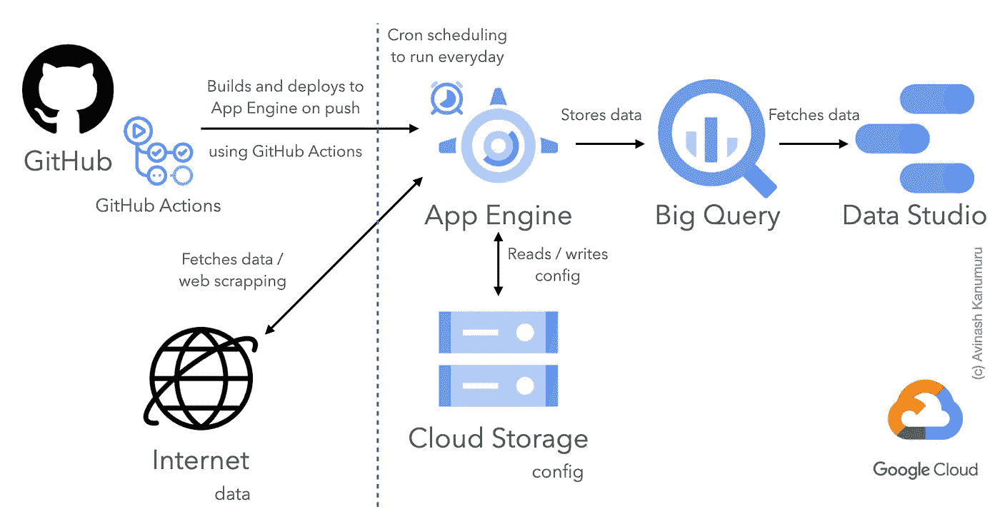
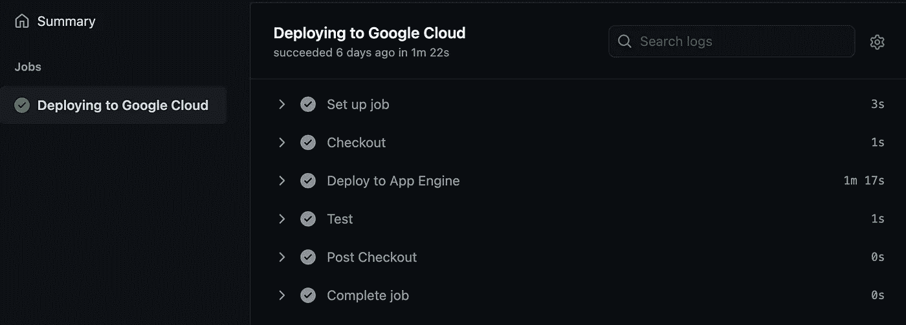

# 使用 GitHub 操作(CI/CD)部署到 Google App Engine

> 原文：<https://medium.com/geekculture/deploy-to-google-app-engine-using-github-actions-ci-cd-f25d4c965fbc?source=collection_archive---------2----------------------->

## 持续集成和持续部署(CI/CD)是 MLOps(数据版本控制)的核心，我们将看看如何使用 Google App Engine 和 GitHub Actions 来实现这一点。



## 介绍

作为个人项目的一部分，我使用 Data Studio 构建了一个仪表板，其中包含来自 Big Query 的数据，这些数据由应用引擎中托管的 python 代码填充。使用`dvc`的数据版本控制将一些原始数据文件、配置和 ML 模型保存在云存储中。

下面是我用`dvc`详细了解数据版本控制的帖子——关于如何设置和使用谷歌云存储。有实际例子的详细指南。

[](/geekculture/data-version-control-dvc-with-google-cloud-storage-and-python-for-ml-fe99dc7d338) [## 使用 Google 云存储和 Python 进行 ML 的数据版本控制(DVC)

### 数据版本控制是一个即将到来的领域，需要更快地实现机器学习迭代，而且仍然…

medium.com](/geekculture/data-version-control-dvc-with-google-cloud-storage-and-python-for-ml-fe99dc7d338) 

回到我的 python 代码——它从互联网的各种 API 中提取数据，使用云存储中存储的配置和模型处理和分析数据，然后将最终数据存储在大查询数据集和云存储文件中。并且代码基于 AppEngine cron 作业每天运行。

这构成了我的应用程序/项目，它使用各种 GCP 组件无缝运行(顺便说一下，我在 GCP 上免费运行了近一个月，因为一切都是免费的——不是免费试用)。但整个设置中唯一缺少的部分是——当我将代码推送到 GitHub 时，它必须将新版本的代码推送到 App Engine，这将完成 DevOps 的 CI/CD 阶段(在我们的示例中为 MLOps)。

## 具有 GitHub 操作的 CI/CD

我的 git 存储库中有两个分支——`main`和`develop`——我使用`develop`来构建或调整模型，然后使用`dvc`将最终的模型推送到云存储中。所以我也有以前版本的模型——如果我将来需要检索来比较结果的话。

一旦我对模型结果感到满意，我将把`develop`合并到`main`分支(我们也可以做一个拉请求，但是我是这个项目的唯一开发者)。然后使用 Google Cloud SDK 从本地计算机单独将代码推送到 GAE。

因此，我们的想法是在使用任何 CI/CD 工具向`main`分支提交变更时，自动向 GAE 部署。为了简单起见，我选择了 GitHub 操作，但是也可以使用 GitLab / Jenkins / …本文将解释使用 GitHub 操作的 CI/CD。

下面是我的`app.yaml`和`cron.yaml`部署到谷歌应用引擎(GAE)的要点，我用来从本地计算机部署，我们将在 GitHub 操作中使用它。

现在在`.github/workflows/main.yml`中创建一个文件来配置 GitHub 动作，将我们的代码部署到 GAE 的 push to `main`分支。以上是配置的要点。这是一种不言自明的，但我花了一些时间来设置它，因为在互联网上没有清晰的文档，我不得不混合不同的部分，以获得大量失败的 GitHub 工作流的配置。

这个动作有一个名称，然后是什么触发了这个动作——对主分支的推/拉请求。然后是需要在触发器上运行的作业—只有部署，我们也可以有更多的作业。然后它在最新的 ubuntu 上运行，步骤如下

1.  使用`actions/checkout@v2`检查最新的代码库
2.  使用`google-github-actions/deploy-appengine@v0.2.0`将代码部署到应用引擎
3.  通过运行`curl`命令来测试应用程序是否已经成功部署

在步骤 2 中，GitHub 操作需要一些额外的参数来正确部署。

1.  交付件—部署时需要用到的东西。在大多数情况下，应该是`app.yaml`，但是在我的例子中，我也在调度一个批处理作业，因为我使用了`app.yaml cron.yaml`
2.  版本—(可选)这是要在 App Engine 中使用的版本。如果未使用，应用程序引擎将创建一个带有当前时间戳的版本。
3.  project _ id——这是必需的，这样 GitHub 操作才能部署到正确的项目
4.  凭据—我们从 GCP 下载的服务帐户 API 密钥文件中的 json 内容。

为了增加安全性，我们可以添加 project_id 和凭证作为 GitHub 机密，并在这里使用它们。要添加 GitHub 机密，请进入项目报告设置>机密>添加机密。复制服务帐户的 JSON 文件内容，并将其作为凭证粘贴。

上面的配置类似于我们用来从本地计算机部署的`gcloud`命令，除了凭证被存储并作为`GOOGLE_APPLICATION_CREDENTIALS`添加到 PATH 中。

```
gcloud app deploy app.yaml cron.yaml --version=v1 --project=<project-id>
```

下面是将 codebase 部署到 GAE 的 GitHub 操作的成功完成。



## 结论

CI/CD 管道是 DevOps 的重要组成部分(与 MLOps 一样),用于简化和自动化部署流程。我们已经使用 GitHub Actions 将我们的项目自动部署到 Google App Engine，将代码推送到特定的分支。有了这个 CI/CD 管道，我们可以更加关注项目的核心功能——软件开发或者模型构建。