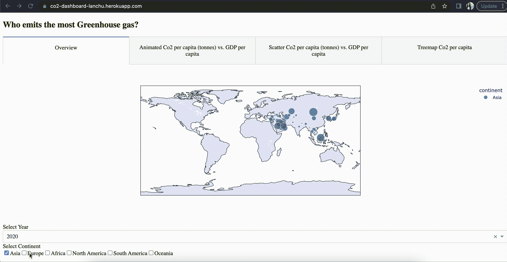

# 只需一个命令，即可通过网络部署您的 Dash 应用程序。

> 原文：<https://medium.com/geekculture/deploy-your-dash-app-over-the-web-in-a-single-command-537725a2b436?source=collection_archive---------16----------------------->

是的，快速简单地与世界分享。

查看链接到我在 Heroku 上的 simply Dash 应用的[链接，以及在我的](https://co2-dashboard-lanchu.herokuapp.com/) [GitHub 库上构建应用的示例代码和数据。](https://github.com/lanchuhuong/Plotly-Dash-App)

My dash app on Heroku. Image by Author.

Plotly Dash 是一个流行的基于 Python 的 web 框架，用于开发数据可视化应用程序。默认情况下，Dash 应用程序在本地主机上运行，您可以自己访问它们…