# 用 Flask 部署你的机器学习模型

> 原文：<https://medium.com/geekculture/deploy-your-machine-learning-model-with-flask-or-voila-c74a07921604?source=collection_archive---------35----------------------->


Photo by [Nathan Dumlao](https://unsplash.com/@nate_dumlao?utm_source=unsplash&utm_medium=referral&utm_content=creditCopyText) on [Unsplash](https://unsplash.com/s/photos/college?utm_source=unsplash&utm_medium=referral&utm_content=creditCopyText)

如果您从未有机会在安全的环境中尝试，数据科学模型部署听起来可能会令人生畏。你想做一个 REST API，还是一个全前端的 app？做这些需要什么？这并没有你想象的那么难！

今天我们将介绍如何将模型部署到 webapp(使用 [Saturn Cloud](https://www.saturncloud.io/) )，以便其他人可以与之交互。在这个应用程序中，我们将让用户做出一些功能选择，然后模型将预测他们的结果。但是使用同样的想法，您可以很容易地做其他事情，比如让用户重新训练模型，上传图像之类的东西，或者与您的模型进行其他交互。

> 声明:我是 Saturn Cloud 的一名高级数据科学家，Saturn Cloud 是一个支持使用 Dask 对 Python 进行简单并行化和扩展的平台。如果你想了解更多关于土星云的信息，请登陆[网站 www.saturncloud.io](https://www.saturncloud.io/) 访问我们。

有趣的是，我们将用两个框架来做同样的项目，Voila 和 Flask，所以你可以看到它们是如何工作的，并决定哪一个适合你的需要。在 Flask 中，我们将创建一个 REST API 和一个 web UI 版本。

我们今天的工具包:

*   [土星云](https://www.saturncloud.io/)(这样你就可以轻松部署了！)
*   [烧瓶](https://flask.palletsprojects.com/en/2.0.x/)
*   [瞧吧](https://voila.readthedocs.io/en/stable/index.html)
*   [情节性](https://plotly.com/) (python 和 JS)
*   [Scikit-learn](https://scikit-learn.org/stable/index.html) (针对我们的车型)

# 其他有用的链接

*   [ipywidgets](https://ipywidgets.readthedocs.io/en/stable/) (对 Voila 有帮助)
*   [数据集的码本](https://collegescorecard.ed.gov/assets/FieldOfStudyDataDocumentation.pdf)
*   [plotly.js 备忘单](https://images.plot.ly/plotly-documentation/images/plotly_js_cheat_sheet.pdf?_ga=2.249711556.332176051.1622039680-1660549259.1622039680)
*   [金贾](https://jinja.palletsprojects.com/en/3.0.x/)(有助于烧瓶)

# 该项目

无论是 Voila 还是 Flask，我们流程的第一步都是完全相同的。我们需要获取一些数据并建立一个模型！我将利用美国教育部的大学记分卡数据，建立一个快速线性回归模型，该模型接受一些输入，并预测学生毕业两年后的可能收入。(你可以在[https://collegescorecard.ed.gov/data/](https://collegescorecard.ed.gov/data/)亲自获取这些数据)

## **关于三围**

*   接受收入指标评估的毕业生群体包括那些接受联邦财政资助的人，但不包括那些随后在测量年度入学的人、在测量年度结束前死亡的人、获得比测量的研究领域证书级别更高的证书的人或在测量年度没有工作的人。

# 加载数据

我已经做了一些数据清理工作，并把我想要的功能上传到了 S3 的一个公共存储桶中，以便于访问。这样，当应用程序运行时，我可以快速加载它。

# 培训形式

一旦我们有了数据集，这将为我们提供一些特征和我们的结果。我们只需要用 scikit 将它分为特性和目标——学会准备建模。(请注意，所有这些功能将完全按照我们每个应用程序中编写的那样运行。)

我们的特点是:

*   区域:学院的地理位置
*   地区:学校所在的城市或城镇的类型
*   控制:学院类型(公立/私立/营利性)
*   CIPDESC_new:主要研究领域(CIP 代码)
*   证书(学士、硕士等)
*   ADM_RATE_ALL:接纳率
*   SAT_AVG_ALL:被录取学生的平均 SAT 分数(代表大学声望)
*   学费:就读该机构一年的费用

我们的目标结果是 EARN_MDN_HI_2YR:完成学位两年后测量的收入中位数。

# 火车模型

我们将使用 scikit-learn 的管道使我们的特征工程尽可能简单快捷。我们将返回一个经过训练的模型以及测试样本的 R 平方值，这样我们就可以在测试集上快速而直接地测量模型的性能，并可以与模型对象一起返回。

现在我们有了一个模型，我们准备把应用程序放在一起！所有这些函数都会在 app 运行的时候运行，因为速度太快了，保存一个要加载的模型对象是没有意义的。如果你的模型没有训练得这么快，保存你的模型对象，当你需要预测的时候在你的应用中返回。

# 形象化

除了建立模型和创建预测，我们希望我们的应用程序显示一个相关分布预测的视觉效果。两个应用程序可以使用相同的绘图功能，因为我们正在使用 Plotly 进行工作。

下面的函数接受学位和专业的类型，以生成分布以及模型给出的预测。这样，观众就可以看到他们的预测和其他人的相比如何。稍后，我们将看到不同的应用程序框架如何使用 Plotly 对象。

这是我们将生成的一般视觉效果——但是因为它很有情节性，所以它将是交互式的！

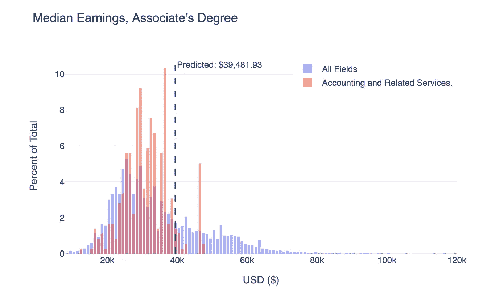

您可能想知道您最喜欢的其他可视化库是否可以在这里工作——答案是，可能！每个 python viz 库都有自己的特点，并且不太可能对 Voila 和 Flask 提供完全相同的支持。我选择 plotly 是因为它具有交互性，并且在两个框架中都有完整的功能，但是欢迎您尝试自己的可视化工具，看看效果如何！

# 瞧

现在我们准备开始构建我们的 Voila 应用程序。瞧，这完全包含在一个 Jupyter 笔记本中，所以你需要启动一个新的笔记本，并添加我们上面写的所有功能。您不需要任何其他文件类型或框架，您可以在一个 Jupyter 笔记本中完成所有工作！

您可以继续添加一个包含建模函数调用的块，这样我们就准备好了数据。

```
df = load_data() 
X, y = split_data(df) 
modobj, modscore = trainmodel(X, y)
```

这样，我们就有了原始数据、模型对象和 R 平方值。

接下来，我们开始构建小部件——这是您的查看者选择填充预测的方式。在一个或多个块中，为用户可能想要的每个输入添加一个小部件——这里有一个例子。这些可以引用您已经在笔记本中创建的项目—正如我们在这里所做的，这可能意味着使用数据集中的数据来填充选择器。(按照您希望的方式进行排序，因为小部件不会对列表进行重新排序。)

当您创建了所有的小部件并且应用程序运行时，您的输入选择器将看起来像这样。

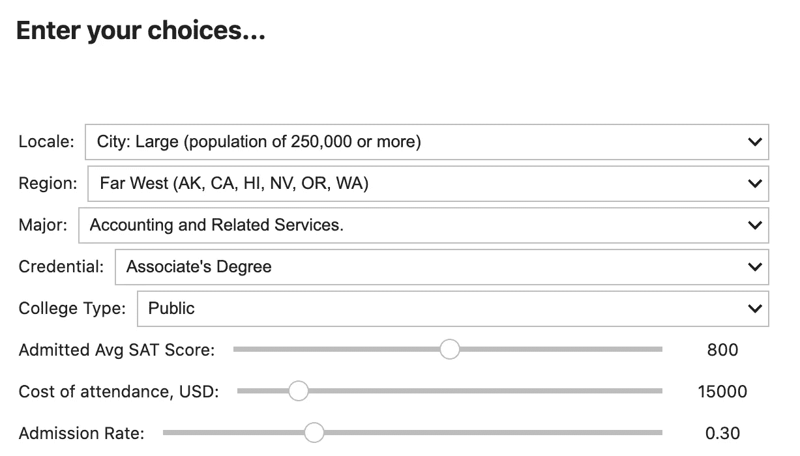

# 创建渲染函数

下一个任务是将所有这些与监听用户输入的功能放在一起，并完成一项任务——对我们来说，这就是预测盈利价值。

您可以编写一个或多个这样的函数，但关键是您如何在`interactive_output`包装器中调用它们。

这个函数监听所有的输入部件，当其中任何一个部件发生变化时，它就会运行。它接受所有用户输入，并将它们形成一个数据帧，该数据帧的形状适合模型对象。它在该数据帧上进行预测，然后使用 f 字符串创建一个 HTML 块。然后它调用我们的绘图函数，如前所述。它显示 HTML 和情节在一起，这是我们将在应用程序上看到的。

然而，回想一下我提到过我们需要称它为`interactive_output`。如果我们不这样做，Voila 就不知道我们打算让它监听输入并运行。但是这是一个简单的任务，只需要一个调用，如下所示。它调用这个函数，并传递一个包含作为键的参数和作为值的小部件名称的 dict。

在这一点上，我们已经准备好做我们的页面布局。如果你愿意，你当然可以添加许多其他的设计元素，并以 HTML 或其他小部件的形式传递它们。

# 页面布局

为了做我们的布局，我使用了 Voila 的网格元素——但是有许多方法可以安排 Voila 应用程序，这里没有显示。正如你可能猜到的，VBox 的意思是垂直的盒子，HBox 的意思是水平的盒子，这些就是我正在使用的容器。

我的垂直盒子叫做`vb`，它保存了我所有的小部件供用户交互。我的水平框将位于它的下面，叫做`hb`，它包含了之前创建的`out2`交互小部件。这里的“孩子”只是指放在每个盒子里的物品。您可以在这里操作这些框的一些布局元素。

下一件事，我想做的是创建我的实际网格。我正在制作我的网格`gb`，它包含了两个对象`vb`和`hb`。网格跨越 80%的页面宽度，形状为 2x2。每个柱的宽度是网格的一半，并描述了网格模板。网格样式可能很难，但是有一个很棒的图表教程可以帮助你:[https://ipywidgets.readthedocs.io/en/latest/examples/Widget·Styling.html](https://ipywidgets.readthedocs.io/en/latest/examples/Widget%20Styling.html)

现在，您已经准备好运行您的应用程序。运行这个程序块，你的应用程序就会出现在你的笔记本页面上！

```
display(gb) 
```

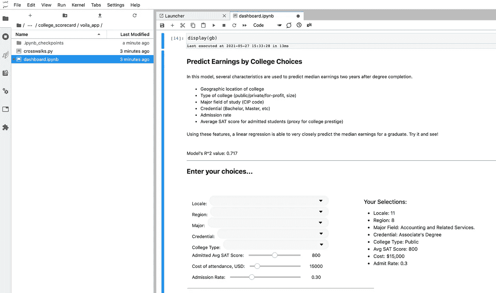

这很好，但是这不是我们想要的最终产品。使用 Saturn Cloud，将此笔记本部署给其他用户是一项简单的任务。

# 部署

确保您的代码在您可以访问的 Github repo 中。转到您选择的 Saturn Cloud 项目，并将该 repo 连接到您的项目。([https://www.saturncloud.io/docs/using-saturn-cloud/gitrepo/](https://www.saturncloud.io/docs/using-saturn-cloud/gitrepo/))这是您的部署将如何找到代码。

然后返回土星云 UI，[打开一个项目](https://www.saturncloud.io/docs/getting-started/start_project/)。在项目页面中，进入[到部署](https://www.saturncloud.io/docs/using-saturn-cloud/jobs_and_deployments/)。您有机会在这里自定义很多，但最重要的部分是命令—这需要使用主机 0.0.0.0 和端口 8000 才能在 Saturn Cloud 上正确运行。如果您在笔记本电脑上本地运行 Voila，您可能会使用相同的命令，只需确保端口和主机是正确的。代码的路径很可能以`../git-repos/`开始，然后是你附加的 repo 中文件的路径。

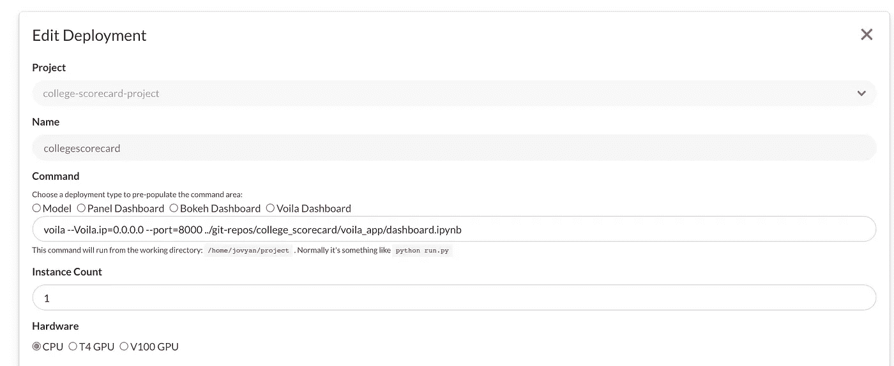

对于这个项目，除了您应该确保在 **Extra Packages** 部分中您注意到 plotly 是必需的之外，没有太多其他内容需要更改。

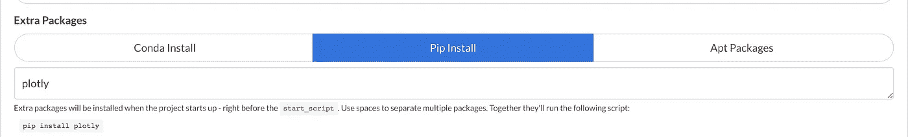

现在，保存您的部署并点击绿色的开始箭头！启动需要一些时间，然后该部署的 URL 将显示您的交互式应用程序。我的有一些额外的文本元素来解释应用程序，你也可以在你的应用程序中写这种东西。

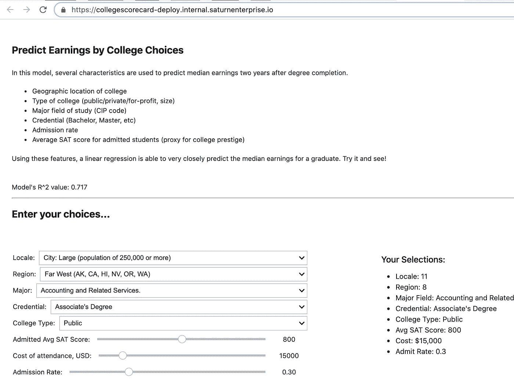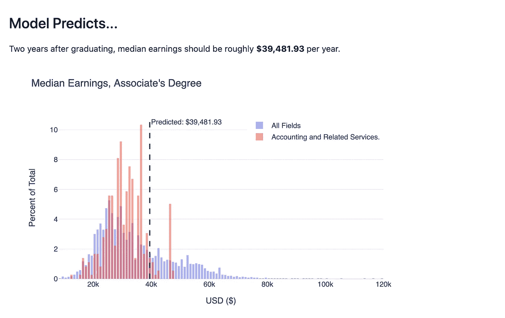

# 瓶

在 Flask 中，我们不会使用 Jupyter，但是有更多的灵活性和可能性——特别是如果你开始集成额外的前端框架。对于这个项目，我们有两种选择:

*   一个裸 REST API
*   一个 webapp(显示一个界面，就像我们之前用 Voila 制作的一样)

如果我们选择 webapp，我们将使用 Python、HTML、CSS 和一些 Javascript 进行开发。这听起来可能很多，但并没有乍看起来那么复杂。在 API 的例子中，你可以避免很多前端设计，但是一些帮助你的用户掌握事情的诀窍仍然是可取的。

# 应用程序脚本

就像 Voila 一样，我们想把我们写的函数放到一个脚本中——而不是`.ipynb`,这将只是`.py`。我们的大部分工作可以包含在这个 Python 脚本中，为了方便起见，我们称之为`app.py`。这包含了我们上面描述的所有代码，以及一些取决于我们正在构建的端点类型的函数。我还将添加一个额外的函数，它封装了我们所做的所有工作，并在被调用时一起运行。

现在，在我们的脚本中，我们初始化 Flask，调用我们的模型函数，并设置好一切。

```
app = Flask(__name__) 
modobj, modscore, df = train_model()
```

# 索引

不管你的用户是否会在浏览器中使用你的应用程序，为他们创建一个登陆页面可能是件好事，这样他们就有地方获取信息和学习使用你的工具。在`app.py`脚本中，我们将有一个创建这个登陆页面的函数。

在这个名为`index`的函数中，我们的 Flask 应用程序被指示呈现 HTML——这几乎是这个函数所做的全部工作。我们也有一些数据在那里，以帮助渲染器使我们的值选择器正确。(空格的缩写列表。)注意这个函数没有返回——那是因为它的全部目的是生成 HTML，仅此而已。

所以它在生成一些 HTML——但是它怎么知道要做什么呢？我们将制作一个设计模板，然后填充我们需要向用户展示的内容。

HTML 模板需要看起来像什么？可以从最基本的 HTML 页面大纲开始。Flask 使用 Jinja 模板来填充变量并传递信息，所以您会看到许多用双花括号括起来的项，表示 Jinja 变量。此外，请注意我们的 body 标记内的部分，因为这是我们制作的任何页面将填充它们包含的信息的地方。

作为模板的结果，索引 HTML 页面根本不需要重复 HTML 包装。它可以像一些 HTML 描述和我们要求用户选择的字段一样简单。然而，它确实需要包装在下面，所以模板系统知道该做什么。

```
 
	<! -- our index-specific HTML and form -->

```

# 交互性

> 如果您想让用户能够通过 UI 提交选项，那么在这个页面上添加一个表单和选择器——如果您只是想让用户通过 URL 参数提交选项，那么您可以跳过这一步。

几乎你在索引页面中做的所有事情都可以是标准的 HTML。我的选择器被封装在一个表单中，看起来像这样。注意凭证选择器有几个 Jinja 变量——这些变量是怎么来的？来自`app.py`！

根据您的工作需要添加任意数量的选择器，您就可以开始了。

# 结果

我们的下一个任务是将结果返回给用户。我们可以将普通 JSON 作为 REST API(更容易传递给其他应用程序)或 UI 版本(例如，更容易被业务用户使用)返回。无论我们走哪条路，我们都需要在`app.py`中的一个函数，它将从输入中产生结果。这个存根可以帮我们做到。它遍历我们所有的输入，检查它们是否出现在 URL 的参数中，然后根据模型运行我们的预测。

# REST API

如果我们没有创建 UI 端点，那么我们可以将它添加到我们的`result`函数中来完成脚本。

```
...
variables['predicted_earn'] = pred_final
    return jsonify(variables)
```

就这样吧！当用户访问我们的网页时，他们将提交选项，或者他们可以直接访问我们的 URL 并以编程方式传递信息。将返回一个 JSON 结果。(您可以自定义`@app.route`调用，将其命名为“api”或适合您的类似名称。)

# UI 端点

如果我们需要更吸引人地展示我们的结果，我们可以将输出制作成一个`result.html`页面。我们已经看到的`index.html`的模板也可以做到这一点，所以所需的 HTML 是最少的。为了好玩，我还将向您展示绘图渲染，以便我们可以完全复制 Voila 功能。

首先，如果我们想创建一个 UI 端点，这是`app.py`的`results`函数的剩余部分。没有更多的-我们只是创建我们的情节(与 Voila 相同的功能)，并运行`render_template`，就像我们用一些不同的参数运行`index.html`一样。

我们的`results.html`代码将接收所有这些内容并显示出来。如果需要，我们还可以传递所有的模型输入，并显示它们，这样用户就可以看到它们提供的所有值——这只是可选的。

对于渲染，所有的结果页面都需要像 HTML 一样。它使用`pred_final`和`graphJSON`打印预测和绘图。当然，我们使用了一点 Javascript 来打印情节，但是如果您不想深入研究，您可以很容易地省略它。

# 部署

现在我们有两个应用:API 和 Webapp。部署它们实际上是一样的！在我们的`app.py`脚本中，我们将添加最后一点(不要忘记端口和主机！):

```
if __name__ == "__main__":
  app.run(host='0.0.0.0', port=8000)
```

这让我们可以使用命令`python app.py`来运行我们的应用程序。

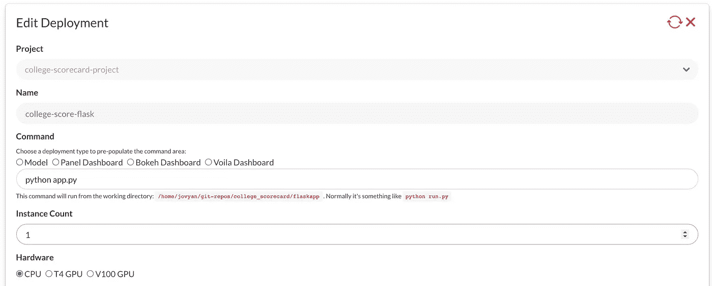

我们的文件结构看起来会像这样(如果我们只是做 API 的话，去掉 results.html。)

```
flask_app/
├── app.py
├── templates/
│   ├── design.html
│   └── index.html
│   └── results.html
```

这就是我们所需要的，尽管你当然可以添加更多的 CSS 或 Javascript 文件。将所有这些添加到我们之前讨论过的 Github 存储库中——或者如果需要的话创建一个新的。

现在，我们可以像部署 Voila 应用程序一样部署这个应用程序——即使我们想这样做，也可以在同一个项目中完成！

Saturn Cloud 项目已经附加了我们的 Github 库，但是如果您需要再次执行这个步骤，只需[查看我们的文档](https://www.saturncloud.io/docs/using-saturn-cloud/gitrepo)。这是您的部署查找代码的方式。

部署 Flask 的命令不同于 Voila——但是记住地址和端口是相同的。您只是在您的`app.py`脚本中设置了它，而不是在部署中。

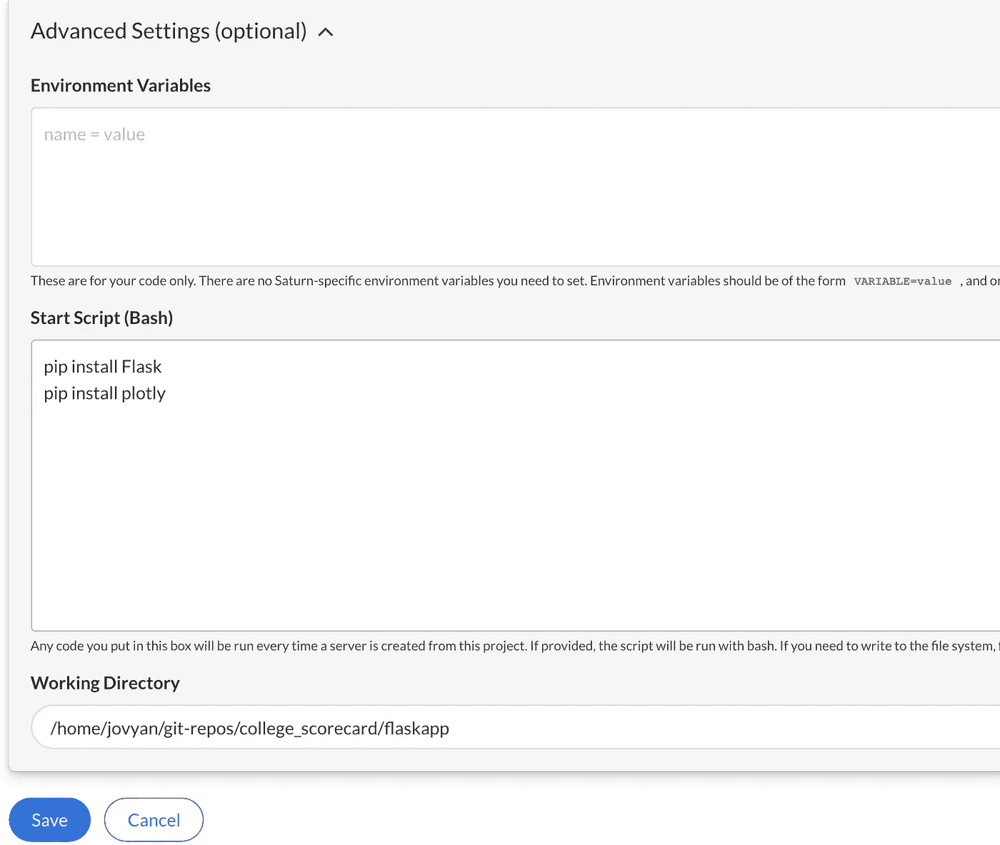

现在你准备好了！保存，单击绿色的开始箭头，您的部署将启动。

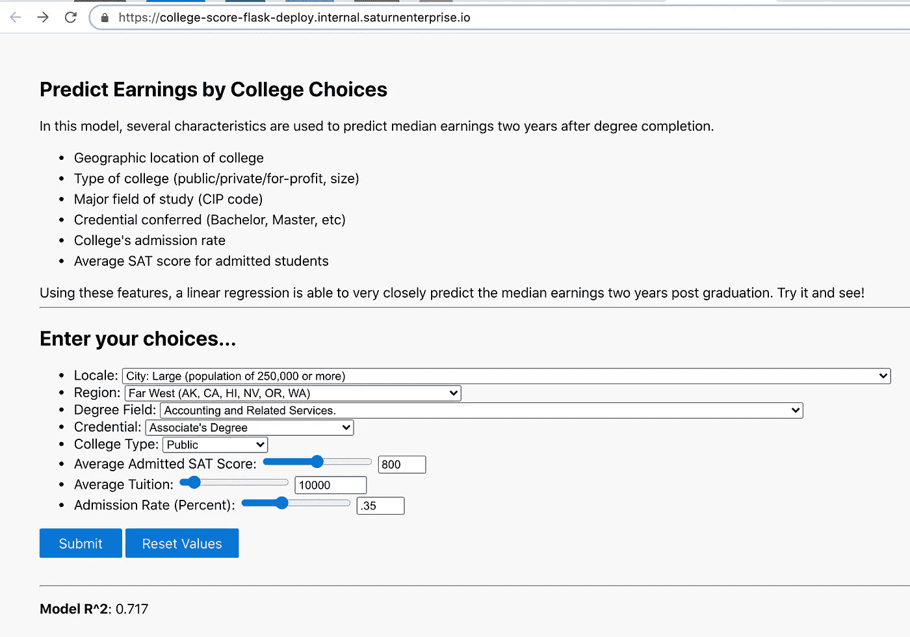

该表单将接受您的查看者的输入，然后将它们带到您的结果页面。

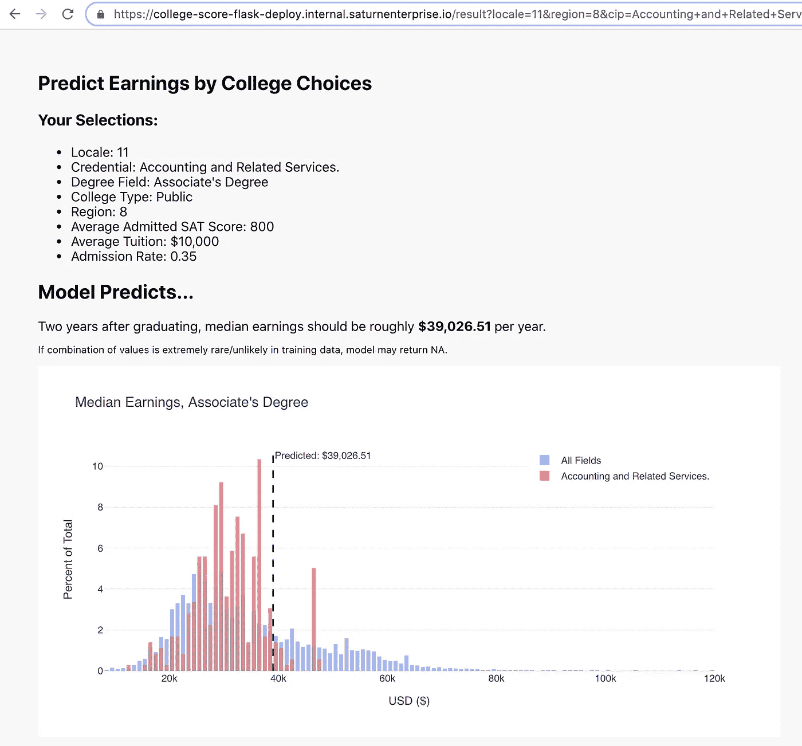

在[我的 Github 页面](https://github.com/skirmer/college_scorecard)获取更多信息和该项目的完整代码库！