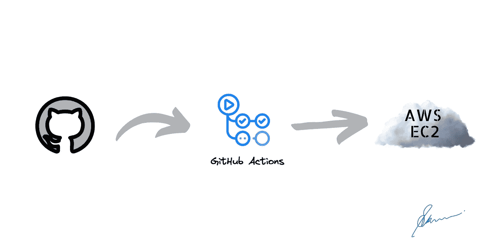

# 使用 GitHub 操作和 Docker 在 AWS EC2 上部署您的 Java Spring Boot 应用程序

> 原文：<https://medium.com/geekculture/deploy-your-spring-boot-java-application-to-aws-ec2-using-github-actions-and-docker-e28c456a4b1a?source=collection_archive---------0----------------------->

## 使用 GitHub 动作和 AWS 实例 EC2 增强您的生产应用程序

Source: [Shubham Kumar](https://medium.com/u/2612c96405e4?source=post_page-----e28c456a4b1a--------------------------------)

# 介绍

在云服务器上部署应用程序不是一件容易的事情，更不用说处理连续部署了。