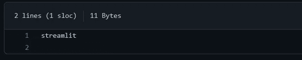
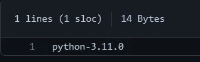

# 通过 3 个简单的步骤将您的 Streamlit 应用程序部署到 Heroku

> 原文：<https://medium.com/geekculture/deploy-your-streamlit-app-to-heroku-in-3-easy-steps-2804c4a3af58?source=collection_archive---------19----------------------->

Heroku 是一个平台即服务解决方案，您可以使用它将您的网络应用程序部署到世界各地。它建立在亚马逊的 AWS 之上，对于个人和公司来说是一个有用的工具，可以让他们在 GitHub 仓库中轻松部署应用程序。


本教程将向您展示如何使用 Heroku 部署您的 streamlit 应用程序，您需要的只是一个 GitHub 帐户和一个 Heroku 帐户。我假设你对两者都有点熟悉。

# 第 0 步:简化

[Streamlit](https://www.streamlit.io) 是一个开源的 Python 库，可以轻松创建和共享漂亮的定制 web 应用程序，用于机器学习和数据科学。只需几分钟，您就可以构建和部署强大的数据应用程序。出于我们的目的，我们将创建一个简单的文件 *app.py* ，它将为您提供三个数字中最大的一个。还有很多东西需要简化，如果您想了解更多，这里有一篇文章可以帮助您入门:

[](/mlearning-ai/streamlit-the-bare-essentials-d9a6d49bdd03) [## Streamlit —最基本的要素

### 使用 Streamlit 所需的基础知识，以及使用纯 python 创建强大的 web 应用程序，非常适合呈现任何…

medium.com](/mlearning-ai/streamlit-the-bare-essentials-d9a6d49bdd03) 

现在，让我们来编写我们的 *app.py* :

```
import streamlit as st

st.title('Greatest of Three Numbers') # Set Title of the webapp

choice1 = st.number_input('Enter First number') #Accepts a number input
choice2 = st.number_input('Enter Second number')
choice3 = st.number_input('Enter Third number')

string = f'Maximum value is {max(choice1,choice2,choice3)}'

st.write(string)
```

您可以使用任何文本编辑器或 IDE 将它写出来，并使用 ***streamlit run app.py(而不是 python app.py)*** 进行测试

您应该会在浏览器中看到类似这样的内容:


Your Streamlit demo-app

**现在，创建一个 GitHub 存储库，并将 *app.py* 添加到其中。**

# 步骤 1:需求和运行时

在您的 GitHub 存储库中，您将需要添加两个*。txt* 文件。

一个 *requirements.txt* 文件可以让您跟踪项目中使用的模块和包。这个文本文件将让 Heroku 知道要运行你的应用程序需要安装哪些依赖项。将项目的所有依赖项放在一个地方供用户查看通常也被认为是一个好的做法。在本例中，我们只使用了一个库，所以让我们将它添加到我们的文件中。

```
streamlit
```



What your requirements.txt file should like in your GitHub repo

类似地， *runtime.txt* 告诉 Heroku 我们将使用的语言是 ***Python。*** 具体来说就是 Python 的 3.11.0 版本。

```
python-3.11.0
```



What your runtime.txt file should like in your GitHub repo

# 第二步:设置

既然我们已经完成了一般步骤，Streamlit 应用程序还需要两个附加文件才能运行。

Heroku 本质上为我们提供了一个虚拟机。这取决于我们来创建一个应用程序。为此，我们使用一个 ***setup.sh*** 文件，它将在虚拟机中为我们创建一个文件夹，并移植我们的应用程序。这个文件使用 shellscript，如果您不能理解它的全部含义，请不要担心。

```
mkdir -p ~/.streamlit/

echo "\
[general]\n\
email = \"your_heroku@email_id.com\"\n\
" > ~/.streamlit/credentials.toml

echo "\
[server]\n\
headless = true\n\
enableCORS=false\n\
port = $PORT\n\
" > ~/.streamlit/config.toml
```

记得用你注册 heroku 账户时使用的电子邮件 id 替换 your_heroku@email_id.com。

最后，记得我说过:

> *使用* **streamlit run app.py(不是 python app.py)进行测试**

我们需要让 Heroku 知道这一点，我们通过添加一个 *Procfile 来做到这一点。*引用 Heroku 文档:

> *Heroku 应用包括一个****proc file****，指定应用在启动时执行的命令。您可以使用一个 Procfile 来声明多种* ***流程类型*** *，包括:*
> 
> *你的应用程序的网络服务器*
> 
> *多种类型的工作进程*
> 
> *单例进程，如* [*时钟*](https://devcenter.heroku.com/articles/scheduled-jobs-custom-clock-processes)
> 
> *在部署新版本之前运行* [*的任务*](https://devcenter.heroku.com/articles/release-phase)

这是 Procfile 的样子:

```
web: sh setup.sh && streamlit run app.py
```

本质上，它告诉 Heroku 运行我们编写的 *setup.sh* 文件，然后运行 *app.py* 文件。这两者都必须是你的 GitHub 库的一部分，如果你已经改变了 *app.py* 文件名，记得在这里反映这个改变。

最后，记住您需要一个包含以下文件的公共 GitHub 存储库。它看起来一定是这样的*:*


The required files in your GitHub repo

**GitHub 就是这样！**


# 第三步:Heroku

将 GitHub 和 Heroku 集成在一起，部署你的网络应用程序非常容易。您可以遵循以下四个步骤:

1.  登录或注册您的 Heroku 帐户。
2.  转到您的仪表板，创建新应用程序。
3.  连接到您的 GitHub，输入您的公共资源库的名称。
4.  向下滚动并部署您的分支。

你可以在这里看 Heroku 官方 doc 上的详细教程:

[](https://devcenter.heroku.com/articles/github-integration) [## GitHub 集成(Heroku GitHub 部署)

### Heroku 与 GitHub 集成，可以轻松地将 GitHub 上的代码部署到 Heroku 上运行的应用程序中。当 GitHub…

devcenter.heroku.com](https://devcenter.heroku.com/articles/github-integration) 

让我知道你对这篇文章的看法。感谢反馈！