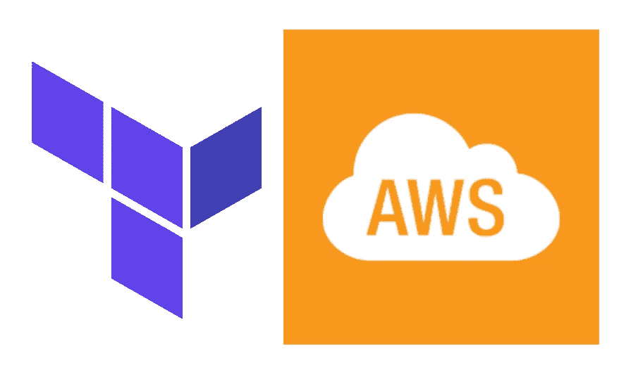
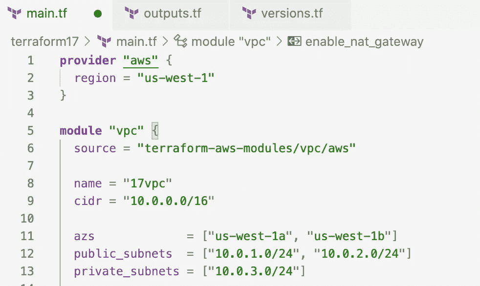
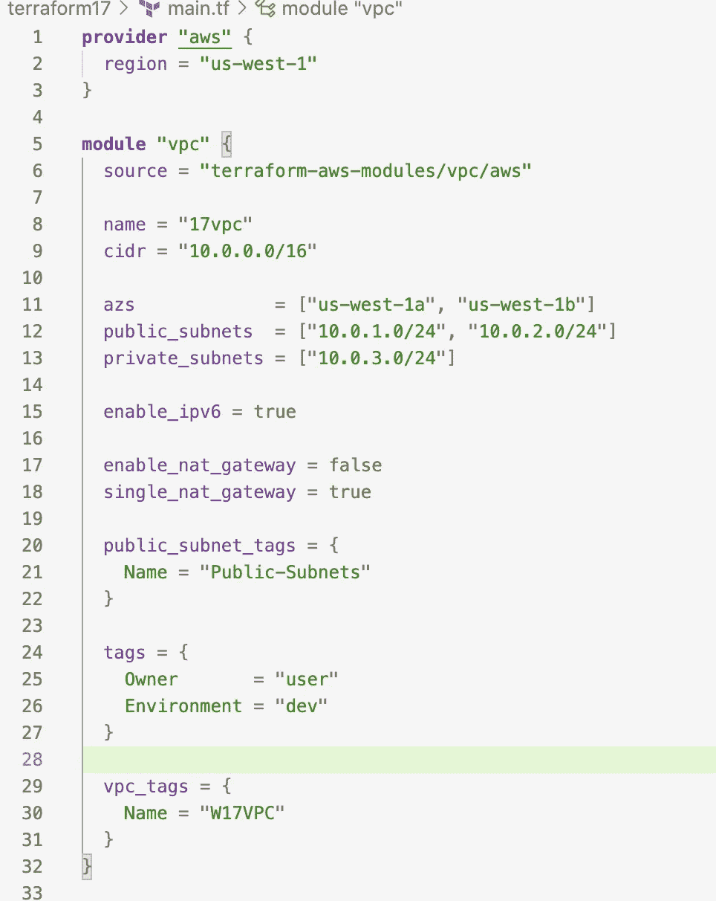
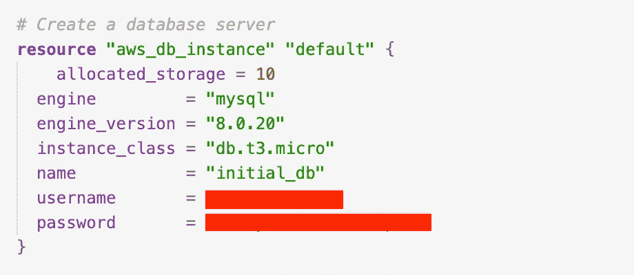
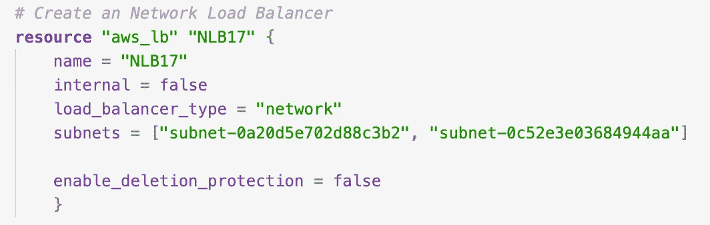
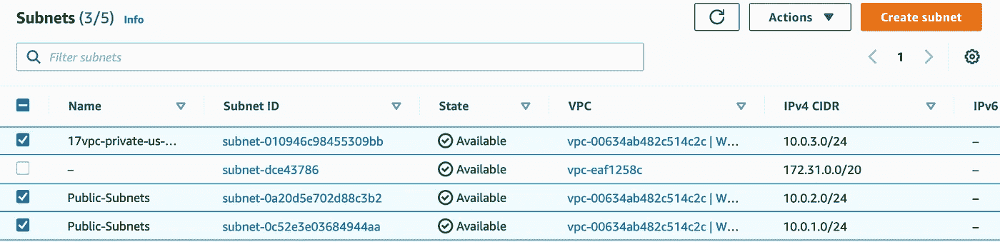
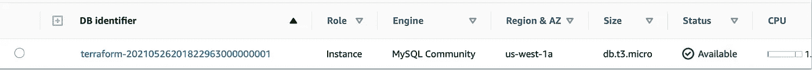
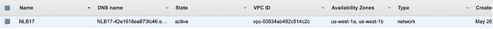

# 使用 Terraform 部署 3 层 AWS VPC 架构

> 原文：<https://medium.com/geekculture/deploying-a-3-tier-aws-vpc-architecture-using-terraform-4c08f5e412db?source=collection_archive---------6----------------------->



先决条件:本地安装了 Terraform，配置了 AWS CLI 的 AWS 帐户，IDE (VSCode，Atom 等。)安装了 Terraform。

这个项目是用 Visual Studio 代码完成的。使用 IDE，您可能会发现正确格式化和将语言预设为 Terraform(以及自动完成等)更容易。).

步骤 1:使用 CIDR 10.0.0.0/16 部署一台 VPC，包含两个公共子网和一个私有子网。公共子网具有 CIDR 10.0.1.0/24 和 10.0.2.0/24。专用子网的 CIDR 为 10.0.3.0/24。

步骤 2:创建一个 RDS MySQL 实例(t3.micro)。

步骤 3:创建一个负载平衡器，将流量导向公共子网。

# 什么是三层架构？它是用来做什么的？

三层架构包括三个逻辑和物理计算层:表示层(客户端层)、应用层(逻辑层)和数据层。是软件项目快速启动的可行选择。

## **什么是虚拟私有云(VPC)？它是用来做什么的？**

VPC 是您控制的 AWS 的私有子部分，您可以在其中放置 AWS 资源(例如 EC2 实例和数据库)。您可以完全控制谁可以访问您放在 VPC 中的 AWS 资源。

VPC 提供安全性，可以大规模执行，定制环境，并允许用户在以后添加虚拟分段。灵活性和定制使开发人员更加敏捷并节省资金。

# **让我们开始我们的项目:**

在 Visual Studio 代码(或您的首选 IDE)中创建一个工作文件夹。tf 文件内: **main.tf** 、 **outputs.tf** 和 **versions.tf.** 中的文件另存为。tf 文件，VSC 会明白，我们将编写地形代码。

## **步骤 1:使用 CIDR 10.0.0.0/16 部署 VPC**

在 **main.tf** 中，在第一个块中声明提供者，然后为 VPC 创建一个模块块。

provider 块让我们声明我们正在与 AWS 合作，以及我们希望我们的 VPC 部署在哪个区域。对于选择哪个地区，AWS 中有很多选项；因此，你可能更倾向于选择“美国-东-1”或“欧盟-西-2”，而不是“美国-西-1”。

模块块由源、名称和 CIDR 组成。来源是“terraform-aws-modules/vpc/aws”，由 terraform 注册表提供。您可以将 VPC 命名为任何名称，使其在您的 AWS 环境中可能已经存在的其他 VPC 中具有个性(例如 AWS 分配给您的帐户的默认 VPC)。必须从专用 IPv4 地址范围中指定 CIDR 块。

```
**provider** "aws" {
region = "us-west-1"
}**module** "vpc" {
source = "terraform-aws-modules/vpc/aws"
name = "17vpc"
cidr = "10.0.0.0/16"
```

## **步骤 2:声明可用区域，添加两个 CIDR 10 . 0 . 1 . 0/24 和 10.0.2.0/24 的公共子网，以及一个 CIDR 10.0.3.0/24 的私有子网。**

可用性区域是每个区域内多个独立的位置。多个可用性区域对于在 AWS 中构建高可用性、容错的应用程序至关重要。根据您的 VPC 创建所在的地区，您的可用区域可能与下面的不同。

如果希望运行面向公众的 web 应用程序，同时维护不可公开访问的后端服务器，请在 VPC 中提供公共和私有子网。Web 服务器可能存在于公共子网中，而数据库服务器存在于私有子网中。私有子网也可以通过使用位于公共子网中的 NAT 网关来访问互联网。

```
azs             = ["us-west-1a", "us-west-1b"]
public_subnets  = ["10.0.1.0/24", "10.0.2.0/24"]
private_subnets = ["10.0.3.0/24"]
```



This is what the main.tf file should look like with all the above commands put together.

使用以下代码完成模块块，并运行**地形初始化**、**地形 fmt** 、**地形计划**和**地形应用**。

这里的`enable_nat_gateway = false`是默认值，但是如果您想为您的每个私有网络提供 NAT 网关，它应该是真的。此外，`single_nat_gateway = true`因为我们希望在所有私有网络中提供一个共享的 NAT 网关。以下使用的标签有助于在 VPC 进行识别。

```
enable_ipv6 = trueenable_nat_gateway = false
single_nat_gateway = truepublic_subnet_tags = {
Name = "Public-Subnets"
}tags = {
Owner       = "user"
Environment = "dev"
}vpc_tags = {
Name = "W17VPC"}}
```



Final module block.

## **步骤 3:用 t3.micro 创建一个关系数据库服务(RDS) MySQL 实例**

Amazon 关系数据库服务(Amazon RDS)允许在云中轻松设置、操作和扩展关系数据库。创建 RDS 将使我们能够专注于我们的应用程序，因为它自动化了耗时的管理任务。 [MySQL](https://aws.amazon.com/rds/mysql/) 是一个开源的关系数据库，可以在其中快速部署可扩展的服务器。

`allocated_storage = x`(其中 x 是一个数字)是我们的数据库服务器分配的存储空间，以千兆字节为单位。由于这是一个小项目，我们不需要很多 gibibytes，但未来的项目可能需要更多。要设置存储自动缩放，可以在我们的`allocated_storage`行下面使用`max_allocated_store = y`(其中 y 是大于 x 的数字)。

`engine = "mysql"`声明使用哪个数据库引擎，而`engine_version = "8.0.20"`声明我们使用的是 MySQL 的引擎版本 8.0.20。这些将根据您的数据库服务器所使用的引擎/版本而有所不同。

最后，使用`instance_class = "db.t3.micro"`声明 RDS 实例的实例类型，并命名您的数据库。

```
*# Create a database server***resource** "aws_db_instance" "default" {
allocated_storage = 5
engine         = "mysql"
engine_version = "8.0.20"
instance_class = "db.t3.micro"
name           = "initial_db"
username       = "<your-aws-username>"
password       = "<your-aws-password>"
}
```



MySQL Database Block

## **步骤 4:创建一个负载均衡器，将流量导向公共子网**

负载平衡器充当客户端的单点联系人，并在多个目标之间分配传入流量。通过使用负载平衡器，我们的应用程序可用性得到了提高。有四种不同类型的[负载平衡器](https://docs.aws.amazon.com/AmazonECS/latest/developerguide/load-balancer-types.html):应用负载平衡器(ALB，第 7 层)、网络负载平衡器(NLB，第 4 层)、经典负载平衡器(CLB，第 4 层)和网关负载平衡器(GLB，第 3 层)。

下面，我们的资源块中使用了一个网络负载平衡器(NLB)。`load_balancer_type = "network"`行是我们声明使用哪个负载平衡器的地方。我选择了网络负载平衡器，因为它在连接级运行，将连接路由到我的 VPC 内的目标。NLB 每秒还能处理数百万个请求，同时保持超低延迟。

```
*# Create a Network Load Balancer***resource** "aws_lb" "NLB17" {
name = "NLB17"
internal = false
load_balancer_type = "network"
subnets = ["<your-public-subnet-here>", "<your-public-subnet-here>"]
enable_deletion_protection = false #true if you are not planning on destroying your load balancer
}
```



Network Load Balancer Block

创建一个 **outputs.tf** 文件使得关于基础设施的信息在命令行上可用，并且可以公开其他 Terraform 配置的信息。在 **outputs.tf** 文件中，插入以下代码:

```
*# VPC***output** "vpc_id" {
description = "The ID of the VPC"
value       = module.vpc.vpc_id
}*# CIDR blocks***output** "vpc_cidr_block" {
description = "The CIDR block of the VPC"
value       = module.vpc.vpc_cidr_block
}*# Subnets***output** "private_subnets" {
description = "List of IDs of private subnets"
value       = module.vpc.private_subnets
}**output** "public_subnets" {
description = "List of IDs of public subnets"
value       = module.vpc.public_subnets
}*# NAT gateways***output** "nat_public_ips" {
description = "List of public Elastic IPs created for AWS NAT Gateway"
value       = module.vpc.nat_public_ips
}*# AZs***output** "azs" {
description = "A list of availability zones specified as argument to this module"
value       = module.vpc.azs
}
```

当运行 Terraform 时，声明我们为 Terraform 和我们的提供商(AWS)使用的版本允许我们控制我们的 Terraform 项目。在 **versions.tf** 文件中，输入以下代码:

```
**terraform** {required_version = ">= 0.12.26"**required_providers** {
aws = {
source  = "hashicorp/aws"
version = ">= 3.15"
}
}
}
```

现在跑一个`terraform init`、`terraform fmt`、`terraform plan`，最后一个`terraform apply`。申请可能需要几分钟，所以请耐心等待！

**让我们检查一下我们的 AWS 账户在** `**terraform apply**`之后的情况


VPC created with correct CIDR!



Two public and one private subnet were created with the correct CIDRs!



MySQL RDS Database created!



Load Balancer created!

现在，任务已经完成，是时候销毁我们的模块，并再次检查我们的 AWS 帐户是否干净，是否没有未来的费用。在 VSCode 终端中，执行`**terraform destroy**`(可能需要几分钟才能完成)。销毁完成后，您的 AWS 帐户中应该不会再看到新创建的 VPC。

干得好！感谢您跟随我使用 Terraform 部署三层 AWS VPC 架构。请务必在 LinkedIn-linkedin.com/in/helenccampbell 与我联系