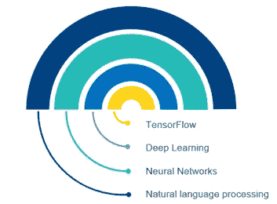
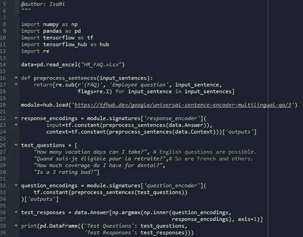

# 部署定制的人工智能聊天机器人比你想象的要简单和便宜得多

> 原文：<https://medium.com/geekculture/deploying-a-customized-ai-powered-chatbot-is-much-simpler-and-cheaper-than-you-think-84ee293cc923?source=collection_archive---------22----------------------->

## *了解如何轻松开发聊天机器人来支持客户交流并获得竞争洞察*

Image by FlamingoImages

Eliza 是麻省理工学院的 Joseph Weizenbaum 在 1994 年创造的第一个聊天机器人。最初，聊天机器人是为了抓住句子中的关键词，并有预编程的响应，创造出像人类一样交谈的幻觉。例如，在那个时候，如果你告诉伊莱扎，“我的父亲是一个伟大的网球运动员，”伊莱扎可能会拿起“父亲”或“网球”，并回答:“告诉我更多关于你的家庭。”或者“你最喜欢的网球运动员是谁？”。今天，由于神经网络、深度学习和许多免费的自然语言处理框架，聊天机器人已经发生了显著的变化，几乎任何人都可以在很短的时间内部署复杂的定制人工智能聊天机器人。听起来好得难以置信？继续读！

## **为什么要使用聊天机器人？**

如今，超过 85%的客户服务互动是通过聊天机器人完成的。它们有很多优点。以下是我最喜欢的 5 个:

1) **效率**:非常明显的一点，但不用说，聊天机器人可以节省大量的时间和成本来回答外部或内部的客户提问。

2) **更好的客户服务**:与顾问交谈的排队或等待时间消失了，用户的问题可以立即得到答复。

3) **一致性**:聊天机器人的使用确保了相同类型的询问将总是以相似的方式得到回答，从而确保更好地遵守政策并避免政策应用中的差异。当涉及到对程序进行更新或更改时，会实现很多价值。这可能需要大量的沟通工作，以确保所有“人类”顾问都知道一个小的变化，而聊天机器人只需几秒钟就能适应。

4) **培训速度**:培训一名员工需要几周甚至几个月的时间来学习不同的交互指南、知识管理系统和决策算法，而聊天机器人只需几分钟，甚至几秒钟就能学会一个全新的知识库。

5) **提供洞察力**:来自客户互动的所有信息不仅可以用于改进聊天机器人，还可以让您洞察客户的需求。例如，如果您部署了一个聊天机器人来回答员工的人力资源相关问题，聊天机器人可以用于评估员工有更多问题的关键领域，使人力资源团队知道应该在哪里以及如何集中沟通。

## **聊天机器人是如何构建的？**

由于自然语言处理、神经网络和深度学习，聊天机器人变得栩栩如生。多亏了预先构建、训练和测试的框架，比如 Google 的 TensorFlow，用几行代码就可以相对容易地部署一个定制的聊天机器人(我们说的是不到 50 行！).

Image by author

自然语言处理(NLP) : NLP 是机器学习、计算机科学和语言学的一个子领域，它允许机器理解文本或人类对话。聊天机器人涉及两个部分的自然语言处理:

1) **自然语言理解**:这是允许机器阅读文本并理解不同的单词和概念。

2) **自然语言生成**:这使得机器能够对用户的问题做出回应，根据它接受过训练的单词和结构来造句。

**神经网络**:神经网络是一系列算法，试图通过模拟人脑运作方式的过程来识别数据中的潜在关系。在聊天机器人中，它用于理解复杂或不精确的信息。

**深度学习**:深度学习是机器学习的一个子集，它拥有能够从非结构化或无标签数据中进行无监督学习的网络。传统上，机器学习需要标记输入和输出数据来训练。深度学习能够根据自己的高级数据特征进行学习，与其他机器学习方法相比，需要更少的数据，并提供更高的性能。

**TensorFlow** :从零开始开发一个机器学习模型是非常复杂的，需要大量的数据和时间。由于 TensorFlow 等公共可用的预建框架，这是一项远不那么令人生畏的工作。TensorFlow 由谷歌开发，将机器学习和深度学习模型捆绑在一起。它的通用句子编码器有 16 种语言版本(阿拉伯语、简体中文、繁体中文、英语、法语、德语、意大利语、日语、韩语、荷兰语、波兰语、葡萄牙语、西班牙语、泰语、土耳其语、俄语)，并且不断更新。将您的聊天机器人模型与它挂钩并获得专业构建、训练和测试模型的所有优势非常简单。

## 我如何开始？

1) **设定目标和目的**:开发聊天机器人的第一步是确定其用途，为产品设定具体的目标。例如，我们想构建一个聊天机器人来回答员工关于人力资源政策的询问。我们希望聊天机器人能够处理 75%的员工互动，而不需要升级到人工支持。

2) **准备所需数据**:第二步是确定和组织驱动聊天机器人交互所需的数据。在构建和部署模型时，这个非编程步骤可能是最耗时的，因为公司通常持有大量关于策略或过程的未记录信息。如果这是你的情况，一个策略可以是记录当前顾问的电话，以捕捉问题和答案，并通过其他 NLP 技术(包括语音到文本)将它们转换为文本数据。组织数据最有效的方式是以问答的形式。理想情况下，每个答案最好有 3 到 4 个简短问题的例子。捕捉是否存在问题依赖也很重要。这里有一个例子:一名员工想知道他们是否可以申请连续 3 周的假期。如果公司的政策因员工群体或资历而异，模型必须知道是否需要向员工询问后续问题，或者是否应该在另一个数据库中搜索以获得所需的信息。

3) **开发对话架构**:一旦数据准备好了，你需要准备对话架构来支持这个过程。下面是我根据 Excel 上的问答列表构建的一个例子的截图。正如承诺的，不到 50 行代码。

4) **集成到用户界面**:最后一步是确定并集成聊天机器人到合适的用户界面。例如，您是否希望将聊天机器人集成到您正在使用的内部消息应用程序中，如 Google Chat、Teams、Slack 等。

5) **部署之前的测试**:最后一步，也是最重要的一步，是在公开部署之前对聊天机器人进行内部测试。在这种情况下，使用现有的顾问来输入他们经常听到的问题以确保聊天机器人正常工作将是一个好主意。如果你想看看 TensorFlow 有多强大，试着输入拼写/语法不好的问题以及俚语。你会看到这个产品变得多么先进。在您让聊天机器人执行交易的情况下(例如:允许聊天机器人打印员工名单)，测试所有这些潜在的场景也很重要。

## **结论**

正如本文所展示的，由于人工智能在过去 20 年中取得的进步，聊天机器人已经变得非常强大。TensorFlow 等公开可用的框架使像你我这样的人能够开发和部署高性能的定制聊天机器人来满足业务需求，只需很少的编程和少量培训。聊天机器人不应被视为取代人们的工作，而是使组织能够让他们的员工从事更多增值任务，并更好地了解他们客户的需求。是什么阻止了你为你的组织创造价值？

**来源**:

 [## 聊天机器人简史

### 人类语言是新的 UI 层，机器人就像新的应用程序，数字助理是元应用程序。智力…

chatbotslife.com](https://chatbotslife.com/a-brief-history-of-chatbots-d5a8689cf52f)  [## 神经网络定义

### 神经网络是一系列努力识别一组数据中潜在关系的算法…

www.investopedia.com](https://www.investopedia.com/terms/n/neuralnetwork.asp#:~:text=A%20neural%20network%20is%20a,organic%20or%20artificial%20in%20nature)  [## 深度学习如何帮助防止金融欺诈

### 深度学习是一种人工智能(AI)功能，它模仿人脑在处理…

www.investopedia.com](https://www.investopedia.com/terms/d/deep-learning.asp#:~:text=Deep%20learning%20is%20a%20subset,learning%20or%20deep%20neural%20network)  [## 张量流集线器

### 编辑描述

tfhub.dev](https://tfhub.dev/google/universal-sentence-encoder-multilingual-qa/3)