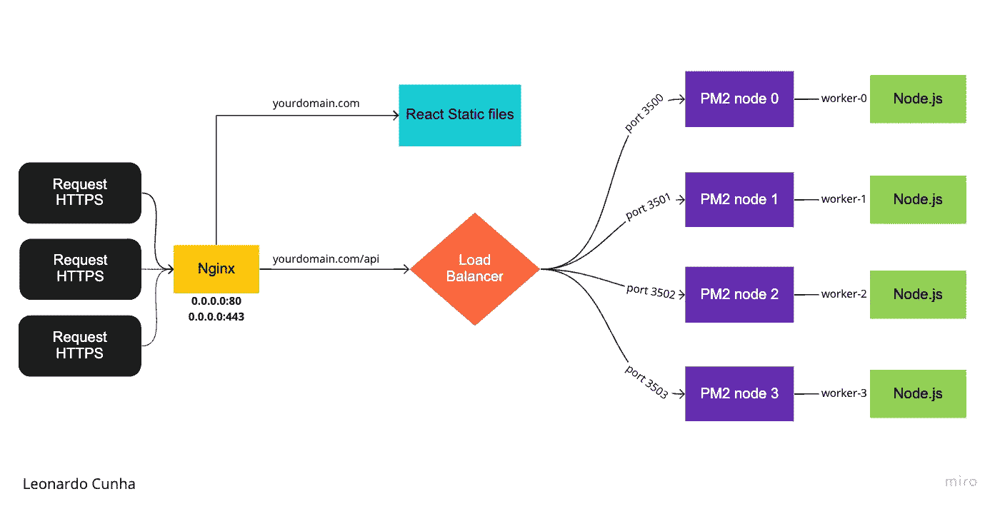
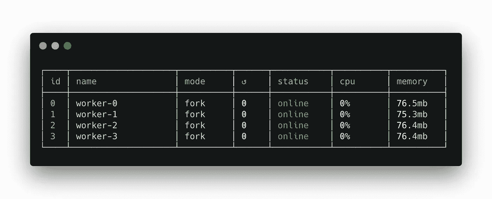
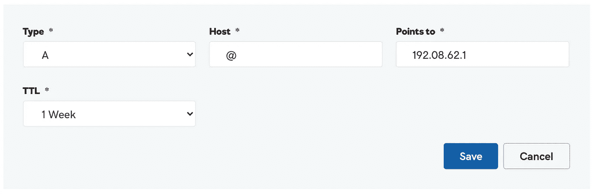
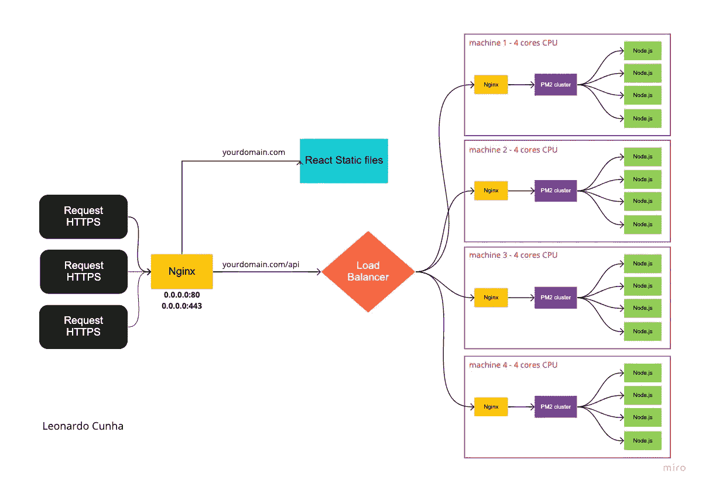

# 使用 PM2 和 Nginx 在一台机器上部署 React 应用程序和 Node.js 服务器

> 原文：<https://medium.com/geekculture/deploying-a-react-app-and-a-node-js-server-on-a-single-machine-with-pm2-and-nginx-15f17251ee74?source=collection_archive---------0----------------------->

本文的目的是记录我在同一台带有负载平衡器的 Linux 机器上部署前端和后端的过程。

# 安装先决条件

请注意，这些说明对 Ubuntu 16 或更高版本有效。

## 节点. js

*   安装命令:

```
$ sudo apt install nodejs
```

*   验证安装:

```
$ node --version
v12.16.0
```

## Nginx (Web 服务、反向代理和负载平衡)

*   更新 Ubuntu 库信息:

```
$ sudo apt-get update
```

*   安装软件包:

```
$ sudo apt-get install nginx
```

*   验证安装:

```
$ sudo nginx -v
nginx version: nginx/1.14.0 (Ubuntu)
```

*   启动 NGINX:

```
$ sudo nginx
```

*   验证 NGINX 已启动并正在运行:

```
$ curl -I 127.0.0.1
HTTP/1.1 200 OK
Server: nginx/1.14.0 (Ubuntu)
```

## NPM (Node.js 包管理器)

*   安装 NPM:

```
$ sudo apt install npm
```

*   验证安装:

```
$ npm -v
6.14.13
```

## PM2(Nodejs 应用程序生产流程经理)

*   安装 PM2:

```
$ npm install pm2@latest -g
```

*   验证安装:

```
$ pm2 -v
4.5.6
```

## Certbot(从 Let's Encrypt 获取免费证书的客户端)

*   确保您的 snapd 版本是最新的:

```
$ sudo snap install core; sudo snap refresh core
```

*   安装证书机器人:

```
$ sudo snap install --classic certbot
```

*   准备 Certbot 命令:

```
$ sudo ln -s /snap/bin/certbot /usr/bin/certbot
```

# 这种结构将如何工作？



Flowchart Diagram for the deployment of Frontend and Backend on a single machine

Nginx 将通过我们的 PM2 Node.js 实例为我们的 React 构建文件提供服务，并帮助我们的后端应用程序实现负载平衡。Node.js 实例的数量与 CPU 拥有的内核数量成正比。要检查您的 Linux CPU 有多少内核，只需运行以下命令:

```
$ nproc
4
```

在我的例子中，我的 CPU 中有四个内核，这将转化为运行 PM2 的 Node.js 的四个实例。这些实例将根据 Nginx 的特定负载平衡方法接收 HTTPS 请求流量。这将有助于我们充分发挥机器的潜力，并减少停机时间。

## 以下是 PM2 提供的一些主要功能:

*   [行为配置](http://pm2.keymetrics.io/docs/usage/application-declaration/)
*   [集装箱集成](http://pm2.keymetrics.io/docs/usage/docker-pm2-nodejs/)
*   [集群模式](http://pm2.keymetrics.io/docs/usage/cluster-mode/)
*   [观看&重新加载](http://pm2.keymetrics.io/docs/usage/watch-and-restart/)
*   [日志管理](http://pm2.keymetrics.io/docs/usage/log-management/)
*   [监控](http://pm2.keymetrics.io/docs/usage/monitoring/)
*   [启动脚本](http://pm2.keymetrics.io/docs/usage/startup/)

在这个例子中，我们不会使用 PM2 提供的集群模式，因为我们将使用 NGINX 来平衡后端负载。这个决定将在本文中解释。

# 部署前端

这将是您通常的前端部署，您将首先克隆您的项目存储库，安装您的依赖项并运行您的构建脚本。

克隆您的存储库:

```
$ mkdir project && cd project$ git clone [git@gitlab.com:your/project/frontend.git](https://gitlab.com/absolutsistemas/web/gis-be.git)
```

安装*节点模块*依赖关系:

```
$ cd frontend$ npm install
```

运行您的构建脚本:

```
$ npm run build
```

获取您的构建路径:

```
$ cd build && pwd
/root/frontend/build
```

稍后，我们将在 NGINX 配置中使用这个构建路径。

# 用 PM2 设置后端

首先，您需要克隆您的后端项目:

```
$ cd project$ git clone [git@gitlab.com:your/project/backend.git](https://gitlab.com/absolutsistemas/web/gis-be.git)
```

安装*节点 _ 模块*依赖关系:

```
$ cd backend$ npm install
```

我们可以利用 PM2 的*行为配置*特性，用环境变量和 PM2 参数创建一个 YAML 格式的生态系统文件。

对于一个有四个内核的 CPU，用四个工人创建一个 **process.yml** 文件:

参数:

*   **脚本**

相对于 pm2 开始的脚本路径

*   **执行模式**

启动你的应用程序的模式，可以是“集群”或“分叉”

*   **名称**

您的 PM2 节点的名称

*   **环境**

将出现在应用程序中的环境变量

请注意，Node.js 应用程序应该准备好使用动态端口号运行。

完成所有设置后，您可以使用 start 命令启动您的工作程序:

```
$ pm2 start process.yml
```

启动 workers 后，您将能够检查当前运行的 PM2 节点列表:

```
$ pm2 list
```



List of PM2 nodes running

# 配置 DNS

您需要在您的域中添加一个指向您的机器 IP 地址的 DNS 记录。

要查找您的计算机的 IP 地址，请运行以下命令:

```
$ ip r
default via **192.08.62.1** dev eth0 onlink
192.08.62.2/24 dev eth0 proto kernel scope link src **192.08.62.1**
```

现在，在您的域名 DNS 设置中，添加一个指向**192.08.62.1**的 DNS 记录:



DNS record that points to the Linux machine

DNS 传播需要 72 小时才能完成，但可能需要一两个小时左右。您可以使用 [DNS Checker](https://dnschecker.org/) 检查您的域名是否有更新的 DNS 记录。

# 配置 Nginx

您需要访问 Nginx 配置文件并添加代码块，以便它能够解释您的架构并相应地重定向请求。

访问并开始编辑配置文件:

```
$ nano /etc/nginx/sites-available/default
```

首先我们需要添加 **upstream** 块，这是一种告诉 Nginx 当这个上游收到请求时，它应该根据特定的负载平衡方法在多个服务器之间进行代理的方式。

可用的负载平衡方法有:

*   **循环赛(默认)**

在这种情况下，Nginx 按顺序遍历上游服务器列表，依次将下一个连接请求分配给每个服务器。

*   **哈希**

在这个方法中，Nginx 计算一个基于文本和 Nginx 变量组合的散列，并将其分配给其中一个服务器。与哈希匹配的传入请求将只发送到该特定服务器。

*   **IP 哈希**

哈希是根据客户端的 IP 地址计算的。这种方法确保来自同一个客户机的多个请求到达同一个服务器。

*   **最少连接**

Nginx 使用最少的连接将传入的请求发送到服务器，从而维持服务器间的负载。

*   **最少时间**

使用这种方法，Nginx 通过使用当前活动连接数和过去请求的加权平均响应时间来计算值并分配给每个服务器，并将传入的请求发送给具有最低值的服务器。

出于这个例子的目的，我们将使用最常见的方法**最少连接数**。

将上游块添加到默认配置文件中:

```
upstream loadbalancer {
  least_conn;
  server localhost:3500;
  server localhost:3501;
  server localhost:3502;
  server localhost:3503;
}
```

当向 https://example.com 的[](https://example.com)****发出请求时，它应该用我们的前端文件做出响应，当向 https://example.com/api 的[](https://example.com/api)**发出请求时，它应该用一个 *proxy_pass* 重定向到我们的负载平衡器。******

******在此配置结束时，您的默认配置文件应该如下所示:******

*   ********位置/** 块:******

****将 root 作为您的前端构建文件夹路径，这不仅对 React 构建有效，而且对任何使用**index.html**文件生成静态构建文件的 javascript 框架都有效。****

*   ******位置/api/** 区块:****

****会将每个 HTTPS 请求重定向到我们的负载均衡器。Nginx 可以识别出一个名为 **loadbalancer** 的上游已经被声明，所以我们可以直接 proxy_pass 到 **http://loadbalacer/** 。****

****保存配置文件后，检查保存的语法是否有效:****

```
**$ sudo nginx -t
nginx: the configuration file /etc/nginx/nginx.conf syntax is ok
nginx: configuration file /etc/nginx/nginx.conf test is successful**
```

****重新加载 Nginx 以反映最近的更改:****

```
**$ systemctl reload nginx**
```

# ****使用 Certbot 设置免费的 SSL 证书****

****要在 Nginx 配置中设置 SSL:****

```
**sudo certbot --nginx**
```

****遵循每个安装步骤。Certbot 将从 Let's encrypt 获取一个证书，并自动更新您的 Nginx 配置文件。****

****您还可以测试 Certbot 的自动更新:****

```
**sudo certbot renew --dry-run**
```

****一切都完成了，你可以在[**https://example.com**](https://example.com!)访问你的应用！😄****

# ******结论******

****我们现在可以理解为什么使用 Nginx 的这种负载平衡方法比只使用 PM2 的集群模式更好。当您的应用程序维护低水平的并发用户时，您可以使用这种初始架构。当这些用户开始到来，而这种配置不再足够时，您可以轻松地将该机器仅用于负载平衡，并开始将您的上游重定向到 localhost 之外的服务器，这样可以实现平滑的水平扩展。****

****这是我们当前设置下水平缩放的直观表示:****

********